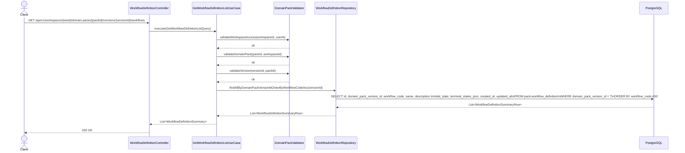
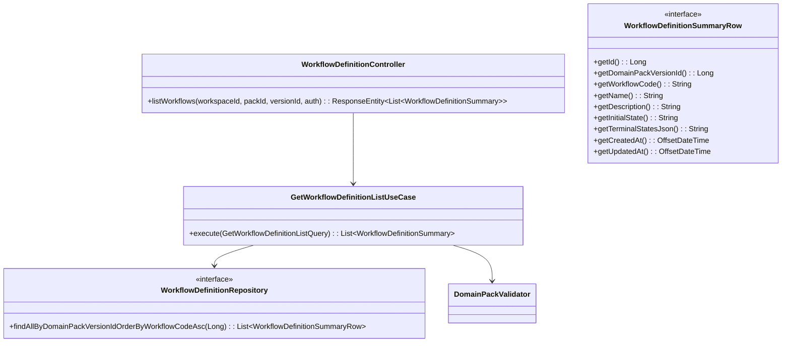

# [BE] 3.2.14 — Workflow(Node/Edge) 초안 목록 조회

> **Backlog**: 운영자가 특정 DomainPackVersion에 저장된 workflow 초안 목록을 조회하고 싶다 → 자동 생성 결과를 운영 가능한 형태로 다듬기 위해
> **Bounded Context**: `domainpack`
> **Branch**: `feature/3214-workflow-list-read`
> **연관 스펙**: 단건 조회 → `.agent/specs/2215.md`; 원본 설계 → `.agent/specs/226.md`

---

## 구현 상태 (Implementation Status)

`GetWorkflowDefinitionListUseCase`, `WorkflowDefinitionController(GET 목록)`, `WorkflowDefinitionSummary`, `WorkflowDefinitionSummaryRow`, 관련 테스트가 **이미 구현·완료**되어 있다.

이 스펙은 기존 구현을 3211~3213 컨벤션에 맞추기 위한 **최소 수정**만 정의한다.

| # | 수정 항목 | 대상 파일 |
|---|-----------|-----------|
| M1 | `workflowCode ASC` 정렬 추가 | `WorkflowDefinitionRepository`, `JpaWorkflowDefinitionRepository`, `GetWorkflowDefinitionListUseCase`, 관련 테스트 |
| M2 | `domainPackVersionId` 필드 추가 (목록 응답) | `WorkflowDefinitionSummaryRow`, `WorkflowDefinitionSummary`, 관련 테스트 |

> 단건 조회 응답(`WorkflowDefinitionDetail`)에 `domainPackVersionId`를 추가하는 작업은 **`.agent/specs/2215.md`** 범위에서 처리한다.

---

## Goal

특정 DomainPackVersion에 속한 `WorkflowDefinition` 초안 목록을 `workflowCode ASC` 순으로 조회하는 GET 엔드포인트를 제공한다. `graphJson`은 목록 응답에서 제외한다(성능).

---

## Sequence Diagram



---

## REST API

### Endpoint

| Method | Path | Description |
|--------|------|-------------|
| GET | `/api/v1/workspaces/{workspaceId}/domain-packs/{packId}/versions/{versionId}/workflows` | Workflow 초안 목록 조회 (`workflowCode ASC`, `graphJson` 제외) |

### Request

Path variables: `workspaceId`(Long), `packId`(Long), `versionId`(Long)  
Headers: `Authorization: Bearer {jwt-token}` (필수)  
Query parameters: 없음

### Response

**200 OK**

```json
[
  {
    "id": 1,
    "domainPackVersionId": 10,
    "workflowCode": "refund_flow",
    "name": "환불 플로우",
    "description": "환불 요청 처리 플로우",
    "initialState": "start",
    "terminalStatesJson": "[\"terminal\"]",
    "createdAt": "2026-04-14T10:00:00Z",
    "updatedAt": "2026-04-14T10:00:00Z"
  }
]
```

> `graphJson`은 포함하지 않는다 (최대 N개 workflow × 대용량 graphJson 방지).  
> workflow가 없는 version이면 빈 배열 `[]`를 반환한다.

**401 Unauthorized**

```json
{ "code": "UNAUTHORIZED", "message": "인증이 필요합니다." }
```

**403 Forbidden**

```json
{ "code": "FORBIDDEN", "message": "워크스페이스에 접근 권한이 없습니다." }
```

**404 Not Found**

```json
{ "code": "DOMAIN_PACK_WORKSPACE_NOT_FOUND", "message": "워크스페이스를 찾을 수 없습니다. id={workspaceId}" }
{ "code": "DOMAIN_PACK_NOT_FOUND",           "message": "DomainPack not found: {packId}" }
{ "code": "DOMAIN_PACK_VERSION_NOT_FOUND",   "message": "도메인 팩 버전을 찾을 수 없습니다. id={versionId}" }
```

---

## Class Design

### DDD Layered Structure



### 수정 파일 (Modified Files)

| 파일 | 변경 내용 |
|------|-----------|
| `WorkflowDefinitionRepository.java` | `findAllByDomainPackVersionId` → `findAllByDomainPackVersionIdOrderByWorkflowCodeAsc` rename |
| `JpaWorkflowDefinitionRepository.java` | 동일 rename; Spring Data JPA 메서드명이 쿼리를 자동 생성하므로 `@Query` 불필요 |
| `WorkflowDefinitionSummaryRow.java` | `Long getDomainPackVersionId()` getter 추가 |
| `WorkflowDefinitionSummary.java` | `Long domainPackVersionId` 필드 추가; `from()` 팩토리 업데이트 |
| `GetWorkflowDefinitionListUseCase.java` | 호출 메서드명 업데이트 |
| `GetWorkflowDefinitionListUseCaseTest.java` | `domainPackVersionId` 포함 stub 업데이트 |
| `WorkflowDefinitionControllerTest.java` | `$[0].domainPackVersionId` 검증 추가 |

### Key Code Sketches

```java
// domain/repository/WorkflowDefinitionSummaryRow.java (변경)
public interface WorkflowDefinitionSummaryRow {
  Long getId();
  Long getDomainPackVersionId();  // 추가
  String getWorkflowCode();
  String getName();
  String getDescription();
  String getInitialState();
  String getTerminalStatesJson();
  OffsetDateTime getCreatedAt();
  OffsetDateTime getUpdatedAt();
}
```

```java
// application/WorkflowDefinitionSummary.java (변경)
public record WorkflowDefinitionSummary(
    Long id,
    Long domainPackVersionId,  // 추가
    String workflowCode,
    String name,
    String description,
    String initialState,
    String terminalStatesJson,
    OffsetDateTime createdAt,
    OffsetDateTime updatedAt) {

  public static WorkflowDefinitionSummary from(WorkflowDefinitionSummaryRow row) {
    return new WorkflowDefinitionSummary(
        row.getId(),
        row.getDomainPackVersionId(),  // 추가
        row.getWorkflowCode(),
        row.getName(),
        row.getDescription(),
        row.getInitialState(),
        row.getTerminalStatesJson(),
        row.getCreatedAt(),
        row.getUpdatedAt());
  }
}
```

```java
// domain/repository/WorkflowDefinitionRepository.java (변경)
// 기존: findAllByDomainPackVersionId(Long)
// 변경:
List<WorkflowDefinitionSummaryRow> findAllByDomainPackVersionIdOrderByWorkflowCodeAsc(Long domainPackVersionId);
```

```java
// infrastructure/persistence/JpaWorkflowDefinitionRepository.java (변경)
// 기존: findAllByDomainPackVersionId(Long)
// 변경 (Spring Data JPA 메서드명 자동 쿼리 생성 활용):
@Override
List<WorkflowDefinitionSummaryRow> findAllByDomainPackVersionIdOrderByWorkflowCodeAsc(Long domainPackVersionId);
```

```java
// application/GetWorkflowDefinitionListUseCase.java (변경)
public List<WorkflowDefinitionSummary> execute(GetWorkflowDefinitionListQuery query) {
  validator.validateWorkspaceAccess(query.workspaceId(), query.userId());
  validator.validateDomainPack(query.packId(), query.workspaceId());
  validator.validateVersion(query.versionId(), query.packId());

  return workflowDefinitionRepository
      .findAllByDomainPackVersionIdOrderByWorkflowCodeAsc(query.versionId())  // 변경
      .stream()
      .map(WorkflowDefinitionSummary::from)
      .toList();
}
```

---

## Tests

### UseCase 테스트 수정: `GetWorkflowDefinitionListUseCaseTest.java`

기존 5개 테스트 케이스 유지. 아래 항목만 업데이트한다.

| 업데이트 항목 | 내용 |
|--------------|------|
| stub 메서드명 | `findAllByDomainPackVersionId` → `findAllByDomainPackVersionIdOrderByWorkflowCodeAsc` |
| `createSummaryRow()` | `getDomainPackVersionId()` getter 구현 추가 (`return VERSION_ID`) |
| 결과 검증 | `result.get(0).domainPackVersionId()` 검증 추가 |

### Controller 테스트 수정: `WorkflowDefinitionControllerTest.java`

기존 6개 테스트 케이스 유지. 아래 항목만 업데이트한다.

| 업데이트 항목 | 내용 |
|--------------|------|
| `listWorkflows_returnsOk` stub | `WorkflowDefinitionSummary` 생성자에 `domainPackVersionId` 추가 |
| `listWorkflows_returnsOk` 검증 | `jsonPath("$[0].domainPackVersionId").value(10)` 추가 |

### Test Checklist

- [ ] 목록 응답에 `domainPackVersionId` 포함 확인
- [ ] 목록 응답에 `graphJson` 미포함 확인 (`$[0].graphJson doesNotExist()`)
- [ ] 빈 목록: workflow 없는 version → 빈 배열 반환
- [ ] 403: 권한 없는 사용자
- [ ] 401: 미인증
- [ ] 404: workspace/pack/version 미소속

---

## Database

변경 없음. `pack.workflow_definition` 테이블은 이미 존재한다.

`workflowCode ASC` 정렬은 기존 인덱스로 처리한다. 버전당 workflow 수가 50개를 초과하거나 목록 조회 p95가 500ms를 넘는 경우 복합 인덱스 추가를 검토한다.

---

## Additional Notes

- 기존 `GetWorkflowDefinitionListUseCase`는 `validator.validateWorkspaceAccess()`, `validator.validateDomainPack()`, `validator.validateVersion()` 3개 개별 호출 방식을 사용한다. 이는 3211 패턴과 일치하며, 3212/3213의 `validateForWorkspacePackVersion()` 복합 호출 방식과 다르다. 기능상 동일하므로 이 스펙에서는 현재 구현을 그대로 유지한다.
- 단건 조회(`WorkflowDefinitionDetail`)에 `domainPackVersionId`를 추가하는 작업은 **`.agent/specs/2215.md`** 범위에서 처리한다.
- graphJson 구조(nodes/edges) 및 유효성 규칙(V1~V6)은 `.agent/specs/226.md` 참조.
- 3211(Slot), 3212(Policy), 3213(Risk)과 함께 Domain Pack 구성요소 조회 API 패밀리를 형성한다.
