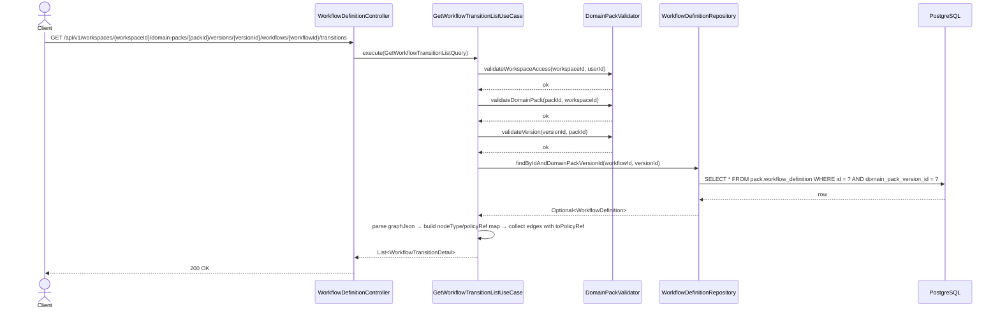

# [BE] 3.2.15 — Transition Condition / Action 초안 목록 조회

## Goal

특정 워크플로우에 속한 모든 Transition(graphJson edge) 초안 목록을 조회하는 READ 전용 엔드포인트를 제공한다.
각 transition은 edge 정보(`id`, `from`, `to`, `label`)와 함께, 목적지 노드가 ACTION 타입인 경우 해당 노드의 `policyRef`를 `toPolicyRef`로 함께 반환한다.

---

## graphJson ACTION Node Schema 변경

### 기존

```json
{
  "nodes": [
    { "id": "check_refund", "type": "DECISION" },
    { "id": "answer_refund", "type": "ACTION" }
  ]
}
```

### 변경 후 (policyRef 필드 추가)

```json
{
  "nodes": [
    { "id": "check_refund",  "type": "DECISION" },
    { "id": "answer_refund", "type": "ACTION", "policyRef": "refund_eligible_policy" },
    { "id": "handoff",       "type": "ACTION", "policyRef": "handoff_agent_policy"  },
    { "id": "terminal",      "type": "TERMINAL" }
  ]
}
```

- `policyRef`: ACTION 타입 노드에 **필수**, 비어있지 않은 문자열.
  - 값은 같은 domain pack version에 존재하는 `policyCode`와 동일해야 한다.
  - `id`(그래프 내부 식별자)와는 독립적으로 관리된다. 동일한 값으로 지정해도 무방하나 강제하지 않는다.
- 비 ACTION 타입 노드(`START`, `DECISION`, `TERMINAL`)에는 `policyRef` 불필요.

### 신규 Validation Rule — V8 (write-time)

| # | 규칙 | 위반 시 에러 코드 | 검증 위치 |
|---|------|-----------------|-----------|
| V8a | ACTION 타입 노드에 `policyRef` 필드가 존재하며 비어있지 않음 | `WORKFLOW_ACTION_NODE_POLICY_REF_MISSING` | `WorkflowGraphValidator` |
| V8b | ACTION 타입 노드의 `policyRef`가 `[A-Za-z0-9_-]+` 패턴 충족 | `WORKFLOW_ACTION_NODE_POLICY_REF_INVALID_CHARS` | `WorkflowGraphValidator` |
| V8c | ACTION 타입 노드의 `policyRef`가 같은 version의 policyCode 중 하나와 일치 | `WORKFLOW_ACTION_NODE_POLICY_REF_NOT_FOUND` | UseCase 레벨 (cross-entity, DB 접근 필요) |

V8a·V8b는 `WorkflowGraphValidator.parseAndValidate`에 추가한다 (graphJson 내부 검증, DB 불필요).  
V8c는 `UpdateWorkflowUseCase`와 `CreateDomainPackDraftUseCase`에서 별도로 검증한다.

이 스펙은 V8을 **정의**한다. 실제 검증·강제 구현은 `UpdateWorkflowUseCase`(V8 추가)와 `CreateDomainPackDraftUseCase`(spec 231 참조)가 담당한다.

---

## Sequence Diagram



---

## REST API

### Endpoint

| Method | Path | Description |
|--------|------|-------------|
| GET | `/api/v1/workspaces/{workspaceId}/domain-packs/{packId}/versions/{versionId}/workflows/{workflowId}/transitions` | Transition 초안 목록 조회 |

### Request

Path variables:
- `workspaceId`: Long
- `packId`: Long
- `versionId`: Long
- `workflowId`: Long

Headers:
- `Authorization: Bearer {jwt-token}` (필수)

### Response

**200 OK**

```json
[
  {
    "id": "e_check_to_answer",
    "workflowDefinitionId": 5,
    "domainPackVersionId": 10,
    "from": "check_refund",
    "to": "answer_refund",
    "label": "eligible",
    "toPolicyRef": "refund_eligible_policy"
  },
  {
    "id": "e_check_to_handoff",
    "workflowDefinitionId": 5,
    "domainPackVersionId": 10,
    "from": "check_refund",
    "to": "handoff",
    "label": "not_eligible",
    "toPolicyRef": "handoff_agent_policy"
  },
  {
    "id": "e_answer_to_end",
    "workflowDefinitionId": 5,
    "domainPackVersionId": 10,
    "from": "answer_refund",
    "to": "terminal",
    "label": null,
    "toPolicyRef": null
  }
]
```

> transitions 없으면 빈 배열 `[]` 반환.
> `label`: `from` 노드 타입이 DECISION인 경우에만 edge JSON의 label 값을 반환한다. 그 외 노드 발신 edge는 JSON에 label이 존재해도 `null`로 반환한다.
> `toPolicyRef`: `to` 노드 타입이 ACTION인 경우에만 해당 노드의 policyRef를 반환한다. ACTION 노드인데 policyRef가 없으면 `WorkflowGraphJsonInvalidException`(500)을 throw한다. ACTION이 아닌 경우 `null`로 반환한다.

**401 Unauthorized**

```json
{ "code": "UNAUTHORIZED", "message": "인증이 필요합니다." }
```

**403 Forbidden**

```json
{ "code": "FORBIDDEN", "message": "워크스페이스에 접근 권한이 없습니다." }
```

**404 Not Found — workflow not found**

```json
{ "code": "WORKFLOW_DEFINITION_NOT_FOUND", "message": "WorkflowDefinition not found: {workflowId}" }
```

**404 Not Found — workspace not found**

```json
{ "code": "DOMAIN_PACK_WORKSPACE_NOT_FOUND", "message": "워크스페이스를 찾을 수 없습니다. id={workspaceId}" }
```

**404 Not Found — pack not found**

```json
{ "code": "DOMAIN_PACK_NOT_FOUND", "message": "DomainPack not found: {packId}" }
```

**404 Not Found — version not found**

```json
{ "code": "DOMAIN_PACK_VERSION_NOT_FOUND", "message": "도메인 팩 버전을 찾을 수 없습니다. id={versionId}" }
```

**500 Internal Server Error — graphJson 정합성 오류**

```json
{ "code": "WORKFLOW_GRAPH_JSON_INVALID", "message": "graphJson이 유효하지 않은 JSON입니다. workflowId={workflowId}" }
```

---

## Class Design

### 신규 생성 파일

| 파일 | 경로 | 역할 |
|------|------|------|
| `GetWorkflowTransitionListQuery.java` | `application/` | UseCase 입력 record |
| `GetWorkflowTransitionListUseCase.java` | `application/` | graphJson 전체 edge 파싱 + 목록 반환 UseCase |

### 수정 파일

| 파일 | 변경 내용 |
|------|-----------|
| `WorkflowTransitionDetail.java` | `toPolicyRef` 필드 추가; `listFromGraphJson` 메서드 추가; `fromGraphJson` 메서드도 동일하게 `toPolicyRef` 반영 (**spec 2217 응답 변경**) |
| `WorkflowGraphValidator.java` | `GraphNode` record에 `policyRef` 파싱 추가; V8a·V8b 검증 메서드 추가 |
| `WorkflowDefinitionController.java` | `@GetMapping("/{workflowId}/transitions")` 핸들러 추가; `GetWorkflowTransitionListUseCase` 의존성 추가 |

### Pseudo-code

```java
// GetWorkflowTransitionListQuery.java
record GetWorkflowTransitionListQuery(
    Long workspaceId, Long packId, Long versionId,
    Long workflowId, Long userId)

// GetWorkflowTransitionListUseCase.java
@Service
@Transactional(readOnly = true)
class GetWorkflowTransitionListUseCase {
    execute(GetWorkflowTransitionListQuery query) {
        validator.validateWorkspaceAccess(query.workspaceId(), query.userId())
        validator.validateDomainPack(query.packId(), query.workspaceId())
        validator.validateVersion(query.versionId(), query.packId())

        WorkflowDefinition workflow = workflowDefinitionRepository
            .findByIdAndDomainPackVersionId(query.workflowId(), query.versionId())
            .orElseThrow(() -> new WorkflowDefinitionNotFoundException(query.workflowId()))

        return WorkflowTransitionDetail
            .listFromGraphJson(workflow.getGraphJson(),
                               workflow.getId(), workflow.getDomainPackVersionId())
    }
}

// WorkflowTransitionDetail.java — record 필드 변경
record WorkflowTransitionDetail(
    String id,
    Long workflowDefinitionId,
    Long domainPackVersionId,
    String from,
    String to,
    @Nullable String label,
    @Nullable String toPolicyRef)   // 신규: to 노드가 ACTION 타입인 경우만 값 존재

// listFromGraphJson — 신규 메서드
static List<WorkflowTransitionDetail> listFromGraphJson(
        String graphJson, Long workflowId, Long versionId) {
    if (graphJson == null) throw new WorkflowGraphJsonInvalidException(...)
    try {
        JsonNode root = MAPPER.readTree(graphJson)

        // 노드 타입 맵(전체) + ACTION policyRef 맵
        Map<String, String> nodeTypeMap = new HashMap<>()
        Map<String, String> actionPolicyRefMap = new HashMap<>()
        for (JsonNode n : root.path("nodes")) {
            String nodeId   = n.path("id").asText()
            String nodeType = n.path("type").asText()
            nodeTypeMap.put(nodeId, nodeType)
            if ("ACTION".equals(nodeType)) {
                String policyRef = n.hasNonNull("policyRef") ? n.path("policyRef").asText(null) : null
                if (policyRef == null || policyRef.isBlank())
                    throw new WorkflowGraphJsonInvalidException(workflowId,
                        new IllegalStateException("ACTION node missing policyRef: " + nodeId))
                actionPolicyRefMap.put(nodeId, policyRef)
            }
        }

        List<WorkflowTransitionDetail> result = new ArrayList<>()
        for (JsonNode e : root.path("edges")) {
            String edgeId = e.hasNonNull("id") ? e.path("id").asText(null) : null
            if (edgeId == null || edgeId.isEmpty()) continue  // V7 미충족 edge 스킵
            String fromNodeId = e.path("from").asText()
            String toNodeId   = e.path("to").asText()
            // label: DECISION 발신 edge에만 노출, 그 외 null 강제
            String label = "DECISION".equals(nodeTypeMap.get(fromNodeId))
                ? (e.hasNonNull("label") ? e.path("label").asText(null) : null)
                : null
            // toPolicyRef: ACTION 목적 edge에만 노출, 그 외 null 강제
            String toPolicyRef = "ACTION".equals(nodeTypeMap.get(toNodeId))
                ? actionPolicyRefMap.get(toNodeId)
                : null
            result.add(new WorkflowTransitionDetail(
                edgeId, workflowId, versionId,
                fromNodeId, toNodeId, label, toPolicyRef))
        }
        return result
    } catch (IOException | IllegalArgumentException e) {
        throw new WorkflowGraphJsonInvalidException(workflowId, e)
    }
}

// fromGraphJson — 기존 메서드 수정 (spec 2217 응답에도 동일 규칙 적용)
static Optional<WorkflowTransitionDetail> fromGraphJson(
        String graphJson, String transitionId, Long workflowId, Long versionId) {
    // listFromGraphJson과 동일하게 nodeTypeMap + actionPolicyRefMap 빌드
    // ACTION 노드 policyRef 누락 시 WorkflowGraphJsonInvalidException throw
    // 일치하는 edge 탐색 → label(DECISION 발신만), toPolicyRef(ACTION 목적만) 적용하여 반환
}

// WorkflowGraphValidator — GraphNode record 변경 및 V8 추가
record GraphNode(String id, String type, @Nullable String policyRef)

private static void validateV8aActionPolicyRefPresence(
        List<GraphNode> nodes, String workflowCode) {
    for (GraphNode n : nodes) {
        if ("ACTION".equals(n.type()) && (n.policyRef() == null || n.policyRef().isBlank())) {
            throw new WorkflowActionNodePolicyRefMissingException(workflowCode)
        }
    }
}

private static void validateV8bActionPolicyRefChars(
        List<GraphNode> nodes, String workflowCode) {
    Pattern VALID = Pattern.compile("[A-Za-z0-9_-]+")
    for (GraphNode n : nodes) {
        if ("ACTION".equals(n.type()) && n.policyRef() != null
                && !VALID.matcher(n.policyRef()).matches()) {
            throw new WorkflowActionNodePolicyRefInvalidCharsException(workflowCode)
        }
    }
}

// WorkflowDefinitionController.java — 추가 핸들러 및 의존성
@GetMapping("/{workflowId}/transitions")
listTransitions(@PathVariable Long workspaceId, @PathVariable Long packId,
                @PathVariable Long versionId, @PathVariable Long workflowId,
                Authentication authentication) {
    Long userId = AuthenticationUtils.getUserId(authentication)
    return ResponseEntity.ok(
        transitionListUseCase.execute(new GetWorkflowTransitionListQuery(
            workspaceId, packId, versionId, workflowId, userId)))
}
```

---

## Tests

### UseCase 테스트: `GetWorkflowTransitionListUseCaseTest.java`

- `@ExtendWith(MockitoExtension.class)` + `@DisplayName`
- `GetWorkflowTransitionUseCaseTest` 픽스처 패턴 동일 적용 (`stubValidWorkspace`, `ReflectionTestUtils`)

| 시나리오 | 예상 결과 |
|----------|-----------|
| 정상 조회 — ACTION 목적지 edge | `toPolicyRef` 값 반환 |
| 정상 조회 — 비ACTION 목적지 edge | `toPolicyRef == null` |
| label 포함/미포함 혼재 | label null 여부 각각 검증 |
| transitions 없음 (edges 빈 배열) | 빈 List 반환 |
| id 없는 edge 혼재 | id 있는 edge만 반환 |
| `workflowId` 미존재 | `WorkflowDefinitionNotFoundException` |
| DB 저장된 graphJson 파싱 오류 (JSON 구문) | `WorkflowGraphJsonInvalidException` |
| DB 저장된 ACTION 노드에 policyRef 없음 (corrupt data) | `WorkflowGraphJsonInvalidException` |
| workspace 미존재 | `DomainPackWorkspaceNotFoundException` |
| 권한 없음 | `DomainPackUnauthorizedWorkspaceAccessException` |
| pack 소속 불일치 | `DomainPackNotFoundException` |
| version 소속 불일치 | `DomainPackVersionNotFoundException` |

### Controller 테스트: `WorkflowDefinitionControllerTest.java` (기존 확장)

- `@MockitoBean GetWorkflowTransitionListUseCase transitionListUseCase` 추가

| 시나리오 | 예상 결과 |
|----------|-----------|
| 정상 조회 | 200, 전 필드 검증 (`id`, `workflowDefinitionId`, `domainPackVersionId`, `from`, `to`, `label`, `toPolicyRef`) |
| transitions 없음 | 200, 빈 배열 |
| `workflowId` 미존재 | 404, `body.code == "WORKFLOW_DEFINITION_NOT_FOUND"` |
| graphJson 파싱 오류 또는 ACTION 노드 policyRef 누락 | 500, `body.code == "WORKFLOW_GRAPH_JSON_INVALID"` |
| 권한 없음 | 403 |
| 인증 없음 | 401 |
| version 미존재 | 404 |

---

## Database

신규 DDL 없음. `pack.workflow_definition.graph_json` JSONB 컬럼 읽기만 수행.

---

## Additional Notes

- `WorkflowGraphValidator.GraphNode` record에 `policyRef` 파싱 추가: `record GraphNode(String id, String type, @Nullable String policyRef)`.
- V8c(cross-entity 검증)는 `WorkflowGraphValidator` 범위 밖이다. `UpdateWorkflowUseCase`와 `CreateDomainPackDraftUseCase`에서 `policyDefinitionRepository.existsByDomainPackVersionIdAndPolicyCode(...)` 등으로 별도 검증한다.
- `WorkflowTransitionDetail.fromGraphJson`(단건, spec 2217)도 `nodeTypeMap` + `actionPolicyRefMap` 방식으로 동일하게 수정한다. label/toPolicyRef 노출 규칙과 ACTION policyRef 누락 시 throw 규칙을 동일하게 적용한다.
- `listFromGraphJson`과 `fromGraphJson` 모두 노드 파싱 단계에서 ACTION 노드의 `policyRef` 누락을 감지하여 즉시 `WorkflowGraphJsonInvalidException`을 throw한다. 이는 write-time V8a 검증을 통과했으나 DB에 corrupt된 데이터가 있는 경우를 방어한다.
- `label`은 `from` 노드 타입이 DECISION인 경우에만 edge JSON에서 읽어 반환하며, 그 외는 JSON 값 무관하게 `null`로 강제한다.
- `toPolicyRef`는 `to` 노드 타입이 ACTION인 경우에만 `actionPolicyRefMap`에서 읽어 반환하며, 그 외는 `null`로 강제한다.
- `id` 없는 edge는 목록에서 스킵한다 (V7 미충족 legacy).
- 목록 반환 순서는 graphJson `edges` 배열 선언 순서를 따른다.
- Validator 호출 순서는 기존 `GetWorkflowTransitionUseCase` 패턴(3단계 개별 호출)을 따른다.
