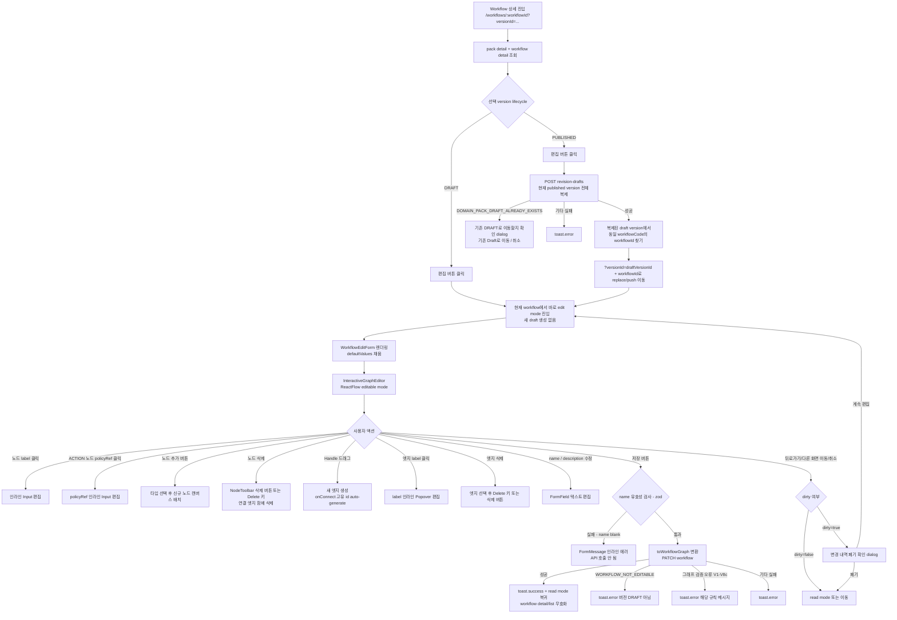

# Spec 324 — [Console] Workflow Node / Edge 수정 기능 구현

**Branch**: `spec/324`
**Canonical Number**: `324`
**Type**: Frontend (FSD)
**작성일**: 2026-04-24
**최종 업데이트**: 2026-05-26 (Domain Pack revision draft 편집 흐름 반영)

---

## Goal

운영자가 Domain Pack의 Workflow 상세 화면에서 `name`, `description`, 그래프(노드/엣지)를 `@xyflow/react` 인터랙티브 편집기로 수정하고 저장할 수 있는 기능을 구현한다.

Published version은 직접 수정하지 않는다. Published version에서 편집을 시작하면 현재 version 전체를 새 `DRAFT` revision으로 복제하고, 화면은 복제된 DRAFT version의 동일 `workflowCode` 상세로 이동한 뒤 편집 모드에 진입한다. 이미 DRAFT version을 보고 있는 경우에는 새 draft를 만들지 않고 현재 workflow를 바로 편집한다.

---

## User Flow Chart



---

## Design Diff

### As-is vs To-be

| 영역 | As-is | To-be | 변경 내용 |
|------|-------|-------|----------|
| 워크플로우 수정 기능 | 상세 화면 read-only 중심 | `WorkflowDraftReadPage` 내 inline edit mode | side sheet 중심에서 상세 화면 편집으로 정리 |
| 그래프 편집 UI | Read-only `GraphRenderer` | `InteractiveGraphEditor` (editable ReactFlow) | 신규 구현 |
| Published version 편집 | PATCH 시 `WORKFLOW_NOT_EDITABLE` 발생 | 편집 버튼에서 revision draft 생성 후 DRAFT 화면으로 이동 | Domain Pack revision 흐름 반영 |
| DRAFT version 편집 | 별도 lifecycle 분기 없음 | 현재 DRAFT에서 바로 edit mode 진입 | 새 draft 중복 생성 금지 |
| 편집 중 이동 | 별도 guard 없음 | dirty guard dialog로 변경 내역 폐기 확인 | 뒤로가기/취소/라우트 이동 보호 |
| `entities/workflow` 타입 | `graph` 필드명, `GraphEdge.id` 없음, `GraphNode.policyRef` 없음 | `graphJson` 필드명, `GraphEdge.id` 추가, `GraphNode.policyRef?` 추가 | **기존 코드 파괴적 수정** |
| `workflow-draft-read` | `detail.graph` 참조 | `detail.graphJson` 참조 | 타입 수정 후 동반 수정 필수 |
| `entities/workflow/api` | 없음 | `workflowKeys` + API 함수 | 신규 구현 |

---

## Prerequisites

### 타입 수정 선행 필수 (기존 코드 파괴)

이 스펙을 구현하기 전에 `entities/workflow/model/types.ts`를 수정해야 하며,
수정 후 `features/workflow-draft-read` 코드가 컴파일 에러가 발생한다. 동반 수정이 필수다.

### BE API (모두 구현 완료)

| Method | Path | 설명 | 응답 타입 |
|--------|------|------|-----------|
| GET | `/api/v1/workspaces/{workspaceId}/domain-packs/{packId}/versions/{versionId}/workflows` | 목록 조회 | `WorkflowSummary[]` |
| GET | `/api/v1/workspaces/{workspaceId}/domain-packs/{packId}/versions/{versionId}/workflows/{workflowId}` | 단건 조회 | `WorkflowDefinitionDetail` |
| PATCH | `/api/v1/workspaces/{workspaceId}/domain-packs/{packId}/versions/{versionId}/workflows/{workflowId}` | 필드 + 그래프 수정 | `WorkflowDefinitionDetail` |
| POST | `/api/v1/workspaces/{workspaceId}/domain-packs/{packId}/versions/{versionId}/revision-drafts` | Published 기준 새 DRAFT revision 생성 | `RevisionDraftResponse` |
| DELETE | `/api/v1/workspaces/{workspaceId}/domain-packs/{packId}/versions/{draftVersionId}/draft` | DRAFT revision 폐기 | `204 No Content` |
| POST | `/api/v1/workspaces/{workspaceId}/domain-packs/{packId}/versions/{draftVersionId}/activate` | DRAFT revision 적용 | `DomainPackVersionDetail` |

`PATCH .../workflows/{workflowId}`는 DRAFT version에만 허용된다. Published version에서 편집 버튼을 누르는 FE 흐름은 PATCH를 바로 호출하지 않고, 먼저 `POST .../revision-drafts`로 새 DRAFT version을 만든 뒤 복제된 workflow를 PATCH한다.

`GET .../workflows`는 선택적으로 `intentDefinitionId` query parameter를 받아 특정 intent에 연결된 workflow만 조회할 수 있다. Intent 상세 화면의 1:1 workflow 표시에서는 이 필터를 사용한다.

PATCH request body:

```json
{
  "name": "...",
  "description": "...",
  "graphJson": { "direction": "LR", "nodes": [...], "edges": [...] }
}
```

PATCH 에러 코드:

| 코드 | 조건 | FE toast 메시지 |
|------|------|----------------|
| `WORKFLOW_NOT_EDITABLE` | 버전이 DRAFT 아님 | `DRAFT 상태의 버전에서만 수정할 수 있습니다.` |
| `GRAPH_JSON_TOO_LARGE` | graphJson > 100,000자 | `그래프 데이터가 너무 큽니다.` |
| `DOMAIN_PACK_DRAFT_INVALID_REQUEST` | graphJson JSON 파싱 실패 또는 node id/type 누락 | `그래프 데이터 형식이 유효하지 않습니다.` |
| `WORKFLOW_INVALID_START_NODE` | START 노드 ≠ 1개 | `START 노드가 정확히 1개여야 합니다.` |
| `WORKFLOW_INVALID_TERMINAL_NODE` | TERMINAL 노드 0개 | `TERMINAL 노드가 최소 1개 필요합니다.` |
| `WORKFLOW_DANGLING_EDGE` | 엣지 끝점 노드 없음 | `엣지의 연결 대상 노드가 존재하지 않습니다.` |
| `WORKFLOW_UNREACHABLE_NODE` | START에서 도달 불가 노드 | `모든 노드가 START에서 도달 가능해야 합니다.` |
| `WORKFLOW_CYCLE_DETECTED` | 사이클 존재 | `그래프에 순환 경로가 있습니다.` |
| `WORKFLOW_UNLABELED_BRANCH` | DECISION 발신 엣지 label 없음 | `DECISION 노드의 모든 분기에 label이 필요합니다.` |
| `WORKFLOW_EDGE_ID_MISSING` | 엣지 id 없음 | `그래프 구조가 유효하지 않습니다.` |
| `WORKFLOW_EDGE_ID_DUPLICATE` | 엣지 id 중복 | `그래프 구조가 유효하지 않습니다.` |
| `WORKFLOW_ACTION_NODE_POLICY_REF_MISSING` | ACTION policyRef 없음 | `ACTION 노드의 policyRef 값이 필요합니다.` |
| `WORKFLOW_ACTION_NODE_POLICY_REF_INVALID_CHARS` | policyRef 패턴 불일치 | `ACTION 노드의 policyRef 형식이 유효하지 않습니다.` |
| `WORKFLOW_ACTION_NODE_POLICY_REF_NOT_FOUND` | ACTION policyRef가 이 버전 내 존재하는 policy 코드가 아님 | `ACTION 노드의 policyRef가 이 버전에 존재하지 않습니다.` |
| 기타 | — | `워크플로우 수정에 실패했습니다.` |

---

## Component Tree

```
pages/domain-pack
└── WorkflowDraftReadPage
     ├── version lifecycle 표시 (실제 lifecycle 기반, 하드코딩 금지)
     ├── EditButton
     │    ├── DRAFT: local edit mode 진입
     │    └── PUBLISHED: revision draft 생성 후 draft workflow로 이동
     ├── read mode: Workflow detail + GraphRenderer
     └── edit mode: InlineWorkflowEditor
          └── WorkflowEditForm
               ├── NameInput (required, @NotBlank)
               ├── DescriptionInput (optional)
               ├── WorkflowCodeField (read-only)
               ├── DirtyGuardDialog
               ├── InteractiveGraphEditor ← 핵심 컴포넌트
               │    ├── AddNodeToolbar (노드 타입 선택 + 추가 버튼)
               │    └── ReactFlow (editable)
               │         ├── EditableStartNode (label 편집)
               │         ├── EditableActionNode (label + policyRef 편집)
               │         ├── EditableDecisionNode (label 편집)
               │         ├── EditableAnswerNode (label 편집)
               │         ├── EditableHandoffNode (label 편집)
               │         └── EditableTerminalNode (label 편집)
               └── ActionBar
                    ├── 저장 버튼 (PATCH fields + graph)
                    └── 취소/뒤로가기 (dirty면 폐기 확인)
```

**이 스펙(324) 직접 구현 범위**: `WorkflowDraftReadPage`의 편집 진입점, `InlineWorkflowEditor`, `WorkflowEditForm`, `InteractiveGraphEditor`, 편집 가능 노드 컴포넌트 6종, 관련 hooks, `entities/workflow` 타입·API 추가, `workflow-draft-read` 동반 수정, dirty guard dialog

**이 스펙 범위 외**: Domain Pack summary 화면의 DRAFT 적용/폐기 버튼 배치(스펙 512), backend revision draft clone 정책 변경(스펙 314), workflow PATCH 도메인 검증 변경(스펙 329)

---

## API Integration

### Query Key Pattern

```typescript
// entities/workflow/api/index.ts  (신규)
export const workflowKeys = {
  all: ['workflows'] as const,
  lists: () => [...workflowKeys.all, 'list'] as const,
  list: (wsId: number, packId: number, versionId: number) =>
    [...workflowKeys.lists(), wsId, packId, versionId] as const,
  detail: (wsId: number, packId: number, versionId: number, workflowId: number) =>
    [...workflowKeys.all, 'detail', wsId, packId, versionId, workflowId] as const,
};
```

### Request / Response 타입

```typescript
// entities/workflow/model/types.ts — 수정·추가

export type GraphNodeType = 'START' | 'ACTION' | 'DECISION' | 'ANSWER' | 'HANDOFF' | 'TERMINAL';

export interface GraphNode {
  id: string;
  label: string;
  type: GraphNodeType;
  policyRef?: string; // ADD: ACTION 노드 필수, 나머지 undefined
}

export interface GraphEdge {
  id: string;        // ADD: V7a/V7b 검증 필수
  from: string;
  to: string;
  label?: string;
}

export interface WorkflowGraph {
  direction: 'LR' | 'TB';
  nodes: GraphNode[];
  edges: GraphEdge[];
}

export interface WorkflowSummary {
  id: number;
  workflowCode: string;
  name: string;
  description: string | null;
  initialState: string | null;
  terminalStatesJson: string;
  createdAt: string;
  updatedAt: string;
}

export interface WorkflowDetail {
  id: number;
  workflowCode: string;
  name: string;
  description: string | null;
  graphJson: WorkflowGraph; // RENAME: 기존 `graph` → `graphJson` (BE 응답 필드명 일치)
  initialState: string | null;
  terminalStatesJson: string;
  evidenceJson: string;
  metaJson: string;
  createdAt: string;
  updatedAt: string;
}

// PATCH request body
export interface UpdateWorkflowRequest {
  name: string;
  description?: string | null;
  graphJson: WorkflowGraph;
}
```

---

## Data Flow

```
WorkflowDraftReadPage
    │  route params: { workspaceId, packId, workflowId }
    │  query: { versionId }
    │
    ├── usePackDetail(workspaceId, packId)
    │     └── selected version lifecycle 확인
    ├── useGetWorkflow(workspaceId, packId, versionId, workflowId)
    │     └── workflowCode 확보
    │
    ├── Edit button click
    │     ├── lifecycle = DRAFT
    │     │     └── setIsEditing(true)
    │     └── lifecycle = PUBLISHED
    │           ├── createRevisionDraft(base version)
    │           ├── draft version workflow list/detail에서 동일 workflowCode 검색
    │           ├── navigate(`/workflows/{draftWorkflowId}?versionId={draftVersionId}`)
    │           └── setIsEditing(true)
    │
    └── edit mode: WorkflowEditForm (defaultValues = workflow data)
          │  react-hook-form + zod resolver (name 필드)
          │  InteractiveGraphEditor
          │     useNodesState(initialNodes)
          │     useEdgesState(initialEdges)
          │     onConnect → 신규 엣지 추가 (crypto.randomUUID() id)
          │     노드 label/policyRef 인라인 편집
          │
          ├── 저장
          │     ├── toWorkflowGraph(nodes, edges, direction)
          │     ├── useUpdateWorkflow.mutate({ wsId, packId, draftVersionId, workflowId, body })
          │     ├── onSuccess: toast.success + read mode 복귀 + invalidate
          │     └── onError: 에러 코드별 toast.error
          │
          └── 취소/뒤로가기/라우트 이탈
                ├── dirty=false: 즉시 read mode 또는 이동
                └── dirty=true: "변경 내역이 버려집니다" 확인 dialog
```

---

## 수정 대상 파일

> **경로 기준**: 아래 모든 경로는 `frontend/` 루트 기준 상대 경로다.

### 신규 생성

| 파일 | 설명 |
|------|------|
| `frontend/src/entities/workflow/api/index.ts` | `workflowKeys`, `fetchWorkflow`, `patchWorkflow` API 함수 |
| `frontend/src/entities/workflow/lib/graphConverter.ts` | ReactFlow nodes/edges → `WorkflowGraph` 필드 매핑 공유 유틸 (`convertFlowToWorkflowGraph`) |
| `frontend/src/features/update-workflow/model/schema.ts` | zod schema (name 필수 검사) |
| `frontend/src/features/update-workflow/api/useGetWorkflow.ts` | GET workflow useQuery hook |
| `frontend/src/features/update-workflow/api/useUpdateWorkflow.ts` | PATCH workflow useMutation hook |
| `frontend/src/features/update-workflow/ui/WorkflowEditSheet.tsx` | legacy side sheet wrapper. 신규 진입점은 `InlineWorkflowEditor` 우선 |
| `frontend/src/features/update-workflow/ui/WorkflowEditForm.tsx` | react-hook-form 기반 편집 폼 |
| `frontend/src/features/update-workflow/ui/InteractiveGraphEditor.tsx` | @xyflow/react 기반 편집기 |
| `frontend/src/features/update-workflow/ui/graphToWorkflow.ts` | ReactFlow → WorkflowGraph 변환 유틸 (`graphConverter` 래퍼) |
| `frontend/src/features/update-workflow/ui/AddNodeToolbar.tsx` | 노드 타입 선택 + 추가 버튼 툴바 |
| `frontend/src/features/update-workflow/ui/nodes/EditableStartNode.tsx` | 편집 가능 START 노드 |
| `frontend/src/features/update-workflow/ui/nodes/EditableActionNode.tsx` | 편집 가능 ACTION 노드 (label + policyRef) |
| `frontend/src/features/update-workflow/ui/nodes/EditableDecisionNode.tsx` | 편집 가능 DECISION 노드 |
| `frontend/src/features/update-workflow/ui/nodes/EditableAnswerNode.tsx` | 편집 가능 ANSWER 노드 |
| `frontend/src/features/update-workflow/ui/nodes/EditableHandoffNode.tsx` | 편집 가능 HANDOFF 노드 |
| `frontend/src/features/update-workflow/ui/nodes/EditableTerminalNode.tsx` | 편집 가능 TERMINAL 노드 |
| `frontend/src/features/update-workflow/index.ts` | barrel export |

### 수정 (기존 파일)

| 파일 | 변경 내용 |
|------|----------|
| `frontend/src/entities/workflow/model/types.ts` | `graph` → `graphJson` rename, `GraphEdge.id` 추가, `GraphNode.policyRef?` 추가, `UpdateWorkflowRequest` 추가 |
| `frontend/src/entities/workflow/index.ts` | 신규 export 추가 (`workflowKeys`, `UpdateWorkflowRequest`) |
| `frontend/src/pages/domain-pack/ui/WorkflowDraftReadPage.tsx` | lifecycle 기반 badge 표시, Published edit 시 revision draft 생성 및 draft workflow 이동, DRAFT edit 시 바로 편집 |
| `frontend/src/features/update-workflow/ui/InlineWorkflowEditor.tsx` | 상세 화면 inline 편집 shell, 저장/취소 action bar, dirty guard 연결 |
| `frontend/src/features/update-workflow/ui/WorkflowEditForm.tsx` | dirty 상태를 parent로 전달하고 취소 시 변경 내역 폐기 확인을 지원 |
| `frontend/src/features/update-workflow/ui/InteractiveGraphEditor.tsx` | 그래프 변경 시 form dirty 상태와 동기화 |
| `frontend/src/features/intent-draft-read/ui/MatchedWorkflowSection.tsx` | intent에 연결된 workflow 이동 시 컴포넌트 중심 route + `?versionId=` 사용 |
| `frontend/src/entities/workflow/api/useListWorkflowsByIntent.ts` | intent 상세에서 1:1 workflow 표시를 위해 `intentDefinitionId` filter 사용 |
| `frontend/src/features/workflow-draft-read/ui/WorkflowDetailPanel.tsx` | `detail.graph` → `detail.graphJson` |
| `frontend/src/features/workflow-draft-read/ui/GraphRenderer.tsx` | `WorkflowDetail` props 타입 반영 (필요 시) |
| `frontend/src/features/workflow-draft-read/ui/graphMapper.ts` | `edge.id` 사용 (기존 자체 생성 ID → `e.id` 사용), `toFlow` 반환 엣지 id 수정; `toFlow`의 역방향 변환이 필요한 경우 `graphConverter.convertFlowToWorkflowGraph` 재사용 |
| `frontend/src/features/workflow-draft-read/ui/graphMapper.test.ts` | edge ID 형식 변경에 따른 테스트 업데이트 |

---

## State Management

### Server State (TanStack Query)

```typescript
// features/update-workflow/api/useGetWorkflow.ts
export function useGetWorkflow(
  wsId: number,
  packId: number,
  versionId: number,
  workflowId: number,
  enabled: boolean,
) {
  return useQuery({
    queryKey: workflowKeys.detail(wsId, packId, versionId, workflowId),
    queryFn: () => fetchWorkflow(wsId, packId, versionId, workflowId),
    enabled,
  });
}
```

```typescript
// features/update-workflow/api/useUpdateWorkflow.ts
export function useUpdateWorkflow() {
  const queryClient = useQueryClient();
  return useMutation({
    mutationFn: ({ wsId, packId, versionId, workflowId, body }: UpdateWorkflowParams) =>
      patchWorkflow(wsId, packId, versionId, workflowId, body),
    onSuccess: (_, { wsId, packId, versionId, workflowId }) => {
      queryClient.invalidateQueries({ queryKey: workflowKeys.detail(wsId, packId, versionId, workflowId) });
      queryClient.invalidateQueries({ queryKey: workflowKeys.list(wsId, packId, versionId) });
      toast.success('워크플로우가 수정되었습니다.');
    },
    onError: (error: ApiRequestError) => {
      const errorMessages: Record<string, string> = {
        WORKFLOW_NOT_EDITABLE: 'DRAFT 상태의 버전에서만 수정할 수 있습니다.',
        GRAPH_JSON_TOO_LARGE: '그래프 데이터가 너무 큽니다.',
        DOMAIN_PACK_DRAFT_INVALID_REQUEST: '그래프 데이터 형식이 유효하지 않습니다.',
        WORKFLOW_INVALID_START_NODE: 'START 노드가 정확히 1개여야 합니다.',
        WORKFLOW_INVALID_TERMINAL_NODE: 'TERMINAL 노드가 최소 1개 필요합니다.',
        WORKFLOW_DANGLING_EDGE: '엣지의 연결 대상 노드가 존재하지 않습니다.',
        WORKFLOW_UNREACHABLE_NODE: '모든 노드가 START에서 도달 가능해야 합니다.',
        WORKFLOW_CYCLE_DETECTED: '그래프에 순환 경로가 있습니다.',
        WORKFLOW_UNLABELED_BRANCH: 'DECISION 노드의 모든 분기에 label이 필요합니다.',
        WORKFLOW_ACTION_NODE_POLICY_REF_MISSING: 'ACTION 노드의 policyRef 값이 필요합니다.',
        WORKFLOW_ACTION_NODE_POLICY_REF_INVALID_CHARS: 'ACTION 노드의 policyRef 형식이 유효하지 않습니다.',
        WORKFLOW_ACTION_NODE_POLICY_REF_NOT_FOUND: 'ACTION 노드의 policyRef가 이 버전에 존재하지 않습니다.',
        WORKFLOW_EDGE_ID_MISSING: '그래프 구조가 유효하지 않습니다.',
        WORKFLOW_EDGE_ID_DUPLICATE: '그래프 구조가 유효하지 않습니다.',
      };
      toast.error(errorMessages[error.code] ?? '워크플로우 수정에 실패했습니다.');
    },
  });
}
```

### Client State (@xyflow/react)

```typescript
// InteractiveGraphEditor.tsx 내 — ReactFlow 상태 관리
const [nodes, setNodes, onNodesChange] = useNodesState(initialNodes);
const [edges, setEdges, onEdgesChange] = useEdgesState(initialEdges);

const onConnect = useCallback(
  (params: Connection) =>
    setEdges((eds) =>
      addEdge({ ...params, id: crypto.randomUUID() }, eds)
    ),
  [setEdges]
);
```

### 폼 상태 (react-hook-form + zod)

```typescript
// features/update-workflow/model/schema.ts
export const workflowEditSchema = z.object({
  name: z.string().trim().min(1, '워크플로우 이름은 필수입니다.'),
  description: z.string().nullable().optional(),
});

export type WorkflowEditFormValues = z.infer<typeof workflowEditSchema>;
```

```typescript
// WorkflowEditForm.tsx 내
const form = useForm<WorkflowEditFormValues>({
  resolver: zodResolver(workflowEditSchema),
  defaultValues: {
    name: workflow.name,
    description: workflow.description,
  },
});
```

- 편집 모드 진입/종료: `WorkflowDraftReadPage`에서 관리한다.
- version lifecycle: pack detail의 실제 `lifecycleStatus`를 사용한다. `DRAFT` badge를 하드코딩하지 않는다.
- Published edit entry: `createRevisionDraft` mutation pending 중 편집 버튼을 disabled 처리하고, 성공 후 draft version으로 이동한다.
- DRAFT edit entry: revision draft API를 호출하지 않고 현재 workflow에서 바로 `isEditing=true`로 전환한다.
- 그래프 상태(nodes, edges): `InteractiveGraphEditor` 내부 `useNodesState`/`useEdgesState`로 관리
- 저장 시 `toWorkflowGraph(nodes, edges, direction)` 변환 후 PATCH 전송
- dirty 상태: `react-hook-form`의 `formState.isDirty`와 graph editor 변경 여부를 합산해 판단한다.
- dirty guard dialog 문구는 변경 내역이 저장되지 않고 버려진다는 점을 명확히 표시한다. 적용/폐기 API와 혼동되지 않도록 "draft 폐기"가 아니라 "편집 중 변경 내역 폐기"로 표현한다.
- 기존 DRAFT 존재 dialog는 편집 화면에서 draft를 폐기하지 않는다. 제목은 `진행 중인 Draft가 있습니다`, 본문은 `새 Draft를 만들 수 없습니다. 기존 Draft에서 계속 편집하거나, Domain Pack 화면에서 Draft를 적용 또는 폐기한 뒤 다시 시도하세요.`로 표시한다.
- 기존 DRAFT 존재 dialog의 primary action은 `기존 Draft로 이동`, secondary action은 `취소`다. `기존 Draft 폐기 후 새로 만들기`는 제공하지 않는다.

---

## graphMapper.ts 수정 사항

```typescript
// 수정 전 (자체 생성 ID)
return {
  id: `${baseId}#${count + 1}`,
  source: e.from,
  target: e.to,
  label: e.label,
};

// 수정 후 (edge.id 직접 사용)
return {
  id: e.id,
  source: e.from,
  target: e.to,
  label: e.label,
};
```

단, 테스트 데이터에 `id` 없는 엣지가 있으면 `graphMapper.test.ts`도 함께 수정.

---

## graphConverter.ts (공유 유틸)

`toFlow` (WorkflowGraph → ReactFlow)의 역방향 변환인 ReactFlow → WorkflowGraph 필드 매핑은
`graphMapper.ts`와 `graphToWorkflow.ts` 양쪽에서 재사용된다. 중복을 막기 위해 해당 변환을
`entities/workflow/lib/graphConverter.ts`에 분리한다.

```typescript
// entities/workflow/lib/graphConverter.ts
import type { Node, Edge } from '@xyflow/react';
import type { GraphNode, GraphEdge, GraphNodeType } from '../model/types';

export function convertFlowToWorkflowGraph(
  nodes: Node[],
  edges: Edge[],
): { nodes: GraphNode[]; edges: GraphEdge[] } {
  const graphNodes: GraphNode[] = nodes.map((n) => ({
    id: n.id,
    type: (n.type?.toUpperCase() ?? 'ACTION') as GraphNodeType,
    label: typeof n.data?.label === 'string' ? n.data.label : '',
    policyRef: typeof n.data?.policyRef === 'string' ? n.data.policyRef || undefined : undefined,
  }));

  const graphEdges: GraphEdge[] = edges.map((e) => ({
    id: e.id,
    from: e.source,
    to: e.target,
    label: typeof e.label === 'string' ? e.label || undefined : undefined,
  }));

  return { nodes: graphNodes, edges: graphEdges };
}
```

## graphToWorkflow.ts

`graphConverter.convertFlowToWorkflowGraph`를 호출하는 얇은 래퍼.

```typescript
// features/update-workflow/ui/graphToWorkflow.ts
import type { Node, Edge } from '@xyflow/react';
import type { WorkflowGraph } from '@/entities/workflow';
import { convertFlowToWorkflowGraph } from '@/entities/workflow/lib/graphConverter';

export function toWorkflowGraph(
  nodes: Node[],
  edges: Edge[],
  direction: WorkflowGraph['direction'],
): WorkflowGraph {
  const { nodes: graphNodes, edges: graphEdges } = convertFlowToWorkflowGraph(nodes, edges);
  return { direction, nodes: graphNodes, edges: graphEdges };
}
```

---

## Design Constraints

`frontend/DESIGN.md` 준수:
- 색상: 모노크롬만 (`#000000` / `#ffffff`)
- 폰트: figmaSans
- 버튼: `shared/ui/button.tsx` (pill geometry)
- Focus outline: `dashed 2px`
- `alert()` 사용 금지 → `import { toast } from "sonner"`
- Inline editor는 기존 상세 화면 폭 안에서 동작하며, 그래프 영역은 desktop에서 충분한 높이와 가로 스크롤 없는 레이아웃을 확보한다.
- Dialog radius는 기존 shared dialog/card 규칙을 따른다.

### 공유 컴포넌트 활용

| 역할 | `shared/ui` 파일 |
|------|-----------------|
| Dirty guard dialog | 기존 dialog/confirm 계열 shared UI |
| 텍스트 입력 | `input.tsx` |
| 저장/취소 버튼 | `button.tsx` |
| 로딩 표시 | `spinner.tsx` |
| 폼 레이블/에러 | `form.tsx` |
| Toast 알림 | `import { toast } from "sonner"` |

---

## Tests

### Test Strategy

| 구분 | 방법 | 도구 | 비고 |
|------|------|------|------|
| 수동 테스트 | 브라우저 직접 확인 | Chrome DevTools | 전체 플로우 |
| 단위 테스트 | Vitest + mock | `pnpm test` | `graphToWorkflow`, `graphMapper` 변환 로직 |

### Test Environment & 사전 조건

| 항목 | 값 |
|------|---|
| 환경 | `pnpm dev` (백엔드 포함) |
| 사전 조건 | DRAFT 상태 Domain Pack Version + 워크플로우 1개 이상 |
| 역할 | OPERATOR 또는 ADMIN 로그인 상태 |

### Test Scenarios

#### Happy Path

| # | 시나리오 | 사전 조건 | 조작 | 기대 결과 |
|---|---------|---------|------|----------|
| 1 | DRAFT workflow name 수정 | DRAFT version, 워크플로우 존재 | 편집 버튼 → name 수정 → 저장 | 성공 toast, read mode 복귀, 데이터 반영 |
| 2 | Published workflow 편집 시작 | PUBLISHED version, DRAFT 없음 | 편집 버튼 클릭 | revision draft 생성, draft version의 동일 workflow로 이동 후 edit mode 진입 |
| 3 | DRAFT에서 편집 버튼 클릭 | DRAFT version | 편집 버튼 클릭 | revision draft API 호출 없음, 현재 workflow 바로 편집 |
| 4 | 노드 label 수정 | DRAFT version | 편집 → 노드 클릭 → label 수정 → 저장 | 성공 toast, read mode 복귀 |
| 5 | 노드 추가 | DRAFT version | 툴바 → 타입 선택 → 추가 → 엣지 연결 → 저장 | 신규 노드 포함한 graph 저장 성공 |
| 6 | 노드 삭제 | DRAFT version | 노드 선택 → Delete → 저장 | 노드 및 연결 엣지 삭제 후 저장 성공 |
| 7 | 엣지 추가 | DRAFT version | Handle 드래그 → 엣지 생성 → 저장 | 신규 엣지 포함한 graph 저장 성공 |
| 8 | 취소 시 변경 없음 | DRAFT version | 편집 → 변경 없음 → 취소 | 즉시 read mode 복귀 |

#### Error & Edge Cases

| # | 시나리오 | 조작 | 기대 결과 |
|---|---------|------|----------|
| 1 | name 빈 문자열로 저장 | name 지우고 저장 | FormMessage 인라인 에러, API 호출 안 됨 |
| 2 | DRAFT 아닌 버전에서 PATCH 방어 | 임의로 Published version에 PATCH | `WORKFLOW_NOT_EDITABLE` → toast.error |
| 3 | START 노드 삭제 후 저장 | START 삭제 → 저장 | `WORKFLOW_INVALID_START_NODE` → toast.error |
| 4 | DECISION 엣지 label 없이 저장 | DECISION에서 엣지 추가, label 빈칸 → 저장 | `WORKFLOW_UNLABELED_BRANCH` → toast.error |
| 5 | ACTION 노드 policyRef 없이 저장 | ACTION 노드 policyRef 공백 → 저장 | `WORKFLOW_ACTION_NODE_POLICY_REF_MISSING` → toast.error |
| 6 | revision draft 이미 존재 | Published에서 편집 버튼, pack에 DRAFT 존재 | `진행 중인 Draft가 있습니다` dialog 표시, `기존 Draft로 이동` 또는 `취소`만 제공 |
| 7 | GET 워크플로우 실패 | 상세 진입 시 API 에러 | 에러 상태 표시, 재시도 가능 |
| 8 | workflowCode 필드 | 편집 폼 내 해당 필드 | read-only, 수정 불가 |
| 9 | dirty 상태에서 취소/뒤로가기 | name 또는 graph 변경 후 취소/이탈 | "변경 내역이 버려집니다" 확인 dialog 표시 |
| 10 | lifecycle badge 표시 | PUBLISHED/DRAFT version 각각 진입 | 실제 lifecycle 값 표시, `DRAFT` 하드코딩 없음 |

#### 접근성

| # | 확인 항목 | 기대 결과 |
|---|---------|----------|
| 1 | 키보드 탐색 | Tab → name, description 순 이동 |
| 2 | Focus outline | dashed 2px 아웃라인 표시 |
| 3 | 저장/취소 버튼 aria | button role, 상태에 따른 disabled 표시 |

---

## Done Criteria

- [ ] `entities/workflow/model/types.ts` 수정 완료: `graph` → `graphJson`, `GraphEdge.id` 추가, `GraphNode.policyRef?` 추가, `UpdateWorkflowRequest` 추가
- [ ] `features/workflow-draft-read` 동반 수정 완료: `detail.graphJson` 참조, `graphMapper.ts` edge id 직접 사용, 테스트 업데이트
- [ ] `entities/workflow/api/index.ts` 신규: `workflowKeys`, `fetchWorkflow`, `patchWorkflow`
- [ ] `WorkflowDraftReadPage`: lifecycle badge를 실제 version 상태로 표시하고 `DRAFT` 하드코딩 제거
- [ ] `WorkflowDraftReadPage`: DRAFT version에서 편집 버튼 클릭 시 revision draft 생성 없이 inline edit mode 진입
- [ ] `WorkflowDraftReadPage`: PUBLISHED version에서 편집 버튼 클릭 시 revision draft 생성 후 동일 `workflowCode`의 draft workflow 상세로 이동
- [ ] `WorkflowDraftReadPage`: 기존 DRAFT 존재 시 `진행 중인 Draft가 있습니다` dialog 표시, `기존 Draft로 이동`/`취소`만 제공
- [ ] `InlineWorkflowEditor`: 상세 화면 안에서 read/edit 전환 가능
- [ ] dirty guard dialog: 저장 전 취소/뒤로가기/라우트 이탈 시 변경 내역 폐기 확인
- [ ] `useGetWorkflow`: TanStack Query `useQuery`, `enabled` prop으로 조건부 활성화
- [ ] `useUpdateWorkflow`: `useMutation`, onSuccess `workflowKeys.detail` + `workflowKeys.list` 두 캐시 모두 invalidate + toast.success
- [ ] `useUpdateWorkflow`: 에러 코드별 user-friendly toast.error (V1–V8c 포함)
- [ ] `WorkflowEditSheet`: legacy wrapper로 유지할 경우 `InlineWorkflowEditor`/`WorkflowEditForm`을 재사용
- [ ] `WorkflowEditForm`: react-hook-form + zod, name 필수 유효성(FormMessage), PATCH 성공 시 toast + read mode 복귀
- [ ] `InteractiveGraphEditor`: `useNodesState` / `useEdgesState`, 노드 label 인라인 편집, ACTION 노드 policyRef 편집, 노드 추가/삭제, 엣지 추가/삭제, 엣지 연결 (`onConnect`)
- [ ] 신규 엣지 id: `crypto.randomUUID()` 사용
- [ ] `workflowCode` 필드: read-only
- [ ] `entities/workflow/lib/graphConverter.ts` 신규: `convertFlowToWorkflowGraph` 구현, `toWorkflowGraph`에서 호출
- [ ] `toWorkflowGraph()`: ReactFlow nodes/edges → `WorkflowGraph` 변환 정확성 (policyRef, edge id 포함)
- [ ] DESIGN.md 준수: 모노크롬, dashed focus, `shared/ui` 컴포넌트 사용, Sheet `w-full sm:max-w-4xl`
- [ ] FSD 의존성 방향 준수: `features/update-workflow` → `entities/workflow` → `shared`
- [ ] `alert()` 미사용, `import { toast } from "sonner"` 사용
- [ ] `pnpm test` 통과 (graphMapper.test.ts 포함)

---

## Out of Scope (이 스펙 제외)

- Domain Pack summary 화면의 DRAFT 적용/폐기 버튼 구현 (스펙 512)
- 노드 위치(position) 서버 저장 — graphJson 스키마에 미포함
- policyRef autocomplete (valid policy 코드 목록 제공 UI)
- 워크플로우 생성 / 삭제 기능
- `workflowCode` 수정 (불변 필드)
