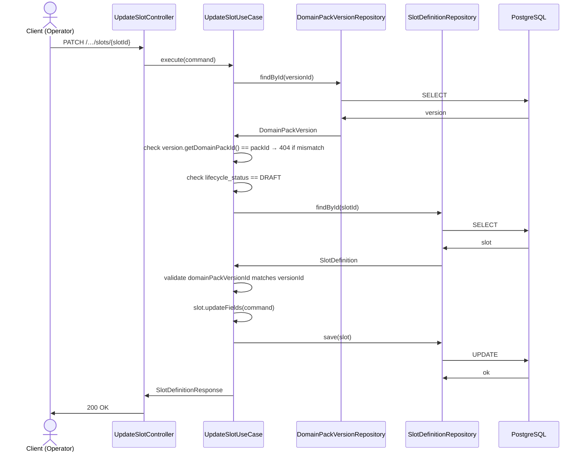
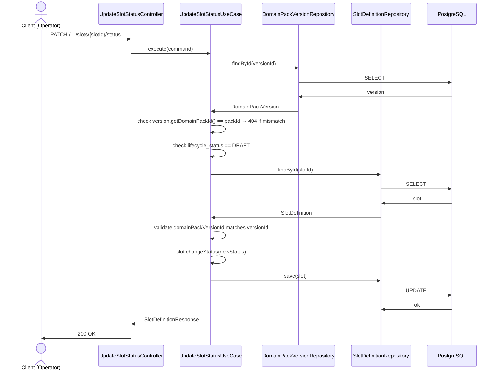
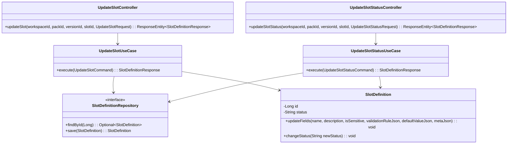

# 326: [BE] Slot / Slot Status 수정 API

## Goal

운영자가 Domain Pack 버전의 Slot 구성요소를 수정할 수 있도록 두 개의 REST API를 제공한다:

1. Slot 일반 필드 수정 (`PATCH .../slots/{slotId}`)
2. Slot Status 전환 (`PATCH .../slots/{slotId}/status`)

모든 수정은 `DomainPackVersion.lifecycle_status = 'DRAFT'`인 경우에만 허용된다.

---

## Sequence Diagram

### 1. Slot 일반 수정



### 2. Slot Status 전환



---

## REST API

### Endpoints

| Method | Path | Description |
|--------|------|-------------|
| PATCH | `/api/v1/workspaces/{workspaceId}/domain-packs/{packId}/versions/{versionId}/slots/{slotId}` | Slot 일반 필드 수정 |
| PATCH | `/api/v1/workspaces/{workspaceId}/domain-packs/{packId}/versions/{versionId}/slots/{slotId}/status` | Slot Status 전환 |

### Request — Slot 일반 수정

**PATCH `/api/v1/workspaces/{workspaceId}/domain-packs/{packId}/versions/{versionId}/slots/{slotId}`**

```json
{
  "name": "고객명",
  "description": "상담 시 수집할 고객 이름",
  "isSensitive": false,
  "validationRuleJson": "{}",
  "defaultValueJson": null,
  "metaJson": "{}"
}
```

수정 가능 필드: `name`, `description`, `isSensitive`, `validationRuleJson`, `defaultValueJson`, `metaJson`

수정 불가 필드: `slotCode`, `dataType`, `domainPackVersionId`

### Request — Slot Status 전환

**PATCH `/api/v1/workspaces/{workspaceId}/domain-packs/{packId}/versions/{versionId}/slots/{slotId}/status`**

```json
{
  "status": "INACTIVE"
}
```

허용 값: `"ACTIVE"`, `"INACTIVE"`

### Response

**200 OK** (양 엔드포인트 공통)

```json
{
  "id": 1,
  "domainPackVersionId": 10,
  "slotCode": "customer_name",
  "name": "고객명",
  "description": "상담 시 수집할 고객 이름",
  "dataType": "STRING",
  "isSensitive": false,
  "validationRuleJson": "{}",
  "defaultValueJson": null,
  "metaJson": "{}",
  "status": "ACTIVE",
  "createdAt": "2026-04-15T10:00:00Z",
  "updatedAt": "2026-04-15T10:30:00Z"
}
```

**400 Bad Request** — DRAFT가 아닌 버전 수정 시도

```json
{
  "code": "SLOT_NOT_EDITABLE",
  "message": "DRAFT 상태의 버전에서만 슬롯을 수정할 수 있습니다."
}
```

**400 Bad Request** — 유효성 오류

```json
{
  "code": "VALIDATION_ERROR",
  "errors": ["name은 필수 항목입니다."]
}
```

**403 Forbidden** — 워크스페이스 멤버십 없음

```json
{
  "code": "UNAUTHORIZED",
  "message": "해당 워크스페이스에 접근 권한이 없습니다."
}
```

**404 Not Found** — Slot 또는 Version 미존재

```json
{
  "code": "NOT_FOUND",
  "message": "슬롯을 찾을 수 없습니다: 999"
}
```

---

## Class Design

### DDD Layered Structure



### SlotDefinition 변경 — 도메인 메서드 추가

```java
// status 허용 값 상수
public static final String STATUS_ACTIVE = "ACTIVE";
public static final String STATUS_INACTIVE = "INACTIVE";

// status 필드 추가 (pack.slot_definition 테이블 컬럼 추가에 대응)
@Column(name = "status", nullable = false)
private String status;

// create() 팩토리 메서드에 기본값 추가
entity.status = STATUS_ACTIVE;

// 일반 필드 수정 메서드 (public setter 금지 준수)
public void updateFields(
    String name,
    String description,
    Boolean isSensitive,
    String validationRuleJson,
    String defaultValueJson,
    String metaJson) {
  Objects.requireNonNull(name, "name must not be null");
  if (name.isBlank()) {
    throw new BadRequestException("VALIDATION_ERROR", "name은 비워둘 수 없습니다.");
  }
  this.name = name;
  this.description = description;
  if (isSensitive != null) this.isSensitive = isSensitive;
  if (validationRuleJson != null) this.validationRuleJson = validationRuleJson;
  this.defaultValueJson = defaultValueJson;
  if (metaJson != null) this.metaJson = metaJson;
}

// Status 전환 메서드
public void changeStatus(String newStatus) {
  if (!STATUS_ACTIVE.equals(newStatus) && !STATUS_INACTIVE.equals(newStatus)) {
    throw new BadRequestException("VALIDATION_ERROR", "허용되지 않는 status 값입니다: " + newStatus);
  }
  this.status = newStatus;
}
```

### Application Service 패턴

```java
@Service
@Transactional(readOnly = true)
public class UpdateSlotUseCase {

  private final SlotDefinitionRepository slotRepository;
  private final DomainPackVersionRepository versionRepository;
  private final WorkspaceMembershipPort membershipPort;

  public UpdateSlotUseCase(
      SlotDefinitionRepository slotRepository,
      DomainPackVersionRepository versionRepository,
      WorkspaceMembershipPort membershipPort) {
    this.slotRepository = slotRepository;
    this.versionRepository = versionRepository;
    this.membershipPort = membershipPort;
  }

  @Transactional
  public SlotDefinitionResponse execute(UpdateSlotCommand command) {
    membershipPort.validateMembership(command.workspaceId(), command.requesterId());

    DomainPackVersion version = versionRepository.findById(command.versionId())
        .orElseThrow(() -> new NotFoundException("버전을 찾을 수 없습니다: " + command.versionId()));

    if (!version.getDomainPackId().equals(command.packId())) {
      throw new NotFoundException("버전을 찾을 수 없습니다: " + command.versionId());
    }

    if (!DomainPackVersion.STATUS_DRAFT.equals(version.getLifecycleStatus())) {
      throw new BadRequestException("SLOT_NOT_EDITABLE", "DRAFT 상태의 버전에서만 슬롯을 수정할 수 있습니다.");
    }

    SlotDefinition slot = slotRepository.findById(command.slotId())
        .orElseThrow(() -> new NotFoundException("슬롯을 찾을 수 없습니다: " + command.slotId()));

    if (!slot.getDomainPackVersionId().equals(command.versionId())) {
      throw new NotFoundException("슬롯을 찾을 수 없습니다: " + command.slotId());
    }

    slot.updateFields(
        command.name(),
        command.description(),
        command.isSensitive(),
        command.validationRuleJson(),
        command.defaultValueJson(),
        command.metaJson());

    slotRepository.save(slot);
    return SlotDefinitionResponse.from(slot);
  }
}
```

---

## Tests

### Unit Tests

```java
@DisplayName("SlotDefinition")
class SlotDefinitionTest {

  @Test
  @DisplayName("updateFields: 허용 필드 정상 수정")
  void updateFields_withValidInput_updatesFields() {
    // given: 기존 SlotDefinition 생성
    // when: updateFields 호출
    // then: name, description 등 수정 확인
  }

  @Test
  @DisplayName("updateFields: name이 blank이면 BadRequestException")
  void updateFields_withBlankName_throwsException() {
    // then: BadRequestException 발생 확인
  }

  @Test
  @DisplayName("changeStatus: ACTIVE→INACTIVE 정상 전환")
  void changeStatus_toInactive_changesStatus() {
    // then: status == "INACTIVE" 확인
  }

  @Test
  @DisplayName("changeStatus: 허용되지 않는 값이면 BadRequestException")
  void changeStatus_withInvalidStatus_throwsException() {
    // then: BadRequestException 발생 확인
  }
}
```

### Integration Tests

```java
@SpringBootTest
@AutoConfigureMockMvc
@DisplayName("UpdateSlotController")
class UpdateSlotControllerTest {

  @Test
  @DisplayName("PATCH /slots/{slotId}: DRAFT 버전의 슬롯 정상 수정 → 200")
  void updateSlot_draftVersion_returns200() { }

  @Test
  @DisplayName("PATCH /slots/{slotId}: PUBLISHED 버전이면 400 반환")
  void updateSlot_publishedVersion_returns400WithSlotNotEditable() { }

  @Test
  @DisplayName("PATCH /slots/{slotId}: 슬롯 미존재 시 404 반환")
  void updateSlot_slotNotFound_returns404() { }

  @Test
  @DisplayName("PATCH /slots/{slotId}: name이 빈 값이면 400 반환")
  void updateSlot_blankName_returns400() { }

  @Test
  @DisplayName("PATCH /slots/{slotId}/status: INACTIVE 전환 → 200")
  void updateSlotStatus_toInactive_returns200() { }

  @Test
  @DisplayName("PATCH /slots/{slotId}/status: 허용되지 않는 status 값이면 400")
  void updateSlotStatus_invalidStatus_returns400() { }

  @Test
  @DisplayName("PATCH /slots/{slotId}/status: PUBLISHED 버전이면 400 반환")
  void updateSlotStatus_publishedVersion_returns400() { }
}
```

### Test Checklist

- [ ] Slot 일반 수정: 허용 필드(name, description, isSensitive, validationRuleJson, defaultValueJson, metaJson) 정상 수정 검증
- [ ] Slot 일반 수정: PUBLISHED 버전에서 수정 시 400 + `SLOT_NOT_EDITABLE` 검증
- [ ] Slot 일반 수정: 슬롯 미존재 시 404 검증
- [ ] Slot 일반 수정: slot의 domainPackVersionId와 URL의 versionId 불일치 시 404 검증
- [ ] Slot 일반 수정: URL의 packId와 version.domainPackId 불일치 시 404 검증
- [ ] Slot 일반 수정: 워크스페이스 멤버십 없을 때 403 검증
- [ ] Slot 일반 수정: name이 빈 값이면 400 검증
- [ ] Slot Status 전환: ACTIVE→INACTIVE, INACTIVE→ACTIVE 정상 전환 검증
- [ ] Slot Status 전환: 허용되지 않는 status 값이면 400 검증
- [ ] Slot Status 전환: PUBLISHED 버전에서 수정 시 400 + `SLOT_NOT_EDITABLE` 검증
- [ ] Slot Status 전환: slot의 domainPackVersionId와 URL의 versionId 불일치 시 404 검증
- [ ] Slot Status 전환: URL의 packId와 version.domainPackId 불일치 시 404 검증

---

## Database

### Migration (Liquibase)

`pack.slot_definition` 테이블에 `status` 컬럼 추가:

```sql
ALTER TABLE pack.slot_definition
    ADD COLUMN status VARCHAR(50) NOT NULL DEFAULT 'ACTIVE';
```

기존 레코드는 마이그레이션 시 `'ACTIVE'` 기본값으로 채워진다.

---

## Additional Notes

- `slotCode`와 `dataType`은 수정 불가 필드다. Controller request DTO에서 제외하여 수신 자체를 차단한다.
- `domainPackVersionId`는 `SlotDefinition` 엔티티에서 `updatable = false`로 선언되어 있어 JPA 수준에서 수정이 차단된다.
- Slot 조회 시 `slotId`와 `versionId`의 매핑을 application layer에서 검증하여 다른 버전의 슬롯에 접근하는 것을 방지한다. 매핑 불일치 시 404로 처리한다(보안상 403 대신 404 권고).
- `status` 컬럼 추가에 따라 `SlotDefinition.create()` 팩토리 메서드에 기본값 `"ACTIVE"` 설정을 추가해야 한다.
- `BadRequestException(String code, String message)` — 첫 번째 인자가 에러 코드, 두 번째 인자가 메시지다. DRAFT 제약 위반 시 `new BadRequestException("SLOT_NOT_EDITABLE", "DRAFT 상태의 버전에서만 슬롯을 수정할 수 있습니다.")` 형태로 던진다.
