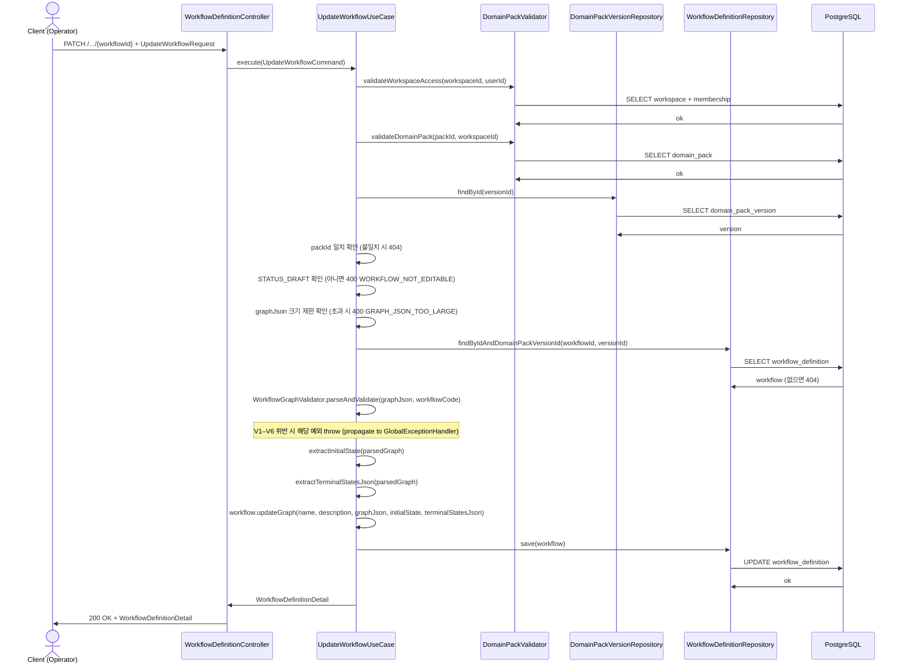
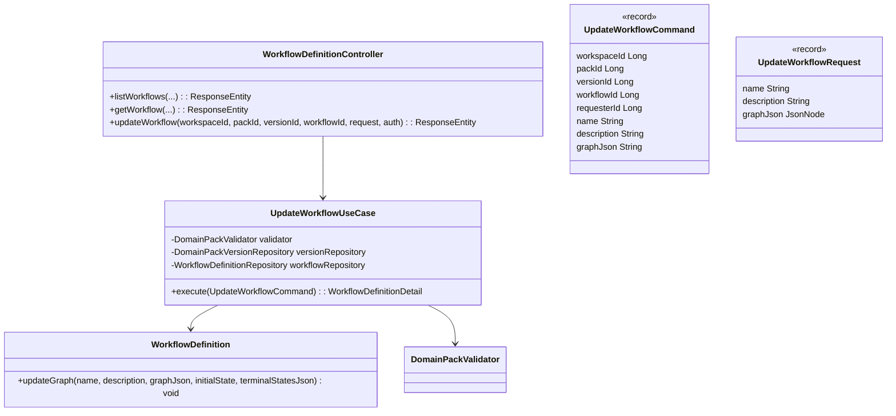

# 3.2.9 [BE] Workflow Node / Edge 수정 API

> Branch: `spec/329` | Template: `_TEMPLATE_BE.md`
> 불확실성 항목: `.handoff/329/uncertainty-register-329.md` 참조

---

## Goal

운영자가 DRAFT 상태 버전의 Workflow graph_json(노드/엣지 구조 전체)과 이름/설명을 수정할 수 있는 PATCH API를 제공한다. graph_json은 전체 교체(full replacement) 방식으로 동작한다.

---

## Sequence Diagram



---

## REST API

### Endpoint

| Method | Path | Description |
|--------|------|-------------|
| PATCH | `/api/v1/workspaces/{workspaceId}/domain-packs/{packId}/versions/{versionId}/workflows/{workflowId}` | Workflow graph_json 전체 교체 수정 |

### Request

**PATCH** `/api/v1/workspaces/{workspaceId}/domain-packs/{packId}/versions/{versionId}/workflows/{workflowId}`

```json
{
  "name": "수정된 워크플로우명",
  "description": "수정된 설명",
  "graphJson": {
    "direction": "LR",
    "nodes": [
      {"id": "start", "type": "START"},
      {"id": "n1",    "type": "ACTION"},
      {"id": "end",   "type": "TERMINAL"}
    ],
    "edges": [
      {"from": "start", "to": "n1",  "label": null},
      {"from": "n1",    "to": "end", "label": null}
    ]
  }
}
```

| 필드 | 타입 | 필수 | 설명 |
|------|------|------|------|
| `name` | String | 필수 | 워크플로우 이름. 비어 있으면 400 |
| `description` | String | 선택 | 설명 (nullable) |
| `graphJson` | JSON Object | 필수 | 전체 그래프. `direction`(텍스트), `nodes[]`, `edges[]` 포함 필수 |

`graphJson` 제약:
- `direction`: 필수 텍스트 필드
- `nodes[]`: 각 원소에 `id`(String), `type`(String) 필수
- `edges[]`: 각 원소에 `from`(String), `to`(String), `label`(String, nullable) 포함
- V1–V6 그래프 검증 (`WorkflowGraphValidator.parseAndValidate()`) 적용
- 크기 제한: 직렬화 후 문자 수 ≤ `MAX_GRAPH_JSON_CHARS` (수치는 U-329-01 참조)

### Response

**200 OK** — `WorkflowDefinitionDetail` (기존 record 재사용)

```json
{
  "id": 10,
  "workflowCode": "wf_refund",
  "name": "수정된 워크플로우명",
  "description": "수정된 설명",
  "graphJson": { "direction": "LR", "nodes": [...], "edges": [...] },
  "initialState": "start",
  "terminalStatesJson": "[\"end\"]",
  "evidenceJson": "[]",
  "metaJson": "{}",
  "createdAt": "2025-04-03T10:00:00Z",
  "updatedAt": "2025-04-15T12:00:00Z"
}
```

**400 Bad Request**

| code | 원인 |
|------|------|
| `WORKFLOW_NOT_EDITABLE` | DRAFT가 아닌 버전에서 수정 시도 |
| `VALIDATION_ERROR` | name 비어 있음 / graphJson 필드 누락 / domain method 검증 실패 |
| `GRAPH_JSON_TOO_LARGE` | graphJson 크기 초과 |
| `GRAPH_JSON_PARSE_ERROR` | graphJson JSON 파싱 실패 (`DomainPackDraftRequestInvalidException`) |
| `GRAPH_JSON_INVALID_START_NODE` | V1 위반: START 노드 ≠ 1개 |
| `GRAPH_JSON_INVALID_TERMINAL_NODE` | V2 위반: TERMINAL 노드 0개 |
| `GRAPH_JSON_DANGLING_EDGE` | V3 위반: 존재하지 않는 노드 참조 |
| `GRAPH_JSON_UNREACHABLE_NODE` | V4 위반: START에서 미도달 노드 |
| `GRAPH_JSON_CYCLE_DETECTED` | V5 위반: 사이클 검출 |
| `GRAPH_JSON_UNLABELED_BRANCH` | V6 위반: DECISION outgoing edge 레이블 없음 |

```json
{ "code": "WORKFLOW_NOT_EDITABLE", "message": "DRAFT 상태의 버전에서만 수정할 수 있습니다." }
```

**404 Not Found**

```json
{ "code": "NOT_FOUND", "message": "워크플로우를 찾을 수 없습니다: 10" }
```

**403 Forbidden**: 워크스페이스 접근 권한 없음 (`DomainPackUnauthorizedWorkspaceAccessException`)

---

## Class Design

### DDD Layered Structure



### Domain Method 추가 (`WorkflowDefinition`)

`WorkflowDefinition`에 추가해야 하는 도메인 메서드 (public setter 금지 원칙 준수):

```java
public void updateGraph(
    String name,
    String description,
    String graphJson,
    String initialState,
    String terminalStatesJson) {
  Objects.requireNonNull(name, "name must not be null");
  Objects.requireNonNull(graphJson, "graphJson must not be null");
  if (name.isBlank()) {
    throw new IllegalArgumentException("name cannot be blank");
  }
  this.name = name;
  this.description = description;
  this.graphJson = graphJson;
  this.initialState = initialState;
  this.terminalStatesJson = terminalStatesJson;
}
```

수정 불가 필드: `workflowCode`, `domainPackVersionId`, `evidenceJson`, `metaJson`

### Request DTO (신규)

```java
// presentation/dto/UpdateWorkflowRequest.java
public record UpdateWorkflowRequest(
    @NotBlank String name,
    String description,
    @NotNull JsonNode graphJson
) {}
```

- `graphJson`은 클라이언트가 JSON 객체로 전송하며 Jackson이 `JsonNode`로 역직렬화
- Controller에서 `objectMapper.writeValueAsString(request.graphJson())`으로 String 변환 후 Command에 전달

### Command Record (신규)

```java
// application/UpdateWorkflowCommand.java
public record UpdateWorkflowCommand(
    Long workspaceId,
    Long packId,
    Long versionId,
    Long workflowId,
    Long requesterId,
    String name,
    String description,
    String graphJson
) {}
```

### Application Service (신규)

```java
// application/UpdateWorkflowUseCase.java
@Service
@Transactional(readOnly = true)
public class UpdateWorkflowUseCase {

  private static final int MAX_GRAPH_JSON_CHARS = 100_000; // ≈ 100KB

  private final DomainPackValidator validator;
  private final DomainPackVersionRepository versionRepository;
  private final WorkflowDefinitionRepository workflowRepository;

  public UpdateWorkflowUseCase(
      DomainPackValidator validator,
      DomainPackVersionRepository versionRepository,
      WorkflowDefinitionRepository workflowRepository) {
    this.validator = validator;
    this.versionRepository = versionRepository;
    this.workflowRepository = workflowRepository;
  }

  @Transactional
  public WorkflowDefinitionDetail execute(UpdateWorkflowCommand command) {
    validator.validateWorkspaceAccess(command.workspaceId(), command.requesterId());
    validator.validateDomainPack(command.packId(), command.workspaceId());

    DomainPackVersion version = versionRepository.findById(command.versionId())
        .orElseThrow(() -> new NotFoundException("NOT_FOUND",
            "버전을 찾을 수 없습니다: " + command.versionId()));
    if (!version.getDomainPackId().equals(command.packId())) {
      throw new NotFoundException("NOT_FOUND",
          "버전을 찾을 수 없습니다: " + command.versionId());
    }
    if (!DomainPackVersion.STATUS_DRAFT.equals(version.getLifecycleStatus())) {
      throw new BadRequestException("WORKFLOW_NOT_EDITABLE",
          "DRAFT 상태의 버전에서만 수정할 수 있습니다.");
    }

    if (command.graphJson().length() > MAX_GRAPH_JSON_CHARS) {
      throw new BadRequestException("GRAPH_JSON_TOO_LARGE",
          "graphJson이 허용 크기(" + MAX_GRAPH_JSON_CHARS + "자)를 초과합니다.");
    }

    WorkflowDefinition workflow = workflowRepository
        .findByIdAndDomainPackVersionId(command.workflowId(), command.versionId())
        .orElseThrow(() -> new NotFoundException("NOT_FOUND",
            "워크플로우를 찾을 수 없습니다: " + command.workflowId()));

    // V1-V6 예외는 GlobalExceptionHandler로 전파
    WorkflowGraphValidator.ParsedGraph parsed =
        WorkflowGraphValidator.parseAndValidate(command.graphJson(), workflow.getWorkflowCode());
    String initialState = WorkflowGraphValidator.extractInitialState(parsed);
    String terminalStatesJson = WorkflowGraphValidator.extractTerminalStatesJson(parsed);

    try {
      workflow.updateGraph(
          command.name(), command.description(),
          command.graphJson(), initialState, terminalStatesJson);
    } catch (IllegalArgumentException e) {
      throw new BadRequestException("VALIDATION_ERROR", e.getMessage());
    }

    workflowRepository.save(workflow);
    return WorkflowDefinitionDetail.from(workflow);
  }
}
```

### Controller 변경 (기존 `WorkflowDefinitionController`에 추가)

기존 `WorkflowDefinitionController`에 `@PatchMapping("/{workflowId}")` 추가:

```java
// 기존 생성자에 UpdateWorkflowUseCase, ObjectMapper 추가
@PatchMapping("/{workflowId}")
public ResponseEntity<WorkflowDefinitionDetail> updateWorkflow(
    @PathVariable Long workspaceId,
    @PathVariable Long packId,
    @PathVariable Long versionId,
    @PathVariable Long workflowId,
    @Valid @RequestBody UpdateWorkflowRequest request,
    Authentication authentication) throws JsonProcessingException {
  Long userId = AuthenticationUtils.getUserId(authentication);
  String graphJsonStr = objectMapper.writeValueAsString(request.graphJson());
  WorkflowDefinitionDetail result = updateUseCase.execute(
      new UpdateWorkflowCommand(
          workspaceId, packId, versionId, workflowId, userId,
          request.name(), request.description(), graphJsonStr));
  return ResponseEntity.ok(result);
}
```

---

## Tests

### Unit Tests

```java
// WorkflowDefinitionUpdateGraphTest.java
@DisplayName("WorkflowDefinition.updateGraph()")
class WorkflowDefinitionUpdateGraphTest {

  @Test
  @DisplayName("유효한 인자로 updateGraph() 호출 시 name, description, graphJson이 수정된다")
  void should_필드수정_when_유효한인자() {
    // given — fixture (ReflectionTestUtils 또는 ofForTest 패턴 활용)
    WorkflowDefinition wf = buildFixtureWorkflow();

    // when
    wf.updateGraph("새 이름", "새 설명", "{\"direction\":\"LR\",\"nodes\":[],\"edges\":[]}", "s", "[\"e\"]");

    // then
    assertThat(wf.getName()).isEqualTo("새 이름");
    assertThat(wf.getGraphJson()).contains("direction");
    assertThat(wf.getInitialState()).isEqualTo("s");
  }

  @Test
  @DisplayName("name이 blank이면 IllegalArgumentException")
  void should_예외_when_nameBlank() {
    WorkflowDefinition wf = buildFixtureWorkflow();
    assertThatThrownBy(() -> wf.updateGraph("  ", null, "{}", "s", "[]"))
        .isInstanceOf(IllegalArgumentException.class)
        .hasMessageContaining("blank");
  }
}
```

```java
// UpdateWorkflowUseCaseTest.java
@ExtendWith(MockitoExtension.class)
@DisplayName("UpdateWorkflowUseCase")
class UpdateWorkflowUseCaseTest {

  @Test
  @DisplayName("DRAFT 아닌 버전 수정 시 WORKFLOW_NOT_EDITABLE 예외")
  void should_WORKFLOW_NOT_EDITABLE_when_버전이PUBLISHED() { ... }

  @Test
  @DisplayName("graphJson 크기 초과 시 GRAPH_JSON_TOO_LARGE 예외")
  void should_GRAPH_JSON_TOO_LARGE_when_크기초과() { ... }

  @Test
  @DisplayName("존재하지 않는 workflowId 요청 시 NotFoundException")
  void should_404_when_workflowNotFound() { ... }

  @Test
  @DisplayName("유효한 요청 시 workflow 수정 후 WorkflowDefinitionDetail 반환")
  void should_수정완료_when_유효한요청() { ... }
}
```

### Integration Tests

```java
// WorkflowDefinitionControllerTest.java (기존 파일 확장)
@WebMvcTest(WorkflowDefinitionController.class)
// @WithLongPrincipal, JwtAuthenticationFilter excludeFilter 패턴 유지
@DisplayName("WorkflowDefinitionController PATCH /{workflowId}")
class WorkflowDefinitionControllerUpdateTest {

  @Test
  @DisplayName("유효한 요청 시 200 OK + WorkflowDefinitionDetail 반환")
  void should_200OK_when_유효한요청() throws Exception {
    // given
    given(updateUseCase.execute(any())).willReturn(mockDetail());

    // when & then
    mockMvc.perform(patch("/api/v1/workspaces/1/domain-packs/1/versions/1/workflows/10")
            .contentType(MediaType.APPLICATION_JSON)
            .content("""
                {"name":"수정명","description":null,
                 "graphJson":{"direction":"LR","nodes":[],"edges":[]}}
                """))
        .andExpect(status().isOk())
        .andExpect(jsonPath("$.id").value(10));
  }

  @Test
  @DisplayName("name 누락 시 400 Bad Request")
  void should_400_when_name누락() throws Exception { ... }

  @Test
  @DisplayName("graphJson 누락 시 400 Bad Request")
  void should_400_when_graphJson누락() throws Exception { ... }
}
```

### Test Checklist

- [ ] 정상: DRAFT 버전 + 유효 graphJson → 200 OK + 수정된 `WorkflowDefinitionDetail`
- [ ] DRAFT 아닌 버전 → 400 `WORKFLOW_NOT_EDITABLE`
- [ ] graphJson V1 위반 (START 노드 != 1) → 400
- [ ] graphJson V2 위반 (TERMINAL 노드 없음) → 400
- [ ] graphJson V3 위반 (dangling edge) → 400
- [ ] graphJson V4 위반 (미도달 노드) → 400
- [ ] graphJson V5 위반 (사이클) → 400
- [ ] graphJson V6 위반 (DECISION label 없음) → 400
- [ ] graphJson 크기 초과 → 400 `GRAPH_JSON_TOO_LARGE`
- [ ] 존재하지 않는 `workflowId` → 404
- [ ] 권한 없는 사용자 → 403
- [ ] `name` blank → 400 `VALIDATION_ERROR`

---

## Database

N/A — 기존 `pack.workflow_definition` 테이블을 그대로 사용. 스키마 변경 없음.

수정 대상 컬럼: `name`, `description`, `graph_json`, `initial_state`, `terminal_states_json`, `updated_at`

---

## Additional Notes

- `graph_json` source of truth는 DB의 JSONB 컬럼. `workflow_node`, `workflow_edge` 별도 정규화 테이블은 현재 없음 (schema.md:993 확인).
- `initialState`와 `terminalStatesJson`은 `WorkflowGraphValidator` 결과에서 자동 추출하여 갱신. 클라이언트가 직접 전송하지 않음.
- `evidenceJson`, `metaJson`은 이 API 범위 밖 (AI 생성/검토 영역).
- `workflowCode`는 버전 내 식별자이므로 수정 불가.
- `WorkflowGraphValidator`는 package-private (`com.init.domainpack.application`). `UpdateWorkflowUseCase`는 동일 패키지이므로 직접 접근 가능.
- V1–V6 예외는 `GlobalExceptionHandler`의 `BusinessException` fallback (400)으로 처리됨.
- `DomainPackValidator`를 사용하되 version DRAFT 확인은 `versionRepository.findById()`로 직접 수행 (DomainPackValidator.validateVersion()은 lifecycle 상태를 반환하지 않음).
- graphJson 크기 제한 수치는 `uncertainty-register-329.md` U-329-01 확정 후 상수값 결정.
