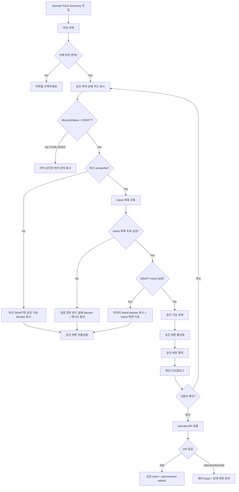

# 331: [FE] Domain Pack 승인 UI

> **Backlog**: 운영자가 Domain Pack 초안 버전을 승인 가능한 상태인지 확인하고, 준비가 끝난 버전을 운영에 적용하고 싶다.
> **Bounded Context**: `domain-pack` FE
> **Template**: `_TEMPLATE_FE.md`
> **Branch**: `spec/331`
> **Canonical Number**: `331`
> **Type**: Frontend (FSD)
> **작성일**: 2026-05-13
> **수정일**: 2026-05-13

---

## Goal

Domain Pack Version 상세 화면에서 승인 준비 상태를 자동 검증하고, 승인 가능한 최신 DRAFT 버전을 확인 다이얼로그를 거쳐 `PUBLISHED`로 활성화하는 FE UI를 구현한다.

---

## 배경

현재 Backend에는 Domain Pack Version을 `DRAFT`에서 `PUBLISHED`로 전환하는 activate API가 존재한다.

| Method | Path | 현재 상태 |
| --- | --- | --- |
| `POST` | `/api/v1/workspaces/{workspaceId}/domain-packs/{packId}/versions/{versionId}/activate` | 구현됨 |

현재 FE에도 `frontend/src/features/domain-pack-summary-read/ui/SummaryDetailPanel.tsx`에 단순 `활성화` 버튼이 존재한다. 하지만 승인 전 자동 검증 UI가 없고, 사용자가 어떤 항목을 처리해야 승인 가능한지 알기 어렵다.

Backend의 `review` bounded context는 문서와 DB schema에는 존재하지만, 현재 구현은 `package-info.java` 수준이다. 따라서 이번 FE 스펙에서는 future backend readiness API를 바로 의존하지 않고, 교체 가능한 FE readiness hook을 먼저 둔다.

---

## Scope Decision

### 331은 Domain Pack Version 승인 UI와 FE readiness adapter만 담당한다

이 스펙은 Domain Pack Version을 최종 승인하는 사용자 경험을 제공하되, Backend review gate 자체를 새로 설계하거나 구현하지 않는다.

이 결정의 기준:

- `331.md`는 `DomainPackSummaryPage`의 우측 version detail 영역에 승인 준비 상태와 승인 액션을 추가한다.
- 현재 Backend에 이미 존재하는 activate API를 실제 승인 실행 API로 사용한다.
- 승인 가능 여부는 `useDomainPackApprovalReadiness` hook으로 격리한다.
- 현재 hook은 FE에서 확인 가능한 local readiness만 판단한다.
- 추후 Backend readiness API가 생기면 hook 내부 구현만 교체하고 UI 컴포넌트 계약은 유지한다.
- Policy/Risk/Slot/Workflow의 "검토 완료" 여부는 현재 Backend status 모델만으로 신뢰성 있게 판정할 수 없으므로, 이번 스펙에서 자동 blocker로 강제하지 않는다.
- 최종 승인 gate는 장기적으로 Backend activate/readiness가 강제해야 하며, FE local readiness는 사용자 안내와 사전 방어 역할이다.

---

## Prerequisites

### 선행 구현

| Source | Status | Description |
| --- | --- | --- |
| `332.md` | 구현됨 | Domain Pack Version activate Backend API |
| `312.md` | 구현됨 | Intent 단위 승인/반려 FE UI |
| `313.md` | 구현됨 | Intent status 전환 Backend API |
| `321.md` | 구현됨 | Slot 수정 및 status 전환 FE UI |
| `322.md` / `327.md` | 구현됨 | Policy 수정 및 status 전환 관련 API/FE |
| `323.md` / `328.md` | 구현됨 | Risk 수정 및 status 전환 관련 API/FE |
| `324.md` / `3210.md` | 구현됨 | Workflow 조회/수정 관련 API/FE |

### Existing FE Patterns

구현 시 아래 기존 파일의 패턴을 따른다. 아래 경로는 현재 repository에서 존재 확인 완료했다.

| Existing file | 재사용 기준 |
| --- | --- |
| `frontend/src/pages/domain-pack/ui/DomainPackSummaryPage.tsx` | pack detail, selected version query string, summary panel 조합 |
| `frontend/src/features/domain-pack-summary-read/ui/SummaryDetailPanel.tsx` | version detail loading/error/ready 상태와 activate hook 사용 위치 |
| `frontend/src/features/domain-pack-summary-read/ui/VersionListPanel.tsx` | version lifecycle status badge 표현 |
| `frontend/src/features/domain-pack-summary-read/ui/ComponentCountGrid.tsx` | 구성요소별 상세 화면 이동 path 구성 |
| `frontend/src/features/domain-pack-summary-read/model/usePackDetail.ts` | pack/version detail generated query wrapper |
| `frontend/src/features/approve-intent/ui/ApproveIntentDialog.tsx` | AlertDialog 기반 확인 다이얼로그 패턴 |
| `frontend/src/shared/ui/alert-dialog.tsx` | 확인/취소 다이얼로그 primitive |
| `frontend/src/shared/api/generated/endpoints/activate-domain-pack-version-controller/activate-domain-pack-version-controller.ts` | activate mutation hook |
| `frontend/src/shared/api/generated/endpoints/intent-definition-controller/intent-definition-controller.ts` | Intent list query hook |

---

## User Flow Chart



---

## Design Diff

### As-is vs To-be

| 영역 | As-is | To-be | 변경 내용 |
| --- | --- | --- | --- |
| 승인 액션 | `DRAFT` 버전에 단순 `활성화` 버튼 표시 | 승인 준비 상태 카드 + `승인` 버튼 | 사용자가 승인 가능 여부를 먼저 확인 |
| 검증 | 버튼 클릭 후 Backend 오류에 의존 | FE readiness hook에서 사전 blocker 계산 | 최신 DRAFT, 미처리 Intent 여부를 사전 안내 |
| 확인 | 확인 다이얼로그 없음 | 승인 확인 다이얼로그 추가 | 승인 후 편집 불가를 명시 |
| Backend readiness 연동 | 없음 | hook interface를 고정해 future API로 교체 가능 | 나중에 Backend readiness API가 생겨도 UI 변경 최소화 |
| 에러 처리 | 일반 실패 toast | error code별 안내 메시지 | 최신 버전 아님, 이미 승인됨, 동시성 충돌 등 구분 |

---

## Screen States

| 상태 | 조건 | 승인 준비 카드 | 승인 버튼 | 사용자 액션 |
| --- | --- | --- | --- | --- |
| 버전 미선택 | `versionId` 없음 | 표시하지 않음 | 없음 | 버전 선택 안내 |
| 로딩 | version detail 또는 readiness 로딩 | skeleton 또는 로딩 문구 | disabled | 대기 |
| PUBLISHED | `lifecycleStatus === "PUBLISHED"` | `승인 완료` 상태 표시 | 없음 | 구성요소 조회만 가능 |
| DRAFT + 최신 아님 | `lifecycleStatus === "DRAFT"` && 선택 versionNo < 최대 versionNo | 최신 DRAFT blocker 표시 | disabled | 최신 버전 선택 |
| DRAFT + Intent 조회 실패 | Intent list query error | 검증 정보 로드 실패 blocker 표시 | disabled | 재시도 또는 새로고침 |
| DRAFT + 미처리 Intent 있음 | DRAFT Intent count > 0 | 미처리 Intent blocker 표시 | disabled | `Intent 검토하기` 이동 |
| DRAFT + 승인 가능 | 최신 DRAFT && DRAFT Intent count = 0 | `승인할 수 있습니다` 표시 | enabled | 확인 다이얼로그 후 activate |
| activate pending | mutation pending | 기존 카드 유지 | disabled + 처리 중 표시 | 중복 클릭 방지 |
| activate 성공 | 200 OK | refetch 후 PUBLISHED 상태 | 없음 | 현재 Summary 화면 유지 |
| activate 실패 | 400/403/404/409/기타 | 기존 readiness 상태 유지 | readiness에 따라 복구 | toast로 실패 사유 표시 |

### Action Boundary

| 액션 | 담당 | 설명 |
| --- | --- | --- |
| 승인 준비 상태 계산 | `useDomainPackApprovalReadiness` | 현재는 local readiness, 추후 server readiness로 교체 |
| blocker action 이동 | `DomainPackApprovalCard` | Intent blocker에서 `/intents` 화면으로 이동 |
| 승인 확인 | `DomainPackApprovalDialog` | 사용자의 명시 확인을 받은 뒤 activate 호출 |
| 실제 승인 | Backend activate API | `lifecycleStatus`를 `PUBLISHED`로 전환 |
| 성공 후 화면 갱신 | `SummaryDetailPanel` / parent page | version detail과 pack detail refetch |

---

## 승인 준비 상태 정의

### 1차 FE Local Readiness

Backend readiness API가 생기기 전까지 FE에서 자동 검증할 수 있는 조건만 사용한다.

| 조건 | 판정 방법 | 승인 영향 |
| --- | --- | --- |
| 선택 버전 존재 | `version.versionId` 존재 | 없으면 승인 불가 |
| DRAFT 버전 | `version.lifecycleStatus === "DRAFT"` | 아니면 승인 불가 |
| 최신 버전 | `pack.versions`의 최대 `versionNo`와 선택 버전 비교 | 최신이 아니면 승인 불가 |
| Intent 처리 완료 | Intent list에서 `status === "DRAFT"` 개수 확인 | 남아 있으면 승인 불가 |
| Intent 목록 조회 성공 | `useListIntents` 성공 여부 | 실패 시 승인 불가 |

### 현재 자동 검증하지 않는 항목

아래 구성요소는 현재 Backend 모델에 별도 review status가 없으므로, 이번 FE에서 “수정 완료” 여부를 강제 판정하지 않는다.

| 구성요소 | 현재 상태 모델 | 이번 스펙 처리 |
| --- | --- | --- |
| Policy | `ACTIVE` / `INACTIVE` | 승인 blocker로 사용하지 않음 |
| Risk | `ACTIVE` / `INACTIVE` | 승인 blocker로 사용하지 않음 |
| Slot | `ACTIVE` / `INACTIVE` | 승인 blocker로 사용하지 않음 |
| Workflow | 별도 status 없음 | 승인 blocker로 사용하지 않음 |

> 추후 Backend readiness API 또는 review task/status가 구현되면, 같은 FE hook의 내부 구현만 서버 응답 기반으로 교체한다.

---

## Component Tree

```
DomainPackSummaryPage
├─ VersionListPanel
└─ SummaryDetailPanel
   ├─ VersionMetaCard
   ├─ DomainPackApprovalCard [NEW]
   │  ├─ ReadinessStatusBadge
   │  ├─ ReadinessBlockerList
   │  │  └─ BlockerActionLink
   │  ├─ ApprovalActionButton
   │  └─ DomainPackApprovalDialog [NEW]
   ├─ SummaryJsonCard
   └─ ComponentCountGrid
```

### 신규/변경 컴포넌트

| 컴포넌트 | 위치 | 설명 |
| --- | --- | --- |
| `DomainPackApprovalCard` | `frontend/src/features/domain-pack-summary-read/ui/DomainPackApprovalCard.tsx` | 승인 준비 상태와 승인 액션을 표시 |
| `DomainPackApprovalDialog` | `frontend/src/features/domain-pack-summary-read/ui/DomainPackApprovalDialog.tsx` | 최종 승인 확인 다이얼로그 |
| `useDomainPackApprovalReadiness` | `frontend/src/features/domain-pack-summary-read/model/useDomainPackApprovalReadiness.ts` | local readiness 계산 hook, future BE readiness API 교체 지점 |
| `buildDomainPackApprovalReadiness` | `frontend/src/features/domain-pack-summary-read/model/buildDomainPackApprovalReadiness.ts` | 순수 readiness 계산 함수 |

---

## API Integration

### 현재 사용 API

| Method | Path | 사용 목적 |
| --- | --- | --- |
| `GET` | `/api/v1/workspaces/{workspaceId}/domain-packs/{packId}` | 버전 목록과 최신 versionNo 판단 |
| `GET` | `/api/v1/workspaces/{workspaceId}/domain-packs/{packId}/versions/{versionId}` | 선택 버전 상세 |
| `GET` | `/api/v1/workspaces/{workspaceId}/domain-packs/{packId}/versions/{versionId}/intents` | 미처리 Intent 검증 |
| `POST` | `/api/v1/workspaces/{workspaceId}/domain-packs/{packId}/versions/{versionId}/activate` | 최종 승인 |

### Future Backend Readiness API

이번 FE 구현에서는 아래 API가 아직 없다고 가정한다. 단, hook 반환 shape는 이 API로 교체하기 쉽게 설계한다.

| Method | Path | Description |
| --- | --- | --- |
| `GET` | `/api/v1/workspaces/{workspaceId}/domain-packs/{packId}/versions/{versionId}/readiness` | 승인 가능 여부와 blocker 목록 조회 |

Future response 예시:

```json
{
  "ready": false,
  "blockingItems": [
    {
      "type": "INTENT",
      "count": 3,
      "reason": "승인 또는 반려되지 않은 Intent가 남아 있습니다."
    }
  ]
}
```

### Error Handling

| Error Code | 상황 | FE 처리 |
| --- | --- | --- |
| `DOMAIN_PACK_VERSION_NOT_LATEST` | 최신 DRAFT가 아님 | `최신 DRAFT 버전만 승인할 수 있습니다.` |
| `DOMAIN_PACK_INVALID_STATE` | 이미 PUBLISHED 또는 DRAFT 아님 | `현재 상태에서는 승인할 수 없습니다.` |
| `DOMAIN_PACK_CONFLICT` | 동시 활성화 충돌 | `다른 요청으로 버전 상태가 변경되었습니다. 새로고침 후 다시 시도해 주세요.` |
| `FORBIDDEN` | 권한 없음 | `Domain Pack을 승인할 권한이 없습니다.` |
| `NOT_FOUND` | pack/version 없음 | `Domain Pack 또는 버전을 찾을 수 없습니다.` |
| `UNAUTHORIZED` | 인증 없음/만료 | `로그인이 필요합니다.` |
| 기타 | 알 수 없는 실패 | `Domain Pack 승인에 실패했습니다.` |

### Local Readiness Error Messages

| 조건 | 메시지 | action |
| --- | --- | --- |
| DRAFT 아님 | `DRAFT 상태의 버전만 승인할 수 있습니다.` | 없음 |
| 최신 버전 아님 | `최신 DRAFT 버전만 승인할 수 있습니다.` | 최신 version 선택 유도 |
| Intent 조회 실패 | `승인 준비 상태를 확인하지 못했습니다.` | `다시 시도` |
| 미처리 Intent 있음 | `승인 또는 반려되지 않은 Intent가 {count}개 남아 있습니다.` | `Intent 검토하기` |

---

## Data Flow

```
┌──────────────────────────────────────────────────────────────┐
│ Page Layer                                                   │
│ DomainPackSummaryPage                                       │
│ - pack detail query                                          │
│ - selected versionId query string 관리                         │
└──────────────────────────────────────────────────────────────┘
                              │
                              ▼
┌──────────────────────────────────────────────────────────────┐
│ Feature UI Layer                                             │
│ SummaryDetailPanel                                           │
│ - version detail query result 렌더링                           │
│ - DomainPackApprovalCard에 version + versions 전달             │
└──────────────────────────────────────────────────────────────┘
                              │
                              ▼
┌──────────────────────────────────────────────────────────────┐
│ Feature Model Layer                                          │
│ useDomainPackApprovalReadiness                               │
│ - 현재: Intent list + version metadata 기반 local readiness     │
│ - 추후: Backend readiness API 응답으로 내부 교체                 │
└──────────────────────────────────────────────────────────────┘
                              │
                              ▼
┌──────────────────────────────────────────────────────────────┐
│ Shared API Layer                                             │
│ generated useListIntents / useActivate                       │
│ customFetch + apiClient                                      │
└──────────────────────────────────────────────────────────────┘
```

---

## 수정 대상 파일

### 변경 파일

| 파일 | 변경 유형 | 설명 |
| --- | --- | --- |
| `frontend/src/pages/domain-pack/ui/DomainPackSummaryPage.tsx` | modify | `SummaryDetailPanel`에 `versions` 전달 |
| `frontend/src/features/domain-pack-summary-read/ui/SummaryDetailPanel.tsx` | modify | 기존 단순 활성화 버튼 제거, 승인 카드 연결 |
| `frontend/src/features/domain-pack-summary-read/ui/SummaryDetailPanel.module.css` | modify | 승인 카드 스타일 추가 |
| `frontend/src/features/domain-pack-summary-read/ui/index.ts` | modify | 신규 UI export |
| `frontend/src/features/domain-pack-summary-read/index.ts` | modify | 신규 hook/type export |
| `frontend/src/features/domain-pack-summary-read/ui/SummaryDetailPanel.test.tsx` | modify | 승인 카드 렌더링/activate 흐름 테스트 보강 |

### 신규 파일

| 파일 | 변경 유형 | 설명 |
| --- | --- | --- |
| `frontend/src/features/domain-pack-summary-read/model/buildDomainPackApprovalReadiness.ts` | new | 순수 readiness 계산 |
| `frontend/src/features/domain-pack-summary-read/model/buildDomainPackApprovalReadiness.test.ts` | new | readiness 조건 단위 테스트 |
| `frontend/src/features/domain-pack-summary-read/model/useDomainPackApprovalReadiness.ts` | new | Intent list query 기반 readiness hook |
| `frontend/src/features/domain-pack-summary-read/ui/DomainPackApprovalCard.tsx` | new | 승인 준비 상태 카드 |
| `frontend/src/features/domain-pack-summary-read/ui/DomainPackApprovalCard.test.tsx` | new | blocker/승인 가능 상태 렌더링 테스트 |
| `frontend/src/features/domain-pack-summary-read/ui/DomainPackApprovalDialog.tsx` | new | 승인 확인 다이얼로그 |
| `frontend/src/features/domain-pack-summary-read/ui/DomainPackApprovalDialog.test.tsx` | new | 확인/취소/로딩 상태 테스트 |

---

## State Management

### Readiness Return Shape

```typescript
type DomainPackApprovalBlockerType =
  | "VERSION"
  | "INTENT"
  | "POLICY"
  | "RISK"
  | "SLOT"
  | "WORKFLOW"
  | "SERVER";

interface DomainPackApprovalBlocker {
  type: DomainPackApprovalBlockerType;
  message: string;
  count?: number;
  actionPath?: string;
}

interface DomainPackApprovalReadiness {
  ready: boolean;
  isLoading: boolean;
  isError: boolean;
  blockers: DomainPackApprovalBlocker[];
}
```

### Local Readiness Rules

```typescript
ready =
  version.lifecycleStatus === "DRAFT" &&
  selectedVersionIsLatest &&
  intentListLoaded &&
  draftIntentCount === 0 &&
  blockers.length === 0;
```

### Cache / Refetch

activate 성공 후에는 아래 데이터를 갱신한다.

- 선택 version detail query
- pack detail query 또는 version list
- Intent list query

현재 `SummaryDetailPanel`은 `query.refetch()`만 호출하므로, 구현 시 pack detail refetch까지 연결할 수 있도록 `onActivated?: () => void` prop을 추가한다.

---

## UX Copy

### 카드 제목

- `승인 준비 상태`

### Ready

- `승인할 수 있습니다.`
- `모든 Intent가 승인 또는 반려되었고, 선택한 버전은 최신 DRAFT입니다.`

### Blocked

- `아직 승인할 수 없습니다.`
- `승인 전에 아래 항목을 먼저 처리해 주세요.`

### Intent blocker

- `승인 또는 반려되지 않은 Intent가 {count}개 남아 있습니다.`
- action: `Intent 검토하기`

### 최신 버전 blocker

- `최신 DRAFT 버전만 승인할 수 있습니다.`

### 확인 다이얼로그

- Title: `Domain Pack 버전을 승인할까요?`
- Description: `승인하면 이 버전은 운영에 사용되며, 이후 구성요소를 수정할 수 없습니다.`
- Confirm: `승인`
- Cancel: `취소`

---

## Design Rules

`frontend/DESIGN.md`를 따른다.

- 인터페이스 chrome은 흑백 중심으로 유지한다.
- 버튼은 pill radius를 사용한다.
- focus outline은 기존 dashed focus 규칙을 유지한다.
- 카드 radius는 8px 이하를 유지한다.
- 승인 준비 상태는 색상만으로 구분하지 않고 텍스트와 상태 badge를 함께 사용한다.
- 실패/차단 상태를 과한 경고색으로 장식하지 않는다. 기존 `--error-color` 사용은 메시지 강조 정도로 제한한다.

---

## Tests

### Unit Tests

| 대상 | 시나리오 |
| --- | --- |
| `buildDomainPackApprovalReadiness` | PUBLISHED 버전이면 blocked |
| `buildDomainPackApprovalReadiness` | 최신 DRAFT가 아니면 blocked |
| `buildDomainPackApprovalReadiness` | DRAFT Intent가 남으면 blocked + count 포함 |
| `buildDomainPackApprovalReadiness` | 최신 DRAFT + DRAFT Intent 0개면 ready |

### Component Tests

| 대상 | 시나리오 |
| --- | --- |
| `DomainPackApprovalCard` | ready 상태에서 승인 버튼 enabled |
| `DomainPackApprovalCard` | blocker가 있으면 승인 버튼 disabled |
| `DomainPackApprovalCard` | Intent blocker action 클릭 시 해당 route 이동 |
| `DomainPackApprovalDialog` | 확인 클릭 시 `onConfirm` 호출 |
| `SummaryDetailPanel` | DRAFT 버전에 승인 카드 표시 |
| `SummaryDetailPanel` | 승인 성공 시 toast + refetch 호출 |
| `SummaryDetailPanel` | activate error code별 toast 표시 |

### Manual QA

| 케이스 | 확인 |
| --- | --- |
| 최신 DRAFT + DRAFT Intent 있음 | 승인 불가, Intent blocker 표시 |
| 최신 DRAFT + 모든 Intent 처리됨 | 승인 가능, 다이얼로그 후 activate 호출 |
| PUBLISHED 버전 | 승인 액션 대신 승인 완료 상태 표시 |
| 이전 DRAFT 버전 | 최신 DRAFT만 승인 가능 안내 |
| 모바일 폭 | 승인 카드/버튼/문구가 겹치지 않음 |

---

## Acceptance Criteria

| # | 기준 | 검증 |
| --- | --- | --- |
| 1 | 최신 DRAFT가 아닌 버전에서는 승인 버튼이 활성화되지 않는다. | 컴포넌트 테스트 |
| 2 | DRAFT 상태 Intent가 1개 이상 남아 있으면 activate API가 호출되지 않는다. | 컴포넌트 테스트 |
| 3 | DRAFT 상태 Intent가 남아 있으면 blocker에 남은 개수와 `Intent 검토하기` 액션이 표시된다. | 컴포넌트 테스트 |
| 4 | 최신 DRAFT이고 DRAFT Intent가 없으면 승인 버튼이 활성화된다. | 컴포넌트 테스트 |
| 5 | 승인 버튼 클릭 시 확인 다이얼로그가 열린다. | 컴포넌트 테스트 |
| 6 | 확인 다이얼로그에서 승인하면 activate mutation이 호출된다. | 컴포넌트 테스트 |
| 7 | activate 성공 시 성공 toast와 version/pack refetch가 수행된다. | 컴포넌트 테스트 |
| 8 | activate 실패 시 error code에 맞는 toast가 표시되고 화면은 유지된다. | 컴포넌트 테스트 |
| 9 | `useDomainPackApprovalReadiness`의 public return shape는 future server readiness로 교체해도 UI 변경이 없도록 유지된다. | 단위 테스트 + 코드 리뷰 |

---

## Done Criteria

- [ ] `DomainPackApprovalReadiness` / `DomainPackApprovalBlocker` 타입을 추가한다.
- [ ] `buildDomainPackApprovalReadiness` 순수 함수를 추가하고 주요 readiness rule을 테스트한다.
- [ ] `useDomainPackApprovalReadiness` hook을 추가한다.
- [ ] hook은 현재 `useListIntents` 기반으로 DRAFT Intent count를 계산한다.
- [ ] hook은 추후 Backend readiness API로 교체 가능한 return shape를 유지한다.
- [ ] `DomainPackApprovalCard`를 추가해 ready/blocked/loading/error 상태를 표시한다.
- [ ] `DomainPackApprovalDialog`를 추가해 최종 승인 확인을 받는다.
- [ ] 기존 `SummaryDetailPanel`의 단순 `활성화` 버튼을 승인 카드로 대체한다.
- [ ] activate 성공 시 version detail과 pack detail 또는 version list를 refetch한다.
- [ ] activate error code별 toast 메시지를 처리한다.
- [ ] 미처리 Intent blocker는 Intent 검토 화면으로 이동할 수 있어야 한다.
- [ ] `alert()`를 사용하지 않고 `sonner` toast를 사용한다.
- [ ] FSD 의존성 방향을 준수한다: `pages → features → entities → shared`.
- [ ] `frontend/DESIGN.md`를 준수한다.
- [ ] `pnpm test` 통과.
- [ ] `pnpm lint` 통과.

---

## Out of Scope

- Backend readiness API 구현
- `review` bounded context 구현
- Policy/Risk/Slot/Workflow review status 추가
- Domain Pack name/code/description 수정 UI
- Domain Pack Version `summaryJson` 편집 UI
- activate API 자체의 Backend 검증 로직 변경

---

## Future Work

Backend readiness API가 구현되면 다음 변경만 수행한다.

1. generated API 갱신
2. `useDomainPackApprovalReadiness` 내부를 server readiness query로 교체
3. `buildDomainPackApprovalReadiness`는 fallback 또는 테스트 fixture 용도로 축소
4. `DomainPackApprovalCard` UI는 기존 return shape를 유지해 변경 최소화

Backend에서 함께 보강해야 할 규칙:

- `activate` API는 readiness false 상태에서 실패해야 한다.
- FE readiness는 안내용이고, 최종 승인 gate는 Backend가 강제해야 한다.
- review task/status가 생기면 Intent뿐 아니라 Policy/Risk/Slot/Workflow blocker도 server response로 표시한다.
