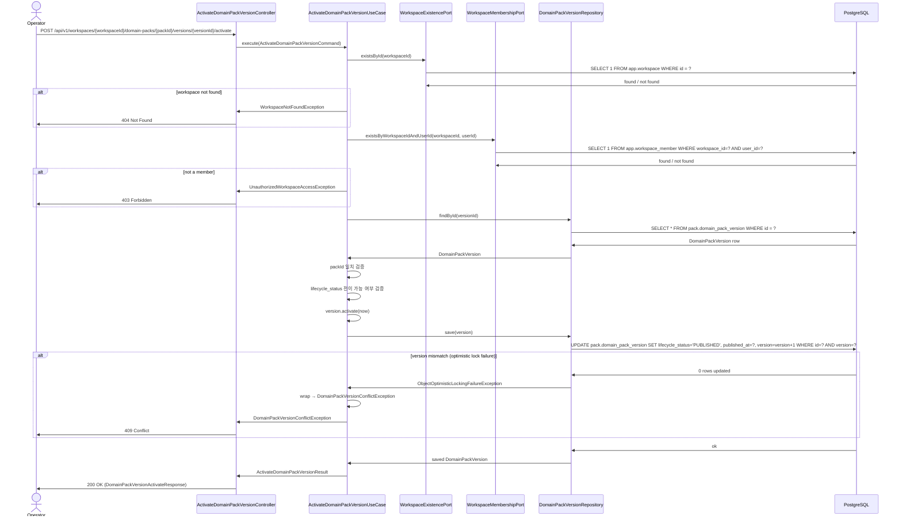
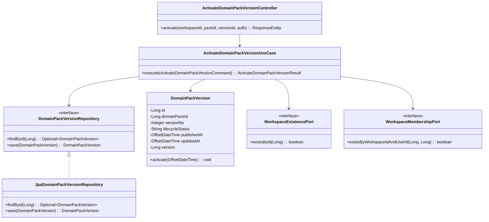

# [BE] 3.3.2 승인된 Domain Pack 활성화

> **Backlog**: 나는 운영자로서, Domain Pack 초안을 승인하고 싶다 → 실시간 상담 실행에 사용할 수 있게 하기 위해
> **Bounded Context**: `domainpack`
> **Template**: `_TEMPLATE_BE.md`
> **Branch**: `spec/332`

---

## Goal

운영자가 특정 `domain_pack_version`을 명시적으로 활성화(activate)하여 `lifecycle_status`를 `PUBLISHED`로 전환하고, `workflow-runtime`이 해당 버전을 실시간 상담 실행에 사용할 수 있게 한다.

---

## Sequence Diagram



---

## REST API

### Endpoint

| Method | Path | Description |
|--------|------|-------------|
| POST | `/api/v1/workspaces/{workspaceId}/domain-packs/{packId}/versions/{versionId}/activate` | 특정 domain pack version을 PUBLISHED로 전환 |

### Path Variables

| Name | Type | Description |
|------|------|-------------|
| `workspaceId` | Long | 워크스페이스 ID |
| `packId` | Long | Domain Pack ID |
| `versionId` | Long | Domain Pack Version ID |

### Request

요청 바디 없음 (path variables만 사용)

### Response

**200 OK**

```json
{
  "id": 42,
  "domainPackId": 7,
  "versionNo": 3,
  "lifecycleStatus": "PUBLISHED",
  "publishedAt": "2026-04-09T12:00:00Z",
  "updatedAt": "2026-04-09T12:00:00Z"
}
```

**400 Bad Request** — 이미 PUBLISHED 상태이거나 전이 불가

```json
{
  "error": "INVALID_STATE",
  "message": "Domain pack version cannot be activated from current state"
}
```

**401 Unauthorized** — 인증 토큰 없음 또는 만료

```json
{
  "error": "UNAUTHORIZED",
  "message": "Authentication required"
}
```

**403 Forbidden** — 인증됐으나 workspace 비멤버

```json
{
  "error": "FORBIDDEN",
  "message": "You do not have access to this workspace"
}
```

> **Authorization**: JWT 인증 필수. 요청자가 해당 `workspaceId`의 멤버(`OPERATOR` 또는 `ADMIN`)여야 한다.  
> workspace 비존재 시 404, workspace 멤버가 아닌 경우 403 반환. (U-005 결정 참조)

**404 Not Found** — versionId 없음, 또는 packId와 불일치

```json
{
  "error": "NOT_FOUND",
  "message": "DomainPackVersion not found: 42"
}
```

**409 Conflict** — 동시 활성화 충돌

```json
{
  "error": "CONFLICT",
  "message": "Domain pack version was modified by another request"
}
```

**500 Internal Server Error**

```json
{
  "error": "INTERNAL_ERROR",
  "message": "Unexpected error occurred"
}
```

---

## Class Design

### DDD Layered Structure



### Aggregate Design

```java
// domain layer
@Entity
@Table(name = "domain_pack_version", schema = "pack")
public class DomainPackVersion {

    @Id
    @GeneratedValue(strategy = GenerationType.IDENTITY)
    private Long id;

    @Column(name = "domain_pack_id", nullable = false, updatable = false)
    private Long domainPackId;

    @Column(name = "version_no", nullable = false)
    private Integer versionNo;

    @Column(name = "lifecycle_status", nullable = false)
    private String lifecycleStatus;

    @Column(name = "published_at")
    private OffsetDateTime publishedAt;

    @Column(name = "updated_at", nullable = false)
    private OffsetDateTime updatedAt;

    @Version
    private Long version;

    protected DomainPackVersion() {}

    @PreUpdate
    protected void onUpdate() {
        this.updatedAt = OffsetDateTime.now();
    }

    // 도메인 메서드: PUBLISHED 전이
    // 전이 허용 선처리 상태는 U-001 참조
    // now: 호출자가 주입하는 시각 — OffsetDateTime.now() 또는 테스트 고정값
    public void activate(OffsetDateTime now) {
        if ("PUBLISHED".equals(this.lifecycleStatus)) {
            throw new IllegalStateException("Domain pack version is already published");
        }
        this.lifecycleStatus = "PUBLISHED";
        this.publishedAt = now;
        // updatedAt은 @PreUpdate(onUpdate)에서 자동 갱신
    }

    public Long getId() { return id; }
    public Long getDomainPackId() { return domainPackId; }
    public Integer getVersionNo() { return versionNo; }
    public String getLifecycleStatus() { return lifecycleStatus; }
    public OffsetDateTime getPublishedAt() { return publishedAt; }
    public OffsetDateTime getUpdatedAt() { return updatedAt; }
}
```

> `lifecycleStatus`를 `String` 대신 `VersionLifecycleStatus` enum으로 모델링하는 것을 권장한다.  
> 단, 허용 값 목록이 DDL CHECK constraint로 강제되지 않으므로 구현 시 enum 정의와 DB 값의 일치 여부를 직접 검증해야 한다.  
> DB 저장 값은 `'PUBLISHED'` (UPPERCASE) 사용 — 기존 demo data(changeset `jhkang0516:20260407`) 기준으로 확인됨.

### Application Service

```java
// application layer
// ActivateDomainPackVersionCommand: workspaceId, packId, versionId, userId 포함
@Service
@Transactional
public class ActivateDomainPackVersionUseCase {

    private final DomainPackVersionRepository versionRepository;
    private final WorkspaceExistencePort workspaceExistencePort;
    private final WorkspaceMembershipPort workspaceMembershipPort;

    public ActivateDomainPackVersionUseCase(
            DomainPackVersionRepository versionRepository,
            WorkspaceExistencePort workspaceExistencePort,
            WorkspaceMembershipPort workspaceMembershipPort) {
        this.versionRepository = versionRepository;
        this.workspaceExistencePort = workspaceExistencePort;
        this.workspaceMembershipPort = workspaceMembershipPort;
    }

    public ActivateDomainPackVersionResult execute(ActivateDomainPackVersionCommand command) {
        // workspace 존재 확인 (U-005 Confirmed)
        if (!workspaceExistencePort.existsById(command.workspaceId())) {
            throw new WorkspaceNotFoundException(command.workspaceId());
        }

        // workspace 멤버십 확인 (U-005 Confirmed)
        if (!workspaceMembershipPort.existsByWorkspaceIdAndUserId(
                command.workspaceId(), command.userId())) {
            throw new UnauthorizedWorkspaceAccessException(command.workspaceId());
        }

        DomainPackVersion version = versionRepository.findById(command.versionId())
            .orElseThrow(() -> new DomainPackVersionNotFoundException(command.versionId()));

        // packId 일치 검증 (path variable 위·변조 방어)
        if (!version.getDomainPackId().equals(command.packId())) {
            throw new DomainPackVersionNotFoundException(command.versionId());
        }

        version.activate(OffsetDateTime.now()); // 전이 규칙 적용 (U-001 참조)
        try {
            DomainPackVersion saved = versionRepository.save(version);
            return ActivateDomainPackVersionResult.from(saved);
        } catch (ObjectOptimisticLockingFailureException e) {
            // @Version 충돌: 동시 요청이 먼저 저장됨 → 도메인 예외로 변환하여 409 반환
            throw new DomainPackVersionConflictException(command.versionId());
        }
    }
}
```

> `workspaceId` 검증은 필수이며, 워크스페이스 존재 확인 및 멤버십 확인을 반드시 수행해야 한다 (U-005 Confirmed).

---

## Tests

### Unit Tests

```java
@DisplayName("DomainPackVersion")
class DomainPackVersionTest {

    @Test
    @DisplayName("activate: PUBLISHED 아닌 상태에서 호출 시 lifecycleStatus가 PUBLISHED로 변경된다")
    void activate_fromNonPublished_setsPublished() {
        // given
        DomainPackVersion version = createDraftVersion(); // lifecycle_status = "DRAFT"
        OffsetDateTime now = OffsetDateTime.parse("2026-04-09T12:00:00Z");
        // when
        version.activate(now);
        // then
        assertThat(version.getLifecycleStatus()).isEqualTo("PUBLISHED");
        assertThat(version.getPublishedAt()).isEqualTo(now);
        // updatedAt은 @PreUpdate(JPA 저장 시점)에서 갱신되므로 도메인 단위 테스트에서는 검증하지 않는다
    }

    @Test
    @DisplayName("activate: 이미 PUBLISHED 상태에서 호출 시 IllegalStateException 발생")
    void activate_fromPublished_throwsException() {
        // given
        DomainPackVersion version = createPublishedVersion(); // lifecycle_status = "PUBLISHED"
        // then
        assertThatThrownBy(() -> version.activate(OffsetDateTime.now()))
            .isInstanceOf(IllegalStateException.class);
    }

    // 테스트용 팩토리 — protected 생성자 접근을 위해 같은 패키지에 위치
    private DomainPackVersion createDraftVersion() { /* "DRAFT" 상태 인스턴스 생성 */ }
    private DomainPackVersion createPublishedVersion() { /* "PUBLISHED" 상태 인스턴스 생성 */ }
}
```

### Integration Tests

```java
@SpringBootTest
@AutoConfigureMockMvc
@DisplayName("ActivateDomainPackVersionController")
class ActivateDomainPackVersionControllerTest {

    @Test
    @DisplayName("POST .../activate: 유효한 version → 200 OK, lifecycleStatus=PUBLISHED")
    void activate_validVersion_returnsPublished() throws Exception {
        mockMvc.perform(post("/api/v1/workspaces/{wId}/domain-packs/{pId}/versions/{vId}/activate",
                workspaceId, packId, versionId)
                .header("Authorization", "Bearer " + validToken))
            .andExpect(status().isOk())
            .andExpect(jsonPath("$.lifecycleStatus").value("PUBLISHED"))
            .andExpect(jsonPath("$.publishedAt").isNotEmpty());
    }

    @Test
    @DisplayName("POST .../activate: 존재하지 않는 versionId → 404")
    void activate_nonExistentVersion_returns404() throws Exception {
        mockMvc.perform(post("/api/v1/workspaces/{wId}/domain-packs/{pId}/versions/99999/activate",
                workspaceId, packId)
                .header("Authorization", "Bearer " + validToken))
            .andExpect(status().isNotFound());
    }

    @Test
    @DisplayName("POST .../activate: packId와 versionId 불일치 → 404")
    void activate_packIdMismatch_returns404() throws Exception {
        // versionId가 다른 packId에 속하는 경우
        mockMvc.perform(post("/api/v1/workspaces/{wId}/domain-packs/{wrongPId}/versions/{vId}/activate",
                workspaceId, wrongPackId, versionId)
                .header("Authorization", "Bearer " + validToken))
            .andExpect(status().isNotFound());
    }

    @Test
    @DisplayName("POST .../activate: 이미 PUBLISHED 상태 → 400")
    void activate_alreadyPublished_returns400() throws Exception {
        // given: DB에 lifecycle_status = 'PUBLISHED'인 version이 미리 존재 (test fixture 선행 설정)
        mockMvc.perform(post("/api/v1/workspaces/{wId}/domain-packs/{pId}/versions/{vId}/activate",
                workspaceId, packId, publishedVersionId)
                .header("Authorization", "Bearer " + validToken))
            .andExpect(status().isBadRequest());
    }

    @Test
    @DisplayName("POST .../activate: 인증 없는 요청 → 401")
    void activate_unauthenticated_returns401() throws Exception {
        mockMvc.perform(post("/api/v1/workspaces/{wId}/domain-packs/{pId}/versions/{vId}/activate",
                workspaceId, packId, versionId))
            .andExpect(status().isUnauthorized());
    }

    @Test
    @DisplayName("POST .../activate: workspace 비멤버 → 403")
    void activate_workspaceNonMember_returns403() throws Exception {
        // given: nonMemberToken은 인증은 됐으나 해당 workspaceId의 멤버가 아닌 사용자의 JWT
        mockMvc.perform(post("/api/v1/workspaces/{wId}/domain-packs/{pId}/versions/{vId}/activate",
                workspaceId, packId, versionId)
                .header("Authorization", "Bearer " + nonMemberToken))
            .andExpect(status().isForbidden());
    }

    @Test
    @DisplayName("POST .../activate: 동시 활성화 충돌 → 409")
    void activate_concurrentActivationConflict_returns409() throws Exception {
        // given: conflictVersionId는 동시 수정 충돌(또는 서비스 레이어 ConflictException)을
        //        유발하도록 사전 설정된 version fixture
        mockMvc.perform(post("/api/v1/workspaces/{wId}/domain-packs/{pId}/versions/{vId}/activate",
                workspaceId, packId, conflictVersionId)
                .header("Authorization", "Bearer " + validToken))
            .andExpect(status().isConflict())
            .andExpect(jsonPath("$.error").value("CONFLICT"));
    }
}
```

### Test Checklist

- [ ] 정상 시나리오: 유효 version 활성화 → `lifecycleStatus == "PUBLISHED"`, `publishedAt != null`
- [ ] 멱등성: 이미 PUBLISHED 상태인 version에 activate 재시도 → 400 Bad Request, DB 상태 변경 없음
- [ ] 동시성: 동일 versionId에 동시 activate 요청 → 하나만 성공(200 OK, lifecycleStatus=PUBLISHED), 나머지는 409 Conflict (`CONFLICT` 에러코드) 반환
- [ ] packId 불일치: path variable 위조 → 404
- [ ] 존재하지 않는 versionId → 404
- [ ] 인증 없는 요청 → 401
- [ ] workspace 비멤버 요청 → 403
- [ ] 트랜잭션: save 실패 시 rollback 후 DB 상태 유지 확인

---

## Database

### 마이그레이션 불필요

`pack.domain_pack_version` 테이블에 이미 아래 컬럼이 존재한다 (changeset `20250403-create-pack-domain-pack-version-table`):

- `lifecycle_status varchar(50) not null default 'DRAFT'`
- `published_at timestamptz` (nullable)
- `updated_at timestamptz not null`

신규 DDL 추가 없이 기존 컬럼만 사용한다.

---

## Additional Notes

- `domainpack` bounded context는 현재 `package-info.java` 스텁만 존재한다. 이 스펙이 해당 bounded context의 첫 번째 실제 구현이다.
- `DomainPackVersion`은 `domain_pack_id` 기준으로 조회하지 않고 `version_id`로 직접 조회하되, `packId` 일치 여부를 application 계층에서 검증한다.
- `lifecycle_status` 전이 규칙: `PUBLISHED`가 아닌 모든 상태에서 전이 허용 (U-001 Confirmed).
- Domain event 발행 없음 (U-004 Confirmed).
- 불확실성 항목 전체는 `.handoff/332/uncertainty-register-332.md` 참조.
- `DomainPackVersionConflictException` 구현 시 `shared/presentation/GlobalExceptionHandler`에 아래 핸들러를 추가해야 한다. 기존 `DatasetKeyConflictException` 핸들러 패턴을 따른다:
  ```java
  @ExceptionHandler(DomainPackVersionConflictException.class)
  public ResponseEntity<ErrorResponse> handleDomainPackVersionConflict(
          DomainPackVersionConflictException ex) {
      return ResponseEntity.status(HttpStatus.CONFLICT)
          .body(new ErrorResponse("CONFLICT", ex.getMessage()));
  }
  ```
