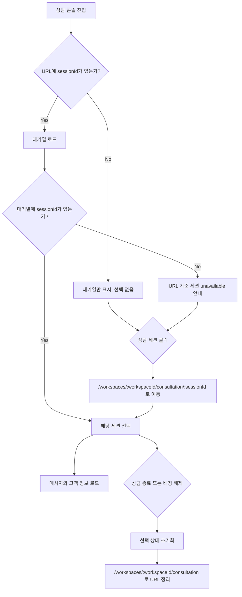

# [FE-342] 실시간 상담 콘솔 세션 URL 직접 진입 흐름

> **Issue**: [#342](https://github.com/ajou-2026-1-capstone-5/ostone/issues/342)
> **Area**: Frontend 중심, backend API 변경은 필수 범위 아님
> **Template**: `_TEMPLATE_FE.md`
> **Branch**: `spec/342`

---

## Goal

실시간 상담 콘솔에서 `/workspaces/:workspaceId/consultation/:sessionId` URL을 직접 열거나 공유했을 때 해당 상담 세션 선택, 메시지 로드, URL 정리 흐름이 일관되게 동작하게 한다.

---

## Background

현재 라우터에는 세션 URL이 이미 정의되어 있다.

| Path | 현재 상태 |
| --- | --- |
| `frontend/src/app/App.tsx` | `/workspaces/:workspaceId/consultation` 및 `/workspaces/:workspaceId/consultation/:sessionId` 라우트가 모두 `ConsultationPage`로 연결된다. |
| `frontend/src/pages/consultation/ui/ConsultationPage.tsx` | `useParams`로 `sessionId`를 읽지 않고 내부 `activeCustomerId` 상태만 사용한다. 세션 선택 시에도 `navigate`를 호출하지 않는다. |
| `frontend/src/features/consultation/api/consultationApi.ts` | workspace-scoped queue, 메시지 조회, assign/release/status 변경 API wrapper가 있다. |
| `frontend/src/features/consultation/ui/QueuePanel.tsx` | `activeCustomerId`에 따라 대기열 row 활성 상태를 표시한다. |
| `frontend/src/features/consultation/ui/ChatPanel.tsx` | 선택된 고객이 없으면 일반 empty state를 표시한다. URL 세션이 유효하지 않은 경우를 구분하지 않는다. |

백엔드에는 현재 workspace active queue 조회와 세션 메시지 조회가 분리되어 있다.

| Path | 현재 상태 |
| --- | --- |
| `backend/src/main/java/com/init/workflowruntime/presentation/WorkspaceConsultationQueueController.java` | `GET /api/v1/workspaces/{workspaceId}/consultation/queue` 제공. workspace membership 검증 후 `OPEN`, `ACTIVE` 세션을 반환한다. |
| `backend/src/main/java/com/init/workflowruntime/presentation/ConsultationController.java` | `GET /api/v1/consultation/sessions/{sessionId}/messages` 등 세션 메시지/status API 제공. |
| `backend/src/main/java/com/init/workflowruntime/presentation/CounselorSessionController.java` | 세션 목록, assign, release API 제공. 단일 세션 상세 조회 endpoint는 없다. |

---

## User Flow Chart



---

## Design Diff

### As-is vs To-be

| 영역 | As-is | To-be | 변경 내용 |
| --- | --- | --- | --- |
| 초기 선택 | URL `sessionId`를 무시하고 선택 없음 | 대기열 로드 후 URL `sessionId`가 있으면 해당 세션 선택 | 직접 진입/새로고침 복원 |
| 세션 선택 | `activeCustomerId`만 변경 | `activeCustomerId`와 URL을 함께 갱신 | 공유/뒤로가기 흐름 개선 |
| 선택 해제 | 내부 상태만 초기화 | 내부 상태 초기화 후 세션 없는 상담 콘솔 URL로 이동 | 종료/배정 해제 후 stale URL 제거 |
| 유효하지 않은 URL | 빈 채팅 화면과 구분되지 않음 | URL 세션을 찾을 수 없거나 접근할 수 없다는 안내 표시 | 사용자가 현재 상태를 이해 가능 |
| 브라우저 탐색 | 뒤로가기/앞으로가기와 선택 상태가 약하게 연결됨 | route param 변경을 선택 상태에 반영 | 브라우저 탐색과 UI 상태 일치 |

### URL Unavailable State

URL의 `sessionId`가 현재 workspace 대기열에 없으면 일반 "좌측 대기 목록에서 고객을 선택해주세요" empty state와 구분되는 안내를 제공한다.

- 예시 문구: `요청한 상담 세션을 현재 대기열에서 찾을 수 없습니다. 상담이 종료되었거나 접근 권한이 없을 수 있습니다.`
- 사용자는 좌측 대기열에서 다른 세션을 선택할 수 있어야 한다.
- 이 상태에서 메시지 조회를 시도하지 않는다. 대기열로 접근 가능성이 확인되지 않은 세션의 메시지를 먼저 조회하지 않는다.

---

## Component Tree

```text
ConsultationPage
├─ QueuePanel
│    └─ queue item selection -> navigate("/workspaces/:workspaceId/consultation/:sessionId")
├─ conversation pane (ConsultationPage 내부 layout region)
│    ├─ URL unavailable state
│    ├─ conversation header
│    └─ ChatPanel
└─ detail pane (ConsultationPage 내부 layout region)
     ├─ MatchedWorkflowBar | MatchedWorkflowBarSkeleton
     ├─ MessageDetailPanel
     └─ CustomerPanel
```

`conversation pane`과 `detail pane`은 현재 별도 React 컴포넌트가 아니라 `ConsultationPage.tsx` 안의 layout region이다. unavailable 안내도 기본 방향은 `ConsultationPage` 내부에서 처리한다. 단 안내 UI가 커져서 책임이 흐려지면 `ConsultationPage` 근처에 작은 전용 view 컴포넌트를 새로 만든다.

---

## 수정 대상 파일

| 파일 | 변경 유형 | 설명 |
| --- | --- | --- |
| `frontend/src/pages/consultation/ui/ConsultationPage.tsx` | modify | `useParams`, `useNavigate` 기반으로 URL `sessionId`와 `activeCustomerId`를 동기화한다. 대기열 로드 후 URL 세션 검증 및 unavailable state를 처리한다. |
| `frontend/src/pages/consultation/ui/consultation-page.module.css` | modify | URL 세션 unavailable 안내 UI가 필요하면 기존 3-pane 레이아웃 안에서 스타일을 추가한다. |
| `frontend/src/pages/consultation/ui/ConsultationPage.test.tsx` | modify | 직접 URL 진입, 세션 선택 시 URL 갱신, 유효하지 않은 URL 안내, 종료/배정 해제 후 URL 정리 테스트를 추가한다. |
| `frontend/src/pages/consultation/ui/ConsultationPage.generated-api.test.tsx` | modify | URL 복원 흐름이 기존 generated API 사용 경로를 깨지 않는지 필요한 범위에서 보강한다. |
| `frontend/src/features/consultation/ui/ChatPanel.tsx` | optional | unavailable 안내를 ChatPanel 책임으로 넣어야 할 때만 prop 추가. 기본 방향은 `ConsultationPage`에서 처리한다. |
| `frontend/src/features/consultation/ui/chat-panel.module.css` | optional | `ChatPanel`에 unavailable variant를 추가하는 경우에만 수정한다. |

---

## State Management

### URL State

`sessionId` route param은 세션 선택 상태의 외부 표현이다.

- `useParams<{ workspaceId: string; sessionId?: string }>()`로 `sessionId`를 읽는다.
- `sessionId`가 있으면 먼저 `Number(sessionId)`와 `!Number.isNaN(...)` 또는 동등한 방식으로 숫자형 ID인지 검증한다.
- 숫자가 아닌 `sessionId`는 queue lookup이나 메시지 조회를 진행하지 않고 `activeCustomerId = null`, `urlSessionUnavailable = true`로 처리한다.
- 숫자형 `sessionId`만 대기열 로드 완료 후 `queue.find((customer) => customer.id === sessionId)`로 접근 가능성을 확인한다.
- route param이 바뀌면 현재 선택 상태도 바뀌어야 한다.
- `sessionId`가 없으면 URL unavailable state를 지우고 선택 없는 상담 콘솔 상태를 유지한다.

### Local State

기존 `activeCustomerId`는 화면 내부의 파생 선택 상태로 유지할 수 있다. 단 다음 규칙을 지킨다.

- URL `sessionId`가 있고 대기열에 존재하면 `activeCustomerId = sessionId`.
- URL `sessionId`가 있고 대기열에 없으면 `activeCustomerId = null`, `urlSessionUnavailable = true`.
- 사용자가 대기열에서 세션을 클릭하면 직접 `setActiveCustomerId`만 하지 않고 먼저 세션 URL로 `navigate`한다. 이후 route param effect가 선택 상태를 맞춘다.
- URL 기반 선택도 기존 수동 선택과 같은 배정 규칙을 따른다. 현재 구현처럼 미배정 세션 선택 시 `assignSession`을 호출해야 한다면 직접 URL 진입으로 선택되는 세션에도 동일하게 적용하되, 이미 배정된 세션에는 중복 호출하지 않는다.
- 상담 종료, 배정 해제, queue `SESSION_REMOVED` 이벤트로 활성 세션이 사라지면 `clearActiveConversation()` 후 `/workspaces/:workspaceId/consultation`으로 `replace` 이동한다.

### Server State

초기 구현은 기존 workspace queue를 source of truth로 사용한다.

- `consultationApi.getQueue(workspaceId)`는 URL 세션 검증의 기준이다.
- URL 세션이 숫자형이고 queue에 존재할 때만 `consultationApi.getMessages(Number(sessionId))`를 호출한다.
- URL 세션이 queue에 없을 때 단건 메시지 조회를 먼저 호출하지 않는다.

---

## API Integration

### Required Endpoints

신규 endpoint는 필수 요구사항이 아니다.

| Method | Path | 용도 |
| --- | --- | --- |
| `GET` | `/api/v1/workspaces/:workspaceId/consultation/queue` | URL 세션이 현재 상담자가 볼 수 있는 활성 대기열에 있는지 확인 |
| `GET` | `/api/v1/consultation/sessions/:sessionId/messages` | 접근 가능한 활성 세션의 메시지 복원 |
| `POST` | `/api/v1/consultation/sessions/:sessionId/assign?counselorId=:id` | 미배정 세션 선택 시 기존 배정 흐름 유지 |
| `POST` | `/api/v1/consultation/sessions/:sessionId/release?counselorId=:id` | 배정 해제 후 URL 정리 |
| `PATCH` | `/api/v1/consultation/sessions/:sessionId/status` | 상담 종료 후 URL 정리 |

### Optional Backend Follow-up

유효하지 않은 URL을 `종료됨`, `존재하지 않음`, `권한 없음`, `다른 workspace 세션`으로 구분해야 한다면 별도 backend 스펙/구현에서 workspace-scoped 단건 조회 API를 추가한다.

예상 후보:

| Method | Path | 설명 |
| --- | --- | --- |
| `GET` | `/api/v1/workspaces/:workspaceId/consultation/sessions/:sessionId` | workspace membership과 session workspace를 확인한 뒤 세션 요약을 반환 |

본 스펙의 필수 구현에서는 이 endpoint 없이도 "현재 대기열에서 찾을 수 없음" 안내까지를 완료 조건으로 본다.

---

## Data Flow

```text
Route /workspaces/:workspaceId/consultation/:sessionId
  -> ConsultationPage reads sessionId param
  -> validate sessionId is numeric
  -> loadQueue(workspaceId)
  -> queue contains sessionId?
       yes:
         activeCustomerId = sessionId
         clear unavailable state
         load messages / matched workflow / websocket topic through the existing activeCustomerId flow
       no:
         activeCustomerId = null
         clear messages and selected message
         show URL unavailable state
```

세션 클릭 흐름:

```text
QueuePanel.onSelectCustomer(id)
  -> ConsultationPage.handleSelectCustomer(id)
  -> navigate(`/workspaces/${workspaceId}/consultation/${id}`)
  -> route param effect selects the session
  -> if session is unassigned, assignSession(id, currentCounselorId)
```

종료/배정 해제 흐름:

```text
handleEndSession / handleReleaseAssignment / SESSION_REMOVED event
  -> remove or update queue
  -> clearActiveConversation()
  -> navigate(`/workspaces/${workspaceId}/consultation`, { replace: true })
```

---

## Requirements

### Functional

1. `ConsultationPage`는 `sessionId` route param을 읽고 대기열 로드 이후 초기 선택 상태에 반영한다.
2. URL `sessionId`가 현재 queue에 있으면 해당 row가 활성화되고 메시지/고객 정보/매칭 워크플로우 로딩 흐름이 기존 선택 흐름과 동일하게 동작한다.
3. 대기열 row를 클릭하면 브라우저 URL이 `/workspaces/:workspaceId/consultation/:sessionId`로 갱신된다.
4. 브라우저 뒤로가기/앞으로가기로 route param이 바뀌면 선택된 상담 세션도 바뀐다.
5. URL `sessionId`가 없으면 선택 없는 기본 상담 콘솔 상태를 보여준다.
6. URL `sessionId`가 현재 queue에 없으면 메시지 조회를 하지 않고 명확한 unavailable 안내를 보여준다.
7. 상담 종료, 배정 해제, websocket `SESSION_REMOVED` 이벤트로 활성 세션이 사라지면 세션 없는 상담 콘솔 URL로 `replace` 이동한다.
8. queue reload 또는 websocket `SESSION_UPSERTED` 이벤트로 URL `sessionId`가 뒤늦게 queue에 들어오면 unavailable state를 해제하고 해당 세션을 선택할 수 있어야 한다.
9. 미배정 세션을 URL로 직접 선택하는 경우에도 기존 수동 선택과 같은 배정 동작을 유지하며, 이미 다른 상담사에게 배정된 세션에는 중복 배정 요청을 보내지 않는다.

### Non-Functional

1. FSD 의존성 방향을 유지한다. `ConsultationPage`는 page layer에서 feature components/API를 조합하고, feature layer가 page layer를 import하지 않는다.
2. `alert()`를 사용하지 않는다. 오류 안내가 toast 성격이면 `sonner`를 사용하고, URL unavailable은 화면 상태로 표시한다.
3. 기존 대기열/메시지/매칭 워크플로우 로딩 흐름의 race guard를 유지한다. stale 메시지가 다른 세션에 표시되지 않아야 한다.
4. 직접 URL 진입 중 queue loading 상태와 unavailable 상태가 겹쳐 보이지 않아야 한다.

---

## Non-Goals

- 상담 히스토리 화면(`/workspaces/:workspaceId/consultation/history/:sessionId`) 변경
- 종료된 세션의 상세 복원 또는 히스토리 화면 자동 이동
- backend 단건 세션 상세 조회 API 필수 추가
- 상담 메시지 전송/메모/워크플로우 바 기능 변경
- 인증/인가 정책 변경

---

## Tests

### Test Strategy

| 구분 | 방법 | 도구 | 비고 |
| --- | --- | --- | --- |
| 컴포넌트/라우팅 테스트 | `MemoryRouter` initialEntries로 URL 진입 재현 | Vitest + React Testing Library | `ConsultationPage.test.tsx` |
| API wrapper 회귀 테스트 | 기존 generated/manual API 호출이 유지되는지 확인 | Vitest | `ConsultationPage.generated-api.test.tsx` 필요한 범위 |
| 수동 테스트 | 로컬 Vite 화면에서 URL/뒤로가기/새로고침 확인 | Browser | Docker compose 또는 frontend dev 환경 |

### Test Scenarios

#### Happy Path

| # | 시나리오 | Given | When | Then |
| --- | --- | --- | --- | --- |
| 1 | 직접 URL 진입 | queue에 `id=1` 세션 존재 | `/workspaces/2/consultation/1`로 렌더 | `id=1` row가 활성화되고 메시지를 조회한다. |
| 2 | 세션 클릭 | `/workspaces/2/consultation` 진입 | 대기열 `id=1` 클릭 | URL이 `/workspaces/2/consultation/1`로 변경된다. |
| 3 | 새로고침 복원 | URL에 `sessionId=1` 존재 | 페이지가 다시 mount되고 queue 로드 완료 | 고객 정보와 메시지가 동일 세션 기준으로 복원된다. |
| 4 | 뒤로가기 | `id=1` 선택 후 `id=2` 선택 | 브라우저 back | 선택 상태가 `id=1`로 돌아간다. |
| 5 | 직접 URL 미배정 세션 | queue의 `id=1` 세션이 미배정 | `/workspaces/2/consultation/1`로 렌더 | 기존 수동 선택과 동일하게 1회 배정 요청 후 선택 상태를 유지한다. |

#### Error & Edge Cases

| # | 시나리오 | Given | When | Then |
| --- | --- | --- | --- | --- |
| 1 | queue에 없는 URL 세션 | queue에 `id=999` 없음 | `/workspaces/2/consultation/999` 진입 | unavailable 안내를 표시하고 `getMessages(999)`를 호출하지 않는다. |
| 2 | queue loading 중 | URL에 `sessionId=1` 존재 | queue 요청 pending | loading 상태만 보이고 unavailable 안내는 아직 보이지 않는다. |
| 3 | queue 로드 실패 | URL에 `sessionId=1` 존재 | queue API reject | 기존 queue error state와 toast가 동작하고 잘못된 unavailable 안내를 먼저 확정하지 않는다. |
| 4 | 상담 종료 | 활성 세션이 현재 상담사에게 배정됨 | 상담 종료 클릭 성공 | queue에서 제거되고 URL이 `/workspaces/2/consultation`로 `replace` 정리된다. |
| 5 | 배정 해제 | 활성 세션이 현재 상담사에게 배정됨 | 배정 해제 성공 | 선택이 해제되고 URL이 `/workspaces/2/consultation`로 `replace` 정리된다. |
| 6 | websocket 제거 이벤트 | 활성 URL 세션이 `SESSION_REMOVED`로 내려옴 | 이벤트 처리 | 선택/메시지가 초기화되고 URL이 세션 없는 경로로 정리된다. |
| 7 | 숫자가 아닌 sessionId | URL `sessionId=abc` | 페이지 진입 | 메시지 API를 호출하지 않고 unavailable 안내를 표시한다. |
| 8 | websocket 지연 도착 | URL `sessionId=9`가 처음에는 queue에 없어 unavailable 안내가 표시됨 | `SESSION_UPSERTED` 이벤트 또는 queue reload로 `id=9` 세션이 들어옴 | unavailable 안내가 사라지고 `id=9`가 선택되며 `getMessages(9)`를 호출한다. |

#### Accessibility & UX

| # | 확인 항목 | 기대 결과 |
| --- | --- | --- |
| 1 | 키보드 대기열 선택 | Enter/Space 선택 시 클릭과 동일하게 URL이 갱신된다. |
| 2 | unavailable 안내 | `role="status"` 또는 적절한 semantic 영역으로 보조기술이 상태 변화를 인지할 수 있다. |
| 3 | focus 흐름 | URL 정리 후 불필요한 focus jump 없이 대기열 탐색을 계속할 수 있다. |

---

## Acceptance Criteria

- `/workspaces/{workspaceId}/consultation/{sessionId}`로 직접 진입하면, 해당 세션이 현재 대기열에 있을 때 자동 선택되고 메시지와 고객 정보가 표시된다.
- 상담 세션을 클릭하면 브라우저 URL의 `:sessionId`가 갱신된다.
- 새로고침 후에도 같은 활성 세션의 메시지와 고객 정보가 복원된다.
- 존재하지 않거나 접근할 수 없거나 현재 대기열에 없는 세션 URL은 빈 채팅 화면 대신 명확한 안내를 표시한다.
- 상담 종료 또는 배정 해제 후 URL이 `/workspaces/{workspaceId}/consultation`으로 정리된다.
- URL의 세션이 대기열에 없을 때 해당 `sessionId`로 메시지 API를 먼저 호출하지 않는다.

---

## Open Questions

1. queue에 없는 세션을 "종료됨"과 "권한 없음/존재하지 않음"으로 구분해야 하는가? 구분이 필요하면 backend 단건 세션 조회 API가 별도 범위로 필요하다.
2. queue에 없는 종료 세션 URL을 상담 히스토리 화면으로 안내만 할지, 자동 이동할지 결정이 필요하다. 본 스펙은 자동 이동하지 않는다.
