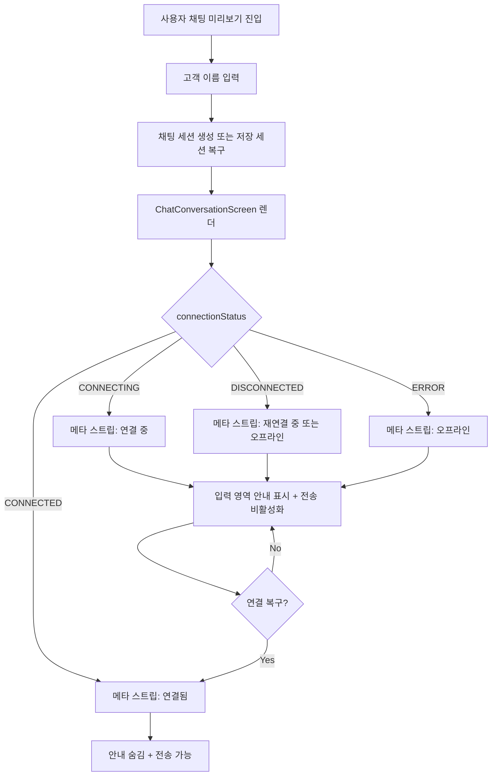

# 343: [FE] 사용자 채팅 미리보기의 실시간 연결 상태 표시

> **Issue**: [#343](https://github.com/ajou-2026-1-capstone-5/ostone/issues/343)
> **Bounded Context**: `chat-demo` FE
> **Template**: `_TEMPLATE_FE.md`
> **Branch**: `feature/343-realtime-connection-status`
> **Canonical Number**: `343`
> **Type**: Frontend (FSD)
> **작성일**: 2026-05-31

---

## Goal

사용자 채팅 미리보기 화면에서 WebSocket 실제 연결 상태를 메타 스트립과 입력 영역에 반영하여, 운영자가 응답 지연이나 전송 실패를 도메인 팩 품질 문제로 오해하지 않도록 한다.

---

## Background

사용자 채팅 미리보기는 운영 중인 Domain Pack이 고객에게 어떻게 응답하는지 확인하는 화면이다. 현재 `UserChatPage`는 `useStomp`의 `connectionStatus`를 구독 조건으로만 사용하고, `ChatConversationScreen`의 메타 스트립은 실제 WebSocket 상태와 관계없이 항상 `연결됨`을 표시한다.

이 때문에 WebSocket이 아직 연결 중이거나 끊어진 상태에서도 사용자는 정상 연결로 오해할 수 있고, 메시지 전송 실패가 네트워크/연결 문제인지 Domain Pack 응답 품질 문제인지 구분하기 어렵다.

---

## Scope

### In Scope

- `UserChatPage`에서 `connectionStatus`를 `ChatConversationScreen`으로 전달한다.
- `ChatConversationScreen` 메타 스트립의 연결 상태 문구와 점 표시를 실제 WebSocket 상태 기준으로 렌더한다.
- 연결이 안정적이지 않을 때 메시지 입력 영역 근처에 짧은 안내를 표시한다.
- 연결 불가 상태에서는 메시지 입력/전송이 비활성화되도록 한다.
- 연결 복구 후 안내 문구와 입력 가능 상태가 정상 상태로 자동 복귀한다.
- 상태별 렌더링과 disabled 동작을 컴포넌트 테스트로 검증한다.

### Issue Requirement Trace

| Issue 요구사항 | 스펙 반영 위치 |
| --- | --- |
| `UserChatPage`의 `connectionStatus`를 `ChatConversationScreen`에 전달 | Scope, Props Contract, 수정 대상 파일 |
| 메타 스트립을 실제 상태 기준으로 표시 | Design Diff, Connection Status Mapping |
| `연결 중`, `연결됨`, `재연결 중`, `오프라인` 상태 표현 | Connection Status Mapping, Test Scenarios |
| 연결이 안정적이지 않을 때 입력 영역 근처 안내 표시 | 표시 원칙, Component Tree, Acceptance Criteria |
| 오프라인 상태에서 전송 버튼 disabled 또는 전송 전 피드백 제공 | Connection Status Mapping에서 disabled 방식으로 결정 |
| 연결 복구 시 안내와 입력 상태 정상 복귀 | User Flow Chart, Test Scenarios, Acceptance Criteria |

### Out of Scope

- Backend WebSocket endpoint, STOMP destination, 인증 헤더 처리 변경
- `useStomp`의 상태 enum 확장 또는 재연결 정책 변경
- 채팅 메시지 저장/동기화 정책 변경
- 관리자용 `ChatRoom` UX 변경
- Domain Pack 런타임 응답 품질 판정 로직 변경

---

## Existing Context

아래 경로는 현재 repository에서 존재 확인 완료했다.

| Existing file | 현재 역할 | 변경 기준 |
| --- | --- | --- |
| `frontend/src/pages/user-chat/ui/UserChatPage.tsx` | 사용자 채팅 미리보기 페이지, `useStomp` 구독 관리 | `connectionStatus`를 대화 화면 props로 전달 |
| `frontend/src/pages/user-chat/ui/ChatConversationScreen.tsx` | 대화 화면, 메타 스트립, 메시지 목록, 입력 영역 조합 | 연결 상태 표시/안내/disabled 조건 반영 |
| `frontend/src/pages/user-chat/ui/ChatHeader.tsx` | 세션 ID와 세션 상태 배지 표시 | WebSocket 연결 상태와 세션 상태를 혼동하지 않도록 유지 |
| `frontend/src/features/user-chat/ui/MessageInput.tsx` | 메시지 입력/전송 UI | 기존 `disabled` prop을 연결 상태에도 재사용 |
| `frontend/src/features/user-chat/ui/ConnectionStatus.tsx` | 관리자 채팅방 연결 상태 표시 컴포넌트 | 상태 문구와 테스트 기준 참고 |
| `frontend/src/shared/lib/websocket/useStomp.ts` | `ConnectionStatus` union과 STOMP 연결 상태 관리 | 기존 enum을 변경하지 않고 소비 |
| `frontend/src/shared/lib/websocket/stompClient.ts` | STOMP client 생성, `reconnectDelay: 5000` 설정 | 재연결 안내 문구의 근거 |

---

## User Flow Chart



---

## Design Diff

### As-is vs To-be

| 영역 | As-is | To-be | 변경 내용 |
| --- | --- | --- | --- |
| 연결 상태 데이터 | `UserChatPage`가 `connectionStatus`를 구독 조건에만 사용 | `ChatConversationScreen`에 props로 전달 | 화면 표시와 실제 연결 상태 동기화 |
| 메타 스트립 | 항상 `연결됨` 표시 | `연결 중`, `연결됨`, `재연결 중`, `오프라인` 표시 | 상태 오인 방지 |
| 입력 영역 | `isSending`일 때만 disabled | `isSending` 또는 연결 불가 상태에서 disabled | 전송 가능 여부 명확화 |
| 연결 불안정 안내 | 전송 실패 후 에러만 표시 | 입력 영역 근처에 사전 안내 표시 | 실패 전 원인 인지 |
| 연결 복구 | 표시 변화 없음 | `CONNECTED` 복구 시 안내 숨김 및 입력 가능 | 정상 복구 피드백 |

---

## Connection Status Mapping

`useStomp`의 현재 union은 `CONNECTING | CONNECTED | DISCONNECTED | ERROR`다. 이 스펙은 enum을 늘리지 않고 사용자 채팅 미리보기에서 표시 문구와 전송 가능 여부를 파생한다.

| `ConnectionStatus` | 메타 스트립 문구 | 안내 문구 | 입력/전송 |
| --- | --- | --- | --- |
| `CONNECTING` | `연결 중` | `실시간 연결을 준비하는 중입니다. 연결 후 메시지를 보낼 수 있습니다.` | disabled |
| `CONNECTED` | `연결됨` | 표시하지 않음 | enabled, 단 `isSending=true`이면 disabled |
| `DISCONNECTED` | `재연결 중` | `실시간 연결이 끊어졌습니다. 잠시 후 자동 재연결을 시도합니다.` | disabled |
| `ERROR` | `오프라인` | `실시간 연결에 문제가 있습니다. 네트워크 상태를 확인한 뒤 다시 시도해 주세요.` | disabled |

### 표시 원칙

- `ChatHeader`의 `session.status`는 채팅 세션 상태이므로 WebSocket 연결 상태로 대체하지 않는다.
- 메타 스트립에는 WebSocket 연결 상태와 `Workspace #{workspaceId} · 운영 도메인 팩 기준` 문구가 함께 유지되어야 한다.
- 연결 상태 점은 기존 CSS variable 중심의 단색 UI를 유지하되, 상태별로 정상/대기/오프라인이 구분되어야 한다.
- `MessageInput`의 `disabled` prop은 `isSending || connectionStatus !== "CONNECTED"` 조건으로 전달한다.
- 연결 불안정 안내는 `MessageInput` 바로 위 또는 입력 영역과 시각적으로 연결된 위치에 표시한다.
- `messageError` 전송 실패 배너와 연결 상태 안내가 동시에 필요한 경우 둘 다 보이되 역할이 구분되어야 한다.

---

## Component Tree

```text
UserChatPage
└─ ChatConversationScreen
   ├─ ChatHeader
   ├─ ChatMetaStrip
   │  └─ RealtimeConnectionIndicator [NEW or inline helper]
   ├─ SessionReuseNote
   ├─ MessageList
   ├─ MessageErrorBanner
   ├─ ConnectionNotice [NEW or inline helper]
   └─ MessageInput
```

### Props Contract

```typescript
interface ChatConversationScreenProps {
  session: DemoChatSession;
  customerName: string;
  workspaceId: number;
  connectionStatus: ConnectionStatus;
  isSending: boolean;
  messageError: string | null;
  onSend: (content: string) => void;
  onStartNewSession: () => void;
}
```

`ConnectionStatus`는 `frontend/src/shared/lib/websocket/useStomp.ts`에서 export되는 타입을 사용한다.

---

## State Management

### Client State

별도 store는 추가하지 않는다. `UserChatPage`가 이미 보유한 `connectionStatus`를 props로 내려주고, `ChatConversationScreen`은 순수 렌더링 조건만 계산한다.

```typescript
const isConnectionReady = connectionStatus === "CONNECTED";
const isInputDisabled = isSending || !isConnectionReady;
```

### Derived UI State

연결 상태 문구, 안내 문구, 점 스타일은 `connectionStatus`에서 파생한다. 같은 파생 로직이 2회 이상 반복되면 `resolveRealtimeConnectionDisplay(status)` 같은 작은 helper로 분리한다.

---

## API Integration

새 REST API 또는 generated client 변경은 없다.

| Surface | 변경 여부 | 설명 |
| --- | --- | --- |
| HTTP API | 없음 | 기존 demo chat session/message API 유지 |
| WebSocket destination | 없음 | 기존 `/topic/chat.{sessionId}` 구독 유지 |
| Generated API | 없음 | Orval generated file 수정/재생성 없음 |

---

## 수정 대상 파일

| 파일 | 변경 유형 | 설명 |
| --- | --- | --- |
| `frontend/src/pages/user-chat/ui/UserChatPage.tsx` | modify | `connectionStatus`를 `ChatConversationScreen`에 전달 |
| `frontend/src/pages/user-chat/ui/ChatConversationScreen.tsx` | modify | 상태별 메타 스트립, 연결 안내, input disabled 조건 반영 |
| `frontend/src/pages/user-chat/ui/ChatConversationScreen.test.tsx` | modify | 연결 상태별 문구/안내/disabled 복구 테스트 추가 |

필요 시 helper 분리를 위해 아래 파일을 추가할 수 있다.

| 파일 | 변경 유형 | 설명 |
| --- | --- | --- |
| `frontend/src/pages/user-chat/ui/resolveRealtimeConnectionDisplay.ts` | optional new | 연결 상태 표시 문구와 입력 가능 여부 파생 |

---

## Tests

### Test Strategy

| 구분 | 방법 | 도구 | 비고 |
| --- | --- | --- | --- |
| 컴포넌트 테스트 | `ChatConversationScreen` props별 렌더링 검증 | Vitest + React Testing Library | 상태 문구, 안내, disabled |
| 페이지 테스트 | 필요 시 `UserChatPage`에서 props 전달 확인 | Vitest | `useStomp` mock이 이미 있거나 쉽게 격리 가능한 경우만 |
| 수동 테스트 | 브라우저에서 WebSocket 연결 전/중단/복구 확인 | Docker Compose 또는 FE dev server | 연결 상태 변화와 입력 가능 상태 확인 |

### Test Scenarios

#### Happy Path

| # | 시나리오 | 사전 조건 | 기대 결과 |
| --- | --- | --- | --- |
| 1 | WebSocket 연결 완료 | `connectionStatus="CONNECTED"` | 메타 스트립에 `연결됨`, 연결 안내 없음, 입력 가능 |
| 2 | 연결 중 | `connectionStatus="CONNECTING"` | 메타 스트립에 `연결 중`, 안내 표시, 입력/전송 disabled |
| 3 | 연결 끊김 | `connectionStatus="DISCONNECTED"` | 메타 스트립에 `재연결 중`, 재연결 안내 표시, 입력/전송 disabled |
| 4 | 연결 오류 | `connectionStatus="ERROR"` | 메타 스트립에 `오프라인`, 네트워크 확인 안내 표시, 입력/전송 disabled |
| 5 | 연결 복구 | `DISCONNECTED` 렌더 후 `CONNECTED`로 rerender | 안내가 사라지고 입력/전송 가능 상태로 복구 |

#### Error & Edge Cases

| # | 시나리오 | 기대 결과 |
| --- | --- | --- |
| 1 | `messageError`와 연결 안내가 동시에 존재 | 전송 실패 배너와 연결 안내가 각각 표시되고 역할이 혼동되지 않음 |
| 2 | `isSending=true`이면서 `CONNECTED` | 기존처럼 입력/전송 disabled |
| 3 | 빈 메시지 | 기존 `MessageInput` 동작대로 전송 버튼 disabled |

#### 반응형 & 접근성

| # | 확인 항목 | 기대 결과 |
| --- | --- | --- |
| 1 | 375px 모바일 | 메타 스트립 상태 문구와 새 테스트 세션 버튼이 겹치지 않음 |
| 2 | 키보드 탐색 | disabled 입력/전송 버튼은 포커스/실행 가능한 상태로 오인되지 않음 |
| 3 | 스크린 리더 | 연결 불안정 안내는 `role="status"` 또는 이에 준하는 의미로 읽힘 |

### Validation Commands

구현 PR에서 아래 검증을 기대한다.

```bash
cd frontend && pnpm test -- ChatConversationScreen
cd frontend && pnpm lint
```

---

## Acceptance Criteria

- WebSocket 연결 전 또는 연결 중 상태에서 사용자 채팅 미리보기는 `연결됨`을 표시하지 않는다.
- WebSocket이 연결되면 메타 스트립에 `연결됨`이 표시되고 메시지 입력이 가능하다.
- WebSocket 연결이 끊기면 메타 스트립에서 `재연결 중` 또는 이에 준하는 비정상 상태를 확인할 수 있다.
- WebSocket 오류 상태에서는 `오프라인` 안내를 확인할 수 있고 메시지 입력/전송이 비활성화된다.
- 연결이 안정적이지 않을 때 메시지 입력 영역 근처에 짧은 안내가 표시된다.
- 연결 복구 후 연결 안내가 사라지고 입력 가능 상태가 정상으로 돌아온다.
- `ChatHeader`의 세션 상태 배지는 기존 세션 상태 표시 역할을 유지한다.
- 실제 `connectionStatus`와 화면 문구가 서로 어긋나지 않는다.

---

## Open Questions

- 없음. 현재 `useStomp` enum과 `stompClient`의 `reconnectDelay`만으로 issue의 표시 요구사항을 충족할 수 있다.
