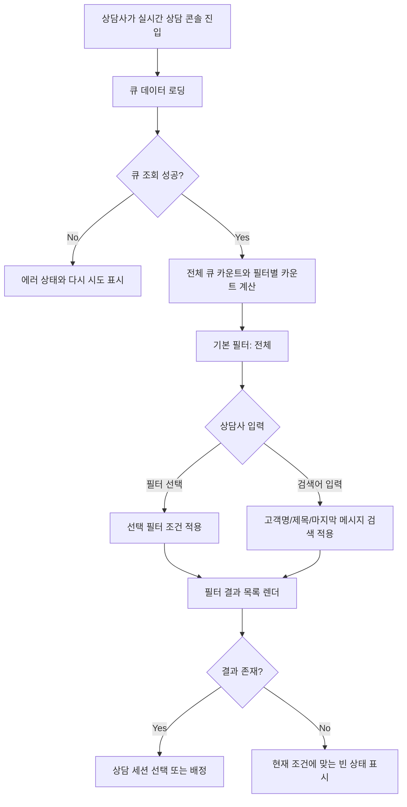

# 346: [FE] 상담 대기열의 내 상담/미배정/읽지 않음 필터 제공

> **Issue**: [#346](https://github.com/ajou-2026-1-capstone-5/ostone/issues/346)
> **Bounded Context**: `workflow-runtime` FE
> **Template**: `_TEMPLATE_FE.md`
> **Branch**: `spec/346`
> **Canonical Number**: `346`
> **Type**: Frontend (FSD)
> **작성일**: 2026-06-01

---

## Goal

실시간 상담 콘솔의 대기열에서 상담사가 미배정 상담, 내 상담, 읽지 않은 상담을 빠르게 분리해 찾을 수 있도록 검색/필터/카운트 기준을 정의한다.

---

## Background

실시간 상담 콘솔의 대기열은 상담사가 지금 처리할 세션을 고르는 첫 진입점이다. 현재 `QueuePanel`은 전달받은 `customers` 배열을 그대로 렌더링하고, 헤더도 `대기 고객`, `N명 대기중`으로 표시한다.

하지만 백엔드 큐는 `OPEN`, `ACTIVE` 세션을 함께 내려준다. 따라서 실제 목록에는 미배정 대기 세션, 내 상담 진행 세션, 다른 상담사에게 배정된 진행 세션이 섞일 수 있다. 상담량이 늘어나면 상담사는 새로 처리해야 할 미배정 상담이나 본인이 이어서 처리해야 할 상담을 직접 훑어야 하며, 화면의 "대기중" 문구도 실제 목록 의미와 어긋날 수 있다.

---

## Scope

### In Scope

- `QueuePanel` 상단에 `전체`, `내 상담`, `미배정`, `읽지 않음` 필터를 제공한다.
- 고객명, 문의 제목, 마지막 메시지 또는 handoff preview 기준 검색을 제공한다.
- 필터별 카운트를 현재 큐 세션의 상태와 배정 정보 기준으로 계산한다.
- 헤더의 전체 대기/진행 카운트와 현재 필터 결과 카운트를 서로 혼동되지 않는 문구로 분리한다.
- 검색어와 필터가 함께 적용될 때 결과 목록과 빈 상태 문구가 현재 조건을 반영한다.
- 키보드 탐색, 포커스 표시, 작은 폭 대기열에서도 깨지지 않는 컨트롤 배치를 유지한다.
- 필터/검색/카운트 동작을 `QueuePanel` 컴포넌트 테스트로 검증한다.

### Issue Requirement Trace

| Issue 요구사항 | 스펙 반영 위치 |
| --- | --- |
| `전체`, `내 상담`, `미배정`, `읽지 않음` 필터 제공 | Scope, Queue Filter Semantics, Component Tree, Test Scenarios |
| 고객명, 문의 제목, 마지막 메시지 기준 검색 제공 | Scope, Search Semantics, Test Scenarios |
| 필터별 카운트를 실제 세션 상태 기준으로 계산 | Queue Filter Semantics, Count Semantics, Acceptance Criteria |
| `대기중` 카운트와 현재 필터 결과 카운트 분리 | Design Diff, Count Semantics, Acceptance Criteria |
| 미배정 상담만 빠르게 확인 | Queue Filter Semantics, Happy Path |
| 자신에게 배정된 상담만 빠르게 확인 | Queue Filter Semantics, Happy Path |
| 읽지 않은 메시지가 있는 상담만 필터링 | Queue Filter Semantics, Happy Path |
| 대기열 카운트 문구가 실제 목록 의미와 어긋나지 않음 | Design Diff, Count Semantics, Acceptance Criteria |

### Out of Scope

- 백엔드 큐 조회 API의 응답 스키마 변경
- 상담 세션 배정/해제 정책 변경
- WebSocket destination 또는 실시간 이벤트 payload 변경
- 읽지 않음 상태의 서버 영속화 정책 변경
- 상담 기록 화면의 필터 UX 변경
- 운영자 권한/워크스페이스 멤버십 검증 변경

---

## Existing Context

아래 경로는 현재 repository에서 존재 확인 완료했다.

| Existing file | 현재 역할 | 변경 기준 |
| --- | --- | --- |
| `frontend/src/features/consultation/ui/QueuePanel.tsx` | 상담 대기열 목록 렌더링, 로딩/에러/빈 상태 표시 | 검색/필터/카운트 UI와 파생 목록 계산 추가 |
| `frontend/src/features/consultation/ui/queue-panel.module.css` | 대기열 패널 스타일 | 필터 탭, 검색 입력, 카운트 요약, 조건별 빈 상태 스타일 추가 |
| `frontend/src/features/consultation/ui/QueuePanel.test.tsx` | `QueuePanel` 컴포넌트 동작 테스트 | 필터, 검색, 카운트, 빈 상태 테스트 추가 |
| `frontend/src/pages/consultation/ui/ConsultationPage.tsx` | 큐 데이터 로딩, 현재 상담사 ID 계산, 큐 선택/배정 처리 | 필요 시 현재 상담사 ID 또는 검색 대상 값을 `QueuePanel` props로 전달 |
| `frontend/src/features/consultation/api/consultationApi.ts` | 상담 큐/메시지/배정 API wrapper | 새 REST API 없이 기존 `getQueue` 응답 사용 |
| `backend/src/main/java/com/init/workflowruntime/application/ConsultationService.java` | `OPEN`, `ACTIVE` 세션 큐 조회 | API 동작 변경 없이 FE에서 의미 분리 |
| `backend/src/main/java/com/init/workflowruntime/presentation/WorkspaceConsultationQueueController.java` | 워크스페이스별 상담 큐 endpoint | endpoint 변경 없음 |

---

## User Flow Chart



---

## Design Diff

### As-is vs To-be

| 영역 | As-is | To-be | 변경 내용 |
| --- | --- | --- | --- |
| 필터 | 없음 | `전체`, `내 상담`, `미배정`, `읽지 않음` segmented control | 상담사가 처리 대상 세션을 빠르게 분리 |
| 검색 | 없음 | 고객명, 문의 제목, 마지막 메시지 또는 handoff preview 검색 | 목록 규모 증가 시 탐색 비용 감소 |
| 헤더 문구 | `대기 고객`, `N명 대기중` | `상담 큐`, `미배정 N건 · 진행 M건` 등 실제 의미 기반 요약 | `ACTIVE` 포함 목록을 대기중으로 오인하지 않음 |
| 현재 결과 카운트 | 전체 배열 길이만 표시 | 선택 필터/검색 결과 `N건 표시` 별도 노출 | 전체 큐 규모와 현재 목록 규모 분리 |
| 빈 상태 | 항상 `대기중인 고객이 없습니다` | 필터/검색 조건에 맞는 빈 상태 문구 | 사용자가 조건 때문인지 실제 큐가 비었는지 구분 |
| 테스트 | 목록/선택/로딩/에러 중심 | 필터/검색/count semantic 테스트 추가 | 요구사항 회귀 방지 |

---

## Queue Filter Semantics

필터는 클라이언트에서 현재 `customers` 배열을 기준으로 계산한다. 서버 응답은 이미 `OPEN`, `ACTIVE` 세션을 포함하므로, FE는 상태와 배정 정보를 이용해 상담사 관점의 하위 목록을 만든다.

| 필터 | 포함 조건 | 카운트 기준 |
| --- | --- | --- |
| `전체` | 현재 큐에 포함된 모든 세션 | `customers.length` |
| `내 상담` | `assignedCounselorId === currentCounselorId` | 현재 상담사에게 배정된 세션 수 |
| `미배정` | `assignedCounselorId == null` 또는 배정 정보 없음 | 아직 상담사에게 배정되지 않은 세션 수 |
| `읽지 않음` | `hasUnread === true` | 읽지 않은 표시가 있는 세션 수 |

### 세부 원칙

- `currentCounselorId`는 `ConsultationPage`가 이미 `getAuthUser()?.id`로 계산하고 있으므로, `QueuePanel`에 prop으로 전달해 필터 계산에 사용한다.
- `assignedCounselorId`가 현재 상담사도 아니고 `null`도 아니면 다른 상담사에게 배정된 상담으로 보고 `전체`에만 포함한다.
- `status === "OPEN"`이어도 `assignedCounselorId`가 있으면 `미배정`에 포함하지 않는다.
- `status === "ACTIVE"`이어도 `assignedCounselorId === currentCounselorId`이면 `내 상담`에 포함한다.
- `읽지 않음`은 배정 여부와 독립적인 필터다. 읽지 않은 내 상담과 읽지 않은 미배정 상담을 모두 포함한다.

---

## Search Semantics

검색어는 앞뒤 공백을 제거하고 대소문자 차이를 무시한다.

검색 대상은 다음 값이다.

| 대상 | 데이터 출처 |
| --- | --- |
| 고객명 | `QueueCustomer.name` |
| 문의 제목 | `QueueCustomer.title` |
| 마지막 메시지 또는 preview | `QueueCustomer.lastMessage`가 추가되는 경우 해당 값, 없으면 기존 `QueueCustomer.handoffReason` |
| 상태 라벨 | 검색 대상에 포함하지 않는다. 상태 탐색은 필터가 담당한다. |

`QueueCustomer`에 마지막 메시지 필드가 아직 없으므로 구현 시 두 선택지가 있다.

1. 기존 API/DTO에 마지막 메시지가 이미 추가되어 있으면 `QueueCustomer.lastMessage` 같은 선택적 필드를 연결한다.
2. 마지막 메시지 데이터가 아직 없으면 현재 카드 preview 역할을 하는 `handoffReason`을 검색 대상으로 사용하고, 마지막 메시지 검색은 후속 API 확장 전까지 제한됨을 UI 코드 주석 또는 구현 PR 본문에 명시한다.

이 스펙 PR은 백엔드 스키마 변경을 요구하지 않는다.

---

## Count Semantics

헤더와 필터 영역은 서로 다른 카운트를 표시한다.

| 위치 | 표시 의미 | 예시 문구 |
| --- | --- | --- |
| 헤더 요약 | 전체 큐의 상태 기반 요약 | `미배정 3건 · 진행 5건` |
| 필터 badge | 각 필터에 해당하는 전체 개수 | `내 상담 2`, `읽지 않음 4` |
| 결과 요약 | 현재 필터와 검색어 적용 후 표시되는 목록 개수 | `현재 2건 표시` |

상태 기반 요약에서 `미배정`은 `assignedCounselorId == null`, `진행`은 `assignedCounselorId != null` 또는 `status === "ACTIVE"` 기준으로 계산한다. 이 기준은 `대기중`이라는 단일 문구보다 현재 큐 의미를 덜 왜곡한다.

---

## Component Tree

```text
ConsultationPage
└─ QueuePanel
   ├─ QueueHeader
   │  ├─ QueueTitle
   │  └─ QueueSummaryCount
   ├─ QueueSearchInput
   ├─ QueueFilterTabs
   │  ├─ QueueFilterTab 전체
   │  ├─ QueueFilterTab 내 상담
   │  ├─ QueueFilterTab 미배정
   │  └─ QueueFilterTab 읽지 않음
   ├─ QueueResultSummary
   └─ QueueList
      ├─ QueueItem
      └─ QueueEmptyState
```

### Props Contract

```typescript
interface QueuePanelProps {
  customers: QueueCustomer[];
  activeCustomerId: string | null;
  currentCounselorId: number | null;
  onSelectCustomer: (id: string) => void;
  isLoading?: boolean;
  loadError?: string | null;
  onRetry?: () => void;
}

interface QueueCustomer {
  id: string;
  name?: string;
  title?: string;
  channel: string;
  handoffReason: string;
  lastMessage?: string;
  waitMinutes: number;
  hasUnread: boolean;
  status?: string | null;
  statusLabel?: string;
  assignedCounselorId?: number | null;
  startedAt?: string | null;
}
```

`currentCounselorId`는 필터 계산용이며, 선택/배정 정책은 기존 `ConsultationPage`의 `handleSelectCustomer` 흐름을 유지한다.

---

## State Management

### Client State

별도 전역 store는 추가하지 않는다. `QueuePanel` 내부 local state로 선택 필터와 검색어만 관리한다.

```typescript
type QueueFilter = "all" | "mine" | "unassigned" | "unread";

const [selectedFilter, setSelectedFilter] = useState<QueueFilter>("all");
const [searchTerm, setSearchTerm] = useState("");
```

### Derived State

필터별 카운트, 검색 결과, 결과 요약은 `customers`, `currentCounselorId`, `selectedFilter`, `searchTerm`에서 파생한다. 파생 로직은 렌더 본문 안에 흩뜨리지 않고 작은 helper로 분리한다.

```typescript
const counts = getQueueFilterCounts(customers, currentCounselorId);
const visibleCustomers = filterQueueCustomers({
  customers,
  currentCounselorId,
  selectedFilter,
  searchTerm,
});
```

helper는 `QueuePanel.tsx` 내부 pure function으로 시작하고, 테스트나 재사용 필요가 커질 때만 별도 파일로 분리한다.

---

## API Integration

새 REST API 또는 generated client 변경은 없다.

| Surface | 변경 여부 | 설명 |
| --- | --- | --- |
| `GET /api/v1/workspaces/{workspaceId}/consultation/queue` | 없음 | 기존 `OPEN`, `ACTIVE` 큐 응답 사용 |
| WebSocket queue event | 없음 | 기존 `SESSION_UPSERTED`, `SESSION_REMOVED` 처리 유지 |
| Generated API | 없음 | `consultationApi.getQueue`는 OpenAPI 미생성 endpoint 수동 호출을 유지 |
| Backend DTO | 없음 | 기존 `ChatSessionResponse.assignedCounselorId`, `status`, `metaJson` 기반 변환 유지 |

---

## 수정 대상 파일

| 파일 | 변경 유형 | 설명 |
| --- | --- | --- |
| `frontend/src/features/consultation/ui/QueuePanel.tsx` | modify | 검색/필터/카운트 UI 및 파생 목록 계산 추가 |
| `frontend/src/features/consultation/ui/queue-panel.module.css` | modify | 검색 입력, segmented filter, badge, 결과 요약, 조건별 빈 상태 스타일 추가 |
| `frontend/src/features/consultation/ui/QueuePanel.test.tsx` | modify | 필터/검색/카운트/빈 상태 테스트 추가 |
| `frontend/src/pages/consultation/ui/ConsultationPage.tsx` | modify | `currentCounselorId`를 `QueuePanel`에 전달하고 필요 시 preview 검색 대상 값 보강 |

선택적으로 pure helper를 분리할 수 있다.

| 파일 | 변경 유형 | 설명 |
| --- | --- | --- |
| `frontend/src/features/consultation/lib/queueFilters.ts` | optional new | 필터/검색/count 계산을 재사용 가능한 pure function으로 분리 |
| `frontend/src/features/consultation/lib/queueFilters.test.ts` | optional new | helper 분리 시 순수 로직 단위 테스트 |

---

## Tests

### Test Strategy

| 구분 | 방법 | 도구 | 비고 |
| --- | --- | --- | --- |
| 컴포넌트 테스트 | `QueuePanel` props별 렌더링/상호작용 검증 | Vitest + React Testing Library | 필터, 검색, count, 빈 상태 |
| 페이지 테스트 | 필요 시 `ConsultationPage`에서 `currentCounselorId` 전달 확인 | Vitest | 기존 mock 구조로 부담이 낮을 때만 추가 |
| 수동 테스트 | 브라우저에서 상담 큐 필터/검색 사용 | Docker Compose 또는 FE dev server | 실제 큐 데이터가 있을 때 확인 |

### Test Environment & 사전 조건

| 항목 | 값 |
| --- | --- |
| 환경 | `docker compose up -d frontend backend postgres` 또는 `cd frontend && pnpm test` |
| API Mock | 컴포넌트 테스트는 props fixture 사용 |
| 사전 조건 | 미배정, 내 상담, 다른 상담사 배정, 읽지 않음 세션 fixture 포함 |

### Test Scenarios

#### Happy Path

| # | 시나리오 | 사전 조건 | 조작 | 기대 결과 |
| --- | --- | --- | --- | --- |
| 1 | 전체 필터 기본 표시 | 큐 세션 4개 | 페이지 진입 | 모든 세션이 표시되고 전체 badge가 4로 표시 |
| 2 | 내 상담 필터 | `currentCounselorId=7`, 배정 세션 2개 | `내 상담` 선택 | `assignedCounselorId=7` 세션만 표시 |
| 3 | 미배정 필터 | 미배정 세션 1개 | `미배정` 선택 | `assignedCounselorId`가 없는 세션만 표시 |
| 4 | 읽지 않음 필터 | `hasUnread=true` 세션 2개 | `읽지 않음` 선택 | 읽지 않음 dot이 있는 세션만 표시 |
| 5 | 고객명 검색 | `홍길동` 고객 존재 | 검색어 `홍` 입력 | 해당 고객만 표시 |
| 6 | 제목/preview 검색 | 제목 또는 handoff preview에 `환불` 포함 | 검색어 `환불` 입력 | 해당 세션만 표시 |
| 7 | 필터와 검색 조합 | 내 상담 2개 중 1개만 검색어 일치 | `내 상담` 선택 후 검색 | 일치하는 내 상담 1개만 표시, 결과 요약 1건 |

#### Error & Edge Cases

| # | 시나리오 | 조작 | 기대 결과 |
| --- | --- | --- | --- |
| 1 | 전체 큐가 비어 있음 | `customers=[]` | 실제 큐가 비어 있음을 나타내는 빈 상태 표시 |
| 2 | 필터 결과만 비어 있음 | `미배정` 선택 | `미배정 상담이 없습니다`처럼 조건 기반 빈 상태 표시 |
| 3 | 검색 결과가 없음 | 존재하지 않는 검색어 입력 | 검색 조건에 맞는 상담이 없다는 빈 상태 표시 |
| 4 | 현재 상담사 ID 없음 | `currentCounselorId=null`, `내 상담` 선택 | 내 상담 결과 0건, UI 오류 없이 표시 |
| 5 | 로딩 중 | `isLoading=true` | 필터 결과 대신 로딩 상태 표시, stale 목록 숨김 |
| 6 | 에러 | `loadError` 전달 | 필터 결과 대신 에러와 재시도 버튼 표시 |

#### 반응형 & 접근성

| # | 확인 항목 | 기대 결과 |
| --- | --- | --- |
| 1 | 좁은 280px 대기열 | 필터 탭이 줄바꿈 또는 가로 스크롤로 겹침 없이 표시 |
| 2 | 키보드 탐색 | 검색 입력, 필터 버튼, 큐 아이템에 Tab 접근 가능 |
| 3 | 필터 선택 상태 | 선택된 필터가 `aria-pressed` 또는 명확한 selected state를 제공 |
| 4 | 검색 입력 | `aria-label` 또는 visible label로 목적을 알 수 있음 |
| 5 | 포커스 표시 | dotted outline 대신 기존 border/ring focus 스타일 유지 |

---

## Acceptance Criteria

- 상담사는 `미배정` 필터로 아직 상담사에게 배정되지 않은 상담만 볼 수 있다.
- 상담사는 `내 상담` 필터로 자신에게 배정된 상담만 볼 수 있다.
- 상담사는 `읽지 않음` 필터로 읽지 않은 표시가 있는 상담만 볼 수 있다.
- 상담사는 고객명, 문의 제목, 마지막 메시지 또는 handoff preview로 큐를 검색할 수 있다.
- 헤더는 `OPEN`, `ACTIVE`가 섞인 전체 목록을 단순히 `N명 대기중`이라고 표현하지 않는다.
- 필터별 badge 카운트는 검색어와 무관한 각 필터의 전체 개수를 보여준다.
- 결과 요약은 현재 필터와 검색어가 모두 적용된 표시 개수를 보여준다.
- 로딩, 에러, 전체 empty, 조건 empty 상태가 서로 구분된다.
- 기존 상담 선택, 자동 배정, 메시지 로딩 흐름은 유지된다.

---

## Validation Expectations

구현 PR에서는 최소 아래 검증을 수행한다.

```bash
cd frontend && pnpm test -- --run src/features/consultation/ui/QueuePanel.test.tsx
cd frontend && pnpm exec eslint src/features/consultation/ui/QueuePanel.tsx src/features/consultation/ui/QueuePanel.test.tsx
git diff --check
```

`ConsultationPage.tsx` 변경이 커지거나 helper를 분리하면 관련 테스트/ESLint 대상에 해당 파일을 추가한다.

---

## Open Questions

- 현재 큐 응답에서 "마지막 메시지" 원문을 안정적으로 받을 수 있는지 확인이 필요하다. 없으면 이번 구현은 `handoffReason`/카드 preview 검색으로 시작하고, 마지막 메시지 검색은 별도 API 확장 이슈로 분리한다.
- 다른 상담사에게 배정된 상담을 `전체`에 계속 노출할지, 별도 필터나 숨김 정책이 필요한지는 이번 이슈 범위 밖으로 둔다.
