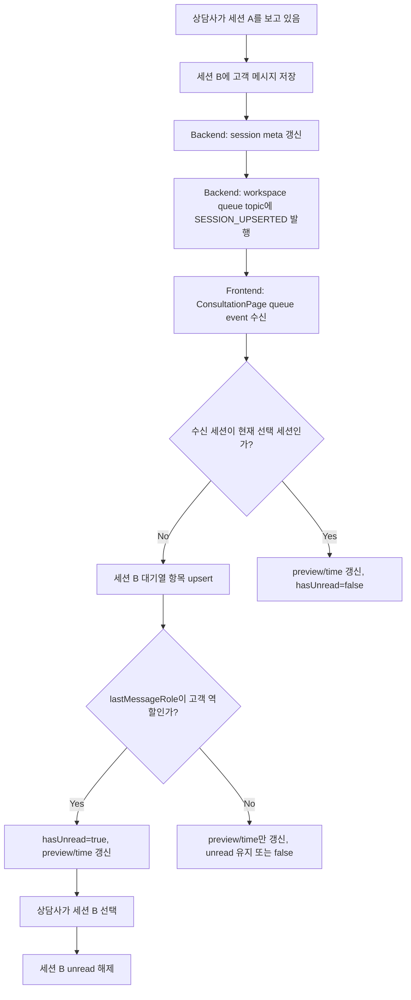
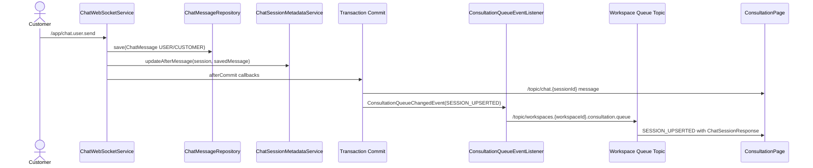

# 347: [FE/BE] 비활성 상담 세션의 신규 메시지 미확인 표시 연결

> **Issue**: [#347](https://github.com/ajou-2026-1-capstone-5/ostone/issues/347)
> **Bounded Context**: `workflow-runtime` BE, `consultation` FE
> **Template**: `_TEMPLATE_FE.md` 기반 mixed spec
> **Branch**: `spec/347`
> **Canonical Number**: `347`
> **Type**: Frontend + Backend
> **작성일**: 2026-06-01

---

## Goal

상담사가 다른 세션을 보고 있는 동안 비활성 상담 세션에 고객 메시지가 도착하면 대기열에서 읽지 않음 상태, 마지막 메시지 미리보기, 마지막 메시지 시간을 실시간으로 갱신한다.

---

## Background

상담사는 여러 상담 세션을 오가며 응대한다. 현재 대기열 모델에는 `hasUnread` 필드가 있고 워크스페이스 대기열 topic 구독도 존재하지만, 고객 메시지 저장 흐름이 대기열 topic으로 새 메시지 도착을 알리지 않는다. 또한 `toQueueCustomer`는 이전 `hasUnread` 값을 보존만 하므로 비활성 세션에 고객 응답이 와도 대기열에서 알아차리기 어렵다.

상담 화면은 현재 선택된 세션의 `/topic/chat.{sessionId}`만 메시지 본문 스트림으로 구독한다. 따라서 선택하지 않은 세션의 고객 응답은 backend가 워크스페이스 대기열 topic으로 세션 upsert 또는 동등한 이벤트를 발행하고, frontend가 그 이벤트를 unread 상태로 해석해야 한다.

---

## Scope

### In Scope

- 고객 메시지 저장 후 워크스페이스 상담 대기열 topic으로 해당 세션 갱신 이벤트를 발행한다.
- 대기열 이벤트 payload는 최신 `ChatSessionResponse.metaJson`을 포함해 `lastMessagePreview`, `lastMessageRole`, `lastMessageAt`을 전달한다.
- frontend 대기열 모델은 마지막 메시지 미리보기와 마지막 메시지 시간을 표현할 수 있어야 한다.
- 비활성 세션에 고객 메시지가 도착하면 해당 대기열 항목의 `hasUnread`를 `true`로 표시한다.
- 현재 선택된 세션의 고객 메시지 이벤트는 unread로 표시하지 않는다.
- 상담사가 세션을 선택하면 해당 세션의 unread 상태를 해제한다.
- 상담사 본인이 보낸 메시지, 상담사 echo, 내부 메모(`NOTE`)는 고객 미확인 메시지로 처리하지 않는다.
- 대기열 카드는 마지막 메시지 미리보기와 마지막 메시지 시간을 함께 표시한다.
- backend와 frontend 모두 해당 동작을 테스트로 검증한다.

### Issue Requirement Trace

| Issue 요구사항 | 스펙 반영 위치 |
| --- | --- |
| 고객 메시지 저장 후 워크스페이스 대기열 topic에도 이벤트 발행 | Backend Event Flow, Backend Requirements |
| 비활성 세션 고객 메시지 도착 시 unread 표시 | Frontend State Rules, Acceptance Criteria |
| 대기열 카드에 마지막 메시지 미리보기와 마지막 메시지 시간 표시 | Design Diff, Queue Item Display |
| 세션 선택 시 unread 해제 | Frontend State Rules, User Flow Chart |
| 상담사 메시지 echo나 NOTE는 unread 제외 | Frontend State Rules, Test Scenarios |

### Out of Scope

- 새 REST API endpoint 추가
- 대기열 topic destination 이름 변경
- STOMP 인증/인가 정책 변경
- 메시지 읽음 상태의 서버 영속화
- 다중 상담사 간 읽음 상태 동기화
- 세션별 전체 메시지 이력 조회 정책 변경
- 상담 종료/배정/해제 플로우의 의미 변경

---

## Existing Context

아래 경로는 현재 repository에서 존재 확인 완료했다.

| Existing file | 현재 역할 | 변경 기준 |
| --- | --- | --- |
| `frontend/src/pages/consultation/ui/ConsultationPage.tsx` | 상담 화면 상태 조합, 대기열 topic 구독, 활성 세션 chat topic 구독 | queue event에서 unread/preview/time 파생, 선택 시 unread 해제 |
| `frontend/src/features/consultation/ui/QueuePanel.tsx` | 대기열 카드 렌더링, `QueueCustomer.hasUnread` 표시 | 마지막 메시지 미리보기와 시간 표시 추가 |
| `frontend/src/features/consultation/api/consultationApi.ts` | 상담 API 타입과 workspace queue event 타입 정의 | queue event payload 타입 확장 필요 여부 검토 |
| `backend/src/main/java/com/init/workflowruntime/application/ChatWebSocketService.java` | WebSocket 고객 메시지 저장 및 `/topic/chat.{sessionId}` broadcast | 고객 메시지 commit 후 queue changed event 발행 |
| `backend/src/main/java/com/init/workflowruntime/application/ChatSessionMetadataService.java` | 메시지 저장 후 session `metaJson`의 마지막 메시지 정보 갱신 | queue event가 최신 meta를 읽을 수 있도록 기존 갱신 순서 유지 |
| `backend/src/main/java/com/init/workflowruntime/application/ConsultationQueueEventListener.java` | `ConsultationQueueChangedEvent`를 workspace queue topic으로 변환 | message 저장에서 발생한 upsert event도 동일 listener로 발행 |
| `backend/src/main/java/com/init/workflowruntime/domain/event/ConsultationQueueChangedEvent.java` | queue 변경 이벤트 record | 기존 이벤트를 재사용하거나 필요한 최소 필드만 확장 |
| `backend/src/main/java/com/init/workflowruntime/application/dto/ChatSessionResponse.java` | 대기열 event/session 응답 DTO | `metaJson`에 최신 last message metadata 포함 |

---

## User Flow Chart



---

## Design Diff

### As-is vs To-be

| 영역 | As-is | To-be | 변경 내용 |
| --- | --- | --- | --- |
| 고객 메시지 저장 후 queue 알림 | `/topic/chat.{sessionId}`로만 메시지 broadcast | workspace queue topic에도 세션 upsert event 발행 | 비활성 세션 갱신 가능 |
| `hasUnread` 계산 | `previous?.hasUnread ?? false` 보존 | queue event의 최신 메시지 역할과 active session 여부로 계산 | 신규 고객 메시지 unread 연결 |
| 대기열 카드 본문 | 제목 또는 handoff reason 표시 | 마지막 메시지 preview 우선 표시, fallback으로 제목/handoff reason 사용 | 최신 대화 맥락 노출 |
| 대기열 카드 시간 | `startedAt` 기준 `n분 전` | 마지막 메시지 시간이 있으면 해당 시간 기준, 없으면 기존 대기 시간 | 새 메시지 도착 시 시간 갱신 |
| 세션 선택 | active id만 변경 | active id 변경과 함께 해당 항목 unread 해제 | 확인 완료 피드백 |
| 상담사/NOTE 메시지 | 구분 없이 meta는 갱신되지만 unread와 무관 | preview/time은 갱신 가능하되 고객 unread로 취급하지 않음 | 고객 응답만 놓치지 않게 표시 |

### Queue Item Display

`QueuePanel`은 대기열 항목마다 아래 우선순위로 텍스트를 표시한다.

| 표시 위치 | 우선순위 |
| --- | --- |
| 제목/이름 | `customerName` 또는 기존 이름 fallback |
| 미리보기 | `lastMessagePreview` -> `title` -> `handoffReason` |
| 시간 | `lastMessageAt`이 있으면 마지막 메시지 기준 상대/시각 표현, 없으면 `startedAt` 기반 기존 대기 시간 |
| unread | `hasUnread=true`일 때 기존 dot 또는 동등한 표시 유지 |

표시 형식은 `frontend/DESIGN.md`의 단색 UI, radius, focus 원칙을 유지한다. 카드 레이아웃은 모바일 폭에서도 이름, 미리보기, 시간, unread dot이 겹치지 않아야 한다.

---

## Backend Event Flow



### Backend Requirements

- `ChatWebSocketService.saveAndBroadcast`는 고객 역할 메시지를 저장하고 `ChatSessionMetadataService.updateAfterMessage`를 호출한 뒤, commit 이후 workspace queue event를 발행해야 한다.
- queue event는 기존 `ConsultationQueueChangedEvent`와 `ConsultationQueueEventListener`를 우선 재사용한다.
- 발행 조건은 고객이 보낸 상담 메시지에 한정한다. 상담사 메시지 저장 흐름 또는 NOTE 저장 흐름은 고객 unread를 만들지 않아야 한다.
- 같은 트랜잭션에서 session meta가 갱신된 뒤 listener가 `ChatSessionResponse.from(session)`을 조회할 수 있어야 한다.
- session이 `OPEN` 또는 `ACTIVE` 상태인 경우 upsert가 되어야 한다. 종료/해결된 세션에 대해서는 기존 제거 이벤트 정책을 변경하지 않는다.
- workspace id는 `ChatSession`에서 가져오며, null이면 이벤트를 발행하지 않고 로깅 또는 예외 정책을 기존 application 계층 패턴에 맞춘다.

---

## Frontend State Rules

### Queue Model

`QueueCustomer`는 아래 필드를 추가 또는 파생할 수 있다.

```typescript
interface QueueCustomer {
  lastMessagePreview?: string;
  lastMessageRole?: string;
  lastMessageAt?: string | null;
}
```

`lastMessage*` 값은 `ChatSession.metaJson`의 `lastMessagePreview`, `lastMessageRole`, `lastMessageAt`에서 파싱한다. `metaJson`이 없거나 JSON 파싱에 실패하면 기존 fallback 표시를 유지한다.

### Unread Decision

```text
isCustomerMessage = normalized lastMessageRole is USER or CUSTOMER
isActiveSession = event session id equals activeCustomerIdRef.current
nextHasUnread =
  false when isActiveSession
  true when event is SESSION_UPSERTED and isCustomerMessage
  previous.hasUnread otherwise
```

- active session에서 수신한 고객 메시지는 채팅 본문에서 바로 보이므로 unread로 표시하지 않는다.
- queue event가 상담사/AGENT/COUNSELOR/NOTE 메시지 metadata를 포함하면 unread를 새로 켜지 않는다.
- 사용자가 대기열 항목을 선택하면 해당 id의 `hasUnread`는 즉시 `false`가 된다.
- 초기 `getQueue` 로딩은 서버가 영속 unread를 제공하지 않으므로 `hasUnread=false`로 시작한다.

---

## API Integration

새 HTTP API는 없다.

| Surface | 변경 여부 | 설명 |
| --- | --- | --- |
| REST API | 없음 | 기존 `/api/v1/workspaces/{workspaceId}/consultation/queue` 유지 |
| WebSocket topic | 유지 | 기존 `/topic/workspaces.{workspaceId}.consultation.queue` 사용 |
| Queue event type | 유지 우선 | 기존 `SESSION_UPSERTED`, `SESSION_REMOVED` 유지 |
| Event payload | 확장 없음 우선 | `ChatSessionResponse.metaJson`에 이미 포함되는 last message metadata 사용 |
| Generated API | 없음 | Orval generated file 직접 수정 없음 |

---

## 수정 대상 파일

| 파일 | 변경 유형 | 설명 |
| --- | --- | --- |
| `backend/src/main/java/com/init/workflowruntime/application/ChatWebSocketService.java` | modify | 고객 메시지 commit 후 queue upsert event 발행 |
| `backend/src/main/java/com/init/workflowruntime/application/ConsultationQueueEventListener.java` | modify optional | message-triggered upsert를 처리하는 데 필요한 방어 로깅 또는 null 처리 보강 |
| `backend/src/test/java/com/init/workflowruntime/application/ChatWebSocketServiceTest.java` | modify/new | 고객 메시지 저장 후 queue event 발행 검증 |
| `backend/src/test/java/com/init/workflowruntime/application/ConsultationQueueEventListenerTest.java` | modify optional | queue listener가 최신 session meta를 topic payload로 발행하는지 검증 |
| `frontend/src/pages/consultation/ui/ConsultationPage.tsx` | modify | queue event에서 last message metadata 파싱, unread 판정, 선택 시 해제 |
| `frontend/src/features/consultation/ui/QueuePanel.tsx` | modify | 마지막 메시지 미리보기와 마지막 메시지 시간 렌더링 |
| `frontend/src/pages/consultation/ui/ConsultationPage.test.tsx` | modify | 비활성/활성 세션 queue event unread 동작 검증 |
| `frontend/src/features/consultation/ui/QueuePanel.test.tsx` | modify | preview/time/unread 렌더링 검증 |

필요 시 중복 파싱 방지를 위해 아래 helper를 추가할 수 있다.

| 파일 | 변경 유형 | 설명 |
| --- | --- | --- |
| `frontend/src/pages/consultation/ui/consultationSessionMeta.ts` | optional new | `metaJson`에서 customer/title/lastMessage metadata를 파싱하는 helper |

---

## Tests

### Test Strategy

| 구분 | 방법 | 도구 | 비고 |
| --- | --- | --- | --- |
| Backend application test | 고객 메시지 저장 후 `ConsultationQueueChangedEvent` 발행 검증 | JUnit 5 + Mockito | 트랜잭션 afterCommit은 테스트 가능한 구조로 분리하거나 이벤트 publisher 호출을 검증 |
| Backend listener test | queue event를 workspace topic으로 publish 검증 | JUnit 5 + Mockito | `ChatSessionResponse.metaJson`에 last message metadata 포함 |
| Frontend page test | STOMP queue event mock으로 unread 상태 변화 검증 | Vitest + React Testing Library | 기존 `ConsultationPage.test.tsx`의 stomp mock 활용 |
| Frontend component test | QueuePanel preview/time/unread 렌더링 검증 | Vitest + React Testing Library | 접근 가능한 텍스트와 unread 표시 확인 |
| 수동 테스트 | Docker Compose 환경에서 두 세션 전환 확인 | Browser | 비활성 세션 고객 메시지 도착 플로우 |

### Test Scenarios

#### Happy Path

| # | 시나리오 | 사전 조건 | 기대 결과 |
| --- | --- | --- | --- |
| 1 | 비활성 세션 고객 메시지 수신 | 세션 A 선택, 세션 B 대기열 존재 | 세션 B 카드에 unread 표시가 켜지고 preview/time이 새 메시지 기준으로 갱신 |
| 2 | unread 세션 선택 | 세션 B `hasUnread=true` | 세션 B 선택 즉시 unread 표시가 사라짐 |
| 3 | 활성 세션 고객 메시지 수신 | 세션 A 선택 상태 | 세션 A preview/time은 갱신되지만 unread 표시는 켜지지 않음 |
| 4 | 고객 메시지 저장 backend | `ChatWebSocketService.saveAndBroadcast` 성공 commit | `/topic/chat.{sessionId}` 메시지와 workspace queue upsert가 모두 발행 |

#### Error & Edge Cases

| # | 시나리오 | 기대 결과 |
| --- | --- | --- |
| 1 | 상담사 메시지 echo | preview/time은 최신 정보로 갱신 가능하나 고객 unread는 켜지지 않음 |
| 2 | NOTE 메시지 저장 | 고객 unread가 켜지지 않음 |
| 3 | queue event payload에 `metaJson` 없음 | 기존 title/handoffReason과 startedAt 기반 표시 유지 |
| 4 | `metaJson` 파싱 실패 | 화면이 깨지지 않고 기존 fallback 표시 유지, 콘솔 에러는 기존 수준으로 제한 |
| 5 | 이미 unread인 세션에 상담사 메시지 metadata 도착 | 기존 unread를 임의로 false로 내리지 않음 |
| 6 | `SESSION_REMOVED` 수신 | 기존처럼 대기열에서 제거, active session이면 대화 상태 정리 |

#### 반응형 & 접근성

| # | 확인 항목 | 기대 결과 |
| --- | --- | --- |
| 1 | 375px 모바일 폭 | 고객명, preview, 시간, unread dot이 겹치지 않음 |
| 2 | 키보드 선택 | Enter/Space로 세션 선택 시 click과 동일하게 unread 해제 |
| 3 | 스크린 리더 | unread 표시는 시각 표시 외에도 카드 텍스트 또는 접근 가능한 라벨로 의미 전달 가능 |
| 4 | Focus | 기존 queue item focus/keyboard 동작 유지 |

### Validation Commands

구현 PR에서 아래 검증을 기대한다.

```bash
cd backend && ./gradlew test
cd frontend && pnpm test -- ConsultationPage QueuePanel
cd frontend && pnpm lint
```

---

## Acceptance Criteria

- 선택하지 않은 상담 세션에 고객 메시지가 오면 대기열 해당 카드에 읽지 않음 표시가 생긴다.
- 해당 세션을 선택하면 읽지 않음 표시가 사라진다.
- 마지막 메시지 미리보기는 새 고객 메시지 내용 기준으로 갱신된다.
- 마지막 메시지 시간은 새 메시지의 `lastMessageAt` 기준으로 갱신된다.
- 현재 선택 중인 세션에 고객 메시지가 와도 unread 표시는 켜지지 않는다.
- 상담사 메시지 echo와 NOTE 메시지는 고객 미확인 메시지로 표시되지 않는다.
- backend는 고객 메시지 commit 이후 workspace queue topic에 세션 upsert 이벤트를 발행한다.
- 기존 대기열 구독 topic, REST queue endpoint, 세션 제거 이벤트 동작은 유지된다.

---

## Open Questions

- 읽음 상태는 이번 범위에서 frontend 로컬 상태로만 관리한다. 다중 상담사 간 unread 동기화 또는 서버 영속 읽음 상태가 필요하면 별도 이슈가 필요하다.
- 시간 표시는 `lastMessageAt`이 있으면 상대 시간 또는 시각 중 기존 UI와 가장 잘 맞는 형식으로 구현한다. 구현 PR에서 현재 대기열 디자인과 테스트 가능성을 기준으로 확정한다.

---

## Self-Review Pass 1: Issue Fidelity

| 점검 항목 | 결과 |
| --- | --- |
| 고객 메시지 저장 후 workspace queue topic 발행 요구 포함 | 포함: Backend Event Flow, Backend Requirements |
| 비활성 세션 unread 표시 요구 포함 | 포함: Frontend State Rules, Acceptance Criteria |
| 세션 선택 시 unread 해제 요구 포함 | 포함: User Flow Chart, Frontend State Rules |
| 마지막 메시지 preview/time 표시 요구 포함 | 포함: Design Diff, Queue Item Display |
| 상담사 echo/NOTE 제외 요구 포함 | 포함: Frontend State Rules, Test Scenarios |
| 이슈에 없는 서버 영속 unread를 요구하지 않음 | Out of Scope와 Open Questions로 분리 |

조치: 초기 초안에서 서버 영속 읽음 상태처럼 오해될 수 있는 표현을 제거하고, 이번 범위가 실시간 queue event와 frontend 로컬 unread 표시임을 명시했다.

---

## Self-Review Pass 2: Ostone Compliance

| 점검 항목 | 결과 |
| --- | --- |
| 파일명 | `.agent/specs/347.md` |
| 브랜치 | `spec/347` |
| 템플릿 | FE 템플릿 기반 mixed spec, backend 섹션 분리 |
| Backend 계층 | application event 발행/listener 중심으로 `workflow-runtime` 경계 유지 |
| Frontend FSD | page가 features component를 조합하고, shared/generated 직접 수정 없음 |
| 경로 검증 | Existing Context와 수정 대상의 product 경로는 존재 확인 완료 |
| 비존재 가능 경로 | 테스트 파일 중 `ChatWebSocketServiceTest.java`/`ConsultationQueueEventListenerTest.java`는 modify/new로 표시 |

조치: 존재 확인된 production 경로만 기존 파일로 단정하고, 테스트 파일은 새로 만들 수 있음을 명시했다. Orval generated 파일 직접 수정이 없다는 API 경계를 추가했다.
