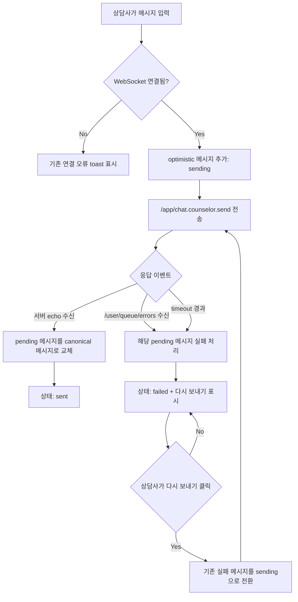

# 348: [FE] 상담사 메시지의 전송 중/실패/재전송 상태 표시

> **Issue**: [#348](https://github.com/ajou-2026-1-capstone-5/ostone/issues/348)
> **Bounded Context**: `workflow-runtime` FE
> **Template**: `_TEMPLATE_FE.md`
> **Branch**: `spec/348`
> **Canonical Number**: `348`
> **Type**: Frontend (FSD)
> **작성일**: 2026-06-01

---

## Goal

상담사 채팅 콘솔에서 optimistic 메시지의 전송 상태를 명확히 표시하고, WebSocket 에러 또는 echo timeout 시 실패 상태와 재전송 동선을 제공한다.

---

## Background

현재 상담사 메시지는 `ConsultationPage`에서 임시 메시지로 즉시 추가한 뒤 `/app/chat.counselor.send`로 STOMP 전송한다. 이후 `/topic/chat.{sessionId}` 서버 echo를 받으면 `pendingIdsRef`의 임시 메시지를 서버 메시지로 교체한다.

하지만 서버 echo가 지연되거나 오지 않는 경우, 또는 백엔드가 `/user/queue/errors`로 WebSocket 처리 오류를 보내는 경우에도 화면은 pending 메시지를 실패 상태로 전환하지 못한다. `useStomp`는 에러 큐를 내부에서 `console.error`로만 처리하기 때문에 호출부가 전송 실패를 메시지 UI에 매핑할 수 없다.

이로 인해 상담사는 방금 보낸 메시지가 실제 고객에게 전달됐는지, 아직 전송 중인지, 실패했는지 판단하기 어렵다.

---

## Scope

### In Scope

- 상담사 UI 메시지 모델에 `sending`, `sent`, `failed` 전송 상태를 추가한다.
- 상담사 또는 내부 메모 optimistic 메시지는 생성 직후 `sending` 상태로 표시한다.
- 서버 echo 수신 시 동일 pending 메시지를 서버 canonical 메시지로 교체하고 `sent` 상태로 전환한다.
- `/user/queue/errors` 수신 내용을 `useStomp` 호출부가 받을 수 있게 한다.
- active session의 pending 메시지가 WebSocket 에러 또는 echo timeout을 만나면 `failed` 상태로 전환한다.
- 실패 메시지에는 상담사가 인지할 수 있는 실패 표시와 `다시 보내기` 액션을 제공한다.
- 재전송 성공 시 기존 실패 메시지를 새 pending 흐름으로 재사용하거나 교체하여 중복 메시지가 남지 않게 한다.
- 상태별 렌더링, timeout, 에러 큐 전달, 재전송 흐름을 테스트로 검증한다.

### Issue Requirement Trace

| Issue 요구사항 | 스펙 반영 위치 |
| --- | --- |
| UI 메시지 모델에 `sending`, `sent`, `failed` 상태 추가 | Message State Model |
| optimistic 메시지는 전송 중 상태로 표시 | State Transition, Design Diff |
| 서버 echo 수신 시 전송 완료 상태 전환 | State Transition, Test Scenarios |
| `/user/queue/errors`를 `useStomp` 호출부에 전달 | WebSocket Error Handling, 수정 대상 파일 |
| WebSocket 에러 또는 timeout 시 실패 상태와 재전송 액션 표시 | Timeout Policy, Retry Policy, Acceptance Criteria |
| 실패 메시지는 실제 전송 완료 메시지와 시각적으로 구분 | Design Diff, ChatPanel Rendering |
| 재전송 성공 시 중복 메시지가 남지 않음 | Retry Policy, Test Scenarios |

### Out of Scope

- Backend WebSocket destination 변경
- `CounselorWebSocketController` 또는 `CounselorService`의 메시지 저장 정책 변경
- 서버 응답 DTO에 client correlation id를 새로 추가하는 변경
- 상담 기록 화면 또는 사용자 채팅 미리보기 화면의 전송 상태 UX 변경
- 오프라인 큐잉, 다중 재시도 자동화, 메시지 삭제 기능
- 전체 WebSocket 재연결 정책 변경

---

## Existing Context

아래 경로는 현재 repository에서 존재 확인 완료했다.

| Existing file | 현재 역할 | 변경 기준 |
| --- | --- | --- |
| `frontend/src/pages/consultation/ui/ConsultationPage.tsx` | 상담 콘솔 페이지, 메시지 조회/구독/전송 및 pending 교체 관리 | 전송 상태 state machine, timeout, error queue mapping, retry handler 추가 |
| `frontend/src/features/consultation/ui/ChatPanel.tsx` | 메시지 목록과 입력 UI 렌더링 | 메시지 상태 표시와 실패 메시지 재전송 액션 추가 |
| `frontend/src/features/consultation/ui/chat-panel.module.css` | 상담 채팅 패널 스타일 | sending/failed/sent 보조 메타와 retry button 스타일 추가 |
| `frontend/src/shared/lib/websocket/useStomp.ts` | STOMP 연결, topic subscribe, `/user/queue/errors` 내부 구독 | 에러 큐 payload를 호출부로 전달할 수 있는 option/callback 추가 |
| `frontend/src/shared/lib/websocket/useStomp.test.tsx` | STOMP hook 동작 테스트 | 에러 큐 callback 전달 및 malformed payload 무시 검증 |
| `frontend/src/features/consultation/ui/ChatPanel.test.tsx` | 채팅 패널 렌더링/입력 테스트 | 상태 라벨, 실패 표시, retry action 테스트 추가 |
| `frontend/src/pages/consultation/ui/ConsultationPage.test.tsx` | 상담 페이지 통합 동작 테스트 | echo 교체, timeout 실패, 에러 큐 실패, 재전송 중복 방지 검증 추가 |
| `backend/src/main/java/com/init/workflowruntime/presentation/CounselorWebSocketController.java` | 상담사 STOMP send handler와 `/user/queue/errors` exception handler | 기존 에러 큐 계약의 근거, 이번 범위에서는 변경하지 않음 |
| `backend/src/main/java/com/init/workflowruntime/application/CounselorService.java` | 상담사 메시지 저장 후 `/topic/chat.{sessionId}` echo 발행 | 서버 echo 수신 기준의 근거, 이번 범위에서는 변경하지 않음 |
| `backend/src/main/java/com/init/workflowruntime/application/dto/ChatMessageResponse.java` | 정상/에러 WebSocket message response DTO | 에러 frame이 `senderRole=SYSTEM`, `messageType=ERROR` 형태임을 고려 |

---

## User Flow Chart



---

## Design Diff

### As-is vs To-be

| 영역 | As-is | To-be | 변경 내용 |
| --- | --- | --- | --- |
| 메시지 모델 | `id`, `senderRole`, `content`, `timestamp` 중심 | `deliveryStatus`, `clientMessageId`, retry payload 포함 | pending/failed 상태를 UI가 직접 표현 |
| optimistic 표시 | 일반 상담사 메시지와 동일하게 즉시 표시 | 전송 중 보조 라벨 또는 spinner 표시 | 실제 전달 전 상태 명확화 |
| echo 수신 | content가 같은 pending 메시지를 서버 메시지로 교체 | pending id를 제거하고 `sent` 상태로 canonical 교체 | 완료 상태 명확화 |
| 에러 큐 처리 | `useStomp` 내부 `console.error` | 호출부 callback으로 전달 | 페이지가 메시지 실패 상태로 매핑 가능 |
| echo timeout | 임시 메시지가 계속 남을 수 있음 | 지정 시간 후 `failed` 전환 | 지연/누락 상태가 화면에 드러남 |
| 실패 표시 | 없음 | 실패 라벨, 구분 스타일, retry button 표시 | 상담사가 후속 조치 가능 |
| 재전송 | 별도 동선 없음 | 실패 메시지에서 같은 content/isNote 재전송 | 성공 시 중복 메시지 제거 |

### ChatPanel Rendering

- 상담사/내부 메모 메시지에만 delivery 상태를 표시한다.
- 고객, assistant, system 메시지는 기존 표시를 유지한다.
- `sending`은 메시지 bubble 아래 메타 영역에 `전송 중`을 표시한다.
- `sent`는 서버 echo로 확정된 상담사 메시지에 대해 기존 timestamp 표시를 유지하고, 별도 성공 장식은 최소화한다.
- `failed`는 bubble과 메타 영역에서 전송 완료 메시지와 구분되어야 하며 `전송 실패`와 `다시 보내기` 액션을 함께 제공한다.
- retry button은 키보드로 focus/click 가능해야 하며, 메시지 선택 click handler와 충돌하지 않도록 이벤트 전파를 제어한다.
- 스타일은 `frontend/DESIGN.md`의 흑백 chrome, pill/circle geometry, border+ring focus 원칙을 따른다.

---

## Component Tree

```text
ConsultationPage
├─ QueuePanel
├─ MatchedWorkflowBar
├─ ChatPanel
│  ├─ MessageList
│  │  ├─ SystemMessage
│  │  ├─ InternalNoteMessage
│  │  └─ ChatMessageBubble
│  │     ├─ MessageBubble
│  │     └─ DeliveryMeta [NEW or inline helper]
│  │        └─ RetryButton [failed only]
│  └─ MessageInput
└─ MessageDetailPanel
```

### Props Contract

`ChatPanel`은 메시지별 delivery 상태를 렌더링하고 실패 메시지의 retry를 페이지로 위임한다.

```typescript
export type MessageDeliveryStatus = "sending" | "sent" | "failed";

export interface ChatMessage {
  id: string;
  senderRole: ChatSenderRole;
  content: string;
  timestamp: string;
  deliveryStatus?: MessageDeliveryStatus;
  clientMessageId?: string;
  retryable?: boolean;
}

interface ChatPanelProps {
  messages: ChatMessage[];
  onSendMessage: (content: string, isNote: boolean) => void;
  onRetryMessage?: (messageId: string) => void;
}
```

`deliveryStatus`는 상담사 optimistic/failed 흐름에만 필요하다. 서버에서 조회한 과거 메시지와 고객 메시지는 필드를 생략하거나 `sent`로 정규화할 수 있다.

---

## Message State Model

### UI Message Fields

| Field | Type | 설명 |
| --- | --- | --- |
| `id` | `string` | React key와 선택 상태에 쓰는 UI id. pending 중에는 client-generated id 사용 |
| `clientMessageId` | `string \| undefined` | 프론트 pending 추적용 id. 서버로 전송하지 않아도 됨 |
| `senderRole` | `ChatSenderRole` | 기존 sender role |
| `content` | `string` | 메시지 본문 |
| `timestamp` | `string` | 화면 표시 시각 |
| `deliveryStatus` | `"sending" \| "sent" \| "failed" \| undefined` | 상담사 메시지 전송 상태 |
| `retryable` | `boolean \| undefined` | 실패 메시지에서 재전송 버튼 표시 여부 |
| `isNote` 또는 retry payload | `boolean` | 재전송 시 `/app/chat.counselor.send` payload 복원용 |

### Pending Registry

현재 `pendingIdsRef: Set<string>`만으로는 timeout, retry payload, timer cleanup을 관리하기 어렵다. 구현 시 아래 정보가 필요하다.

```typescript
type PendingMessage = {
  id: string;
  sessionId: string;
  content: string;
  isNote: boolean;
  timeoutId: ReturnType<typeof setTimeout>;
  createdAt: number;
};
```

구현은 `Map<string, PendingMessage>` 또는 동일 정보를 보존하는 구조를 사용한다. session 변경, 메시지 reload, unmount 시 pending timeout은 모두 정리해야 한다.

---

## State Transition

| Trigger | 대상 | 전이 |
| --- | --- | --- |
| 상담사 전송 시작 | 새 optimistic 메시지 | none -> `sending` |
| 서버 echo 수신, content와 role이 pending과 매칭 | 해당 pending 메시지 | `sending` -> `sent`, 서버 메시지로 교체 |
| `/user/queue/errors` 수신 | active session의 가장 오래된 pending 메시지 또는 구현이 매칭 가능한 pending | `sending` -> `failed` |
| echo timeout 경과 | 해당 pending 메시지 | `sending` -> `failed` |
| retry 클릭 | 해당 failed 메시지 | `failed` -> `sending` |
| retry 후 서버 echo 수신 | 해당 메시지 | `sending` -> `sent`, 중복 제거 |
| active session 변경 또는 메시지 reload | 이전 session pending | timeout cleanup, 이전 메시지 화면에서 제거 |

### Echo Matching

현재 backend echo에는 프론트가 생성한 correlation id가 없다. 이번 FE 스펙은 backend 변경을 범위 밖으로 두므로 아래 기준을 사용한다.

- pending 후보는 active session의 상담사/메모 메시지 중 `deliveryStatus="sending"`인 메시지로 제한한다.
- echo의 normalized role이 `COUNSELOR`, `AGENT`, `NOTE` 중 하나이고 content가 pending content와 같으면 가장 오래된 pending 후보를 교체한다.
- 이미 동일 서버 message id가 화면에 있으면 append하지 않는다.
- 같은 content를 연속 전송하는 경우에도 pending 생성 순서를 유지해 가장 오래된 pending부터 해소한다.

이 방식은 완전한 correlation id가 없을 때의 FE 한계다. 서버 DTO에 client id를 추가하는 개선은 별도 backend/API 스펙에서 다룬다.

---

## WebSocket Error Handling

### useStomp Contract

`useStomp`는 `/user/queue/errors` 구독 결과를 호출부에 전달할 수 있어야 한다. 기존 자동 연결 패턴을 유지하면서 option object를 받는 방식이 가장 단순하다.

```typescript
type WebSocketServerError = unknown;

interface UseStompOptions {
  onServerError?: (error: WebSocketServerError) => void;
}

export function useStomp(options?: UseStompOptions): UseStompResult;
```

처리 기준:

- error queue message body가 JSON이면 `onServerError(parsed)`를 호출한다.
- malformed JSON은 기존처럼 무시한다.
- callback이 없어도 기존 동작은 유지한다.
- callback 최신성을 위해 ref를 사용하거나 effect dependency로 안전하게 갱신한다.
- `console.error`는 개발 진단용으로 유지할 수 있지만, UI 상태 전환은 호출부 callback을 기준으로 한다.

### ConsultationPage Mapping

`ConsultationPage`는 active session에 pending 메시지가 있을 때 server error를 가장 오래된 pending 메시지 실패로 매핑한다.

에러 payload가 `ChatMessageResponse.error()` 형태라면 다음 정보를 표시 문구에 활용할 수 있다.

| Field | Example | 사용 |
| --- | --- | --- |
| `senderRole` | `SYSTEM` | error frame 식별 보조 |
| `messageType` | `ERROR` | error frame 식별 보조 |
| `content` | `[SESSION_NOT_ASSIGNED] ...` | 실패 tooltip 또는 상세 문구 후보 |

사용자에게 노출하는 기본 문구는 간결하게 `전송 실패`로 두고, 상세 사유는 toast 또는 title/aria-label에 제한적으로 사용할 수 있다.

---

## Timeout Policy

| 항목 | 기준 |
| --- | --- |
| 기본 timeout | 8초 |
| 시작 시점 | optimistic 메시지 생성 직후 |
| 성공 cleanup | 서버 echo로 pending이 해소되면 timeout clear |
| 실패 cleanup | timeout 발생 후 pending registry에서 제거하고 메시지 상태를 `failed`로 전환 |
| session 변경 cleanup | 이전 active session pending timeout clear |
| unmount cleanup | 모든 pending timeout clear |

8초는 현재 `useStomp`의 재연결 지연이 5초인 점을 고려해, 일시적 echo 지연과 실제 실패를 구분할 최소 여유를 둔 값이다. 구현 중 더 적절한 상수가 필요하면 `COUNSELOR_MESSAGE_ACK_TIMEOUT_MS` 같은 page-local 상수로 둔다.

---

## Retry Policy

실패 메시지의 `다시 보내기`는 새 메시지를 append하지 않고 기존 실패 메시지를 다시 `sending`으로 전환하는 방식으로 동작해야 한다.

재전송 절차:

1. 실패 메시지의 `content`, `isNote`, active `sessionId`를 확인한다.
2. 메시지 id를 유지하거나 새 `clientMessageId`를 부여하되, 화면에는 실패 메시지 1개만 남긴다.
3. 상태를 `sending`으로 바꾸고 retry button을 숨긴다.
4. `/app/chat.counselor.send`로 같은 payload를 보낸다.
5. 서버 echo 수신 시 기존 메시지를 canonical 서버 메시지로 교체한다.
6. retry도 timeout 또는 error queue를 만나면 다시 `failed`로 전환한다.

재전송 시점에 WebSocket이 `CONNECTED`가 아니면 기존 전송과 동일하게 toast로 안내하고 failed 상태를 유지한다.

---

## API Integration

새 HTTP API 또는 generated client 변경은 없다.

| Surface | 변경 여부 | 설명 |
| --- | --- | --- |
| HTTP API | 없음 | 기존 상담 메시지 조회/상담 세션 API 유지 |
| WebSocket send | 없음 | `/app/chat.counselor.send` 유지 |
| WebSocket echo | 없음 | `/topic/chat.{sessionId}` 유지 |
| WebSocket error queue | consume 방식 변경 | 기존 `/user/queue/errors`를 `useStomp` 호출부로 전달 |
| Generated API | 없음 | Orval generated file 수정/재생성 없음 |
| Backend DTO | 없음 | `ChatMessageResponse.error()` 형태를 FE에서 소비 |

---

## 수정 대상 파일

| 파일 | 변경 유형 | 설명 |
| --- | --- | --- |
| `frontend/src/pages/consultation/ui/ConsultationPage.tsx` | modify | pending registry, timeout, server error mapping, retry handler 추가 |
| `frontend/src/features/consultation/ui/ChatPanel.tsx` | modify | delivery 상태 렌더링과 failed retry action 추가 |
| `frontend/src/features/consultation/ui/chat-panel.module.css` | modify | sending/failed 메타, retry button, focus/disabled 스타일 추가 |
| `frontend/src/shared/lib/websocket/useStomp.ts` | modify | `/user/queue/errors` callback option 추가 |
| `frontend/src/shared/lib/websocket/useStomp.test.tsx` | modify | error queue callback, malformed payload, 기존 동작 유지 테스트 |
| `frontend/src/features/consultation/ui/ChatPanel.test.tsx` | modify | sending/failed/sent 렌더링과 retry click 테스트 |
| `frontend/src/pages/consultation/ui/ConsultationPage.test.tsx` | modify | echo 전환, timeout 실패, error queue 실패, retry 중복 방지 테스트 |

필요 시 작은 helper를 아래처럼 page slice 내부에 추가할 수 있다.

| 파일 | 변경 유형 | 설명 |
| --- | --- | --- |
| `frontend/src/pages/consultation/ui/counselorMessageDelivery.ts` | optional new | pending transition helper 또는 delivery label resolver |

---

## State Management

별도 전역 store는 추가하지 않는다. 전송 상태는 active consultation page의 local state와 ref로 충분하다.

| 상태 | 위치 | 설명 |
| --- | --- | --- |
| `messages` | `ConsultationPage` local state | 화면에 렌더링할 canonical + optimistic 메시지 |
| `pendingMessagesRef` | `ConsultationPage` ref | timeout과 retry payload를 포함한 pending registry |
| `deliveryStatus` | `UiChatMessage` field | 메시지별 표시 상태 |
| input state | `ChatPanel` local state | 기존 입력 state 유지 |

FSD 의존성 방향은 기존처럼 `pages -> features -> shared`를 유지한다. `shared/lib/websocket`는 feature/page 타입을 import하지 않는다.

---

## Tests

### Test Strategy

| 구분 | 방법 | 도구 | 비고 |
| --- | --- | --- | --- |
| Hook test | `useStomp` error queue callback 검증 | Vitest + React Testing Library `renderHook` | callback 유무, malformed JSON |
| Component test | `ChatPanel` 상태별 렌더링/재전송 액션 검증 | Vitest + React Testing Library | 접근성 이름과 click 전파 확인 |
| Page test | `ConsultationPage` pending state machine 검증 | Vitest + React Testing Library fake timers | echo, timeout, error, retry |
| 수동 테스트 | Docker Compose 또는 FE dev server에서 상담사 콘솔 확인 | 브라우저 | WebSocket 에러/timeout은 mock 또는 네트워크 차단으로 확인 |

### Test Environment & 사전 조건

| 항목 | 값 |
| --- | --- |
| 환경 | `cd frontend && pnpm test -- --run ...` |
| Timer | Vitest fake timers 사용 |
| WebSocket | `useStomp` 또는 STOMP client mock |
| 상담 세션 | 상담사가 active session에 배정된 fixture |

### Test Scenarios

#### Happy Path

| # | 시나리오 | 사전 조건 | 조작 | 기대 결과 |
| --- | --- | --- | --- | --- |
| 1 | 상담사 메시지 전송 직후 | WebSocket `CONNECTED`, active session 배정됨 | 메시지 전송 | 메시지가 `전송 중` 상태로 표시되고 send payload가 발행됨 |
| 2 | 서버 echo 수신 | pending 메시지 1개 존재 | 같은 content의 counselor echo 수신 | pending 메시지가 서버 id/timestamp 메시지로 교체되고 실패 표시가 없음 |
| 3 | 내부 메모 전송 완료 | NOTE pending 메시지 존재 | 같은 content의 NOTE echo 수신 | 내부 메모도 동일하게 `sent`로 확정됨 |
| 4 | 실패 메시지 재전송 성공 | failed 메시지 1개 존재 | `다시 보내기` 클릭 후 echo 수신 | 메시지 1개만 남고 canonical 서버 메시지로 교체됨 |

#### Error & Edge Cases

| # | 시나리오 | 조작 | 기대 결과 |
| --- | --- | --- | --- |
| 1 | WebSocket error queue 수신 | `/user/queue/errors` JSON frame 수신 | active session의 pending 메시지가 `failed`로 전환되고 retry action 표시 |
| 2 | malformed error queue frame | invalid JSON 수신 | 예외 없이 무시하고 기존 pending 상태 유지 |
| 3 | echo timeout | pending 생성 후 8초 경과 | 해당 메시지가 `failed`로 전환되고 timeout이 정리됨 |
| 4 | 같은 content 연속 전송 | 동일 content pending 2개 생성 후 echo 1개 수신 | 가장 오래된 pending 1개만 sent로 전환되고 나머지는 pending 유지 |
| 5 | retry 중 연결 끊김 | failed 메시지에서 retry 클릭, `connectionStatus !== CONNECTED` | 기존 toast 안내, failed 상태 유지, 새 메시지 append 없음 |
| 6 | session 변경 | pending이 있는 상태에서 active session 변경 | 이전 pending timeout 정리, 이전 session 메시지가 새 session 화면에 남지 않음 |
| 7 | 실패 메시지 선택 | failed 메시지 bubble 클릭 | 기존 메시지 선택 동작 유지 |
| 8 | retry button click | retry button 클릭 | message selection toggle이 같이 발생하지 않음 |

---

## Acceptance Criteria

- 메시지 전송 직후 상담사가 `전송 중` 상태를 볼 수 있다.
- 서버 echo가 오면 해당 optimistic 메시지가 canonical 서버 메시지로 교체되고 완료 상태가 된다.
- `/user/queue/errors` 수신 또는 8초 timeout 시 pending 메시지는 `전송 실패` 상태로 전환된다.
- 실패 메시지는 전송 완료 메시지와 시각적으로 구분된다.
- 실패 메시지에는 키보드 접근 가능한 `다시 보내기` 액션이 있다.
- 재전송 성공 시 같은 내용의 실패/전송 완료 메시지가 중복으로 남지 않는다.
- `useStomp`에 error callback을 넘기지 않는 기존 호출부는 기존 동작을 유지한다.
- active session 변경과 component unmount 시 pending timeout이 정리된다.
- FSD 의존성 방향(`pages -> features -> shared`)을 위반하지 않는다.

---

## Validation Plan

구현 PR에서 아래 검증을 수행한다.

```bash
cd frontend && pnpm test -- --run src/shared/lib/websocket/useStomp.test.tsx src/features/consultation/ui/ChatPanel.test.tsx src/pages/consultation/ui/ConsultationPage.test.tsx
cd frontend && pnpm exec eslint src/shared/lib/websocket/useStomp.ts src/features/consultation/ui/ChatPanel.tsx src/pages/consultation/ui/ConsultationPage.tsx
git diff --check
```

문서 PR 단계에서는 제품 코드 변경이 없으므로 `git diff --check`로 스펙 문서의 whitespace만 확인한다.

---

## Open Questions

- Backend가 향후 `clientMessageId`를 echo에 포함하도록 확장할지 여부. 이번 스펙은 backend 변경 없이 content + pending order 매칭을 사용한다.
- `/user/queue/errors` frame이 여러 pending 메시지 중 특정 메시지를 가리킬 수 있는 correlation 정보를 제공할지 여부. 현재 확인 가능한 DTO에는 session/message correlation field가 없다.
- timeout 8초가 실제 운영 네트워크에서 충분한지 여부. 구현 후 수동 테스트에서 조정 가능성을 확인한다.

---

## Self-Review Notes

### Pass 1: Issue Fidelity

- 이슈의 명시 요구사항인 `sending/sent/failed`, optimistic 전송 중 표시, echo 완료 전환, error queue 전달, timeout 실패, retry action, 실패 시각 구분, 재전송 중복 방지를 모두 Scope와 Acceptance Criteria에 매핑했다.
- 이슈에 없는 backend DTO 확장과 WebSocket destination 변경은 Out of Scope로 분리했다.
- error queue에 correlation id가 없다는 불확실성은 Open Questions와 Echo Matching 한계로 명시했다.

### Pass 2: Repository Compliance

- FE 중심 이슈이므로 `_TEMPLATE_FE.md` 형식을 사용했다.
- 스펙 파일명은 `.agent/specs/348.md`, 브랜치는 `spec/348`로 지정했다.
- 참조한 repository 경로는 작성 전에 존재를 확인했다.
- FSD 의존성 방향은 `pages -> features -> shared`로 유지하도록 명시했다.
- 제품 코드 구현 대신 요구사항/구조/검증 기준을 남기는 스펙 PR 범위에 맞췄다.
