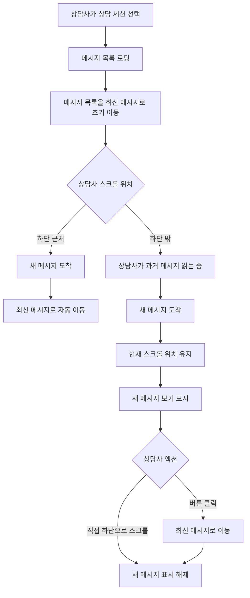

# 349: [FE] 상담 메시지 목록의 자동 스크롤 동작 개선

> **Issue**: [#349](https://github.com/ajou-2026-1-capstone-5/ostone/issues/349)
> **Bounded Context**: `workflow-runtime` FE
> **Template**: `_TEMPLATE_FE.md`
> **Branch**: `spec/349`
> **Canonical Number**: `349`
> **Type**: Frontend (FSD)
> **작성일**: 2026-06-01

---

## Goal

상담사가 과거 상담 맥락을 읽는 중에는 메시지 목록의 현재 스크롤 위치를 유지하고, 최신 대화를 보고 있을 때만 새 메시지로 자연스럽게 따라가도록 `ChatPanel`의 자동 스크롤 동작을 개선한다.

---

## Background

상담사는 최신 답변만 보는 것이 아니라 이전 고객 발화, AI 응답, 내부 메모, 시스템 안내를 함께 확인하면서 응대한다. 현재 `ChatPanel`은 `messages`가 바뀔 때마다 메시지 목록을 항상 하단으로 이동시키므로, 상담사가 과거 메시지를 읽는 도중 고객 또는 AI 메시지가 추가되면 읽던 위치가 사라질 수 있다.

새 메시지 도착 사실을 알리는 UI와 현재 스크롤 위치 유지는 분리되어야 한다. 하단 근처에서 대화 중인 상담사는 기존처럼 최신 메시지를 즉시 볼 수 있어야 하지만, 위쪽 맥락을 검토 중인 상담사는 새 메시지 도착 여부만 확인하고 원하는 시점에 최신 메시지로 이동할 수 있어야 한다.

---

## Scope

### In Scope

- `ChatPanel` 메시지 목록의 자동 스크롤 조건을 하단 근처 여부 기반으로 변경한다.
- 상담사가 메시지 목록의 하단 근처에 있을 때는 새 메시지 추가 시 기존처럼 최신 메시지로 이동한다.
- 상담사가 하단에서 벗어나 과거 메시지를 보고 있을 때는 새 메시지가 추가되어도 현재 스크롤 위치를 유지한다.
- 하단 밖에서 새 메시지가 도착하면 `새 메시지 보기` 버튼 또는 배지를 메시지 목록 안쪽 하단에 표시한다.
- `새 메시지 보기`를 클릭하면 메시지 목록이 최신 메시지로 이동하고 새 메시지 표시가 사라진다.
- 세션 전환 또는 초기 메시지 로딩 시에는 기존처럼 최신 메시지로 초기 이동한다.
- 스크롤 유지, 자동 추적, 새 메시지 표시, 버튼 클릭 동작을 컴포넌트 테스트로 검증한다.

### Issue Requirement Trace

| Issue 요구사항 | 스펙 반영 위치 |
| --- | --- |
| 스크롤이 하단 근처에 있을 때만 자동 스크롤 | Scope, Scroll Behavior Contract, Test Scenarios |
| 상담사가 위쪽을 보고 있으면 현재 스크롤 위치 유지 | Scope, User Flow Chart, Acceptance Criteria |
| 하단 밖에서 새 메시지가 도착하면 `새 메시지 보기` 버튼 또는 배지 표시 | Scope, Design Diff, Component Tree |
| 버튼 클릭 시 최신 메시지로 이동 | Scope, Interaction Details, Test Scenarios |
| 세션 전환 시 최신 메시지로 초기 이동 | Scope, Scroll Behavior Contract, Test Scenarios |

### Out of Scope

- Backend 상담 메시지 API, WebSocket destination, STOMP payload 변경
- 메시지 정렬 기준, 중복 메시지 제거, optimistic message 매칭 정책 변경
- 상담 세션 배정, 종료, 메모 저장 권한 정책 변경
- `QueuePanel`, `MessageDetailPanel`, `CustomerPanel`의 레이아웃 또는 상태 정책 변경
- 가상 스크롤 도입 또는 대용량 메시지 페이지네이션 정책 변경

---

## Existing Context

아래 경로는 현재 repository에서 존재 확인 완료했다.

| Existing file | 현재 역할 | 변경 기준 |
| --- | --- | --- |
| `frontend/src/features/consultation/ui/ChatPanel.tsx` | 상담 메시지 목록, 메시지 선택, 입력/전송 UI 렌더링 | 자동 스크롤 조건, 새 메시지 표시, 최신 이동 동작 추가 |
| `frontend/src/features/consultation/ui/chat-panel.module.css` | `ChatPanel` 레이아웃과 메시지/입력 스타일 | 새 메시지 버튼/배지 위치, focus, 반응형 스타일 추가 |
| `frontend/src/features/consultation/ui/ChatPanel.test.tsx` | `ChatPanel` 컴포넌트 동작 테스트 | 스크롤 동작과 새 메시지 표시 테스트 추가 |
| `frontend/src/pages/consultation/ui/ConsultationPage.tsx` | 상담 페이지, 세션 선택, 메시지 로딩/구독, `ChatPanel` 조합 | 세션 전환 기준으로 사용할 안정적인 식별자 전달이 필요한 경우 props 확장 |

---

## User Flow Chart



---

## Design Diff

### As-is vs To-be

| 영역 | As-is | To-be | 변경 내용 |
| --- | --- | --- | --- |
| 메시지 변경 반응 | `messages` 변경마다 `scrollTop = scrollHeight` 실행 | 하단 근처일 때만 자동 이동 | 과거 메시지 읽기 흐름 보존 |
| 하단 밖 새 메시지 | 새 메시지 도착과 위치 유지가 구분되지 않음 | 현재 위치 유지 + `새 메시지 보기` 표시 | 새 메시지 인지와 맥락 확인 분리 |
| 수동 최신 이동 | 별도 액션 없음 | 버튼/배지 클릭 시 최신 메시지 이동 | 상담사가 원하는 시점에 이동 |
| 세션 전환 | 메시지 로딩 후 하단 이동 | 세션 전환/초기 로딩에서는 하단 이동 유지 | 새 상담 진입 시 최신 대화 우선 표시 |

### 표시 원칙

- `새 메시지 보기` 컨트롤은 메시지 목록 하단에 고정되어 입력 영역을 가리지 않아야 한다.
- 버튼 또는 배지는 기존 `frontend/DESIGN.md`의 pill/circle 계열 인터랙션, focus ring, 흑백 중심 UI를 따른다.
- 컨트롤은 키보드로 focus 가능해야 하며 Enter/Space 또는 기본 button 동작으로 최신 메시지 이동이 가능해야 한다.
- 새 메시지 표시 문구는 짧게 유지한다. 예: `새 메시지 보기`
- 새 메시지 표시는 하단 근처로 돌아오거나 버튼을 눌러 최신 메시지로 이동하면 사라진다.

---

## Scroll Behavior Contract

### 하단 근처 판정

구현은 메시지 목록 요소의 `scrollHeight`, `scrollTop`, `clientHeight`를 기준으로 하단까지 남은 거리를 계산한다.

```typescript
const distanceFromBottom = scrollHeight - scrollTop - clientHeight;
const isNearBottom = distanceFromBottom <= thresholdPx;
```

- `thresholdPx`는 상담사가 거의 하단에 있는 상태를 자연스럽게 따라가도록 80-120px 범위의 상수로 둔다.
- threshold는 컴포넌트 내부 상수로 충분하며 별도 전역 설정이나 store를 추가하지 않는다.

### 메시지 변경 처리

| 조건 | 기대 동작 |
| --- | --- |
| 세션 전환 또는 초기 메시지 로딩 | 최신 메시지로 즉시 이동 |
| 이전 렌더 시점에 하단 근처였고 새 메시지 추가 | 최신 메시지로 자동 이동 |
| 이전 렌더 시점에 하단 밖이었고 새 메시지 추가 | 기존 `scrollTop` 유지, `새 메시지 보기` 표시 |
| 메시지 개수가 줄거나 세션이 비워짐 | 새 메시지 표시 초기화 |
| 사용자가 직접 하단 근처로 스크롤 | 새 메시지 표시 초기화 |
| `새 메시지 보기` 클릭 | 최신 메시지로 이동, 새 메시지 표시 초기화 |

### 세션 전환 기준

현재 `ChatPanel`은 `messages`만 props로 받는다. 세션 전환을 안정적으로 구분하기 위해 필요하면 `ConsultationPage`에서 active session id를 내려주는 prop을 추가한다.

```typescript
interface ChatPanelProps {
  sessionId?: string | null;
  messages: ChatMessage[];
  // existing props 유지
}
```

`sessionId`가 추가될 경우 `ConsultationPage`는 `activeCustomerId`를 전달한다. 이 prop은 스크롤 초기화 판정에만 사용하며 메시지 렌더링이나 권한 정책을 바꾸지 않는다.

---

## Component Tree

```text
ConsultationPage
└─ ChatPanel
   ├─ ChatHeader
   ├─ MessageListContainer
   │  ├─ MessageList
   │  │  ├─ SystemMessage
   │  │  ├─ InternalNote
   │  │  └─ MessageGroup
   │  └─ NewMessageJumpButton [NEW]
   └─ MessageComposer
      ├─ NoteToggleButton
      ├─ MessageTextarea
      └─ SendButton
```

---

## State Management

### Client State

별도 전역 store는 추가하지 않는다. `ChatPanel` 내부 local state와 ref로 충분하다.

| 상태/참조 | 목적 |
| --- | --- |
| `listRef` | 기존 메시지 목록 DOM 참조 유지 |
| `isAtBottomRef` 또는 `wasNearBottomRef` | 메시지 변경 직전 사용자가 하단 근처였는지 추적 |
| `showNewMessageNotice` | 하단 밖 새 메시지 도착 표시 여부 |
| `previousSessionIdRef` | 세션 전환 여부 판정 |
| `previousMessageCountRef` | 메시지 추가/감소/초기 로딩 구분 |

### Derived UI State

- `showNewMessageNotice`는 하단 밖에서 메시지 개수가 증가했을 때만 `true`가 된다.
- 하단 근처 스크롤 이벤트 또는 최신 이동 버튼 클릭 시 `false`가 된다.
- 세션 전환, 고객 미선택, 메시지 목록 초기화 시에도 `false`로 초기화한다.

---

## API Integration

새 API 또는 generated client 변경은 없다.

| Surface | 변경 여부 | 설명 |
| --- | --- | --- |
| HTTP API | 없음 | 기존 상담 메시지 조회 API 유지 |
| WebSocket destination | 없음 | 기존 `/topic/chat.{activeCustomerId}` 구독 유지 |
| Generated API | 없음 | Orval generated file 수정/재생성 없음 |
| Backend contract | 없음 | message payload, session status 변경 없음 |

---

## 수정 대상 파일

| 파일 | 변경 유형 | 설명 |
| --- | --- | --- |
| `frontend/src/features/consultation/ui/ChatPanel.tsx` | modify | 하단 근처 판정, 세션 전환 초기 스크롤, 새 메시지 보기 상태와 클릭 동작 추가 |
| `frontend/src/features/consultation/ui/chat-panel.module.css` | modify | 새 메시지 보기 버튼/배지 스타일, 메시지 목록 내 고정 위치, focus/반응형 스타일 추가 |
| `frontend/src/features/consultation/ui/ChatPanel.test.tsx` | modify | 자동 스크롤 조건, 위치 유지, 배지 표시, 클릭 이동 테스트 추가 |
| `frontend/src/pages/consultation/ui/ConsultationPage.tsx` | optional modify | `ChatPanel`에 `sessionId` 전달이 필요할 경우 `activeCustomerId` prop 연결 |

---

## Interaction Details

### New Message Jump Button

- 표시 조건: 상담사가 하단 밖에 있는 동안 메시지 개수가 증가한 경우
- 기본 문구: `새 메시지 보기`
- 동작: 클릭 시 `listRef.current.scrollTo({ top: scrollHeight, behavior: "smooth" })` 또는 동등한 최신 이동 수행
- 접근성: 실제 `<button>` 요소 사용, 명확한 accessible name 제공
- 포커스: 기존 focus ring 변수를 사용해 키보드 사용자가 위치를 확인할 수 있어야 한다.

### Scroll Event Handling

- 메시지 목록에 `onScroll` 핸들러를 추가해 하단 근처 여부를 갱신한다.
- 사용자가 직접 하단 근처로 내려오면 새 메시지 표시를 숨긴다.
- 이벤트 핸들러는 DOM 값을 읽는 정도로 유지하고, 새 추상화나 throttling은 실제 성능 문제가 확인될 때만 도입한다.

---

## Tests

### Test Strategy

| 구분 | 방법 | 도구 | 비고 |
| --- | --- | --- | --- |
| 컴포넌트 테스트 | DOM scroll property mock + React Testing Library | Vitest | `ChatPanel.test.tsx`에 추가 |
| 수동 확인 | 상담 페이지에서 긴 메시지 목록으로 스크롤 동작 확인 | 브라우저 | 세션 전환/하단 근처/과거 메시지 확인 |
| 회귀 확인 | 기존 메시지 전송, 메모 모드, 메시지 선택 테스트 유지 | Vitest | 기존 테스트 의도 유지 |

### Test Environment & 사전 조건

| 항목 | 값 |
| --- | --- |
| 환경 | `cd frontend && pnpm test` |
| 대상 | `frontend/src/features/consultation/ui/ChatPanel.test.tsx` |
| 사전 조건 | 스크롤 가능한 메시지 목록을 만들 수 있도록 DOM scroll metric을 테스트에서 제어 |

### Test Scenarios

#### Happy Path

| # | 시나리오 | 사전 조건 | 조작 | 기대 결과 |
| --- | --- | --- | --- | --- |
| 1 | 세션 초기 로딩 시 최신 메시지 표시 | 고객 선택, 메시지 여러 개 로딩 | `ChatPanel` 렌더 | 메시지 목록이 하단으로 이동 |
| 2 | 하단 근처에서 새 메시지 도착 | `distanceFromBottom <= thresholdPx` | messages prop에 새 메시지 추가 | 최신 메시지로 자동 이동, 새 메시지 표시 없음 |
| 3 | 과거 메시지를 읽는 중 새 메시지 도착 | `distanceFromBottom > thresholdPx` | messages prop에 새 메시지 추가 | 기존 scrollTop 유지, `새 메시지 보기` 표시 |
| 4 | 새 메시지 보기 클릭 | 새 메시지 표시가 보임 | 버튼 클릭 | 최신 메시지로 이동, 표시 사라짐 |
| 5 | 직접 하단으로 스크롤 | 새 메시지 표시가 보임 | 메시지 목록을 하단 근처로 스크롤 | 표시 사라짐 |
| 6 | 세션 전환 | A 세션에서 위쪽 스크롤 중 | B 세션 선택 | B 세션 메시지 목록은 최신 메시지로 초기 이동 |

#### Error & Edge Cases

| # | 시나리오 | 조작 | 기대 결과 |
| --- | --- | --- | --- |
| 1 | 고객 미선택 상태 | `customerName=null` 렌더 | 빈 상태 유지, 새 메시지 표시 없음 |
| 2 | 메시지 목록 비어 있음 | `messages=[]` 렌더 | 스크롤 오류 없이 입력 영역 유지 |
| 3 | 메시지 개수 감소 | 세션 전환 또는 reload로 messages 감소 | 새 메시지 표시 초기화 |
| 4 | disabled 상태 | 상담 배정 권한 없음 | 입력 disabled 유지, 스크롤/새 메시지 표시 정책은 깨지지 않음 |

#### 반응형 & 접근성

| # | 확인 항목 | 기대 결과 |
| --- | --- | --- |
| 1 | 모바일 폭에서 버튼 표시 | 입력 영역과 메시지 텍스트를 가리지 않고 터치 가능한 크기 유지 |
| 2 | 키보드 탐색 | `새 메시지 보기` 버튼에 Tab focus 가능, Enter/Space로 이동 |
| 3 | 포커스 표시 | dotted/dashed outline 없이 기존 focus ring으로 위치 확인 가능 |
| 4 | 스크린 리더 | 버튼 accessible name이 `새 메시지 보기`로 읽힘 |

---

## Acceptance Criteria

- 상담사가 과거 메시지를 읽는 중 새 메시지가 도착해도 메시지 목록의 스크롤 위치가 하단으로 튀지 않는다.
- 상담사가 하단 근처에서 대화 중이면 새 메시지 도착 시 최신 메시지로 자연스럽게 따라간다.
- 하단 밖에서 새 메시지가 도착하면 화면에 `새 메시지 보기` 버튼 또는 배지가 표시된다.
- `새 메시지 보기`를 클릭하면 최신 메시지로 이동하고 표시가 사라진다.
- 상담 세션을 전환하면 새 세션의 메시지 목록은 최신 메시지 기준으로 초기 표시된다.
- 기존 메시지 전송, 내부 메모 모드, 메시지 선택/해제, disabled 동작은 회귀하지 않는다.

---

## Performance Considerations

- 스크롤 이벤트에서는 DOM metric 계산과 간단한 state/ref 갱신만 수행한다.
- 메시지 목록 크기가 커지는 문제는 이 이슈의 범위가 아니며, 가상 스크롤이나 pagination은 별도 이슈에서 다룬다.
- 부드러운 스크롤이 테스트 안정성을 해치면 테스트에서는 `scrollTo` 호출 여부와 상태 변화를 중심으로 검증한다.

---

## Open Questions

- 없음. 이슈의 제안과 확인 기준만으로 스펙 작성이 가능하다.
