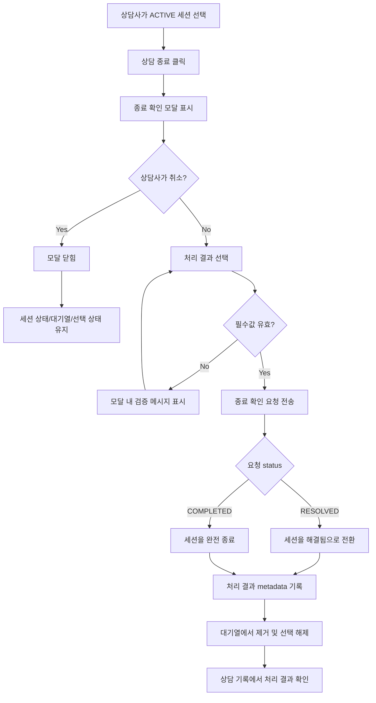

# 350: [FE/BE] 상담 종료 전 확인과 처리 결과 기록 제공

> **Issue**: [#350](https://github.com/ajou-2026-1-capstone-5/ostone/issues/350)
> **Bounded Context**: `workflow-runtime` FE/BE
> **Template**: `_TEMPLATE_FE.md` 기반, Backend 계약 섹션 포함
> **Branch**: `spec/350`
> **Canonical Number**: `350`
> **Type**: Mixed (Frontend FSD + Backend DDD)
> **작성일**: 2026-06-01

---

## Goal

상담사가 상담 종료를 누를 때 즉시 세션이 `COMPLETED`로 바뀌지 않도록 확인 절차를 제공하고, 종료 처리 결과와 후속 조치 여부를 상담 기록에 남긴다.

---

## Background

상담 종료는 세션을 대기열에서 제거하고 기록 상태를 확정하는 액션이다. 현재 상담 화면은 `상담 종료` 버튼 클릭 직후 `consultationApi.updateStatus(sessionId, "COMPLETED")`를 호출하고, 성공하면 화면에서 세션을 제거한다. 이 흐름에는 확인 모달, 취소 기회, 처리 결과 선택, 후속 연락 필요 여부 기록이 없다.

Backend 도메인에는 `ChatSessionStatus.OPEN | ACTIVE | RESOLVED | COMPLETED`, `ChatSession.resolve()`, `ChatSession.closeSession()`, `ChatSession.reopen()` 흐름이 존재한다. 하지만 현재 UI는 종료 시 `COMPLETED`만 사용하므로 `RESOLVED`와 `COMPLETED`의 의미 차이가 상담사 경험에 반영되지 않는다.

---

## Scope

### In Scope

- 상담 화면에서 `상담 종료` 버튼 클릭 시 즉시 상태 변경을 수행하지 않고 확인 모달을 연다.
- 모달에서 처리 결과를 필수로 선택하게 한다.
- 처리 결과 선택지는 최소 `해결됨`, `고객 이탈`, `보류`, `후속 연락 필요`를 포함한다.
- 상담사는 선택적으로 종료 사유 또는 내부 메모를 입력할 수 있다.
- 후속 연락 필요 여부는 별도 boolean 또는 처리 결과 파생값으로 기록되어 상담 기록에서 확인 가능해야 한다.
- `RESOLVED`와 `COMPLETED`를 UI에서 구분해 사용할 수 있도록 상태 전환 규칙을 명시한다.
- 종료 취소 시 세션 상태, 대기열, 선택된 상담, 메시지 목록이 변경되지 않는다.
- 종료 확인 버튼과 취소 버튼의 시각적 우선순위를 명확히 하여 실수 종료를 줄인다.
- 상담 기록 화면 또는 세션 상세에서 종료 처리 결과를 확인할 수 있게 한다.
- Backend는 상태 전환과 종료 메타데이터 기록을 하나의 원자적 유스케이스로 처리한다.

### Issue Requirement Trace

| Issue 요구사항 | 스펙 반영 위치 |
| --- | --- |
| 상담 종료 전 확인 모달 제공 | User Flow Chart, Component Tree, Acceptance Criteria |
| 처리 결과 선택 | Resolution Outcome Model, End Session Modal |
| `RESOLVED`와 `COMPLETED` 상태 전환 구분 | Status Transition Policy, Backend Contract |
| 종료 사유 또는 처리 결과 기록 | Resolution Metadata, API Integration |
| primary/danger 버튼 배치 명확화 | End Session Modal, Design Diff |
| 클릭만으로 즉시 종료되지 않음 | Acceptance Criteria, Test Scenarios |
| 종료 후 기록에서 처리 결과 확인 | Chat History Surface, Test Scenarios |
| 종료 취소 시 상태/대기열 불변 | User Flow Chart, Test Scenarios |

### Out of Scope

- 상담 도메인의 새로운 장기 상태 enum 추가
- 상담 기록 검색/필터의 전체 재설계
- 고객에게 전송되는 자동 종료 메시지 생성
- 알림, SMS, 이메일 등 실제 후속 연락 발송 기능
- ML pipeline 또는 Domain Pack 생성 흐름 변경
- 기존 상담 메모 저장 방식의 전면 교체

---

## Existing Context

아래 경로는 현재 repository에서 존재 확인 완료했다.

| Existing file | 현재 역할 | 변경 기준 |
| --- | --- | --- |
| `frontend/DESIGN.md` | 프론트 디자인 가이드 | 모달, 버튼, focus 상태는 이 가이드를 우선 적용 |
| `frontend/src/pages/consultation/ui/ConsultationPage.tsx` | 상담 화면, 대기열/메시지/종료 액션 조합 | 즉시 종료 대신 모달 상태와 submit 흐름 추가 |
| `frontend/src/features/consultation/api/consultationApi.ts` | 상담 API wrapper | generated endpoint 우선 사용, 미생성 endpoint만 `customFetch` 허용 |
| `frontend/src/pages/consultation/ui/ConsultationPage.generated-api.test.tsx` | 상담 화면 generated API 연동 테스트 | 즉시 `COMPLETED` 호출 테스트를 모달 확인 흐름으로 갱신 |
| `frontend/src/pages/consultation/ui/chat-history/ChatHistoryPage.tsx` | 상담 기록 화면 | 종료 처리 결과 표시 위치 후보 |
| `frontend/src/features/consultation/ui/chat-history/SessionCard.tsx` | 상담 기록 목록 카드 | 처리 결과 요약 표시 후보 |
| `backend/src/main/java/com/init/workflowruntime/domain/ChatSession.java` | 상담 세션 Aggregate | 상태 전환과 종료 메타데이터 기록 도메인 메서드 기준 |
| `backend/src/main/java/com/init/workflowruntime/domain/ChatSessionStatus.java` | 상담 세션 상태 enum | `RESOLVED`, `COMPLETED` 의미 구분 유지 |
| `backend/src/main/java/com/init/workflowruntime/application/ConsultationService.java` | 상담 메시지/상태 변경 유스케이스 | 상태 변경과 결과 기록을 같은 트랜잭션으로 처리 |
| `backend/src/main/java/com/init/workflowruntime/application/ChatSessionMetadataService.java` | `metaJson` 갱신 유틸리티 | 종료 처리 결과를 기존 metadata와 병합하는 위치 후보 |
| `backend/src/main/java/com/init/workflowruntime/application/dto/UpdateStatusRequest.java` | 상태 변경 요청 DTO | 처리 결과/사유/후속 연락 필드 확장 후보 |
| `backend/src/main/java/com/init/workflowruntime/application/dto/ChatSessionResponse.java` | 상담 세션 응답 DTO | 처리 결과 확인을 위해 `metaJson` 유지 또는 명시 필드 추가 |
| `backend/src/main/java/com/init/workflowruntime/presentation/ConsultationController.java` | 상담 세션 상태 변경 REST controller | Controller는 DTO 검증과 service 위임만 담당 |

---

## User Flow Chart



---

## Design Diff

### As-is vs To-be

| 영역 | As-is | To-be | 변경 내용 |
| --- | --- | --- | --- |
| 종료 버튼 | 클릭 즉시 `COMPLETED` 요청 | 클릭 시 확인 모달 표시 | 실수 종료 방지 |
| 처리 결과 | 기록 없음 | 결과 선택 필수 | 후속 관리 품질 개선 |
| 종료 사유 | 기록 없음 | 선택 입력 | 기록 맥락 보강 |
| 상태 전환 | UI는 `COMPLETED`만 사용 | 결과에 따라 `RESOLVED` 또는 `COMPLETED` 사용 | 도메인 상태 의미 반영 |
| 취소 | 취소 기회 없음 | 취소 시 아무 상태도 변경하지 않음 | 대기열/세션 불변 보장 |
| 기록 확인 | 종료 여부만 확인 가능 | 처리 결과, 사유, 후속 연락 여부 표시 | 상담 기록 품질 개선 |
| 버튼 위계 | 단일 danger action | 취소는 secondary, 최종 확인은 danger | 위험 액션 명확화 |

---

## Resolution Outcome Model

### 처리 결과

| Key | Label | 기본 요청 status | followUpRequired | 설명 |
| --- | --- | --- | --- | --- |
| `RESOLVED` | 해결됨 | `RESOLVED` | `false` | 상담사가 문제 해결을 확인했지만 기록상 해결 상태로 남김 |
| `CUSTOMER_LEFT` | 고객 이탈 | `COMPLETED` | `false` | 고객 이탈로 더 이상 상담을 진행하지 않음 |
| `PENDING` | 보류 | `RESOLVED` | `true` | 상담은 현재 대기열에서 제거하되 추후 확인이 필요함 |
| `FOLLOW_UP_REQUIRED` | 후속 연락 필요 | `RESOLVED` | `true` | 후속 연락이 필요한 해결/종결 후보 상태 |

### Status Transition Policy

- 모달 submit 시 API 요청에는 목표 세션 상태인 `status`와 `resolutionOutcome`을 함께 전달한다.
- `status=RESOLVED`는 `ACTIVE -> RESOLVED` 전환을 사용한다.
- `status=COMPLETED`는 `ACTIVE` 또는 `RESOLVED`에서 완전 종료할 수 있어야 한다.
- `RESOLVED` 세션은 상담 기록에서 `해결됨` 상태와 처리 결과를 확인할 수 있어야 한다.
- `COMPLETED` 세션은 상담 기록에서 `상담 종료` 상태와 처리 결과를 확인할 수 있어야 한다.
- `OPEN`으로 되돌리는 기존 `reopen()` 의미는 유지하되, 이 스펙의 모달 submit에서는 사용하지 않는다.

`PENDING`과 `FOLLOW_UP_REQUIRED`를 `RESOLVED`로 매핑하는 이유는 현재 enum에 별도 보류 상태가 없고, 새 enum 추가는 이슈 범위를 넘어가기 때문이다. 향후 보류 전용 대기열이 필요하면 별도 이슈에서 상태 모델을 확장한다.

### Resolution Metadata

현재 확인된 저장 surface인 `ChatSession.metaJson`에는 최소 아래 정보를 보존한다.

```json
{
  "resolution": {
    "outcome": "FOLLOW_UP_REQUIRED",
    "label": "후속 연락 필요",
    "status": "RESOLVED",
    "reason": "배송사 확인 후 안내 예정",
    "followUpRequired": true,
    "resolvedBy": 7,
    "resolvedAt": "2026-06-01T12:34:56+09:00"
  }
}
```

- 기존 `customerName`, `handoffReason`, `title`, `messageCount`, `lastMessagePreview` 등 metadata는 덮어쓰지 않고 병합한다.
- `reason`은 선택 입력이지만, 입력된 경우 앞뒤 공백을 제거해 저장한다.
- `resolvedBy`는 인증된 상담사 ID 또는 현재 service 계층에서 검증 가능한 user ID를 사용한다. 기존 API 계약상 user ID를 받을 수 없는 경우 구현 PR에서 controller 인증 컨텍스트 연결 방식을 함께 확정한다.

---

## End Session Modal

### Component Tree

```text
ConsultationPage
├─ QueuePanel
├─ ConversationHeader
│  ├─ ReleaseAssignmentButton
│  └─ EndSessionButton
├─ EndSessionConfirmModal [NEW]
│  ├─ OutcomeSegmentedControl
│  ├─ FollowUpIndicator
│  ├─ ResolutionReasonTextarea
│  └─ ModalActions
├─ ChatPanel
└─ CustomerPanel
```

### UI Rules

- 모달 제목은 선택된 고객명 또는 세션 ID를 포함해 어떤 상담을 종료하는지 식별 가능해야 한다.
- 처리 결과는 버튼형 segmented control 또는 radio group으로 제공한다.
- 처리 결과를 선택하지 않은 상태에서는 최종 확인 버튼을 disabled 하거나 submit 시 모달 안에 검증 메시지를 표시한다.
- 취소 버튼은 좌측 또는 secondary 위치에 두고, 최종 확인 버튼은 danger 스타일로 우측에 둔다.
- 모달 바깥 클릭이나 `Esc` 닫기는 취소와 동일하게 상태 변경을 수행하지 않는다.
- submit 중에는 모달 내 입력과 최종 확인 버튼을 비활성화하고 중복 요청을 막는다.
- API 실패 시 모달을 닫지 않고 toast/error text로 실패를 알린다.
- 버튼, focus ring, radius, typography는 `frontend/DESIGN.md`를 따른다.

---

## Backend Contract

### REST API

기존 endpoint를 확장하는 방식을 우선한다.

| Method | Path | Description |
| --- | --- | --- |
| `PATCH` | `/api/v1/consultation/sessions/{sessionId}/status` | 상태 전환과 종료 처리 결과 기록 |

### Request

```json
{
  "status": "RESOLVED",
  "resolutionOutcome": "FOLLOW_UP_REQUIRED",
  "resolutionReason": "배송사 확인 후 안내 예정",
  "followUpRequired": true
}
```

### Response

기존 `ChatSessionResponse`를 유지하되, 처리 결과 확인을 위해 아래 둘 중 하나를 만족해야 한다.

1. `metaJson`에 `resolution` object가 포함된다.
2. `ChatSessionResponse`에 명시적인 resolution summary field가 추가된다.

초기 구현은 generated API 변경 범위를 줄이기 위해 `metaJson` 포함 방식을 우선하되, UI 표시 로직이 복잡해지면 명시 DTO를 선택한다.

### Service Rules

- `ConsultationController`는 request validation과 `ConsultationService` 호출만 담당한다.
- `ConsultationService`는 세션 조회, 상태 전환, metadata 병합, queue event 발행을 하나의 `@Transactional` 쓰기 유스케이스로 처리한다.
- `ChatSession`은 public setter 없이 의미 있는 도메인 메서드로 상태를 바꾼다.
- unsupported `status` 또는 `resolutionOutcome`은 `BadRequestException`으로 반환한다.
- 존재하지 않는 세션은 기존처럼 `NotFoundException`으로 반환한다.
- 상태 전환이 도메인 규칙에 맞지 않으면 구체적 예외를 사용하고, 빈 catch나 일반 `Exception` catch를 추가하지 않는다.

---

## API Integration

### Frontend API

`frontend/src/features/consultation/api/consultationApi.ts`는 generated `updateStatus` endpoint function을 기본으로 사용한다. Backend OpenAPI가 새 request schema를 반영하면 `frontend/src/shared/api/generated/`를 직접 수정하지 않고 `pnpm api:gen`으로 재생성한다.

```typescript
interface ResolveSessionRequest {
  status: "RESOLVED" | "COMPLETED";
  resolutionOutcome: "RESOLVED" | "CUSTOMER_LEFT" | "PENDING" | "FOLLOW_UP_REQUIRED";
  resolutionReason?: string;
  followUpRequired: boolean;
}
```

### Chat History Surface

상담 기록은 기존 `metaJson`을 파싱해 아래 정보를 표시한다.

| Field | 표시 예 |
| --- | --- |
| `resolution.label` | `후속 연락 필요` |
| `resolution.reason` | `배송사 확인 후 안내 예정` |
| `resolution.followUpRequired` | `후속 연락 필요` badge |
| `status` | `RESOLVED`는 `해결됨`, `COMPLETED`는 `상담 종료` |

---

## 수정 대상 파일

| 파일 | 변경 유형 | 설명 |
| --- | --- | --- |
| `frontend/src/pages/consultation/ui/ConsultationPage.tsx` | modify | 종료 확인 모달 상태, submit/cancel 흐름, 결과 기록 요청 연결 |
| `frontend/src/features/consultation/api/consultationApi.ts` | modify | 상태 변경 request wrapper 확장 |
| `frontend/src/pages/consultation/ui/ConsultationPage.generated-api.test.tsx` | modify | 즉시 종료 호출 테스트를 모달 확인/취소 시나리오로 갱신 |
| `frontend/src/pages/consultation/ui/chat-history/ChatHistoryPage.tsx` | modify | 종료 처리 결과 확인 surface 반영 |
| `frontend/src/features/consultation/ui/chat-history/SessionCard.tsx` | modify | 처리 결과 요약 및 후속 연락 badge 표시 |
| `backend/src/main/java/com/init/workflowruntime/application/dto/UpdateStatusRequest.java` | modify | 종료 처리 결과, 사유, 후속 연락 여부 필드 추가 |
| `backend/src/main/java/com/init/workflowruntime/application/ConsultationService.java` | modify | 상태 전환과 resolution metadata 저장 유스케이스 추가 |
| `backend/src/main/java/com/init/workflowruntime/application/ChatSessionMetadataService.java` | modify | 기존 metadata와 resolution object 병합 helper 추가 |
| `backend/src/main/java/com/init/workflowruntime/domain/ChatSession.java` | modify | `RESOLVED -> COMPLETED` 또는 종료 metadata 연계에 필요한 도메인 메서드 보강 |
| `backend/src/main/java/com/init/workflowruntime/presentation/ConsultationController.java` | modify | 확장된 request DTO를 service에 전달 |

필요 시 아래 테스트 파일을 추가 또는 수정한다.

| 파일 | 변경 유형 | 설명 |
| --- | --- | --- |
| `backend/src/test/java/com/init/workflowruntime/domain/ChatSessionTest.java` | optional modify/new | `ACTIVE -> RESOLVED`, `RESOLVED -> COMPLETED`, invalid transition 검증 |
| `backend/src/test/java/com/init/workflowruntime/application/ConsultationServiceTest.java` | optional modify/new | resolution metadata 병합과 queue event 발행 검증 |
| `backend/src/test/java/com/init/workflowruntime/presentation/ConsultationControllerTest.java` | optional modify | request validation과 service 위임 검증 |

---

## State Management

### Client State

별도 global store는 추가하지 않는다. `ConsultationPage` 내부 상태로 모달을 관리한다.

```typescript
type EndSessionModalState =
  | { open: false }
  | {
      open: true;
      sessionId: string;
      customerName: string;
      outcome: ResolutionOutcome | null;
      reason: string;
      isSubmitting: boolean;
      error: string | null;
    };
```

### Submit Behavior

- `상담 종료` 클릭: modal state만 `open=true`로 변경한다.
- `취소`: modal state를 닫고 queue/messages/activeCustomerId를 변경하지 않는다.
- `확인`: outcome을 요청 `status`로 변환해 API 호출한다.
- API 성공: 기존처럼 queue에서 해당 세션을 제거하고 active conversation을 clear한다.
- API 실패: 기존 선택 상태를 유지하고 모달 안에서 재시도 가능해야 한다.

---

## Tests

### Test Strategy

| 구분 | 방법 | 도구 | 비고 |
| --- | --- | --- | --- |
| Frontend 컴포넌트/페이지 테스트 | 모달 표시, 취소, submit 검증 | Vitest + React Testing Library | `ConsultationPage.generated-api.test.tsx` 중심 |
| Frontend API wrapper 테스트 | 확장 request body 검증 | Vitest | generated 함수 호출 payload 확인 |
| Backend domain test | 상태 전환 규칙 검증 | JUnit 5 | 순수 domain test 우선 |
| Backend service test | metadata 병합과 event 발행 검증 | Mockito/JUnit 5 | repository mock 사용 |
| Backend controller test | validation/DTO 전달 검증 | MockMvc | request schema 확장 검증 |

### Test Scenarios

#### Happy Path

| # | 시나리오 | 사전 조건 | 조작 | 기대 결과 |
| --- | --- | --- | --- | --- |
| 1 | 종료 모달 표시 | ACTIVE 세션이 현재 상담사에게 배정됨 | `상담 종료` 클릭 | API 호출 없이 확인 모달 표시 |
| 2 | 해결됨 처리 | 모달 열림 | `해결됨` 선택 후 확인 | `status=RESOLVED`, `resolutionOutcome=RESOLVED` 요청 |
| 3 | 고객 이탈 처리 | 모달 열림 | `고객 이탈` 선택 후 확인 | `status=COMPLETED`, `resolutionOutcome=CUSTOMER_LEFT` 요청 |
| 4 | 후속 연락 처리 | 모달 열림 | `후속 연락 필요` 선택, 사유 입력 후 확인 | `followUpRequired=true`와 사유가 저장됨 |
| 5 | 상담 기록 표시 | resolution metadata가 있는 종료 세션 존재 | 기록 화면 진입 | 처리 결과 label과 후속 연락 badge 표시 |

#### Error & Edge Cases

| # | 시나리오 | 조작 | 기대 결과 |
| --- | --- | --- | --- |
| 1 | 취소 | 모달에서 취소 또는 `Esc` | API 미호출, 상태/대기열/선택 세션 유지 |
| 2 | 결과 미선택 | outcome 없이 확인 | 요청하지 않고 모달 내 검증 피드백 표시 |
| 3 | API 실패 | 확인 요청 실패 | 모달 유지, toast/error 표시, 세션 선택 유지 |
| 4 | 권한 없음 | 배정되지 않은 세션에서 종료 시도 | 기존처럼 종료 버튼 disabled |
| 5 | invalid status | 지원하지 않는 status 요청 | Backend `BadRequestException` |
| 6 | invalid transition | 도메인 상태 전환 불가 | Backend 도메인 예외를 구체적 에러로 반환 |

#### 반응형 & 접근성

| # | 확인 항목 | 기대 결과 |
| --- | --- | --- |
| 1 | 모바일 폭 | 모달 내용이 화면 밖으로 넘치지 않고 버튼은 세로/가로 배치가 안정적 |
| 2 | 키보드 탐색 | outcome, textarea, 취소, 확인으로 Tab 이동 가능 |
| 3 | 스크린 리더 | 모달 title, 처리 결과 group label, textarea label 제공 |
| 4 | Focus 복귀 | 모달 닫힘 후 `상담 종료` 버튼 또는 안정적인 위치로 focus 복귀 |

---

## Acceptance Criteria

- `상담 종료` 버튼 클릭만으로 `updateStatus` 또는 backend 상태 변경 요청이 발생하지 않는다.
- 상담사는 종료 전 처리 결과를 선택하거나 확인할 수 있다.
- 처리 결과 없이 최종 종료 요청을 보낼 수 없다.
- 취소하면 세션 상태, 대기열, 선택된 상담, 메시지 목록이 변경되지 않는다.
- `해결됨`은 `RESOLVED`, `고객 이탈`은 `COMPLETED`로 구분해 요청된다.
- `보류`와 `후속 연락 필요`는 `followUpRequired=true`로 기록된다.
- 종료 처리 결과, 사유, 후속 연락 여부는 종료 후 상담 기록에서 확인 가능하다.
- Backend는 상태 전환과 처리 결과 metadata 기록을 같은 트랜잭션에서 처리한다.
- 기존 `metaJson`의 고객명, 문의 제목, 메시지 요약 정보는 종료 기록 저장 시 보존된다.
- 기존 generated API 파일은 직접 수정하지 않는다.

---

## Validation Plan

- Frontend: `cd frontend && pnpm test -- ConsultationPage.generated-api.test.tsx`
- Frontend: `cd frontend && pnpm test -- consultationApi.test.ts`
- Backend: `cd backend && ./gradlew test --tests '*ChatSessionTest' --tests '*ConsultationServiceTest' --tests '*ConsultationControllerTest'`
- 변경 범위가 커지면 `cd frontend && pnpm test`와 `cd backend && ./gradlew test`를 추가로 실행한다.

---

## Open Questions

- `resolvedBy`를 기록하기 위한 상담사 ID는 현재 status endpoint에서 어떻게 얻을지 구현 PR에서 확정해야 한다. 기존 request에는 user ID가 없으므로 인증 컨텍스트 연계가 필요할 수 있다.
- `PENDING`과 `FOLLOW_UP_REQUIRED`를 장기적으로 별도 대기열/상태로 관리할지 여부는 이번 스펙 범위를 벗어난다.
- 상담 기록에서 처리 결과를 목록 카드에만 표시할지, 상세 메시지 영역에도 표시할지 최종 UI 밀도는 구현 중 기존 화면 구조를 기준으로 결정한다.
