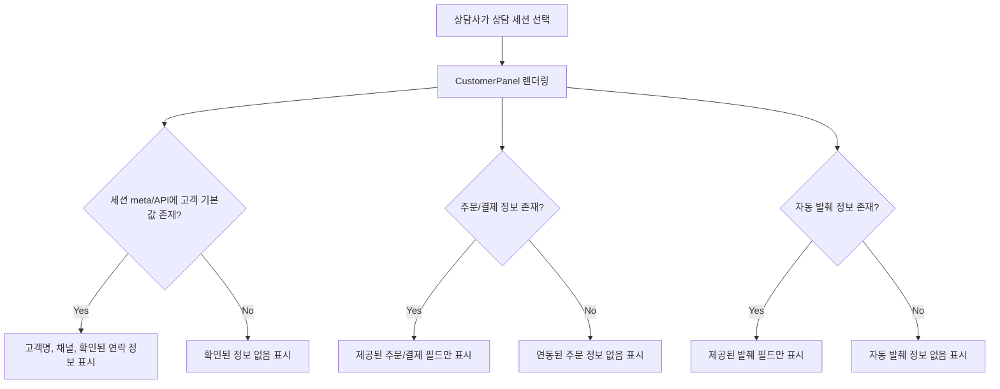

# Frontend FSD Spec: 상담 고객 정보 패널 목업 업무 데이터 제거

## Goal

상담사가 실제 연동되지 않은 주문/결제/카드/환불 정보를 업무 데이터로 오해하지 않도록 상담 고객 정보 패널에서 하드코딩된 구체 값을 제거하고, 세션에서 확인된 값만 표시한다.

## User Flow Chart



## Design Diff

### As-is vs To-be

| 영역           | As-is                                                   | To-be                                                        | 변경 내용                                       |
| -------------- | ------------------------------------------------------- | ------------------------------------------------------------ | ----------------------------------------------- |
| 고객 정보      | 연락처, 이메일이 없으면 구체적인 마스킹 예시값 표시     | 세션에서 제공된 값만 표시하고 없으면 `확인된 정보 없음` 표시 | 목업 연락 정보 제거                             |
| 문의 관련 주문 | 주문번호, 주문일, 결제금액, 배송 상태가 항상 표시       | 주문 정보가 없으면 section-level empty state 표시            | 미연동 주문/결제 데이터 제거                    |
| 처리 단계      | 날짜와 진행 상태가 하드코딩된 stepper 표시              | 처리 단계 데이터가 없으면 empty state 표시                   | 실제 상태처럼 보이는 단계 제거                  |
| 확인된 정보    | 카드번호, 환불 요청액, 환불 사유, 처리 기한이 항상 표시 | 자동 발췌 정보가 없으면 empty state 표시                     | 민감하거나 업무 판단에 영향을 주는 목업 값 제거 |

## Component Tree

```text
ConsultationPage
└─ CustomerPanel
   ├─ 고객 정보 InfoCard
   ├─ AI 이관 InfoCard
   ├─ 문의 관련 주문 InfoCard
   │  └─ EmptyCardState
   ├─ 처리 단계 InfoCard
   │  ├─ ProgressStepper
   │  └─ EmptyCardState
   ├─ 확인된 정보 InfoCard
   │  └─ EmptyCardState
   └─ 내부 메모 InfoCard
```

## API Integration

### Existing Data Source

| Source                                       | Field                                                           | Usage                                            |
| -------------------------------------------- | --------------------------------------------------------------- | ------------------------------------------------ |
| `ChatSessionResponse.metaJson`               | `customerName`, `handoffRequired`, `handoffReason`, `handoffAt` | 현재 세션에서 확인 가능한 고객명 및 AI 이관 정보 |
| `ChatSessionResponse.channel`                | `channel`                                                       | 상담 채널 표시                                   |
| `ChatSessionResponse.metaJson.customerInfo`  | `membershipTier`, `contact`, `email`                            | 값이 존재할 때만 고객 정보 표시                  |
| `ChatSessionResponse.metaJson.orderInfo`     | `orderNumber`, `orderDate`, `paymentAmount`, `deliveryStatus`   | 값이 존재할 때만 주문 정보 표시                  |
| `ChatSessionResponse.metaJson.extractedInfo` | `cardNumber`, `refundAmount`, `refundReason`, `dueDate`         | 값이 존재할 때만 자동 발췌 정보 표시             |

백엔드 변경은 이번 이슈의 필수 범위가 아니다. `backend/src/main/java/com/init/workflowruntime/application/dto/ChatSessionResponse.java`에서 `metaJson`과 `channel`은 이미 응답에 포함되어 있으며, `backend/src/main/java/com/init/workflowruntime/application/ChatSessionMetadataService.java`는 현재 AI 이관 및 메시지 요약 메타데이터를 관리한다.

## Data Flow

```text
ChatSessionResponse
  └─ ConsultationPage.parseSessionMeta()
      ├─ QueueCustomer.customerInfo
      ├─ QueueCustomer.orderInfo
      └─ QueueCustomer.extractedInfo
          └─ CustomerPanel props
              ├─ 제공된 값 렌더링
              └─ 미제공 섹션 empty state 렌더링
```

## 수정 대상 파일

| 파일                                                                         | 변경 유형 | 설명                                                                                                  |
| ---------------------------------------------------------------------------- | --------- | ----------------------------------------------------------------------------------------------------- |
| `frontend/src/pages/consultation/ui/sections/CustomerPanel.tsx`              | modify    | 하드코딩된 고객/주문/자동 발췌/처리 단계 값을 제거하고 section empty state 및 분리된 데이터 타입 추가 |
| `frontend/src/pages/consultation/ui/ConsultationPage.tsx`                    | modify    | 세션 meta에서 고객/주문/자동 발췌 정보를 분리해 CustomerPanel로 전달                                  |
| `frontend/src/pages/consultation/ui/ConsultationPage.test.tsx`               | modify    | 세션 meta 값이 CustomerPanel에 전달되고 목업 업무 데이터가 표시되지 않는지 검증                       |
| `frontend/src/pages/consultation/ui/sections/consultation-sections.test.tsx` | modify    | 실제 데이터가 없을 때 목업 업무 데이터가 표시되지 않는지 검증                                         |

## State Management

`ConsultationPage`의 큐 상태에 상담 고객 패널 전용 데이터를 함께 보관한다. 이 데이터는 UI 표시용이며, 새로운 전역 store나 서버 상태 라이브러리를 추가하지 않는다.

```typescript
type QueueCustomerPanelData = {
  customerInfo: Pick<CustomerInfo, "membershipTier" | "contact" | "email">;
  orderInfo: CustomerOrderInfo | null;
  extractedInfo: CustomerExtractedInfo | null;
};
```

## Tests

### Test Strategy

| 구분            | 방법                            | 도구                           | 비고                                          |
| --------------- | ------------------------------- | ------------------------------ | --------------------------------------------- |
| 컴포넌트 테스트 | CustomerPanel 렌더링 결과 검증  | Vitest + React Testing Library | 목업 업무 데이터 부재와 제공 데이터 표시 확인 |
| 통합 범위 확인  | ConsultationPage 타입/빌드 검증 | `pnpm test`, `pnpm build`      | 기존 상담 화면 흐름 회귀 확인                 |

### Test Scenarios

#### Happy Path

| #   | 시나리오                          | 사전 조건                                             | 기대 결과                                                            |
| --- | --------------------------------- | ----------------------------------------------------- | -------------------------------------------------------------------- |
| 1   | 고객명과 채널만 있는 상담 선택    | `customerName`, `channel`만 존재                      | 고객명/채널은 표시되고 연락처/주문/카드/환불 값은 empty state로 표시 |
| 2   | 세션 meta에 주문 정보가 존재      | `orderInfo`에 주문번호/주문일/결제금액/배송 상태 존재 | 제공된 주문 정보만 표시                                              |
| 3   | 세션 meta에 자동 발췌 정보가 존재 | `extractedInfo`에 카드번호/환불액/사유/기한 존재      | 제공된 자동 발췌 정보만 표시                                         |

#### Error & Edge Cases

| #   | 시나리오                           | 기대 결과                                                                       |
| --- | ---------------------------------- | ------------------------------------------------------------------------------- |
| 1   | `metaJson`이 비어 있거나 파싱 실패 | 기존처럼 고객명은 fallback 처리하고 패널 업무 정보는 empty state 표시           |
| 2   | 일부 필드만 존재                   | 존재하는 필드는 표시하고 나머지는 `확인된 정보 없음` 또는 `연동 정보 없음` 표시 |
| 3   | 처리 단계 데이터가 없음            | 하드코딩 stepper 대신 `확인된 처리 단계가 없습니다.` 표시                       |

## Acceptance Criteria

- 실제 데이터가 없을 때 주문번호, 주문일, 결제금액, 배송 상태, 카드번호, 환불 요청액, 처리 기한 같은 구체적인 업무 값이 표시되지 않는다.
- 고객명과 채널처럼 현재 세션에서 확인 가능한 값은 유지된다.
- 고객 정보, 주문 정보, 자동 발췌 정보는 서로 분리된 타입과 props로 표현된다.
- 미연동 주문/처리 단계/자동 발췌 섹션은 상담사가 목업 데이터로 오해하지 않도록 명확한 empty state를 보여준다.
- 기존 내부 메모 및 AI 이관 정보 표시 흐름은 유지된다.

## Non-goals

- 새로운 주문/결제/환불 API를 구현하지 않는다.
- 백엔드 `metaJson` 구조를 마이그레이션하지 않는다.
- 상담 대기열, 메시지 전송, AI 응대 모드 동작은 변경하지 않는다.

## Open Questions

- 주문/결제/환불 연동 API가 추가될 때 `metaJson`을 계속 경유할지, 별도 generated endpoint로 분리할지는 후속 이슈에서 결정한다.
