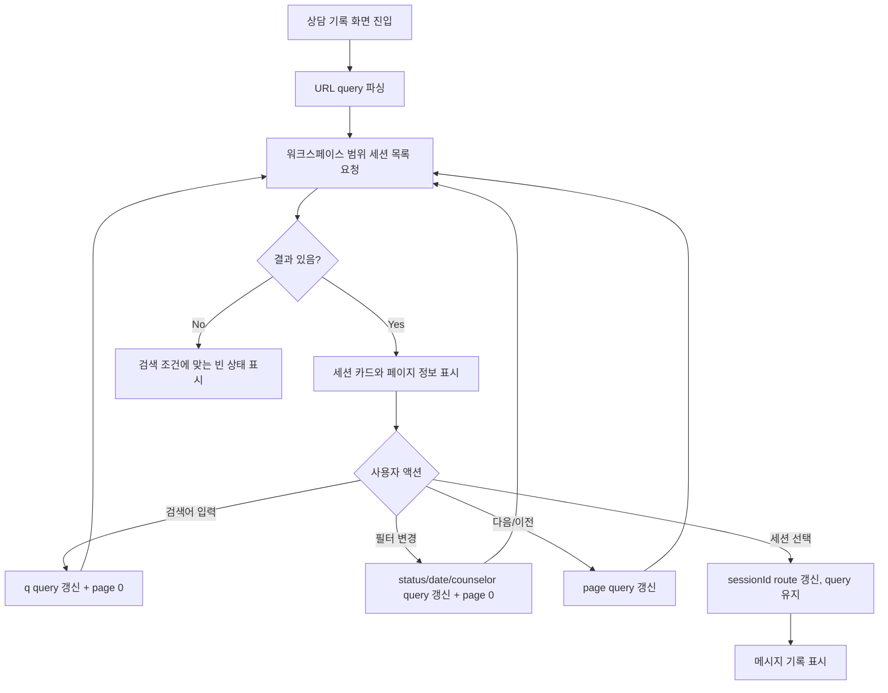

# 352: 상담 기록 검색/필터/페이지 이동 제공

> **Issue**: [#352](https://github.com/ajou-2026-1-capstone-5/ostone/issues/352)
> **Bounded Context**: `workflow-runtime` FE/BE
> **Template**: `_TEMPLATE_FE.md` 기반, Backend 계약 섹션 포함
> **Branch**: `feature/352-chat-history-search-filters`
> **Canonical Number**: `352`
> **Type**: Mixed (Frontend FSD + Backend DDD)
> **작성일**: 2026-06-01

---

## Goal

상담 기록 화면에서 상담사가 고객명/키워드, 기간, 상태, 담당 상담사 조건으로 이전 상담을 찾고 페이지를 이동할 수 있게 한다.

---

## Background

상담 기록은 상담사가 이전 응대 맥락과 후속 처리 내용을 찾는 작업 화면이다. 현재 확인된 구현은 `frontend/src/pages/consultation/ui/chat-history/ChatHistoryPage.tsx`가 세션 목록을 가져온 뒤 `COMPLETED`/`RESOLVED`만 클라이언트에서 걸러 보여주고, `frontend/src/features/consultation/ui/chat-history/SessionList.tsx`는 검색/필터/페이지 이동 UI를 제공하지 않는다.

Backend의 `GET /api/v1/workspaces/{workspaceId}/consultation/sessions`는 `status`, `page`, `size` 수준의 조건만 처리한다. 기록이 많아지면 고객명, 메시지 키워드, 기간, 담당 상담사 기준으로 서버에서 먼저 좁혀야 한다.

---

## Scope

### In Scope

- 상담 기록 목록에 고객명 또는 메시지 키워드 검색 입력을 제공한다.
- 기간, 상태, 담당 상담사 ID 필터를 제공한다.
- 이전/다음 페이지 이동 UI를 제공하고 현재 페이지와 전체 건수를 표시한다.
- 검색/필터/페이지 조건을 URL query에 반영해 새로고침 후에도 유지한다.
- Backend 세션 목록 API에 검색/필터 조건을 추가한다.
- #327에서 정리된 workspace-scoped URL과 선택 상태를 유지한다.

### Out of Scope

- 담당 상담사 이름 자동완성 또는 사용자 디렉터리 조회
- 상담 기록 export, 저장된 검색 조건, 고급 정렬
- 상담 메시지 본문 전용 검색 API 분리
- ML pipeline 또는 Domain Pack 생성 흐름 변경

### Issue Requirement Trace

| Issue 요구사항 | 스펙 반영 위치 |
| --- | --- |
| 고객명/키워드 검색 | Frontend Design, Backend Contract |
| 기간, 상태, 담당 상담사 필터 | Frontend Design, Backend Contract |
| 페이지 이동 또는 더 보기 | Pagination |
| URL query 유지 | Route State |
| Backend 검색 조건 추가 | Backend Contract |
| #327 workspace scope 이후에도 워크스페이스 내부 검색 | Backend Contract, Acceptance Criteria |

---

## Existing Context

아래 경로는 현재 repository에서 존재 확인 완료했다.

| Existing file | 현재 역할 | 변경 기준 |
| --- | --- | --- |
| `frontend/DESIGN.md` | 프론트 디자인 가이드 | 검색/필터/버튼/focus 스타일 기준 |
| `frontend/src/pages/consultation/ui/chat-history/ChatHistoryPage.tsx` | 상담 기록 화면과 URL 선택 상태 조합 | URL query 기반 필터 상태 추가 |
| `frontend/src/features/consultation/ui/chat-history/SessionList.tsx` | 상담 기록 목록 표시 | 검색/필터/페이지 UI 추가 |
| `frontend/src/features/consultation/api/chatHistoryApi.ts` | 상담 기록 query hook | filter 조건과 page response 반영 |
| `frontend/src/features/consultation/api/consultationApi.ts` | 상담 API wrapper | 세션 목록 query parameter 확장 |
| `backend/src/main/java/com/init/workflowruntime/presentation/CounselorSessionController.java` | 상담사 세션 REST controller | query parameter 확장 |
| `backend/src/main/java/com/init/workflowruntime/application/CounselorService.java` | 상담사 세션 application service | 조건 검증 및 검색 query orchestration |
| `backend/src/main/java/com/init/workflowruntime/domain/ChatSessionRepository.java` | ChatSession repository port | 검색 조건을 받는 page 조회 port 추가 |
| `backend/src/main/java/com/init/workflowruntime/infrastructure/persistence/JpaChatSessionRepository.java` | JPA repository adapter | workspace-scoped 검색 query 구현 |

---

## User Flow Chart



---

## Design Diff

| 영역 | As-is | To-be | 변경 내용 |
| --- | --- | --- | --- |
| 검색 | 없음 | 고객명/키워드 입력 | 세션 metadata와 메시지 본문을 대상으로 검색 |
| 상태 | 기록 화면에서 사실상 고정 | 전체/OPEN/ACTIVE/RESOLVED/COMPLETED 선택 | 상태별 기록 탐색 가능 |
| 기간 | 없음 | 시작일/종료일 date input | `startedAt` 기준 기간 필터 |
| 담당 상담사 | 없음 | 상담사 ID 숫자 입력 | `assignedCounselorId` 기준 필터 |
| 페이지 | API param만 존재 | 이전/다음 버튼과 카운트 표시 | 20개 초과 세션 탐색 가능 |
| URL 상태 | sessionId만 반영 | 필터와 page query 보존 | 새로고침 후 동일 조건 복원 |

---

## Frontend Design

### Component Tree

```text
ChatHistoryPage
├─ SessionList
│  ├─ SearchInput
│  ├─ StatusSelect
│  ├─ DateRangeInputs
│  ├─ CounselorIdInput
│  ├─ ResetFiltersButton
│  ├─ SessionCard[]
│  └─ PaginationControls
└─ MessageHistory
```

### Route State

상담 기록 route는 기존 경로를 유지하고 query string만 확장한다.

```text
/workspaces/:workspaceId/consultation/history?q=환불&status=COMPLETED&startedFrom=2026-05-01&startedTo=2026-05-31&assignedCounselorId=42&page=1
/workspaces/:workspaceId/consultation/history/:sessionId?q=환불&status=COMPLETED&page=1
```

- `q`: 고객명, 세션 제목, 최근 메시지, 메시지 본문 등 키워드 검색어
- `status`: `ALL | OPEN | ACTIVE | RESOLVED | COMPLETED`; 기본값은 상담 기록의 기존 동작과 가까운 `COMPLETED`
  - `ALL`은 프론트엔드 URL 상태 전용 값이며 Backend API에는 `status` 조건을 보내지 않는다.
- `startedFrom`, `startedTo`: `YYYY-MM-DD`
- `assignedCounselorId`: 양수 숫자
- `page`: backend와 동일한 0-based page index
- 필터 조건 변경 시 `page`는 `0`으로 초기화한다.
- 세션 선택 시 현재 query string은 유지한다.

### Loading/Error/Empty

- 로딩 중에도 필터 컨트롤은 유지하고 목록 영역에 loading state를 표시한다.
- 에러 시 재시도 버튼을 제공한다.
- 검색/필터 조건이 있는 빈 결과는 “검색 조건에 맞는 상담 기록이 없습니다”로 표시한다.

---

## Backend Contract

### REST API

기존 endpoint를 확장한다.

| Method | Path | Description |
| --- | --- | --- |
| `GET` | `/api/v1/workspaces/{workspaceId}/consultation/sessions` | 워크스페이스 상담 세션 목록 검색 |

### Query Parameters

| Name | Type | Required | Description |
| --- | --- | --- | --- |
| `status` | string | no | 세션 상태 필터 |
| `keyword` | string | no | 세션 channel/metaJson 또는 메시지 content 검색어 |
| `startedFrom` | date | no | `startedAt` 시작일, `YYYY-MM-DD` |
| `startedTo` | date | no | `startedAt` 종료일, `YYYY-MM-DD` |
| `assignedCounselorId` | number | no | 담당 상담사 ID |
| `page` | number | no | 0-based page, 기본값 `0` |
| `size` | number | no | page size, 기본값 `20`, 최대 `100` |

### Response

기존 `CounselorSessionResponse` page envelope를 유지한다.

```json
{
  "content": [
    {
      "id": 7,
      "status": "COMPLETED",
      "channel": "WEB",
      "metaJson": "{\"title\":\"홍길동 환불 상담\"}",
      "startedAt": "2026-05-22T09:00:00+09:00",
      "assignedCounselorId": 42,
      "endedAt": "2026-05-22T09:30:00+09:00"
    }
  ],
  "page": 0,
  "size": 20,
  "totalElements": 1,
  "totalPages": 1
}
```

### Application Rules

- `workspaceId`는 양수여야 한다.
- `status`가 있으면 `ChatSessionStatus`로 검증한다.
- `assignedCounselorId`가 있으면 양수여야 한다.
- `startedFrom`과 `startedTo`가 모두 있으면 `startedFrom <= startedTo`여야 한다.
- 날짜 필터는 `Asia/Seoul` 업무 날짜 기준으로 `startedFrom` 00:00:00 이상, `startedTo + 1 day` 00:00:00 미만을 조회한다.
- keyword는 앞뒤 공백을 제거하고 빈 문자열이면 조건에서 제외한다.
- 검색은 항상 `workspaceId` 조건 안에서만 수행한다.

---

## 수정 대상 파일

| 파일 | 변경 유형 | 설명 |
| --- | --- | --- |
| `.agent/specs/352.md` | new | 이슈 요구사항과 검증 기준 문서화 |
| `backend/src/main/java/com/init/workflowruntime/presentation/CounselorSessionController.java` | modify | 검색/필터 query parameter 추가 |
| `backend/src/main/java/com/init/workflowruntime/application/CounselorService.java` | modify | query validation과 검색 조회 orchestration |
| `backend/src/main/java/com/init/workflowruntime/domain/ChatSessionRepository.java` | modify | 검색 조건 기반 page 조회 port 추가 |
| `backend/src/main/java/com/init/workflowruntime/infrastructure/persistence/JpaChatSessionRepository.java` | modify | native query 기반 workspace-scoped 검색 구현 |
| `backend/src/test/java/com/init/workflowruntime/application/CounselorServiceTest.java` | modify | 검색/필터 검증 추가 |
| `backend/src/test/java/com/init/workflowruntime/presentation/CounselorSessionControllerTest.java` | modify | query parameter 전달 검증 |
| `frontend/src/features/consultation/api/consultationApi.ts` | modify | page response와 query parameter 확장 |
| `frontend/src/features/consultation/api/chatHistoryApi.ts` | modify | filter-aware query key와 hook 응답 적용 |
| `frontend/src/features/consultation/api/chatHistoryKeys.ts` | modify | 검색 조건 포함 query key |
| `frontend/src/pages/consultation/ui/chat-history/ChatHistoryPage.tsx` | modify | URL query 기반 filter state |
| `frontend/src/features/consultation/ui/chat-history/SessionList.tsx` | modify | 검색/필터/페이지 UI |
| `frontend/src/features/consultation/ui/chat-history/SessionList.module.css` | modify | 필터/페이지 스타일 |
| `frontend/src/**/__tests__ 또는 *.test.tsx` | modify | API/hook/page/list 테스트 갱신 |

---

## Acceptance Criteria

- 상담사가 고객명 또는 메시지 키워드로 이전 상담을 찾을 수 있다.
- 기간, 상태, 담당 상담사 조건으로 목록을 좁힐 수 있다.
- 세션이 20개를 넘어도 이전/다음 페이지로 이동할 수 있다.
- 새로고침해도 query string의 검색/필터/페이지 조건이 유지된다.
- 세션 선택 후에도 검색/필터 query가 유지된다.
- 검색은 `workspaceId` 조건과 함께 적용되어 다른 워크스페이스 세션이 섞이지 않는다.
- 검색/필터 결과가 없으면 빈 상태를 명확히 표시한다.

---

## Test Plan

### Backend

- `CounselorServiceTest`
  - keyword, 기간, 상태, 담당 상담사 필터가 repository 검색 조건으로 전달된다.
  - 유효하지 않은 status는 `BadRequestException`을 반환한다.
  - 유효하지 않은 workspaceId/page/size/assignedCounselorId/date range를 거부한다.
- `CounselorSessionControllerTest`
  - 확장된 query parameter를 service에 전달한다.

### Frontend

- `consultationApi.test.ts`
  - `getSessionPage`가 확장 query parameter를 URL에 반영한다.
  - 기존 `getSessions`는 page envelope의 content를 반환한다.
- `chatHistoryApi.test.ts`
  - filter 조건을 API 호출과 query key에 반영한다.
  - `workspaceId`가 없으면 query를 실행하지 않는다.
- `ChatHistoryPage.test.tsx`
  - URL query 조건으로 세션 목록을 조회한다.
  - 필터 변경 시 URL query가 갱신되고 page가 초기화된다.
  - 세션 선택 시 query string이 유지된다.
- `SessionList.test.tsx`
  - 검색/필터 컨트롤, 빈 상태, pagination button 동작을 검증한다.
