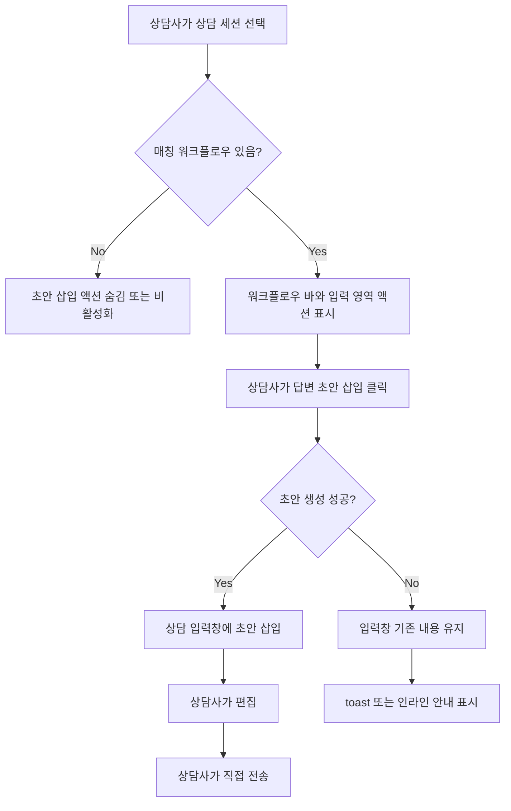

# Frontend/Backend Spec: 매칭 워크플로우 기반 답변 초안 삽입

## Goal

매칭된 워크플로우가 있는 상담 세션에서 상담사가 워크플로우 맥락 기반 답변 초안을 입력창에 삽입하고, 직접 편집한 뒤 수동으로 전송할 수 있게 한다.

## User Flow Chart



## Problem

현재 `MatchedWorkflowBar`는 매칭된 워크플로우 정보를 보여주고 상세 화면으로 이동할 수 있지만, 상담사가 실제 응대 문장을 작성하는 입력창으로 워크플로우 맥락을 연결하지 않는다. 기존 하드코딩 추천 답변 strip은 제거되어 있어 상담사가 워크플로우 내용을 읽고 직접 문장화해야 한다.

## Scope

- 상담 세션에 매칭 워크플로우가 있을 때 답변 초안 삽입 액션을 제공한다.
- 현재 워크플로우 상태가 추가 정보를 요구하는 단계라면 삽입되는 초안은 상담사가 보낼 다음 질문 형태가 될 수 있다.
- 초안은 상담 입력창에만 채워지며 자동 전송하지 않는다.
- 상담사는 삽입된 초안을 편집한 뒤 기존 전송 흐름으로 직접 전송한다.
- 초안 생성 실패 시 입력창의 기존 내용을 변경하지 않고 오류 안내를 표시한다.
- 매칭 워크플로우가 없는 세션에서는 삽입 액션을 숨기거나 비활성화한다.
- 백엔드는 상담사 검토용 draft response API를 자동 채팅 응답 저장 흐름과 분리해 제공한다.

## Non-goals

- 고객에게 자동으로 메시지를 전송하지 않는다.
- 기존 자동 LLM 응답 생성 이벤트 흐름을 대체하지 않는다.
- 워크플로우 실행 상태를 초안 생성만으로 진행시키지 않는다.
- #323의 매칭 근거 표시 범위를 확장하지 않는다.
- 새로운 데이터베이스 테이블이나 영속 이력 저장을 추가하지 않는다.

## Design Diff

| 영역 | As-is | To-be | 변경 내용 |
|------|-------|-------|----------|
| 워크플로우 연결 | `MatchedWorkflowBar`에서 정보 확인/상세 이동 | 입력창 초안 삽입 액션 제공 | 매칭된 워크플로우를 응대 작성 행동으로 연결 |
| 전송 방식 | 상담사가 직접 문장 작성 후 전송 | 초안 삽입 후 상담사가 편집/전송 | 자동 전송 없이 입력 보조만 수행 |
| 실패 처리 | 초안 생성 흐름 없음 | 실패 시 기존 입력 유지 및 안내 | 입력 손실 방지 |
| 백엔드 API | 사용자 자동응답 흐름 중심 | 상담사 draft response API 분리 | 메시지 저장과 워크플로우 진행 없이 초안만 반환 |

## Affected Modules

### Frontend

- `frontend/src/pages/consultation/ui/ConsultationPage.tsx`
- `frontend/src/pages/consultation/ui/sections/MatchedWorkflowBar.tsx`
- `frontend/src/features/consultation/ui/ChatPanel.tsx`
- `frontend/src/features/consultation/api/consultationApi.ts`

### Backend

- `backend/src/main/java/com/init/workflowruntime/presentation/ConsultationController.java`
- `backend/src/main/java/com/init/workflowruntime/application/CounselorDraftResponseService.java`
- `backend/src/main/java/com/init/workflowruntime/application/command/GenerateDraftResponseCommand.java`
- `backend/src/main/java/com/init/workflowruntime/application/LlmAssistantService.java`
- `backend/src/main/java/com/init/workflowruntime/application/dto/GenerateWorkflowAwareResponseResult.java`

## Component Tree

```text
ConsultationPage
├─ MatchedWorkflowBar
│  └─ Matched workflow visibility source
└─ ChatPanel
   ├─ Input textarea
   ├─ Draft insertion action state
   └─ Send button
```

## API Integration

### New Endpoint

| Method | Path | Description |
|--------|------|-------------|
| POST | `/api/v1/consultation/sessions/{sessionId}/draft-response` | 현재 상담 세션과 매칭 워크플로우 맥락을 기반으로 상담사 입력창에 삽입할 답변 초안을 생성한다. |

### Response Shape

```json
{
  "content": "확인해주신 주문 건은 환불 접수 후 영업일 기준 3일 내 처리될 예정입니다."
}
```

### Error Handling

- 세션이 없으면 기존 예외 응답 규칙에 따라 `404`를 반환한다.
- 매칭 워크플로우가 없거나 초안 생성이 불가능하면 `4xx` 또는 `5xx` 오류를 반환할 수 있다.
- 프론트엔드는 오류 시 입력창 값을 덮어쓰지 않고 toast로 안내한다.

## Data Flow

```text
MatchedWorkflowBar/ChatPanel action
  -> ConsultationPage handler
  -> consultationApi.generateDraftResponse(sessionId)
  -> POST /api/v1/consultation/sessions/{sessionId}/draft-response
  -> backend draft service
  -> { content }
  -> ChatPanel textarea value update
```

## State Management

- 서버 상태 캐시는 필요하지 않다. 초안 생성은 사용자 액션 기반 mutation으로 취급한다.
- `ChatPanel`은 입력창 내용을 로컬 상태로 유지한다.
- `ConsultationPage`는 현재 세션, 매칭 워크플로우 유무, 상담사 배정 상태를 기준으로 초안 액션 활성 여부를 결정한다.
- 초안 요청 중에는 중복 클릭을 막기 위해 액션을 loading/disabled 처리한다.

## Acceptance Criteria

- 매칭 워크플로우가 있는 세션에서 상담사가 답변 초안을 입력창에 삽입할 수 있다.
- 삽입된 초안은 고객에게 자동 전송되지 않는다.
- 상담사는 삽입된 초안을 편집한 뒤 직접 전송할 수 있다.
- 초안 생성 실패 시 기존 입력 내용이 보존된다.
- 매칭 워크플로우가 없는 세션에서는 삽입 액션이 숨겨지거나 비활성화된다.
- 백엔드 draft response API는 초안 생성 결과를 반환하고 상담 메시지를 저장하지 않는다.
- 초안 생성 API와 UI 흐름은 기존 상담 메시지 전송/재시도 흐름을 깨뜨리지 않는다.

## Validation Plan

- Backend: `ConsultationController`와 신규 draft service 테스트로 성공, 세션 없음, 매칭 워크플로우 없음, 저장 부작용 없음 시나리오를 검증한다.
- Frontend: `ChatPanel` 테스트로 초안 삽입, 자동 전송 방지, 실패 시 기존 입력 보존, disabled 상태를 검증한다.
- Frontend page integration: `ConsultationPage` 테스트로 매칭 워크플로우가 있을 때만 초안 요청이 가능하고 오류 toast가 표시되는지 확인한다.
- Targeted commands:
  - `cd backend && ./gradlew test --tests com.init.workflowruntime.presentation.ConsultationControllerTest`
  - `cd frontend && pnpm test -- ChatPanel ConsultationPage`

## Open Questions

- 없음.
