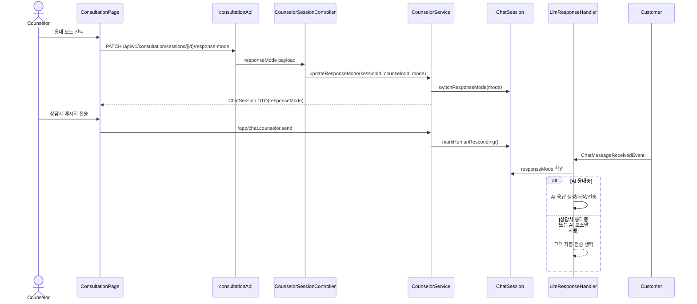

# 상담사 개입 이후 AI 자동응답 상태 제어

## Goal

상담 세션별 AI 응대 모드를 명시적으로 관리하여 상담사 개입 이후 AI가 의도치 않게 고객에게 자동응답하지 않도록 하고, 상담 화면에서 현재 응대 상태를 확인하고 전환할 수 있게 한다.

## Problem

현재 고객 메시지가 저장되면 `ChatMessageReceivedEvent`가 발행되고 `LlmResponseHandler`가 AI 응답을 생성해 같은 채팅 토픽으로 전송한다. 상담사 배정 여부나 상담사가 수동으로 응대 중인지에 대한 명시적 제어가 없어, `ACTIVE` 세션에서 상담사가 배정된 뒤에도 AI가 고객에게 자동응답할 수 있다. 상담사 화면에도 AI 자동응답이 켜져 있는지, 상담사 응대 중인지, AI 보조만 허용되는지 표시되지 않는다.

## Scope

- `runtime.chat_session`에 세션 단위 AI 응대 모드를 저장한다.
- 응대 모드는 `AI 응대중`, `상담사 응대중`, `AI 보조만 사용`을 표현한다.
- 새 세션은 기존 고객 채팅 자동응답 흐름을 유지하기 위해 기본적으로 AI 자동응답 허용 상태로 시작한다.
- 상담사 배정 또는 상담사 일반 메시지 전송 시 기본 모드는 상담사 응대 상태로 전환한다.
- 상담사가 상담 화면에서 자동응답 허용, 중지, AI 보조 모드를 명시적으로 전환할 수 있게 한다.
- `LlmResponseHandler`는 자동응답 허용 상태일 때만 고객에게 AI 메시지를 생성, 저장, 전송한다.
- 상담 대기열 및 상담 세션 응답 DTO는 현재 응대 모드를 포함한다.

## Non-goals

- AI 보조 모드에서 상담사용 초안 생성 UI를 새로 완성하지 않는다. 이번 범위에서는 고객 자동 전송을 막고 상태를 명시적으로 저장, 표시, 전환하는 것을 우선한다.
- 워크플로우 그래프의 handoff 노드를 새로 해석하거나 별도 실행 상태 모델을 추가하지 않는다.
- 기존 인증/인가 체계를 전면 개편하지 않는다.
- OpenAPI generated frontend 파일을 직접 수정하지 않는다. 아직 생성되지 않은 상담사 모드 endpoint는 기존 `consultationApi`의 수동 endpoint 패턴을 따른다.

## Sequence Diagram



## REST API

### Endpoint

| Method | Path | Description |
| --- | --- | --- |
| PATCH | `/api/v1/consultation/sessions/{sessionId}/response-mode` | 상담 세션의 AI 응대 모드를 변경한다. |

### Request

```json
{
  "counselorId": 42,
  "responseMode": "AI_ASSIST_ONLY"
}
```

### Response

```json
{
  "id": 123,
  "status": "ACTIVE",
  "channel": "WEB",
  "metaJson": "{}",
  "startedAt": "2026-05-31T12:00:00+09:00",
  "assignedCounselorId": 42,
  "responseMode": "AI_ASSIST_ONLY"
}
```

### Error Cases

| Status | Code | Condition |
| --- | --- | --- |
| 400 | `INVALID_COUNSELOR_ID` | `counselorId`가 없거나 유효하지 않다. |
| 400 | `UNSUPPORTED_RESPONSE_MODE` | 지원하지 않는 모드가 요청된다. |
| 400 | `SESSION_NOT_ASSIGNED` | 배정된 상담사가 아닌 사용자가 모드를 변경한다. |
| 404 | `SESSION_NOT_FOUND` | 세션을 찾을 수 없다. |

## Backend Design

### Affected Files

| Path | Change |
| --- | --- |
| `backend/src/main/java/com/init/workflowruntime/domain/ChatSession.java` | 응대 모드 필드와 도메인 전환 메서드를 추가한다. |
| `backend/src/main/java/com/init/workflowruntime/domain/ChatSessionResponseMode.java` | 지원 모드 enum을 추가한다. |
| `backend/src/main/java/com/init/workflowruntime/application/LlmResponseHandler.java` | 자동응답 허용 모드일 때만 AI 응답 생성/전송을 실행한다. |
| `backend/src/main/java/com/init/workflowruntime/application/CounselorService.java` | 배정/상담사 메시지/모드 변경 정책을 오케스트레이션한다. |
| `backend/src/main/java/com/init/workflowruntime/application/dto/ChatSessionResponse.java` | 현재 응대 모드를 응답에 포함한다. |
| `backend/src/main/java/com/init/workflowruntime/application/dto/CounselorSessionResponse.java` | 현재 응대 모드를 응답에 포함한다. |
| `backend/src/main/java/com/init/workflowruntime/application/dto/UpdateResponseModeRequest.java` | 모드 변경 요청 DTO를 추가한다. |
| `backend/src/main/java/com/init/workflowruntime/presentation/CounselorSessionController.java` | 모드 변경 endpoint를 추가한다. |
| `backend/src/main/resources/db/changelog/db.changelog-master.sql` | `runtime.chat_session.response_mode` 컬럼과 기본값을 추가한다. |

### Response Mode Policy

| Event | Result |
| --- | --- |
| 새 세션 생성 | `AI_ACTIVE` |
| 상담사 배정 | `HUMAN_ACTIVE` |
| 상담사 일반 메시지 전송 | `HUMAN_ACTIVE` |
| 상담사 내부 메모 전송 | 기존 모드 유지 |
| 배정 해제 | `AI_ACTIVE` |
| 상담사 수동 전환 | 요청한 모드로 변경 |

### LLM Auto-send Gate

`LlmResponseHandler`는 `ChatMessageReceivedEvent` 처리 초기에 세션을 조회한다. 세션이 `AI_ACTIVE`가 아니면 LLM 호출, assistant 메시지 저장, STOMP 전송을 모두 수행하지 않는다. 이 경우 고객 채팅 메시지 저장과 상담 대기열 갱신은 기존 흐름대로 유지된다.

## Frontend Design

### Affected Files

| Path | Change |
| --- | --- |
| `frontend/src/features/consultation/api/consultationApi.ts` | `responseMode` 타입과 모드 변경 API wrapper를 추가한다. |
| `frontend/src/pages/consultation/ui/ConsultationPage.tsx` | 상담 헤더에 현재 응대 모드 표시와 전환 컨트롤을 추가한다. |
| `frontend/src/pages/consultation/ui/consultation-page.module.css` | 기존 흑백 디자인 토큰에 맞는 segmented control 스타일을 추가한다. |

### UI Behavior

- 활성 세션이 있으면 상담 헤더에 응대 모드 상태를 표시한다.
- 현재 상담사에게 배정된 세션에서만 모드 전환 버튼을 활성화한다.
- 전환 성공 시 대기열의 해당 세션 데이터를 갱신하고 성공 토스트를 표시한다.
- 전환 실패 시 기존 모드를 유지하고 에러 토스트를 표시한다.
- 세션이 다른 상담사에게 배정되었거나 종료 상태이면 컨트롤은 비활성화한다.

## Data Impact

- `runtime.chat_session.response_mode varchar(50) not null default 'AI_ACTIVE'` 컬럼을 추가한다.
- 기존 세션은 마이그레이션 기본값으로 `AI_ACTIVE`가 된다.
- 기존 세션 중 이미 상담사가 배정된 세션은 마이그레이션에서 `HUMAN_ACTIVE`로 보정한다.
- enum 값은 `AI_ACTIVE`, `HUMAN_ACTIVE`, `AI_ASSIST_ONLY`로 제한한다.

## Validation

- Backend unit tests:
  - `ChatSession` 기본 모드 및 도메인 전환 정책
  - `CounselorService` 배정/해제/모드 변경 정책
  - `LlmResponseHandler`가 `AI_ACTIVE`가 아닌 세션에서 LLM 호출과 고객 자동 전송을 생략하는지
- Frontend tests:
  - `consultationApi.updateResponseMode` 요청 URL/payload
  - `ConsultationPage`가 현재 모드 표시 및 전환 버튼 동작을 수행하는지
- Local verification:
  - `cd backend && ./gradlew test --tests '*ChatSessionTest' --tests '*CounselorServiceTest' --tests '*LlmResponseHandlerTest'`
  - `cd frontend && pnpm test -- --run src/features/consultation/api/consultationApi.test.ts src/pages/consultation/ui/ConsultationPage.test.tsx`

## Acceptance Criteria

- 상담사는 상담 화면에서 현재 세션의 AI 응대 모드를 한눈에 확인할 수 있다.
- 상담사는 본인에게 배정된 세션에서 AI 자동응답 허용, 상담사 응대, AI 보조 모드를 전환할 수 있다.
- 상담사 배정 또는 상담사 일반 메시지 전송 이후 기본적으로 AI 고객 자동응답은 중지된다.
- `AI_ACTIVE` 상태가 아닌 세션에서는 고객 메시지가 들어와도 `LlmResponseHandler`가 고객에게 AI 메시지를 자동 전송하지 않는다.
- 기존 미배정 고객 채팅 자동응답은 기본 `AI_ACTIVE` 상태에서 유지된다.

## Open Questions

- AI 보조 모드에서 상담사용 초안을 어디에 저장하고 어떤 UI 채널로 전달할지는 후속 설계가 필요하다.
- 워크플로우 handoff 실행 상태를 별도 세션 상태로 승격할지는 이번 이슈 범위 밖에서 결정한다.
