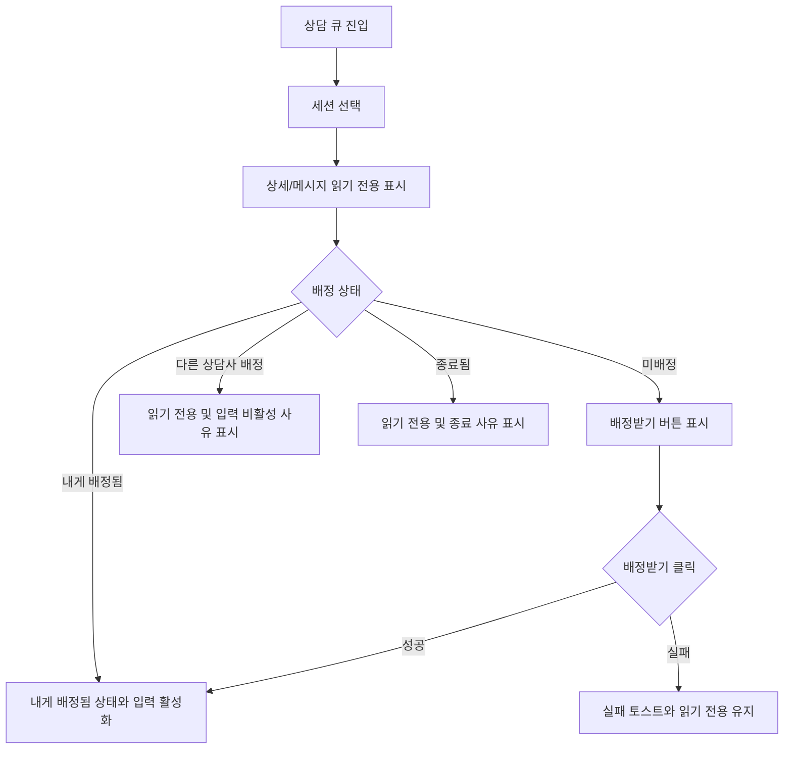

# Frontend FSD Spec: 상담 세션 열람과 배정받기 액션 분리

## Goal

상담사가 대기열의 미배정 세션을 먼저 읽어본 뒤, 별도 `배정받기` 액션으로만 세션을 맡을 수 있게 한다.

## User Flow Chart



## Design Diff

| 영역 | As-is | To-be | 변경 내용 |
| --- | --- | --- | --- |
| 큐 세션 선택 | 미배정 세션 클릭 시 즉시 배정 API 호출 | 클릭/URL 진입은 세션 열람만 수행 | 읽기와 배정 액션 분리 |
| 배정 액션 | 선택 동작에 암묵적으로 포함 | 헤더의 `배정받기` 버튼으로 명시 | 성공/실패 토스트 및 버튼 로딩 상태 표시 |
| 입력 상태 | 배정 이후에만 사실상 응대 가능 | 미배정/타 상담사/종료 세션은 입력 비활성화와 사유 표시 | 읽기 전용 상태를 화면에 명확히 노출 |

## Component Tree

```text
ConsultationPage
├─ QueuePanel
├─ ChatPanel
│  ├─ assignment status
│  ├─ message list
│  └─ disabled reason + input controls
└─ CustomerPanel
```

## API Integration

| Method | Path | Description |
| --- | --- | --- |
| GET | `/api/v1/workspaces/{workspaceId}/consultation/queue` | 상담 큐 조회 |
| GET | `/api/v1/consultation/sessions/{sessionId}/messages` | 선택 세션 메시지 조회 |
| POST | `/api/v1/consultation/sessions/{sessionId}/assign?counselorId={counselorId}` | `배정받기` 클릭 시 상담사 배정 |
| POST | `/api/v1/consultation/sessions/{sessionId}/release?counselorId={counselorId}` | 내 배정 해제 |

기존 `frontend/src/features/consultation/api/consultationApi.ts`의 수동 API 래퍼를 유지한다. OpenAPI generated endpoint가 없는 상담 큐/배정 계열 엔드포인트이기 때문이다.

## Data Flow

```text
QueuePanel selection
  -> ConsultationPage activeCustomerId 변경
  -> ConsultationPage 메시지 조회
  -> ChatPanel 읽기 전용/응대 가능 상태 렌더링

배정받기 클릭
  -> consultationApi.assignSession(sessionId, currentCounselorId)
  -> queue의 해당 세션 assignedCounselorId 갱신
  -> ChatPanel 입력 활성화
```

## 수정 대상 파일

| 파일 | 변경 유형 | 설명 |
| --- | --- | --- |
| `frontend/src/pages/consultation/ui/ConsultationPage.tsx` | modify | 선택과 배정을 분리하고 배정받기 액션/상태를 추가 |
| `frontend/src/pages/consultation/ui/consultation-page.module.css` | modify | 배정받기 버튼과 배정 중 상태 스타일 추가 |
| `frontend/src/features/consultation/ui/ChatPanel.tsx` | modify | 입력 비활성 사유를 표시 |
| `frontend/src/features/consultation/ui/chat-panel.module.css` | modify | 읽기 전용 안내 스타일 추가 |
| `frontend/src/pages/consultation/ui/ConsultationPage.test.tsx` | modify | 클릭 열람, 별도 배정, 타 상담사/미배정 입력 비활성 상태 검증 |
| `frontend/src/features/consultation/ui/ChatPanel.test.tsx` | modify | disabled reason 렌더링 검증 |

## State Management

- 서버 상태: 상담 큐, 메시지 목록, 배정/해제 결과는 기존 `consultationApi` 호출 결과를 사용한다.
- 클라이언트 상태: 선택된 세션, 메시지 로딩 대상, 배정 요청 중인 세션 ID를 `ConsultationPage` 로컬 상태로 관리한다.

## Tests

### Test Strategy

| 구분 | 방법 | 도구 | 비고 |
| --- | --- | --- | --- |
| 컴포넌트/페이지 테스트 | 사용자 행동 중심 렌더링 및 API 호출 검증 | Vitest + React Testing Library | 핵심 흐름 |
| 정적 검증 | 타입/빌드 수준 확인 | `pnpm test -- --run ...` | 변경 파일 중심 |

### Test Scenarios

| # | 시나리오 | 기대 결과 |
| --- | --- | --- |
| 1 | 미배정 세션을 클릭한다 | 메시지를 읽을 수 있지만 `assignSession`은 호출되지 않는다 |
| 2 | 미배정 세션에서 `배정받기`를 클릭한다 | `assignSession` 호출, 성공 토스트, 입력 활성화 |
| 3 | 배정 실패가 발생한다 | 실패 토스트 표시, 읽기 전용 상태 유지 |
| 4 | 다른 상담사에게 배정된 세션을 연다 | 메시지 입력 비활성화 및 사유 표시 |
| 5 | 내게 배정된 세션을 연다 | 기존 응대/종료/배정해제 흐름 유지 |

## Non-goals

- 백엔드 배정 정책, 경합 처리, 권한 모델은 변경하지 않는다.
- 상담 큐 API 응답 스키마 또는 generated API 재생성은 포함하지 않는다.
- 다른 상담사에게 배정된 세션의 접근 제한 정책을 새로 정의하지 않는다. 프론트엔드는 현재 큐에 노출된 세션을 읽기 전용으로 다룬다.

## Open Questions

- 배정 실패가 경합 때문인지 권한 문제인지 세분화된 서버 에러 코드를 노출할지 여부는 후속 백엔드/API 정책으로 남긴다.
