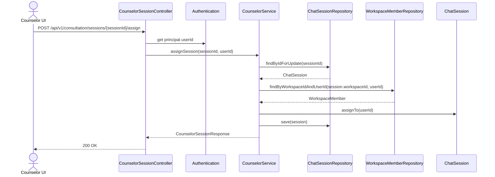

# 상담 배정/해제 인증 주체 정합화

## Goal

상담 배정/해제 API가 클라이언트가 전달한 `counselorId`를 신뢰하지 않고, 인증된 사용자 본인의 ID로만 세션을 배정하거나 해제하도록 변경한다.

## Background

현재 상담사 메시지 전송 WebSocket 흐름은 principal에서 상담사 ID를 가져오지만, REST 기반 상담 배정/해제는 `counselorId` request parameter를 사용한다. 이 구조에서는 클라이언트가 다른 상담사 ID를 포함한 요청을 만들 수 있으므로 REST 흐름의 인증 모델이 WebSocket 흐름과 달라진다.

## Scope

- `POST /api/v1/consultation/sessions/{sessionId}/assign` 요청에서 `counselorId` request parameter를 제거한다.
- `POST /api/v1/consultation/sessions/{sessionId}/release` 요청에서 `counselorId` request parameter를 제거한다.
- 서버는 Spring Security `Authentication` principal에서 현재 사용자 ID를 읽어 상담사 ID로 사용한다.
- 상담 세션의 `workspaceId` 기준으로 현재 사용자가 해당 워크스페이스 멤버인지 검증한다.
- 프론트엔드 상담 API wrapper와 상담 페이지 호출부는 `counselorId` 인자를 넘기지 않는다.
- 관련 단위/컨트롤러/API wrapper 테스트를 갱신한다.

## Non-goals

- 상담사 역할 체계나 워크스페이스 멤버 역할별 권한을 새로 정의하지 않는다.
- 상담 세션 상태 전이 규칙(`OPEN`, `ACTIVE`, `RESOLVED`, `COMPLETED`)은 변경하지 않는다.
- 상담 메시지 전송 WebSocket destination이나 payload 계약은 변경하지 않는다.
- 상담 목록/큐 조회 endpoint의 경로와 응답 구조는 변경하지 않는다.

## Affected Modules

| Area | Verified path | Change |
| --- | --- | --- |
| Backend presentation | `backend/src/main/java/com/init/workflowruntime/presentation/CounselorSessionController.java` | assign/release에서 request parameter 제거, 인증 사용자 ID 추출 |
| Backend application | `backend/src/main/java/com/init/workflowruntime/application/CounselorService.java` | 현재 사용자 ID로 배정/해제 수행, 세션 workspace membership 검증 |
| Backend domain support | `backend/src/main/java/com/init/workspace/domain/repository/WorkspaceMemberRepository.java` | 기존 workspace membership 조회 재사용 |
| Frontend feature API | `frontend/src/features/consultation/api/consultationApi.ts` | assign/release 함수 인자 및 URL query 제거 |
| Frontend page | `frontend/src/pages/consultation/ui/ConsultationPage.tsx` | assign/release 호출 시 current user ID 전달 제거 |
| Tests | `backend/src/test/java/com/init/workflowruntime/presentation/CounselorSessionControllerTest.java` | authenticated principal 기반 controller delegation 검증 |
| Tests | `backend/src/test/java/com/init/workflowruntime/application/CounselorServiceTest.java` | workspace membership 검증 및 다른 상담사 해제 방지 검증 |
| Tests | `frontend/src/features/consultation/api/consultationApi.test.ts` | query 없는 assign/release 요청 검증 |
| Tests | `frontend/src/pages/consultation/ui/ConsultationPage.test.tsx` | page가 wrapper에 sessionId만 넘기는지 검증 |

## Sequence Diagram



## REST API

### Endpoint

| Method | Path | Description |
| --- | --- | --- |
| POST | `/api/v1/consultation/sessions/{sessionId}/assign` | 인증된 사용자를 해당 상담 세션의 상담사로 배정 |
| POST | `/api/v1/consultation/sessions/{sessionId}/release` | 인증된 사용자가 본인에게 배정된 상담 세션을 해제 |

### Request

두 endpoint 모두 request body와 `counselorId` query parameter를 받지 않는다.

```http
POST /api/v1/consultation/sessions/123/assign
Authorization: Bearer {accessToken}
```

```http
POST /api/v1/consultation/sessions/123/release
Authorization: Bearer {accessToken}
```

### Response

응답은 기존 `CounselorSessionResponse` 형태를 유지한다.

```json
{
  "id": 123,
  "status": "ACTIVE",
  "channel": "WEB",
  "assignedCounselorId": 42
}
```

### Error Cases

| Condition | Expected behavior |
| --- | --- |
| 인증 정보 없음 또는 principal이 Long이 아님 | 기존 인증/인가 예외 처리로 거부 |
| 세션 없음 | `SESSION_NOT_FOUND` |
| 현재 사용자가 세션 workspace 멤버가 아님 | `WORKSPACE_ACCESS_DENIED` |
| 이미 배정된 세션 배정 시도 | 기존 `ChatSession.assignTo` 상태 검증 유지 |
| 본인에게 배정되지 않은 세션 해제 시도 | `SESSION_NOT_ASSIGNED_TO_COUNSELOR` |

## Frontend API Integration

`frontend/src/features/consultation/api/consultationApi.ts`의 수동 wrapper는 다음처럼 session ID만 받는다.

```typescript
assignSession(sessionId: number): Promise<ChatSession>
releaseSession(sessionId: number): Promise<ChatSession>
```

호출 URL은 각각 아래와 같다.

```text
/api/v1/consultation/sessions/{sessionId}/assign
/api/v1/consultation/sessions/{sessionId}/release
```

`frontend/src/pages/consultation/ui/ConsultationPage.tsx`는 UI 상태 판별을 위해 `currentCounselorId`를 계속 사용할 수 있지만, assign/release 요청에는 전달하지 않는다.

## Data and Migration Impact

- DB schema 변경은 없다.
- 기존 `runtime.chat_session.assigned_counselor_id` 컬럼 의미는 유지된다.
- OpenAPI는 controller signature 변경으로 `counselorId` query parameter가 제거되어야 한다. generated API가 해당 endpoint를 사용하지 않는 현재 wrapper 구조에서는 직접 수정 대상 generated 파일은 없다.

## Acceptance Criteria

- 배정 요청은 `counselorId` query parameter 없이 성공한다.
- 해제 요청은 `counselorId` query parameter 없이 성공한다.
- 서버는 인증 principal의 사용자 ID를 `assignedCounselorId`로 저장한다.
- 현재 사용자가 세션 workspace 멤버가 아니면 배정/해제를 거부한다.
- 다른 사용자 ID를 query parameter로 조작해도 서버 동작에 영향을 주지 않는다.
- 본인에게 배정되지 않은 세션 해제는 기존처럼 거부된다.
- 프론트엔드 assign/release wrapper와 페이지 호출부는 `counselorId` 인자를 요구하지 않는다.

## Validation Plan

- Backend unit test: `CounselorServiceTest`
- Backend controller test: `CounselorSessionControllerTest`
- Frontend API wrapper test: `consultationApi.test.ts`
- Frontend page interaction test: `ConsultationPage.test.tsx`
- Targeted commands:
  - `cd backend && ./gradlew test --tests com.init.workflowruntime.application.CounselorServiceTest --tests com.init.workflowruntime.presentation.CounselorSessionControllerTest`
  - `cd frontend && pnpm test -- consultationApi.test.ts ConsultationPage.test.tsx`

## Open Questions

- 없음. 이 이슈에서는 워크스페이스 멤버 여부까지만 검증하고, 역할별 상담사 권한 분리는 별도 정책 이슈로 다룬다.
