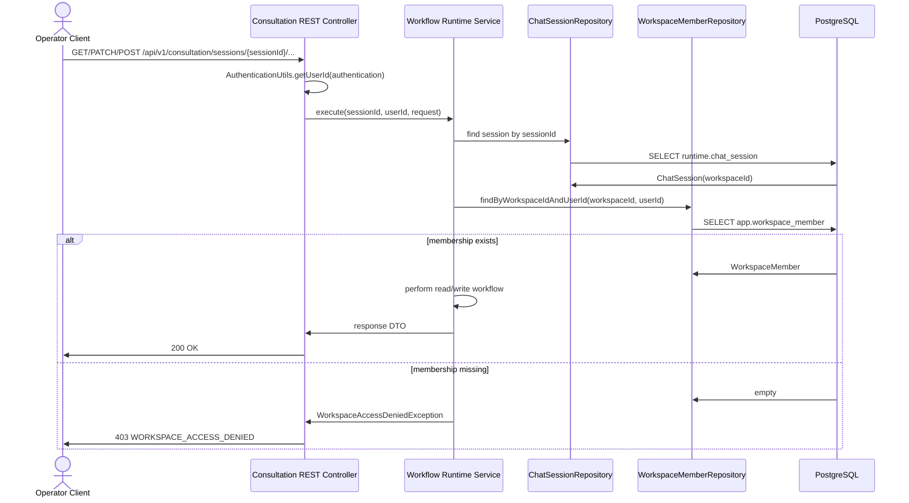
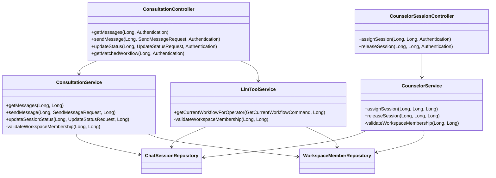

# Backend Spec: 상담 Session REST 접근 제어 강화

## Goal

`sessionId` 기반 상담 REST API가 세션이 속한 워크스페이스 멤버십을 확인한 뒤
상담 메시지, 상태, 매칭 워크플로우, 배정/해제 기능을 제공하도록 강화한다.

## Problem

현재 `/api/v1/consultation/**` 요청은 Spring Security에서 `OPERATOR` 역할만
확인한다. 워크스페이스 단위 큐 조회는 멤버십을 검증하지만, 세션 ID만 받는 REST
API는 세션의 `workspaceId`와 현재 인증 사용자의 멤버십을 연결해 확인하지 않는다.
다른 워크스페이스의 `sessionId`를 알게 되면 상담 기록 조회, 상태 변경,
워크플로우 조회 같은 작업에 접근할 위험이 있다.

## Scope

- `backend/src/main/java/com/init/workflowruntime/presentation/ConsultationController.java`
- `backend/src/main/java/com/init/workflowruntime/presentation/CounselorSessionController.java`
- `backend/src/main/java/com/init/workflowruntime/application/ConsultationService.java`
- `backend/src/main/java/com/init/workflowruntime/application/CounselorService.java`
- `backend/src/main/java/com/init/workflowruntime/application/LlmToolService.java`
- 관련 controller/service 테스트

## Non-Goals

- Spring Security URL role 정책 변경은 포함하지 않는다.
- 상담 세션 테이블 또는 워크스페이스 멤버십 스키마 변경은 포함하지 않는다.
- WebSocket 상담 채널 접근 제어는 기존 `JwtChannelInterceptor` 검증을 유지한다.
- LLM 내부 tool command 전체를 사용자 인증 기반 API로 바꾸지 않는다. 이번 범위는
  REST controller에서 노출되는 `matched-workflow` 조회에 한정한다.

## Sequence Diagram



## REST API

기존 URL과 요청/응답 DTO는 유지한다. 각 endpoint는 현재 인증 principal의 userId를
사용해 세션 워크스페이스 멤버십을 검증한다.

| Method | Path | Access Rule |
| --- | --- | --- |
| `GET` | `/api/v1/consultation/sessions/{sessionId}/messages` | 세션 워크스페이스 멤버 |
| `POST` | `/api/v1/consultation/sessions/{sessionId}/messages` | 세션 워크스페이스 멤버 |
| `PATCH` | `/api/v1/consultation/sessions/{sessionId}/status` | 세션 워크스페이스 멤버 |
| `GET` | `/api/v1/consultation/sessions/{sessionId}/matched-workflow` | 세션 워크스페이스 멤버 |
| `POST` | `/api/v1/consultation/sessions/{sessionId}/assign` | 세션 워크스페이스 멤버 |
| `POST` | `/api/v1/consultation/sessions/{sessionId}/release` | 세션 워크스페이스 멤버 |

### Error Response

멤버십 검증 실패는 기존 `WorkspaceAccessDeniedException`을 사용해 일관된 403 응답으로 반환한다.

```json
{
  "code": "WORKSPACE_ACCESS_DENIED",
  "message": "워크스페이스에 접근 권한이 없습니다."
}
```

## Class Design



## Requirements

1. `ConsultationController`는 `AuthenticationUtils.getUserId(authentication)`으로 현재
   사용자 ID를 추출하고 sessionId 기반 service 호출에 전달한다.
2. `ConsultationService`의 메시지 조회, 메시지 전송, 상태 변경은 세션 조회 후
   `session.workspaceId`와 `userId`로 멤버십을 검증한다.
3. `LlmToolService`는 REST용 매칭 워크플로우 조회 진입점에서 세션 워크스페이스
   멤버십을 검증한다. 기존 내부 LLM tool 흐름은 현재 command 계약을 유지한다.
4. `CounselorService`의 REST 배정/해제 흐름은 요청자가 세션 워크스페이스 멤버인지 검증한다.
5. 검증 실패는 `WorkspaceAccessDeniedException`을 던져 `WORKSPACE_ACCESS_DENIED`
   코드의 403 응답을 반환한다.
6. 세션이 존재하지 않는 경우는 기존처럼 `SESSION_NOT_FOUND` 404를 유지한다.
7. API path와 request/response body 호환성은 유지한다.

## Data/API Impacts

- DB migration 없음.
- REST path 변경 없음.
- 기존 response DTO 변경 없음.
- application service method signature는 인증 사용자 ID를 받을 수 있도록 확장된다.

## Validation

- Backend 단위 테스트에 비멤버가 sessionId 기반 메시지 조회, 메시지 전송, 상태
  변경, 매칭 워크플로우 조회, 배정/해제에 접근할 때
  `WorkspaceAccessDeniedException`이 발생하는 케이스를 추가한다.
- Controller 테스트는 인증 principal에서 추출한 userId가 service로 전달되는지 검증한다.
- 가능한 경우 `cd backend && ./gradlew test --tests ...`로 변경된 테스트 범위를 실행한다.

## Open Questions

- 상태 변경과 메시지 전송을 반드시 `assignedCounselorId == authenticated userId`인
  상담사로 제한할지는 정책 결정이 필요하다. 이번 이슈의 확인 기준은 워크스페이스
  멤버십 검증이므로, 기존 배정 상담사 검증이 있는
  `CounselorService.sendCounselorMessage` 외의 REST 메시지/상태 변경은 멤버십
  검증까지만 적용한다.
