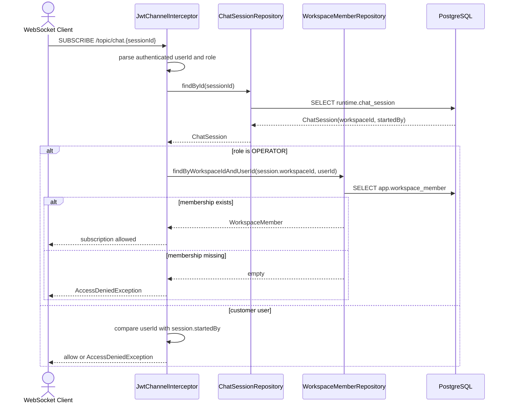
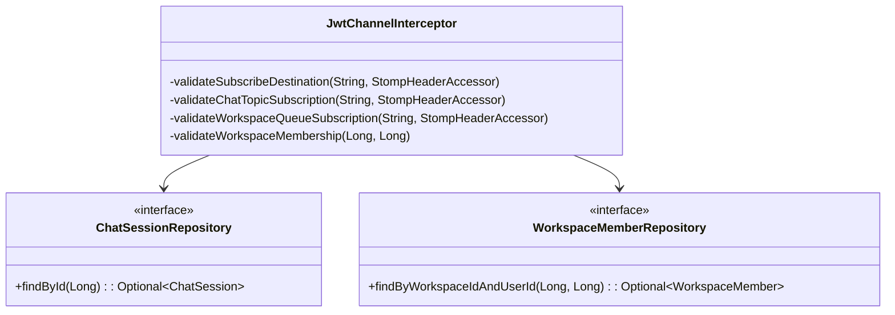

# Backend Spec: 상담 WebSocket chat topic 워크스페이스 멤버십 검증

## Goal

OPERATOR가 `/topic/chat.{sessionId}` WebSocket topic을 구독할 때도 해당 상담 세션의 워크스페이스 멤버십을 검증해 REST API와 WebSocket 접근 제어를 일관되게 만든다.

## Problem

현재 `backend/src/main/java/com/init/workflowruntime/interceptor/JwtChannelInterceptor.java`는 `/topic/workspaces.{workspaceId}.consultation.queue` 구독에서 OPERATOR role과 워크스페이스 멤버십을 함께 확인한다. 반면 `/topic/chat.{sessionId}` 구독은 OPERATOR role이면 세션을 조회하지 않고 바로 허용한다. 다른 워크스페이스의 `sessionId`를 알게 된 OPERATOR가 해당 채팅 topic을 구독할 수 있는 구조라서 sessionId 기반 REST 접근 제어와 WebSocket topic 접근 제어가 다르게 동작한다.

## Scope

- `backend/src/main/java/com/init/workflowruntime/interceptor/JwtChannelInterceptor.java`
- `backend/src/test/java/com/init/workflowruntime/interceptor/JwtChannelInterceptorTest.java`
- 기존 `backend/src/main/java/com/init/workflowruntime/domain/ChatSessionRepository.java`
- 기존 `backend/src/main/java/com/init/workspace/domain/repository/WorkspaceMemberRepository.java`

## Non-Goals

- WebSocket topic 경로, STOMP command, message payload 계약은 변경하지 않는다.
- DB schema나 repository port 계약은 변경하지 않는다.
- assigned counselor 여부 또는 상담 모니터링 권한 정책을 새로 정의하지 않는다. 이번 범위는 이슈 확인 기준인 워크스페이스 멤버십 검증에 한정한다.
- 고객 사용자의 기존 구독 정책, 즉 본인이 시작한 세션만 구독할 수 있는 정책은 변경하지 않는다.

## Sequence Diagram

## WebSocket API

기존 destination 계약은 유지한다.

| STOMP Command | Destination | Access Rule |
| --- | --- | --- |
| `SUBSCRIBE` | `/topic/chat.{sessionId}` | OPERATOR는 세션 워크스페이스 멤버여야 한다. 고객 사용자는 본인이 시작한 세션이어야 한다. |
| `SUBSCRIBE` | `/topic/workspaces.{workspaceId}.consultation.queue` | 기존처럼 OPERATOR role과 워크스페이스 멤버십이 필요하다. |

### Error Cases

| Condition | Expected behavior |
| --- | --- |
| chat topic의 `sessionId`가 숫자가 아님 | `BadRequestException` |
| chat topic의 `sessionId`에 해당하는 세션 없음 | `BadRequestException` with `SESSION_NOT_FOUND` |
| OPERATOR가 세션 워크스페이스 멤버가 아님 | `AccessDeniedException` |
| 고객 사용자가 본인이 시작하지 않은 세션 구독 | `AccessDeniedException` |

## Class Design

## Requirements

1. `JwtChannelInterceptor`는 `/topic/chat.{sessionId}` 구독 시 role과 무관하게 `ChatSessionRepository.findById(sessionId)`로 세션을 조회한다.
2. OPERATOR role인 경우 세션의 `workspaceId`와 인증된 `userId`로 `WorkspaceMemberRepository.findByWorkspaceIdAndUserId`를 호출한다.
3. OPERATOR가 세션 워크스페이스 멤버가 아니면 `AccessDeniedException`으로 구독을 차단한다.
4. 고객 사용자는 기존처럼 `session.startedBy`가 인증된 `userId`와 같은 경우에만 chat topic 구독을 허용한다.
5. workspace queue topic의 기존 OPERATOR role 및 워크스페이스 멤버십 검증 동작은 유지한다.
6. 잘못된 destination 또는 없는 session에 대한 기존 예외 의미를 유지한다.

## Data/API Impacts

- DB migration 없음.
- WebSocket destination 변경 없음.
- REST API 변경 없음.
- repository interface 변경 없음.

## Validation

- `JwtChannelInterceptorTest`에 OPERATOR가 세션 워크스페이스 멤버인 경우 chat topic 구독이 허용되는 케이스를 유지한다.
- `JwtChannelInterceptorTest`에 OPERATOR가 세션 워크스페이스 멤버가 아닌 경우 chat topic 구독이 `AccessDeniedException`으로 거부되는 케이스를 추가한다.
- 기존 고객 사용자 owned/other session 구독 테스트를 유지한다.
- Targeted command: `cd backend && ./gradlew test --tests com.init.workflowruntime.interceptor.JwtChannelInterceptorTest`

## Open Questions

- 없음. assigned counselor 여부 또는 세부 모니터링 권한은 이슈에서 정책 정의 필요 항목으로 언급되었지만, 이번 확인 기준은 워크스페이스 멤버십 일관성이다.
