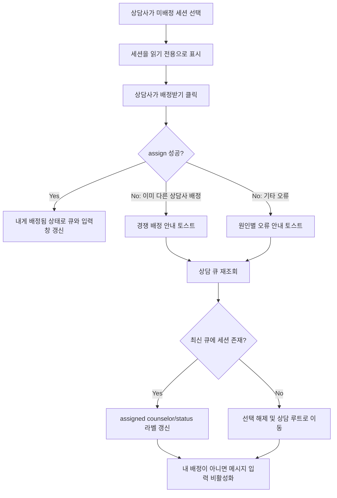

# Frontend FSD Spec: 상담 세션 배정 경쟁 실패 시 화면 상태 복구

## Goal

두 상담사가 같은 미배정 세션을 거의 동시에 배정받으려 할 때, 실패한 상담사의 화면을 서버 최신 상태로 복구하고 메시지 입력이 잘못 활성화되지 않도록 한다.

---

## User Flow Chart



---

## Design Diff

### As-is vs To-be

| 영역 | As-is | To-be | 변경 내용 |
|------|-------|-------|----------|
| 배정 실패 안내 | `상담 세션 배정에 실패했습니다.` 단일 토스트 | 경쟁 배정, 권한, 세션 없음, 일반 오류를 구분 | 서버 에러 코드 기반 메시지 매핑 |
| 배정 실패 후 큐 | 즉시 refetch하지 않음 | 실패 직후 workspace queue를 재조회 | assigned counselor/status 라벨을 서버 상태로 복구 |
| 실패한 세션 선택 상태 | 선택된 상태가 유지될 수 있음 | 최신 큐에서 내 배정이 아니거나 사라지면 선택 해제 | 메시지 입력창이 활성화되지 않도록 보장 |
| optimistic 상태 | 선택과 실제 배정 상태가 혼재될 수 있음 | 선택은 읽기 전용, assign 성공 후에만 내 배정 상태 반영 | `배정받기` 버튼 흐름과 입력 가능 조건 분리 |

---

## Component Tree

```text
ConsultationPage
├─ QueuePanel
│    └─ QueueCustomer rows
├─ ConversationHeader
│    ├─ assignment status badge
│    ├─ claim button
│    └─ response mode controls
└─ ChatPanel
     ├─ assignment status
     ├─ disabled notice
     └─ message input
```

---

## API Integration

### Endpoints

| Method | Path | Description |
|--------|------|-------------|
| GET | `/api/v1/workspaces/{workspaceId}/consultation/queue` | 상담 큐 최신 상태 조회 |
| POST | `/api/v1/consultation/sessions/{sessionId}/assign` | 상담 세션 배정 |

### Error Code Handling

| Code | UI reaction |
|------|-------------|
| `SESSION_ALREADY_ASSIGNED` | "이미 다른 상담사에게 배정된 상담입니다." 안내 후 큐 재조회 및 선택 해제/읽기 전용 복구 |
| `SESSION_NOT_ASSIGNABLE` | "현재 배정할 수 없는 상담 상태입니다." 안내 후 큐 재조회 |
| `SESSION_NOT_FOUND` | "상담 세션을 찾을 수 없습니다." 안내 후 큐 재조회 및 선택 해제 |
| `WORKSPACE_ACCESS_DENIED` | "상담 배정 권한이 없습니다." 안내 후 큐 재조회 |
| `FORBIDDEN` | "상담 배정 권한이 없습니다." 안내 후 큐 재조회 |
| 기타/네트워크 | "상담 세션 배정에 실패했습니다." 안내 후 큐 재조회 시도 |

---

## Data Flow

```text
QueuePanel selection
  -> ConsultationPage.activeCustomerId
  -> read-only ChatPanel unless assignedCounselorId === currentCounselorId
  -> claim button
  -> consultationApi.assignSession
  -> success: replace queue item from response
  -> failure: toast by ApiRequestError.code
  -> consultationApi.getQueue(workspaceId)
  -> reconcile active selection against latest queue
```

---

## 수정 대상 파일

| 파일 | 변경 유형 | 설명 |
|------|----------|------|
| `frontend/src/pages/consultation/ui/ConsultationPage.tsx` | update | 배정 실패 코드 매핑, 실패 후 큐 동기화, 선택 상태 복구 |
| `frontend/src/pages/consultation/ui/ConsultationPage.test.tsx` | update | 경쟁 배정 실패 후 큐 재조회/선택 해제/입력 비활성화 검증 |
| `backend/src/main/java/com/init/workflowruntime/application/CounselorService.java` | update | assign 실패 원인을 구분할 수 있는 에러 코드 반환 |

---

## State Management

### Server State

- 상담 큐는 `consultationApi.getQueue(workspaceId)` 응답을 기준으로 정렬 및 표시한다.
- assign 성공 시에는 assign 응답의 `ChatSession`으로 해당 큐 항목을 갱신한다.
- assign 실패 시에는 항상 큐 재조회를 시도해 서버 상태와 화면을 다시 맞춘다.

### Client State

- `activeCustomerId`는 선택된 세션을 나타내며, 배정 성공을 의미하지 않는다.
- 메시지 입력 가능 여부는 기존처럼 `assignedCounselorId === currentCounselorId` 조건만 따른다.
- assign 실패 후 최신 큐에서 active session이 없거나 다른 상담사에게 배정되어 있으면 active selection을 해제한다.

---

## Tests

### Test Strategy

| 구분 | 방법 | 도구 | 비고 |
|------|------|------|------|
| 컴포넌트 테스트 | 배정 실패 시나리오 렌더링 | Vitest + React Testing Library | 큐 refetch, 토스트, 선택 해제, 입력 비활성화 확인 |
| API/서비스 테스트 | assign 실패 코드 확인 | 기존 backend test 범위에 맞춰 필요 시 추가 | 세션 상태 guard 동작 |
| 수동 테스트 | 두 상담사 동시 배정 | 브라우저 2개 세션 | 실패한 쪽 최신 큐 라벨 확인 |

### Test Scenarios

| # | 시나리오 | 조작 | 기대 결과 |
|---|---------|------|----------|
| 1 | 경쟁 배정 실패 | 미배정 세션 선택 후 assign API가 `SESSION_ALREADY_ASSIGNED` 반환 | 별도 토스트, 큐 재조회, 선택 해제, 입력 비활성화 |
| 2 | 실패 후 세션이 최신 큐에 남음 | refetch 응답에 같은 session이 다른 상담사 배정 상태로 포함 | 큐 라벨이 "다른 상담사 배정"으로 갱신 |
| 3 | 권한/네트워크 오류 | assign API 실패 | 오류 안내 후 큐 재조회 시도, 메시지 입력은 내 배정이 아니면 비활성화 |

---

## Non-goals

- 자동 재시도 또는 배정 대기열 잠금 UX는 포함하지 않는다.
- 상담 큐 WebSocket 프로토콜을 변경하지 않는다.
- 메시지 전송 권한 판정 조건을 확장하지 않는다.

---

## Open Questions

- HTTP 상태를 409 Conflict로 분리할지 여부는 현재 공통 예외 계층과 호환성을 고려해 별도 후속 논의로 남긴다. 이번 범위에서는 명확한 error code 제공과 FE 반응을 우선한다.
