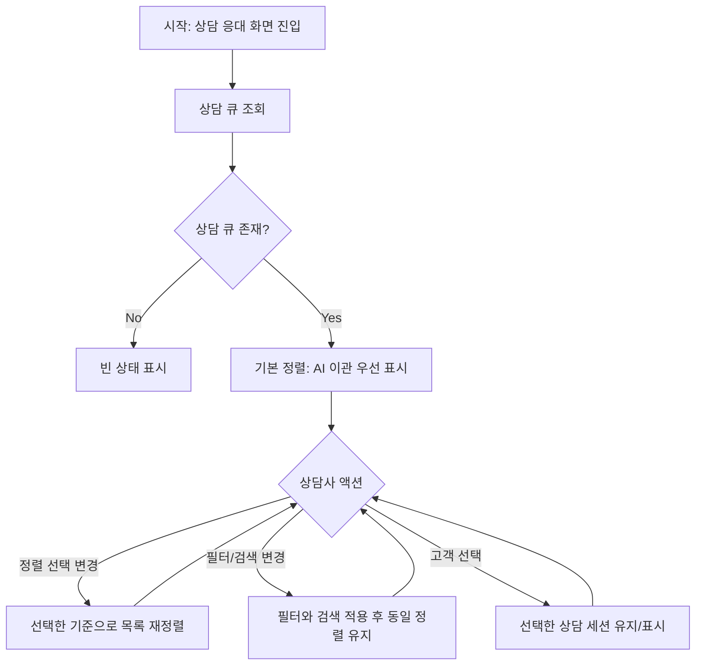

# [FE] #362 — 상담 대기열 정렬 기준 명확화

> 이 스펙은 상담 큐에서 상담사가 목록 정렬 기준을 직접 확인하고 전환할 수 있게 하는 프론트엔드 개선을 정의한다.
> FSD (Feature-Sliced Design) 아키텍처를 따른다.

---

## Goal

상담 큐 목록에 명시적인 정렬 선택 UI를 제공하여 상담사가 AI 이관 우선, 오래 기다린 순, 최신순 기준으로 대기열을 확인할 수 있게 한다.

---

## User Flow Chart



---

## Design Diff

### As-is vs To-be

| 영역 | As-is | To-be | 변경 내용 |
|------|-------|-------|----------|
| 기본 대기열 순서 | API/페이지 로직의 우선순위 정렬에 의존 | UI에 기본 정렬 기준을 명시 | 상담사가 현재 목록 기준을 바로 인지 |
| 정렬 변경 | 변경 불가 | `AI 이관 우선`, `오래 기다린 순`, `최신순` 선택 가능 | 상담 현장 우선순위에 맞춰 전환 |
| 대기 시간 표시 | `대기 N분` 또는 마지막 메시지 시간을 표시 | 오래 기다린 순 선택 시 `waitMinutes` 내림차순으로 정렬 | 표시 문구와 목록 순서의 의미 불일치 완화 |
| 상태 보존 | 선택/읽지 않음 상태는 큐 아이템 속성에 의존 | 정렬 변경 후에도 같은 `id` 기반 선택/읽지 않음 표시 유지 | active selection과 unread 표시 유지 |

---

## Component Tree

```
ConsultationPage
└─ QueuePanel
   ├─ SearchInput
   ├─ FilterTabs
   ├─ SortControl
   │  └─ SortButtons
   ├─ ResultCount
   └─ QueueItem[]
      ├─ CustomerAvatar
      ├─ CustomerSummary
      └─ QueueMeta
```

---

## API Integration

### Endpoints

| Method | Path | Description | 변경 여부 |
|--------|------|-------------|----------|
| GET | `/api/v1/workspaces/{workspaceId}/consultation/queue` | 상담 큐 조회 | 변경 없음 |

현재 백엔드의 `ConsultationService.getActiveQueue`는 AI 이관 우선 및 이관 시각 기반 정렬을 이미 적용한다. 이번 이슈에서는 서버 정렬 파라미터를 추가하지 않고, 클라이언트가 받은 큐 배열을 표시 기준에 맞게 재정렬한다.

---

## Data Flow

```
┌─────────────────────────────────────────┐
│ pages/consultation                       │
│ ConsultationPage                         │
│ - API/WebSocket 큐 데이터를 QueueCustomer로 변환 │
└───────────────────────┬─────────────────┘
                        │ props
                        ▼
┌─────────────────────────────────────────┐
│ features/consultation/ui                 │
│ QueuePanel                               │
│ - filter/search 적용                     │
│ - sortMode 상태로 visibleCustomers 정렬  │
│ - activeCustomerId/hasUnread는 id 기반 유지 │
└─────────────────────────────────────────┘
```

---

## 수정 대상 파일

| 파일 | 변경 유형 | 설명 |
|------|----------|------|
| `frontend/src/features/consultation/ui/QueuePanel.tsx` | modify | 상담 큐 정렬 옵션, 정렬 함수, 정렬 기준 표시 추가 |
| `frontend/src/features/consultation/ui/queue-panel.module.css` | modify | 정렬 선택 컨트롤 스타일 추가 |
| `frontend/src/features/consultation/ui/QueuePanel.test.tsx` | modify | 정렬 모드, active selection, unread 유지 검증 추가 |
| `frontend/src/pages/consultation/ui/ConsultationPage.tsx` | unchanged | 기존 QueuePanel 조합 유지 |
| `backend/src/main/java/com/init/workflowruntime/application/ConsultationService.java` | unchanged | 서버 API 정렬 파라미터는 이번 범위에서 추가하지 않음 |

---

## State Management

### Client State

`QueuePanel` 내부에 정렬 모드 로컬 상태를 둔다.

```typescript
type QueueSortMode = "handoffPriority" | "waitLongest" | "latest";
```

정렬 모드는 필터와 검색 상태와 독립적으로 유지한다. 필터/검색으로 노출 목록이 줄어들어도 선택된 정렬 기준은 바뀌지 않는다.

---

## Requirements

1. 상담 큐 상단에서 현재 정렬 기준을 확인할 수 있어야 한다.
2. 기본 정렬은 AI 이관 세션을 먼저 보여주고, AI 이관끼리는 오래된 이관 시각이 먼저 오도록 한다.
3. 오래 기다린 순 정렬은 `waitMinutes`가 큰 세션을 먼저 보여주고, 동률이면 안정적인 보조 기준을 적용한다.
4. 최신순 정렬은 최신 활동 시각 또는 시작 시각이 최신인 세션을 먼저 보여준다.
5. 정렬 변경은 `activeCustomerId` 기반 선택 표시와 `hasUnread` 기반 읽지 않음 표시를 훼손하지 않아야 한다.
6. 기존 필터, 검색, 로딩, 에러, 빈 상태 동작은 유지되어야 한다.

---

## Non-goals

- 서버 API에 `sort` 쿼리 파라미터를 추가하지 않는다.
- 백엔드 DB 조회 순서나 WebSocket 이벤트 계약을 변경하지 않는다.
- 상담 배정, unread 계산, 메시지 로딩 정책을 변경하지 않는다.

---

## Tests

### Test Scenarios

| # | 시나리오 | 조작 | 기대 결과 |
|---|---------|------|----------|
| 1 | 기본 정렬 기준 확인 | 상담 큐 표시 | `AI 이관 우선`이 active로 표시되고 handoff 세션이 우선 노출 |
| 2 | 오래 기다린 순 변경 | 정렬 버튼 클릭 | `waitMinutes`가 큰 고객부터 표시 |
| 3 | 최신순 변경 | 정렬 버튼 클릭 | 최신 `lastMessageAt`/`startedAt` 기준으로 표시 |
| 4 | 정렬 변경 중 상태 보존 | active 고객과 unread 고객이 있는 큐에서 정렬 변경 | 선택 표시와 unread indicator 유지 |
| 5 | 필터/검색 결합 | 필터 또는 검색 후 정렬 변경 | 조건에 맞는 목록 안에서 정렬 적용 |

### Validation

- `cd frontend && pnpm test -- QueuePanel.test.tsx`
- 필요 시 `cd frontend && pnpm lint`

---

## Open Questions

- 향후 큐 규모가 커질 경우 서버 정렬 파라미터가 필요할 수 있으나, 이번 이슈에서는 클라이언트 표시 정렬로 해결한다.
