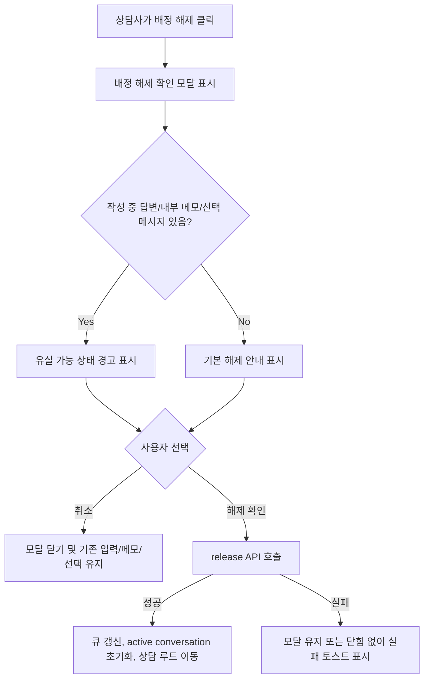

# Issue 363 Spec: 상담 배정 해제 전 확인과 작성 중 내용 보호

## Goal

상담사가 현재 배정된 상담을 해제하기 전에 해제 결과와 유실 가능성이 있는 작성 중 상태를 확인하고, 취소하면 기존 작업 맥락을 그대로 유지할 수 있게 한다.

## Problem

상담 화면의 `배정 해제` 버튼은 클릭 즉시 release API를 호출한다. 해제 성공 후 현재 대화, 선택된 메시지, 작성 중인 답변, 내부 메모 화면이 비워질 수 있지만, 상담사는 이 영향을 사전에 확인할 수 없다. 상담 종료에는 확인 모달이 있으나 배정 해제에는 별도 보호 흐름이 없다.

## Scope

- `frontend/src/pages/consultation/ui/ConsultationPage.tsx`
- `frontend/src/pages/consultation/ui/consultation-page.module.css`
- `frontend/src/features/consultation/ui/ChatPanel.tsx`
- `frontend/src/features/consultation/ui/ChatPanel.test.tsx`
- `frontend/src/pages/consultation/ui/ConsultationPage.test.tsx`

## Non-goals

- 배정 해제 사유를 서버에 저장하거나 release API request body를 변경하지 않는다.
- Backend domain 또는 REST endpoint 동작은 변경하지 않는다.
- 자동 임시저장, 브라우저 이탈 방지, 세션 간 작성 내용 복원 정책은 이번 범위에 포함하지 않는다.
- 상담 종료 모달 정책은 변경하지 않는다.

## User Flow Chart



## Design Diff

| 영역 | As-is | To-be | 변경 내용 |
| --- | --- | --- | --- |
| 배정 해제 액션 | 버튼 클릭 즉시 API 호출 | 확인 모달에서 명시 확인 후 API 호출 | 실수 방지 |
| 작성 중 답변 | 해제 전 감지 불가 | 답변 입력창에 내용이 있으면 경고 | 유실 인지 |
| 내부 메모 | 해제 전 감지 불가 | 우측 내부 메모 textarea에 내용이 있으면 경고 | 유실 인지 |
| 선택 메시지 | 해제 전 감지 불가 | 메시지 상세 선택 상태가 있으면 경고 | 맥락 유실 인지 |
| 취소 | API 호출 이후 되돌릴 수 없음 | API 호출 없이 모달만 닫음 | 기존 상태 유지 |

## Component Tree

```text
ConsultationPage
├─ QueuePanel
├─ ChatPanel
│    └─ controlled composer draft state
├─ CustomerPanel
└─ ReleaseAssignmentDialog
     ├─ release result notice
     ├─ unsaved-state warning list
     └─ cancel / confirm actions
```

## API Integration

기존 endpoint를 유지한다.

| Method | Path | Description |
| --- | --- | --- |
| POST | `/api/v1/consultation/sessions/:id/release` | 현재 상담사 배정 해제 |

release API는 사용자가 모달에서 `해제 확인`을 누른 뒤에만 호출한다. API payload 또는 response DTO 변경은 없다.

## State Management

- `ChatPanel`은 작성 중 답변과 NOTE 모드 여부를 부모가 관찰할 수 있도록 composer draft 값을 props로 받거나 변경 이벤트를 전달한다.
- `ConsultationPage`는 활성 세션별 작성 중 답변, 우측 내부 메모, 선택 메시지 상태를 기준으로 배정 해제 경고 항목을 계산한다.
- 취소는 release API를 호출하지 않고 모달만 닫는다.
- 해제 성공은 기존 동작처럼 queue row를 서버 응답 기준으로 갱신하고 active conversation을 초기화한다.
- 해제 실패는 API 실패 토스트를 표시하고 사용자가 입력 상태를 잃지 않도록 active conversation을 유지한다.

## Acceptance Criteria

- `배정 해제` 버튼 클릭만으로 release API가 호출되지 않는다.
- 확인 모달은 해제 후 세션이 미배정 대기열로 돌아간다는 점을 안내한다.
- 작성 중 답변, 내부 메모, 선택된 메시지 중 하나라도 있으면 별도 경고가 표시된다.
- 모달에서 취소하면 작성 중 답변, 내부 메모, 선택 메시지 상태가 유지된다.
- 모달에서 해제 확인을 누른 뒤에만 release API가 호출된다.
- 해제 성공 후 큐와 active conversation 상태는 서버 release 응답에 맞춰 갱신된다.

## Validation

- Frontend tests:
  - `ConsultationPage`에서 배정 해제 클릭만으로 `releaseSession`이 호출되지 않는지 검증한다.
  - 작성 중 답변/내부 메모/선택 메시지가 있을 때 경고가 표시되는지 검증한다.
  - 취소 시 입력/메모/선택 상태가 유지되는지 검증한다.
  - 확인 시 release API가 호출되고 기존 성공 흐름이 유지되는지 검증한다.
  - `ChatPanel`이 composer draft 변경을 부모에 전달하고 controlled draft를 렌더링하는지 검증한다.
- Targeted local command:
  - `cd frontend && pnpm test -- --run src/features/consultation/ui/ChatPanel.test.tsx src/pages/consultation/ui/ConsultationPage.test.tsx`

## Open Questions

- 배정 해제 사유 선택/입력은 서버 계약 변경이 필요한 제품 정책이다. 이번 이슈에서는 검토 대상으로 남기고 구현 범위에 포함하지 않는다.
