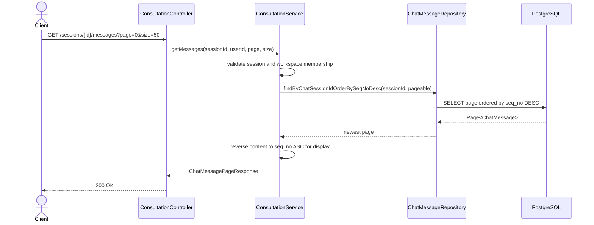
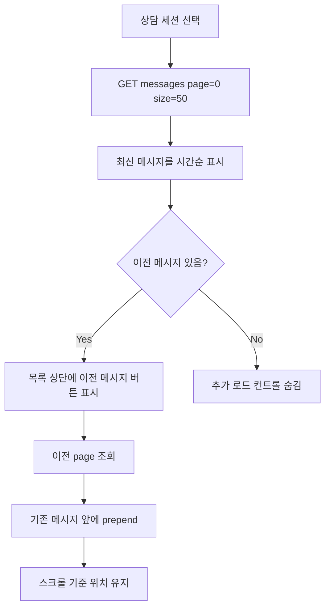

# [FE/BE] 상담 메시지 조회 pagination 계약 실제 구현

## Goal

상담 메시지 조회 API와 프론트 상담 화면이 동일한 `page`/`size` pagination 계약을 사용하여 긴 상담 세션도 최근 메시지부터 가볍게 로드한다.

## Problem

- `frontend/src/features/consultation/api/consultationApi.ts`는 메시지 조회 시 `page`, `size` query string을 만들 수 있다.
- `backend/src/main/java/com/init/workflowruntime/presentation/ConsultationController.java`의 `GET /api/v1/consultation/sessions/{sessionId}/messages`는 query parameter를 받지 않고 전체 메시지를 반환한다.
- `backend/src/main/java/com/init/workflowruntime/domain/ChatMessageRepository.java`는 현재 세션 전체 메시지를 `seqNo` 오름차순으로 조회한다.
- 실시간 상담 화면과 상담 기록 화면에서 긴 이력을 처음 열 때 전체 메시지 조회에 의존할 수 있다.

## Scope

- 메시지 조회 endpoint에 `page`와 `size` query parameter를 적용한다.
- 응답은 `content`, `page`, `size`, `totalElements`, `totalPages` metadata를 포함한다.
- `page=0`은 최신 메시지 묶음을 의미한다. 각 page의 `content`는 화면 렌더링을 위해 `seqNo` 오름차순으로 반환한다.
- 실시간 상담 화면은 세션 선택 시 `page=0`, `size=50`으로 최근 메시지를 먼저 조회한다.
- 실시간 상담 화면은 메시지 목록 상단에서 이전 메시지 page를 추가로 불러올 수 있어야 하며, 기존 스크롤 위치가 급격히 튀지 않아야 한다.
- 상담 기록 화면은 동일한 메시지 pagination metadata를 사용해 이전 메시지 page를 조회한다.
- 백엔드와 프론트 테스트는 동일한 `page`/`size` 계약과 metadata를 검증한다.

## Non-goals

- cursor 기반 pagination으로 전환하지 않는다.
- 상담 세션 목록 API 계약은 변경하지 않는다.
- WebSocket 실시간 메시지 전송/수신 계약은 변경하지 않는다.
- OpenAPI generated 파일을 직접 수정하지 않는다. generated endpoint가 query parameter를 반영하기 전까지 수동 wrapper가 미생성 계약을 보완한다.

## REST API

### Endpoint

| Method | Path | Description |
| --- | --- | --- |
| GET | `/api/v1/consultation/sessions/{sessionId}/messages?page=0&size=50` | 상담 메시지 page 조회 |

### Query Parameters

| 이름 | 기본값 | 제약 | 설명 |
| --- | --- | --- | --- |
| `page` | `0` | `0` 이상 | 최신 묶음부터 시작하는 page index |
| `size` | `50` | `1` 이상, `100` 이하 | page당 메시지 수 |

### Response

```json
{
  "content": [
    {
      "id": 101,
      "seqNo": 42,
      "senderRole": "CUSTOMER",
      "messageType": "TEXT",
      "content": "환불하고 싶습니다",
      "createdAt": "2026-06-01T10:00:00+09:00"
    }
  ],
  "page": 0,
  "size": 50,
  "totalElements": 123,
  "totalPages": 3
}
```

## Backend Design

### Affected Bounded Context

- `workflow-runtime`

### Sequence Diagram



### Class Design

| 파일 | 변경 유형 | 설명 |
| --- | --- | --- |
| `backend/src/main/java/com/init/workflowruntime/presentation/ConsultationController.java` | modify | `page`, `size` request parameter 수신 |
| `backend/src/main/java/com/init/workflowruntime/application/ConsultationService.java` | modify | membership 검증 후 paged message 조회 |
| `backend/src/main/java/com/init/workflowruntime/application/dto/ChatMessagePageResponse.java` | new | 메시지 content와 pagination metadata 응답 |
| `backend/src/main/java/com/init/workflowruntime/domain/ChatMessageRepository.java` | modify | `Pageable` 기반 메시지 조회 포트 추가 |
| `backend/src/main/java/com/init/workflowruntime/infrastructure/persistence/JpaChatMessageRepository.java` | no direct edit | Spring Data repository가 domain port의 query method를 자동 구현 |

## Frontend Design

### Affected Slices

- `pages/consultation`
- `features/consultation`

### User Flow



### Frontend Files

| 파일 | 변경 유형 | 설명 |
| --- | --- | --- |
| `frontend/src/features/consultation/api/consultationApi.ts` | modify | 메시지 page 응답 타입과 wrapper 추가 |
| `frontend/src/features/consultation/api/chatHistoryApi.ts` | modify | 상담 기록 화면에서 page metadata 사용 |
| `frontend/src/features/consultation/api/chatHistoryKeys.ts` | modify | query key가 page/size를 포함하도록 유지 |
| `frontend/src/pages/consultation/ui/ConsultationPage.tsx` | modify | 최근 메시지 초기 로드 및 이전 page 로드 처리 |
| `frontend/src/features/consultation/ui/ChatPanel.tsx` | modify | 상단 이전 메시지 로드 컨트롤과 스크롤 보존 처리 |
| `frontend/src/features/consultation/ui/chat-history/MessageHistory.tsx` | modify | 이전 page 로드 및 metadata 기반 카운트 표시 |

## Data and API Impacts

- DB schema 변경은 없다.
- 기존 메시지 저장 순서와 `seqNo` 의미는 유지한다.
- 기존 `GET /messages` 호출은 기본값 `page=0`, `size=50`을 적용하므로 더 이상 전체 목록을 반환하지 않는다.
- 프론트 wrapper는 legacy array 응답을 방어적으로 처리할 수 있지만, 정상 계약은 metadata가 있는 page 응답이다.

## Acceptance Criteria

1. `GET /api/v1/consultation/sessions/{sessionId}/messages?page=0&size=50`가 전체 메시지가 아니라 최신 50개 이하만 반환한다.
2. 응답에는 `content`, `page`, `size`, `totalElements`, `totalPages`가 포함된다.
3. `page=1` 요청은 그 이전 메시지 묶음을 반환하고 각 `content`는 `seqNo` 오름차순이다.
4. `page < 0`, `size <= 0`, `size > 100` 요청은 validation error로 거부된다.
5. 실시간 상담 화면은 세션 선택 시 최근 메시지만 먼저 표시하고, 이전 메시지가 있으면 상단에서 추가 로드할 수 있다.
6. 이전 메시지를 prepend할 때 사용자가 보던 메시지 위치가 자연스럽게 유지된다.
7. 상담 기록 화면도 동일한 page metadata를 사용해 이전 메시지를 추가 조회한다.
8. 백엔드 controller/service 테스트와 프론트 API/hook/component 테스트가 위 계약을 검증한다.

## Validation Plan

- Backend: `cd backend && ./gradlew test --tests '*ConsultationControllerTest' --tests '*ConsultationServiceTest'`
- Frontend: `cd frontend && pnpm test -- --run src/features/consultation/api/consultationApi.test.ts src/features/consultation/api/chatHistoryApi.test.ts src/features/consultation/ui/ChatPanel.test.tsx src/features/consultation/ui/chat-history/MessageHistory.test.tsx src/pages/consultation/ui/ConsultationPage.test.tsx src/entities/chat/api/chatApi.test.ts`
- Frontend lint/build: changed-file `eslint`와 `pnpm build`

## Open Questions

- 없음. 이 이슈에서는 cursor 방식 대신 현재 프론트 wrapper가 이미 노출한 `page`/`size`를 실제 계약으로 확정한다.

## Spec Self-review

### Pass 1: Issue Fidelity

- 이슈의 명시 요구사항인 백엔드 pagination 적용, 긴 세션 초기 전체 조회 회피, 이전 메시지 로드, 프론트/백엔드 계약 정렬, metadata 반환을 모두 acceptance criteria에 반영했다.
- cursor 방식은 대안으로만 제시되었으므로 non-goal로 두고 `page`/`size`를 확정했다.

### Pass 2: Ostone Compliance

- 최종 브랜치: `feature/364-consultation-message-pagination`
- 스펙 파일명: `.agent/specs/364.md`
- 혼합 FE/BE 작업이지만 API 계약이 중심이므로 Backend 템플릿을 기준으로 Frontend 섹션을 분리했다.
- 참조한 모든 파일 경로는 repository inspection으로 존재를 확인했다.
