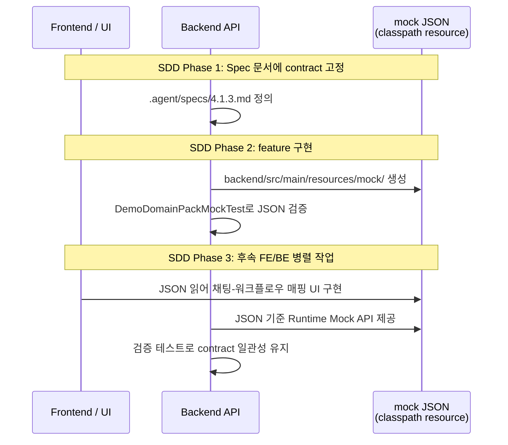

# [BE-4.1.3] 데모 Runtime용 Domain Pack Mock JSON Contract

> **Backlog**: 4.1.3 Domain Pack Mock 데이터 contract 정의
> **Bounded Context**: `domainpack`
> **Template**: `_TEMPLATE_BE.md`
> **Branch**: `spec/4.1.3`
> **작업 브랜치 (구현 단계)**: `feature/4.1.3-demo-runtime-domain-pack-mock`

---

## Goal

데모용 Runtime 환경에서 사용할 canonical Domain Pack Mock JSON contract를 정의한다. 이 스펙은 후속 FE/BE 병렬 작업이 동일한 ID 규칙, cross-reference 불변식, workflow graph 형태를 공유할 수 있도록 기준 데이터 구조를 고정한다.

- 후속 FE 작업: `backend/src/main/resources/mock/demo-domain-pack.json`을 읽어 채팅-워크플로우 매핑 UI를 구현
- 후속 BE 작업: 같은 JSON을 기준으로 Runtime Mock 데이터를 제공하는 API를 구현
- mock JSON은 최종 API DTO를 보장하지 않고, 후속 구현의 contract 기준으로만 취급한다.

---

## Sequence Diagram



---

## REST API

**N/A** — 이 스펙은 신규 엔드포인트를 정의하지 않는다. REST API는 후속 구현 작업(`feature/4.1.3-demo-runtime-domain-pack-mock`)에 포함되거나, 이 JSON을 사용하는 별도 API 스펙에서 정의한다.

---

## Data Contract

이 절은 _TEMPLATE_BE.md의 "Class Design" 섹션을 Data Contract 중심으로 대체한다. 신규 Java 클래스/서비스/리포지토리가 없으므로, JSON 구조와 불변식 자체를 계약의 중심에 둔다.

### Top-Level JSON Shape

```json
{
  "domainPack": { ... },
  "version": { ... },
  "intents": [ ... ],
  "slots": [ ... ],
  "policies": [ ... ],
  "risks": [ ... ],
  "workflows": [ ... ]
}
```

최상위 필드는 모두 필수이며, 빈 배열(`[]`)은 허용하지 않는다.

### ID 및 코드 명명 규칙

| 규칙 | 내용 |
|------|------|
| `id` | DB 저장을 가정한 deterministic numeric ID. 100번대 범위 사용 (pack 100, version 101, intent 110-112, slot 120-125, policy 130-134, risk 140-142, workflow 150-152). binding 관계는 별도 컬렉션 없이 intent 내부 참조(requiredSlotIds, workflowId)로 표현한다. |
| `*Code` | stable ASCII lowercase underscore code. 후속 API에서 참조 키로 사용 |
| `packKey` | `cs-demo-ecommerce` |
| `*Code` 예시 | `cancel_order`, `order_number`, `check_available`, `high_value_cancel` |
| `version.versionNo` | 정수. mock은 `1` |

### Display Text vs Code 분리

- **한국어 필드**: `name`, `description`, `promptHint` — 사람이 읽는 UI 텍스트
- **ASCII 필드**: `*Code`, `*Ref`, `id` — 시스템 참조 키, 코드 값
- 혼용 금지: 한국어를 코드/ref 값에 사용하지 않고, ASCII를 display text에 사용하지 않는다.

### 컬렉션별 항목 수 (Mock)

| 컬렉션 | 개수 | 비고 |
|--------|------|------|
| `intents` | 3 | `cancel_order`, `change_address`, `check_refund_status` |
| `slots` | 6 | 주문번호, 사유, 새주소, 환불금액, 고객명, 연락처 |
| `policies` | 5 | `check_available`, `address_change_limit`, `refund_amount_check`, `high_value_alert`, `return_deadline_check` |
| `risks` | 3 | 고액취소, 주소사기, 환불지연 |
| `workflows` | 3 | 취소처리, 주소변경, 환불상태조회 |

### 필드별 Status 값

| 엔티티 | Status 필드 | 허용값 | Mock 값 |
|--------|-------------|--------|---------|
| `domainPack` | `status` | `ACTIVE` | `ACTIVE` |
| `version` | `lifecycleStatus` | `DRAFT`, `PUBLISHED` | `PUBLISHED` |
| `intent` | `status` | `DRAFT`, `PUBLISHED`, `REJECTED` | `PUBLISHED` |
| `slot` | `status` | `ACTIVE`, `INACTIVE` | `ACTIVE` |
| `policy` | `status` | `ACTIVE`, `INACTIVE` | `ACTIVE` |
| `risk` | `status` | `ACTIVE`, `INACTIVE` | `ACTIVE` |

> **주의**: `intent.status`에 `ACTIVE`는 @Deprecated이므로 절대 사용하지 않는다.

### 각 엔티티 JSON Shape

#### domainPack

```json
{
  "id": 100,
  "workspaceId": 1,
  "packKey": "cs-demo-ecommerce",
  "name": "이커머스 고객센터 데모",
  "description": "이커머스 CS 시나리오 기반 데모용 도메인 팩",
  "status": "ACTIVE"
}
```

#### version

```json
{
  "id": 101,
  "domainPackId": 100,
  "versionNo": 1,
  "lifecycleStatus": "PUBLISHED",
  "summaryJson": {}
}
```

`summaryJson`은 객체, `sourcePipelineJobId`는 mock에서 생략 가능하다.

#### intent

```json
{
  "id": 110,
  "intentCode": "cancel_order",
  "name": "주문 취소",
  "description": "고객이 배송 전 주문을 취소하려는 의도",
  "taxonomyLevel": 1,
  "parentIntentId": null,
  "status": "PUBLISHED",
  "requiredSlotIds": [120, 121],
  "workflowIds": [150],
  "entryConditionJson": {},
  "sourceClusterRef": {},
  "evidenceJson": [],
  "metaJson": {}
}
```

- `requiredSlotIds[]`: 이 intent에 필요한 slot의 `id` 배열. 순서는 수집 순서를 의미한다.
- `workflowIds[]`: 이 intent에 연결된 workflow의 `id` 배열. mock에서는 1개가 기본이며 `isPrimary=true`로 간주한다.
- `entryConditionJson` / `sourceClusterRef` / `metaJson`: JSONB 객체, default `{}`
- `evidenceJson`: JSONB 배열, default `[]`

#### slot

```json
{
  "id": 120,
  "slotCode": "order_number",
  "name": "주문번호",
  "description": "취소 or 조회 대상 주문의 식별 번호",
  "dataType": "STRING",
  "isSensitive": false,
  "status": "ACTIVE",
  "validationRuleJson": {},
  "defaultValueJson": null,
  "metaJson": {}
}
```

`dataType`은 `STRING | NUMBER | BOOLEAN | DATE | ADDRESS` 중 하나. `defaultValueJson`은 nullable.

#### policy

```json
{
  "id": 130,
  "policyCode": "check_available",
  "name": "취소 가능 여부 확인",
  "description": "주문 상태가 취소 가능한 상태인지 확인",
  "severity": "HIGH",
  "status": "ACTIVE",
  "conditionJson": {},
  "actionJson": {},
  "evidenceJson": [],
  "metaJson": {}
}
```

`severity`는 `LOW | MEDIUM | HIGH | CRITICAL`.

#### risk

```json
{
  "id": 140,
  "riskCode": "high_value_cancel",
  "name": "고액 주문 취소",
  "description": "고액 주문 취소 시 추가 확인 필요",
  "riskLevel": "HIGH",
  "status": "ACTIVE",
  "triggerConditionJson": {},
  "handlingActionJson": {},
  "evidenceJson": [],
  "metaJson": {}
}
```

`riskLevel` 값: `LOW | MEDIUM | HIGH | CRITICAL` (enum `RiskLevel` 참조).

#### workflow

```json
{
  "id": 150,
  "workflowCode": "cancel_order_flow",
  "name": "주문 취소 처리",
  "description": "주문 취소 요청을 접수하고 처리하는 워크플로우",
  "initialState": "start",
  "terminalStatesJson": ["cancelled", "rejected"],
  "graphJson": { ... },
  "evidenceJson": [],
  "metaJson": {}
}
```

### Workflow Graph Invariants

`graphJson`은 DAG(Directed Acyclic Graph) 형태의 워크플로우를 표현한다. JSON 구조:

```json
{
  "direction": "top-to-bottom",
  "nodes": [
    { "id": "start", "type": "START", "label": "시작" },
    { "id": "n1", "type": "ACTION", "label": "주문 확인", "policyRef": "check_available" },
    { "id": "n2", "type": "DECISION", "label": "취소 가능?" },
    { "id": "n3", "type": "ACTION", "label": "고액 취소 알림", "policyRef": "high_value_alert" },
    { "id": "end_cancelled", "type": "TERMINAL", "label": "취소 완료" },
    { "id": "end_rejected", "type": "TERMINAL", "label": "취소 불가" }
  ],
  "edges": [
    { "id": "e1", "from": "start", "to": "n1" },
    { "id": "e2", "from": "n1", "to": "n2" },
    { "id": "e3", "from": "n2", "to": "n3", "label": "가능" },
    { "id": "e4", "from": "n2", "to": "end_rejected", "label": "불가능" },
    { "id": "e5", "from": "n3", "to": "end_cancelled" }
  ]
}
```

#### 그래프 불변식

| ID | 불변식 | 검증 방법 |
|----|--------|-----------|
| G1 | `direction`은 항상 `"top-to-bottom"` | 문자열 일치 |
| G2 | `nodes[]`는 최소 2개 이상 (START + 최소 1 TERMINAL) | 배열 크기 >= 2 |
| G3 | `nodes[].type`는 `START`, `TERMINAL`, `DECISION`, `ACTION` 중 하나 | 집합 포함 검사 |
| G4 | START 노드는 정확히 1개 | `nodes[].type` 중 START = 1 |
| G5 | TERMINAL 노드는 최소 1개 | `nodes[].type` 중 TERMINAL >= 1 |
| G6 | `nodes[].id`는 그래프 내에서 유일 | ID 중복 검사 |
| G7 | `edges[].id`는 그래프 내에서 유일 | ID 중복 검사 |
| G8 | `edges[].from`과 `edges[].to`는 모두 `nodes[].id`에 존재 | 참조 무결성 |
| G9 | DECISION 타입 노드에서 나가는 모든 edge는 `label`을 가짐 | DECISION 노드의 outgoing edge에 label 존재 |
| G10 | ACTION 타입 노드는 `policyRef`가 선택적으로 존재. 존재할 경우 `policies[].policyCode` 중 하나와 일치 | cross-entity 참조 검사 |
| G11 | 노드 `id`는 DB id와 혼동되지 않는 stable string (예: `start`, `n1`, `n2`, `end_cancelled`) | 영문 소문자 + underscore |
| G12 | 순환 구조 없음 (DAG) | 위상 정렬 가능 |

### Cross-Reference Invariants

| ID | 참조 | 방향 | 설명 |
|----|------|------|------|
| R1 | intent → slot | `requiredSlotIds[]` → `slots[].id` | 각 requiredSlotId가 slots 배열에 존재 |
| R2 | intent → workflow | `workflowIds[]` → `workflows[].id` | 각 workflowId가 workflows 배열에 존재 |
| R3 | workflow ACTION → policy | `graphJson.nodes[].policyRef` → `policies[].policyCode` | ACTION 노드의 policyRef가 policies 내 존재 |
| R4 | workflow → version | `workflows[].domainPackVersionId` (id를 통한 간접 참조) | version.id가 존재 |

### Demo Scenario

mock 데이터는 가상의 한국어 이커머스 CS 도메인을 모델링한다.

#### 시나리오 개요

```
고객이 "주문 취소해줘"라고 문의 → 시스템이 cancel_order intent 식별
→ order_number, reason slot 수집
→ check_available policy로 취소 가능 여부 확인
→ DECISION 노드에서 분기 (가능 → 취소 처리, 불가능 → 반려)
→ ACTION 노드에서 high_value_alert policyRef로 고액 취소 알림 정책 적용
→ TERMINAL 상태 도달
```

#### 의도별 연결

| Intent | Code | Required Slot Codes | Workflow Code |
|--------|------|---------------------|---------------|
| 주문 취소 | `cancel_order` | `order_number`, `reason` | `cancel_order_flow` |
| 배송지 변경 | `change_address` | `order_number`, `new_address` | `change_address_flow` |
| 환불 상태 확인 | `check_refund_status` | `order_number` | `check_refund_flow` |

#### 정책별 ACTION 노드 참조

| Policy Code | 참조하는 Workflow | ACTION 노드 label |
|-------------|-------------------|-------------------|
| `check_available` | `cancel_order_flow` | 주문 확인 |
| `high_value_alert` | `cancel_order_flow` | 고액 취소 알림 |
| `address_change_limit` | `change_address_flow` | 변경 가능 확인 |
| `refund_amount_check` | `check_refund_flow` | 환불 금액 확인 |
| `return_deadline_check` | `check_refund_flow` | 반품 기한 확인 |

#### 리스크 연결

| Risk Code | 연관 Policy | 설명 |
|-----------|-------------|------|
| `high_value_cancel` | `check_available` | 고액 주문 취소 시 추가 확인 정책 연동 |
| `address_fraud` | `address_change_limit` | 주소 변경 사기 탐지 정책 연동 |
| `refund_delay` | `refund_amount_check` | 환불 지연 리스크 알림 정책 연동 |

### 대표 JSON Payload (약식)

다음은 최상위 구조를 보여주는 대표적인 partial JSON이다. 전체 payload는 `backend/src/main/resources/mock/demo-domain-pack.json`에 포함된다.

```json
{
  "domainPack": {
    "id": 100,
    "workspaceId": 1,
    "packKey": "cs-demo-ecommerce",
    "name": "이커머스 고객센터 데모",
    "description": "이커머스 CS 시나리오 기반 데모용 도메인 팩",
    "status": "ACTIVE"
  },
  "version": {
    "id": 101,
    "domainPackId": 100,
    "versionNo": 1,
    "lifecycleStatus": "PUBLISHED",
    "summaryJson": {}
  },
  "intents": [
    {
      "id": 110,
      "intentCode": "cancel_order",
      "name": "주문 취소",
      "description": "고객이 배송 전 주문을 취소하려는 의도",
      "taxonomyLevel": 1,
      "status": "PUBLISHED",
      "requiredSlotIds": [120, 121],
      "workflowIds": [150]
    }
  ],
  "slots": [
    {
      "id": 120,
      "slotCode": "order_number",
      "name": "주문번호",
      "dataType": "STRING",
      "isSensitive": false,
      "status": "ACTIVE",
      "validationRuleJson": {},
      "defaultValueJson": null,
      "metaJson": {}
    }
  ],
  "policies": [
    {
      "id": 130,
      "policyCode": "check_available",
      "name": "취소 가능 여부 확인",
      "severity": "HIGH",
      "status": "ACTIVE",
      "conditionJson": {},
      "actionJson": {},
      "evidenceJson": [],
      "metaJson": {}
    }
  ],
  "risks": [
    {
      "id": 140,
      "riskCode": "high_value_cancel",
      "name": "고액 주문 취소",
      "riskLevel": "HIGH",
      "status": "ACTIVE",
      "triggerConditionJson": {},
      "handlingActionJson": {},
      "evidenceJson": [],
      "metaJson": {}
    }
  ],
  "workflows": [
    {
      "id": 150,
      "workflowCode": "cancel_order_flow",
      "name": "주문 취소 처리",
      "initialState": "start",
      "terminalStatesJson": ["cancelled", "rejected"],
      "graphJson": {
        "direction": "top-to-bottom",
        "nodes": [
          { "id": "start", "type": "START", "label": "시작" },
          { "id": "n1", "type": "ACTION", "label": "주문 확인", "policyRef": "check_available" },
          { "id": "n2", "type": "DECISION", "label": "취소 가능?" },
          { "id": "n3", "type": "ACTION", "label": "고액 취소 알림", "policyRef": "high_value_alert" },
          { "id": "end_cancelled", "type": "TERMINAL", "label": "취소 완료" },
          { "id": "end_rejected", "type": "TERMINAL", "label": "취소 불가" }
        ],
        "edges": [
          { "id": "e1", "from": "start", "to": "n1" },
          { "id": "e2", "from": "n1", "to": "n2" },
          { "id": "e3", "from": "n2", "to": "n3", "label": "가능" },
          { "id": "e4", "from": "n2", "to": "end_rejected", "label": "불가능" },
          { "id": "e5", "from": "n3", "to": "end_cancelled" }
        ]
      },
      "evidenceJson": [],
      "metaJson": {}
    }
  ]
}
```

---

## Acceptance Evidence

Spec 문서와 후속 JSON artifact가 다음 기준을 만족해야 한다.

### Spec 문서 검증

| # | 검증 항목 | 검증 방법 |
|---|-----------|-----------|
| A1 | JSON top-level shape(`domainPack`, `version`, `intents`, `slots`, `policies`, `risks`, `workflows`)이 문서화됨 | 목차 확인 |
| A2 | ID 명명 규칙(deterministic numeric, 100번대 범위)이 정의됨 | Data Contract 섹션 확인 |
| A3 | Code 명명 규칙(ASCII lowercase underscore)이 정의됨 | Data Contract 섹션 확인 |
| A4 | display text(한국어)와 code/ref(ASCII) 분리 규칙이 정의됨 | Data Contract 섹션 확인 |
| A5 | 모든 status 허용값이 명시됨. intent.status에 ACTIVE가 제외됨 | Status 필드 표 확인 |
| A6 | workflow graph 12개 불변식(G1-G12)이 정의됨 | Workflow Graph Invariants 확인 |
| A7 | cross-reference 4개 불변식(R1-R4)이 정의됨 | Cross-Reference Invariants 확인 |
| A8 | demo 시나리오가 설명되고 1개 end-to-end flow가 있음 | Demo Scenario 섹션 확인 |
| A9 | REST API가 N/A로 표시됨 | REST API 섹션 확인 |
| A10 | MUST NOT 가드레일 7개 항목이 명시됨 | MUST NOT 섹션 확인 |

### 후속 JSON 검증 (feature 단계)

| # | 검증 항목 | 예상 |
|---|-----------|------|
| B1 | JSON 파일 존재 | `backend/src/main/resources/mock/demo-domain-pack.json` |
| B2 | Jackson ObjectMapper로 파싱 가능 | 예외 없음 |
| B3 | 최상위 Null 체크 — 모든 필드가 null이 아님 | 모든 최상위 필드 non-null |
| B4 | 빈 컬렉션 체크 | intents, slots, policies, risks, workflows 모두 비어 있지 않음 |
| B5 | 모든 `*Code`가 ASCII lowercase underscore | regex `^[a-z][a-z0-9_]*$` |
| B6 | 모든 id가 100번대 | id >= 100 and id < 200 (단 workspaceId 예외) |
| B7 | 각 컬렉션 항목 수가 Mock 계획과 일치 | intents=3, slots=6, policies=5, risks=3, workflows=3 |
| B8 | intent.status가 ACTIVE가 아님 | DRAFT, PUBLISHED, REJECTED 중 하나 |
| B9 | 모든 R1-R4 cross-reference 통과 | 참조 무결성 만족 |
| B10 | 모든 workflow graph G1-G12 통과 | 그래프 불변식 만족 |

---

## MUST NOT (Guardrails)

이 스펙은 데이터 contract만 정의한다. 구현 단계에서 다음을 반드시 준수한다:

1. **No Controller/DTO/Service/Repository**: Runtime Mock API 구조를 추가하지 않는다. API는 후속 스펙에서 정의한다.
2. **No DB/Liquibase/JPA 변경**: DB seed, Liquibase migration, JPA entity/repository를 수정하지 않는다.
3. **No Frontend 파일**: FE fallback, mock TypeScript 파일을 수정하지 않는다.
4. **No 새 의존성**: JSON Schema validator 등 새 라이브러리를 추가하지 않는다. Jackson + JUnit으로 검증한다.
5. **No Production Helper**: `MockDomainPackLoader` 같은 classpath reader utility를 추가하지 않는다. 테스트에서 resource를 직접 읽는다.
6. **No 공유 상수/enum/interface 추출**: mock-local value는 JSON에만 두고 Java 코드로 추출하지 않는다.
7. **No 운영 데이터**: 실제 고객 데이터를 사용하지 않는다. 가상의 데모 시나리오만 사용한다.
