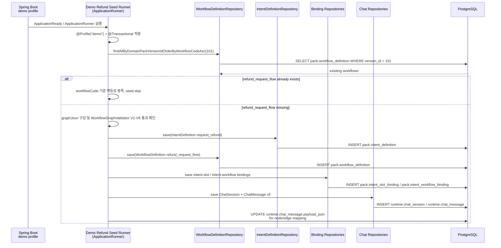

# [BE-4.1.4] 데모 환불 요청 Workflow 및 Runtime Seed

> **Backlog**: 4.1.4 Refund Request 데모 Workflow/Runtime seed 데이터 정의
> **Bounded Context**: `domainpack`, `workflowruntime`
> **Template**: `_TEMPLATE_BE.md`
> **Branch**: `spec/4.1.4`
> **작업 브랜치 (구현 단계)**: `feature/4.1.4-refund-request-demo-seed`

---

## Goal

데모 프로필에서 실행되는 seed runner가 기존 이커머스 데모 Domain Pack에 환불 요청(`request_refund`) intent, `refund_request_flow` Workflow Graph, 그리고 해당 흐름을 설명하는 채팅 세션/메시지 데이터를 멱등적으로 추가하도록 backend contract를 정의한다.

이 스펙은 다음 범위만 다룬다.

- 기존 `cs-demo-ecommerce` Domain Pack(version id contract: `101`)에 데모 seed 데이터를 추가한다.
- 신규 REST API, 신규 bounded context, 신규 DB migration은 정의하지 않는다.
- 기존 3개 workflow(`cancel_order_flow`, `change_address_flow`, `check_refund_status_flow`) 데이터는 변경하지 않는다.
- JPA 엔티티와 repository contract는 기존 자산을 재사용한다.

---

## Sequence Diagram



---

## REST API

**N/A** — 이 기능은 demo profile seed 데이터 생성 작업이며 신규 HTTP endpoint를 추가하지 않는다.

기존 API가 seed 결과를 조회할 수 있어야 하는 범위는 다음으로 제한한다.

| Existing Surface | Expected Seed Visibility |
|------------------|--------------------------|
| Domain Pack workflow 조회 | `refund_request_flow`가 version `101`의 workflow 목록에 포함된다. |
| Workflow transition 조회 | `WorkflowTransitionDetail.listFromGraphJson()`이 `refund_request_flow.graphJson.edges`를 transition detail로 변환한다. |
| 상담 queue/message 조회 | 생성된 `ChatSession`과 `ChatMessage` 5건이 기존 runtime repository/API 흐름에서 조회 가능하다. |

---

## Class Design

### DDD Layered Structure

```mermaid
classDiagram
    class DemoRefundRequestSeedRunner {
        +run(ApplicationArguments): void
        -seedIfMissing(): void
        -buildRefundRequestGraphJson(): String
        -buildMessagePayloads(): List~String~
    }

    class WorkflowGraphValidator {
        <<package-private final>>
        +parseAndValidate(String, String): ParsedGraph
        +extractInitialState(ParsedGraph): String
        +extractTerminalStatesJson(ParsedGraph): String
    }

    class WorkflowDefinitionRepository {
        <<interface>>
        +findAllByDomainPackVersionIdOrderByWorkflowCodeAsc(Long): List~WorkflowDefinitionSummaryRow~
        +save(WorkflowDefinition): WorkflowDefinition
    }

    class WorkflowDefinition {
        +create(Long, String, String, String, String, String, String, String, String): WorkflowDefinition
        +updateGraph(String, String, String, String, String): void
    }

    class IntentDefinition {
        +create(Long, String, String, String, Integer, String, String, String, String): IntentDefinition
        +changeStatus(String): void
    }

    class IntentSlotBinding {
        +create(Long, Long, Boolean, Integer, String, String): IntentSlotBinding
    }

    class IntentWorkflowBinding {
        +create(Long, Long, Boolean, String): IntentWorkflowBinding
    }

    class ChatSession {
        +create(Long, Long, ChatSessionStatus, String, String): ChatSession
        +activate(): void
        +resolve(): void
    }

    class ChatMessage {
        +create(Long, Integer, String, String, String): ChatMessage
    }

    class WorkflowTransitionDetail {
        <<record>>
        +listFromGraphJson(String, Long, Long): List~WorkflowTransitionDetail~
    }

    DemoRefundRequestSeedRunner --> WorkflowDefinitionRepository
    DemoRefundRequestSeedRunner --> WorkflowGraphValidator
    DemoRefundRequestSeedRunner --> WorkflowDefinition
    DemoRefundRequestSeedRunner --> IntentDefinition
    DemoRefundRequestSeedRunner --> IntentSlotBinding
    DemoRefundRequestSeedRunner --> IntentWorkflowBinding
    DemoRefundRequestSeedRunner --> ChatSession
    DemoRefundRequestSeedRunner --> ChatMessage
    WorkflowTransitionDetail --> WorkflowDefinition
```



### Runner Contract

| 항목 | Contract |
|------|----------|
| 실행 조건 | `@Profile("demo")`에서만 활성화한다. |
| 트랜잭션 | runner seed 메서드 전체를 `@Transactional`로 감싼다. |
| 멱등성 기준 | `domainPackVersionId=101`의 workflow 목록에서 `workflowCode="refund_request_flow"` 존재 여부를 확인한다. 존재하면 intent/chat seed를 포함해 전체 seed를 건너뛴다. |
| repository 사용 | 기존 repository port를 우선 사용한다. `WorkflowDefinitionRepository`에는 `findByWorkflowCode`가 없으므로 `findAllByDomainPackVersionIdOrderByWorkflowCodeAsc(101)` 결과를 code로 필터링한다. |
| 기존 데이터 보존 | workflow ids `150`, `151`, `152`와 기존 intent/slot/policy/risk row는 수정하지 않는다. |
| payload 처리 | `ChatMessage.create()`는 `payloadJson`을 항상 `{}`로 생성한다. Runner는 message 저장 후 같은 트랜잭션에서 `runtime.chat_message.payload_json`을 node/edge mapping JSON으로 세팅해야 한다. 엔티티/repository contract 변경 없이 seed 전용 persistence 경로(`EntityManager` 또는 `JdbcTemplate`)를 사용한다. |

### Domain Pack Seed Contract

기존 `backend/src/main/resources/mock/demo-domain-pack.json` contract와 ID/code 스타일을 유지한다.

| Component | ID | Code | Name | Notes |
|-----------|----|------|------|-------|
| domainPack | 100 | `cs-demo-ecommerce` | 이커머스 고객센터 데모 | 기존 데이터 재사용 |
| version | 101 | versionNo `1` | PUBLISHED | 기존 데이터 재사용 |
| intent | 113 | `request_refund` | 환불 요청 | 신규 seed |
| workflow | 153 | `refund_request_flow` | 환불 요청 처리 | 신규 seed |

신규 intent는 기존 slot/policy를 재사용한다.

| Binding | Reused ID | Code | Required / Role |
|---------|-----------|------|-----------------|
| intent-slot | 120 | `order_number` | required, collectionOrder `1` |
| intent-slot | 123 | `refund_amount` | required, collectionOrder `2` |
| intent-slot | 124 | `customer_name` | required, collectionOrder `3` |
| intent-slot | 125 | `contact_number` | required, collectionOrder `4` |
| workflow policy | 132 | `refund_amount_check` | 환불 가능 금액 확인 |
| workflow policy | 133 | `high_value_alert` | 고액 환불 요청 알림 |
| workflow policy | 134 | `return_deadline_check` | 반품/환불 요청 기한 확인 |

### Refund Request Workflow Graph

`refund_request_flow`의 graph는 `WorkflowGraphValidator`의 V1-V8 규칙을 모두 통과해야 한다.

```json
{
  "id": 153,
  "workflowCode": "refund_request_flow",
  "name": "환불 요청 처리",
  "description": "환불 요청을 접수하고 금액, 기한, 고액 알림 조건을 확인하는 워크플로우",
  "initialState": "start",
  "terminalStatesJson": ["refund_requested", "rejected"],
  "graphJson": {
    "direction": "top-to-bottom",
    "nodes": [
      {
        "id": "start",
        "type": "START",
        "label": "시작"
      },
      {
        "id": "n1",
        "type": "ACTION",
        "label": "환불 금액 확인",
        "policyRef": "refund_amount_check"
      },
      {
        "id": "n2",
        "type": "DECISION",
        "label": "환불 가능?"
      },
      {
        "id": "n3",
        "type": "ACTION",
        "label": "반품 기한 확인",
        "policyRef": "return_deadline_check"
      },
      {
        "id": "n4",
        "type": "DECISION",
        "label": "기한 내 요청?"
      },
      {
        "id": "n5",
        "type": "ACTION",
        "label": "고액 환불 알림",
        "policyRef": "high_value_alert"
      },
      {
        "id": "end_requested",
        "type": "TERMINAL",
        "label": "환불 요청 접수",
        "state": "refund_requested"
      },
      {
        "id": "end_rejected",
        "type": "TERMINAL",
        "label": "환불 요청 반려",
        "state": "rejected"
      }
    ],
    "edges": [
      {
        "id": "e1",
        "from": "start",
        "to": "n1"
      },
      {
        "id": "e2",
        "from": "n1",
        "to": "n2"
      },
      {
        "id": "e3",
        "from": "n2",
        "to": "n3",
        "label": "가능"
      },
      {
        "id": "e4",
        "from": "n2",
        "to": "end_rejected",
        "label": "불가능"
      },
      {
        "id": "e5",
        "from": "n3",
        "to": "n4"
      },
      {
        "id": "e6",
        "from": "n4",
        "to": "n5",
        "label": "기한 내"
      },
      {
        "id": "e7",
        "from": "n4",
        "to": "end_rejected",
        "label": "기한 초과"
      },
      {
        "id": "e8",
        "from": "n5",
        "to": "end_requested"
      }
    ]
  },
  "evidenceJson": [],
  "metaJson": {
    "demo": true,
    "seedRefId": 153
  }
}
```

#### Validator Rule Mapping

| Rule | Requirement | `refund_request_flow` Evidence |
|------|-------------|--------------------------------|
| V1 | 정확히 1개 START | `start` 1개 |
| V2 | 최소 1개 TERMINAL | `end_requested`, `end_rejected` 2개 |
| V3 | dangling edge 금지 | 모든 `from`/`to`가 nodes에 존재 |
| V4 | cycle 금지 | `start → n1 → n2 → ... → terminal` 단방향 DAG |
| V5 | START에서 모든 node 도달 | `start`에서 모든 node로 경로 존재 |
| V6 | DECISION outgoing edge label 필수 | `e3`, `e4`, `e6`, `e7` 모두 label 포함 |
| V7a | edge id 필수 | `e1`-`e8` 모두 id 포함 |
| V7b | edge id unique | `e1`-`e8` 중복 없음 |
| V8 | ACTION policyRef 유효 | `refund_amount_check`, `return_deadline_check`, `high_value_alert` 모두 `[A-Za-z0-9_-]+` 일치 |

### Workflow Transition Mapping Contract

`WorkflowTransitionDetail.listFromGraphJson(graphJson, workflowId, versionId)`는 edge를 다음처럼 변환해야 한다.

| Edge | From | To | Label | toPolicyRef |
|------|------|----|-------|-------------|
| `e1` | `start` | `n1` | `null` | `refund_amount_check` |
| `e2` | `n1` | `n2` | `null` | `null` |
| `e3` | `n2` | `n3` | `가능` | `return_deadline_check` |
| `e4` | `n2` | `end_rejected` | `불가능` | `null` |
| `e5` | `n3` | `n4` | `null` | `null` |
| `e6` | `n4` | `n5` | `기한 내` | `high_value_alert` |
| `e7` | `n4` | `end_rejected` | `기한 초과` | `null` |
| `e8` | `n5` | `end_requested` | `null` | `null` |

### Runtime Chat Seed Contract

Runner는 demo conversation을 1개 생성한다.

| Field | Value |
|-------|-------|
| `workspaceId` | `1` |
| `domainPackVersionId` | `101` |
| `status` | `ACTIVE` |
| `channel` | `DEMO` |
| `metaJson` | `{"demo":true,"scenario":"refund_request","workflowCode":"refund_request_flow"}` |

`ChatSession.create()`는 상태를 인자로 받으므로 `ACTIVE`로 생성한다. 상태 전이 시연이 필요하면 별도 시나리오에서 `OPEN → activate() → ACTIVE → resolve() → RESOLVED`를 사용하되, 이 seed의 초기 queue 노출 목적은 `ACTIVE` 상태다.

#### ChatMessage Seed Rows

초기 메시지는 정확히 5개이며 seqNo는 1부터 증가한다.

| seqNo | senderRole | messageType | content | Mapping Summary |
|-------|------------|-------------|---------|-----------------|
| 1 | `USER` | `TEXT` | `환불 요청합니다` | workflow 시작, `start` |
| 2 | `AGENT` | `TEXT` | `주문번호와 환불 예상 금액을 확인하겠습니다.` | `e1`, `n1`, `refund_amount_check` |
| 3 | `AGENT` | `TEXT` | `환불 가능 금액이 확인되었습니다. 반품 가능 기한을 이어서 확인하겠습니다.` | `e3`, `n3`, `return_deadline_check` |
| 4 | `NOTE` | `SYSTEM` | `고객명과 연락처 확인 완료. 고액 환불 알림 대상입니다.` | `e6`, `n5`, `high_value_alert` |
| 5 | `AGENT` | `TEXT` | `환불 요청이 접수되었습니다. 처리 결과는 등록된 연락처로 안내드리겠습니다.` | `e8`, `end_requested` |

각 message의 `payloadJson`은 아래 shape을 따른다.

```json
{
  "workflowCode": "refund_request_flow",
  "workflowRefId": 153,
  "intentCode": "request_refund",
  "intentRefId": 113,
  "currentNodeId": "n1",
  "incomingEdgeId": "e1",
  "policyRef": "refund_amount_check",
  "slotRefs": ["order_number", "refund_amount"],
  "state": "in_progress"
}
```

Message별 payload contract는 다음과 같다.

| seqNo | workflowRefId | intentRefId | currentNodeId | incomingEdgeId | policyRef | slotRefs | state |
|-------|---------------|-------------|---------------|----------------|-----------|----------|-------|
| 1 | `153` | `113` | `start` | `null` | `null` | `[]` | `started` |
| 2 | `153` | `113` | `n1` | `e1` | `refund_amount_check` | `["order_number", "refund_amount"]` | `checking_amount` |
| 3 | `153` | `113` | `n3` | `e3` | `return_deadline_check` | `["order_number"]` | `checking_deadline` |
| 4 | `153` | `113` | `n5` | `e6` | `high_value_alert` | `["customer_name", "contact_number"]` | `agent_note` |
| 5 | `153` | `113` | `end_requested` | `e8` | `null` | `["contact_number"]` | `refund_requested` |

---

## Tests

### Unit Tests

| Test | Purpose | Expected |
|------|---------|----------|
| `WorkflowGraphValidatorTest.parseAndValidate_acceptsRefundRequestFlow` | 신규 graphJson이 V1-V8을 모두 만족하는지 검증 | parsed nodes 8개, edges 8개, initialState `start`, terminal states `["refund_requested","rejected"]` |
| `WorkflowGraphValidatorTest.parseAndValidate_rejectsDecisionEdgeWithoutLabel` | DECISION edge label 누락 negative 검증 | `WorkflowUnlabeledBranchException` 발생 |
| `WorkflowTransitionDetailTest.listFromGraphJson_mapsRefundRequestTransitions` | transition detail mapping 검증 | `e1.toPolicyRef=refund_amount_check`, `e3.label=가능`, `e6.toPolicyRef=high_value_alert`, `e8.toPolicyRef=null` |

### Integration Tests

| Test | Purpose | Expected |
|------|---------|----------|
| `DemoRefundRequestSeedRunnerTest.seed_createsRefundWorkflowAndMappedChatMessages` | demo profile에서 runner가 신규 workflow/intent/chat seed를 생성 | `refund_request_flow` 1건, `request_refund` 1건, ACTIVE demo chat session 1건, messages 5건 |
| `DemoRefundRequestSeedRunnerTest.seed_isIdempotentByWorkflowCode` | runner 반복 실행 시 중복 생성 방지 | 동일 transaction 또는 재실행 후 `workflowCode="refund_request_flow"` count가 1 |
| `DemoRefundRequestSeedRunnerTest.seed_setsMessagePayloadJsonMappings` | `ChatMessage.create()`의 `{}` 기본 payload를 runner가 mapping payload로 세팅 | seqNo 1-5의 `payloadJson.workflowCode`가 모두 `refund_request_flow`, 각 node/edge mapping 일치 |

### Test Checklist

- [ ] 정상 시나리오: demo profile 실행 시 환불 요청 workflow, intent binding, chat seed가 생성된다.
- [ ] 멱등성: `workflowCode="refund_request_flow"`가 이미 있으면 추가 row를 만들지 않는다.
- [ ] graph 검증: `WorkflowGraphValidator.parseAndValidate()`가 신규 graphJson을 통과시킨다.
- [ ] transition 변환: `WorkflowTransitionDetail.listFromGraphJson()`이 `e1`-`e8`을 누락 없이 변환한다.
- [ ] payload mapping: `runtime.chat_message.payload_json`이 `{}`가 아니라 node/edge mapping JSON으로 저장된다.
- [ ] 기존 데이터 보존: workflow id contract `150`, `151`, `152`의 graphJson과 code는 변경하지 않는다.

---

## Database

### Migration (Liquibase)

**N/A** — 신규 테이블/컬럼을 만들지 않는다. 기존 schema에 demo seed row만 추가한다.

### Existing Table Contract

#### `pack.workflow_definition`

| Column | Type / Contract | Seed Value |
|--------|------------------|------------|
| `id` | `Long`, auto | DB 생성값. mock contract id는 `153`이며 `meta_json.seedRefId`에 보존 가능 |
| `domain_pack_version_id` | `Long`, not null | `101` |
| `workflow_code` | `String`, not null | `refund_request_flow` |
| `name` | `String`, not null | `환불 요청 처리` |
| `description` | `String` | `환불 요청을 접수하고 금액, 기한, 고액 알림 조건을 확인하는 워크플로우` |
| `graph_json` | `jsonb`, not null | Refund Request Workflow Graph |
| `initial_state` | `String` | `start` |
| `terminal_states_json` | `jsonb`, not null | `["refund_requested","rejected"]` |
| `evidence_json` | `jsonb`, not null | `[]` |
| `meta_json` | `jsonb`, not null | `{"demo":true,"seedRefId":153}` |

#### `pack.intent_definition`

| Column | Type / Contract | Seed Value |
|--------|------------------|------------|
| `id` | `Long`, auto | DB 생성값. mock contract id는 `113`이며 `meta_json.seedRefId`에 보존 가능 |
| `domain_pack_version_id` | `Long`, not null | `101` |
| `intent_code` | `String`, not null | `request_refund` |
| `name` | `String`, not null | `환불 요청` |
| `description` | `String` | `고객이 주문 또는 반품 건에 대해 환불 접수를 요청하는 의도` |
| `taxonomy_level` | `Integer` | `1` |
| `parent_intent_id` | `Long`, nullable | `null` |
| `status` | `String` | `PUBLISHED`로 전환 필요 |
| `source_cluster_ref` | `jsonb` | `{}` |
| `entry_condition_json` | `jsonb` | `{}` |
| `evidence_json` | `jsonb` | `[]` |
| `meta_json` | `jsonb` | `{"demo":true,"seedRefId":113}` |

`IntentDefinition.create()`는 기본 status가 `DRAFT`이므로 seed 완료 전 `changeStatus(IntentDefinition.STATUS_PUBLISHED)`를 호출한다.

#### `pack.intent_slot_binding`

| intentCode | slotCode | isRequired | collectionOrder | promptHint | conditionJson |
|------------|----------|------------|-----------------|------------|---------------|
| `request_refund` | `order_number` | `true` | `1` | `환불할 주문번호를 확인해 주세요.` | `{}` |
| `request_refund` | `refund_amount` | `true` | `2` | `환불 예상 금액을 확인해 주세요.` | `{}` |
| `request_refund` | `customer_name` | `true` | `3` | `고객명을 확인해 주세요.` | `{}` |
| `request_refund` | `contact_number` | `true` | `4` | `처리 결과를 안내할 연락처를 확인해 주세요.` | `{}` |

#### `pack.intent_workflow_binding`

| intentCode | workflowCode | isPrimary | routeConditionJson |
|------------|--------------|-----------|--------------------|
| `request_refund` | `refund_request_flow` | `true` | `{}` |

#### `runtime.chat_session`

| Column | Type / Contract | Seed Value |
|--------|------------------|------------|
| `workspace_id` | `Long`, not null | `1` |
| `domain_pack_version_id` | `Long`, not null | `101` |
| `status` | `ChatSessionStatus` | `ACTIVE` |
| `channel` | `String`, not null | `DEMO` |
| `started_by` | `Long`, nullable | `null` |
| `meta_json` | `jsonb`, not null | `{"demo":true,"scenario":"refund_request","workflowCode":"refund_request_flow"}` |
| `ended_at` | nullable | `null` |

#### `runtime.chat_message`

| Column | Type / Contract | Seed Value |
|--------|------------------|------------|
| `chat_session_id` | `Long`, not null | 생성된 demo chat session id |
| `seq_no` | `Integer`, `> 0` | `1`-`5` |
| `sender_role` | `String`, not blank | `USER`, `AGENT`, `NOTE` |
| `message_type` | `String`, not blank | `TEXT`, `SYSTEM` |
| `content` | `TEXT` | ChatMessage Seed Rows 참조 |
| `payload_json` | `jsonb`, not null | node/edge mapping JSON. `{}`로 남으면 실패 |

---

## Acceptance Criteria

### Positive

**Command**

```bash
cd backend && SPRING_PROFILES_ACTIVE=demo ./gradlew test --tests "*DemoRefundRequestSeedRunnerTest.seed_createsRefundWorkflowAndMappedChatMessages"
```

**Expected**

- `pack.workflow_definition`에 `domain_pack_version_id=101`, `workflow_code='refund_request_flow'` row가 정확히 1건 존재한다.
- `WorkflowGraphValidator.parseAndValidate(graphJson, "refund_request_flow")`가 예외 없이 통과한다.
- `WorkflowTransitionDetail.listFromGraphJson(graphJson, workflowId, 101L)` 결과가 8건이며 `e1`, `e3`, `e6`, `e8` mapping이 위 contract와 일치한다.
- `runtime.chat_session`에 `meta_json.workflowCode='refund_request_flow'`인 demo session이 1건 존재한다.
- 해당 session의 `runtime.chat_message`가 seqNo 1-5로 5건 존재하고 각 `payload_json`이 node/edge mapping을 포함한다.

### Negative

**Command**

```bash
cd backend && ./gradlew test --tests "*WorkflowGraphValidatorTest.parseAndValidate_rejectsDecisionEdgeWithoutLabel"
```

**Expected**

- DECISION node(`n2` 또는 `n4`)에서 나가는 edge의 `label`을 제거한 graphJson은 `WorkflowUnlabeledBranchException`으로 거부된다.
- 이 실패는 seed runner에서 실제 저장 전에 발생해야 하며, transaction rollback 후 `refund_request_flow` 관련 workflow/chat row가 남지 않는다.

### Spec Verification

- [ ] `.agent/specs/4.1.4.md` 파일이 존재한다.
- [ ] `Goal`, `Sequence Diagram`, `REST API`, `Class Design`, `Tests`, `Database`, `Acceptance Criteria`, `Additional Notes` 섹션이 모두 채워져 있다.
- [ ] 신규 graphJson은 V1-V8 검증 규칙과 transition mapping을 문서상으로 모두 충족한다.
- [ ] 기존 3개 workflow 데이터 변경 금지 조건이 명시되어 있다.

---

## Additional Notes

- `WorkflowGraphValidator`는 package-private final class이므로 동일 package 테스트 또는 application layer 경유 테스트로 검증한다.
- `WorkflowTransitionDetail.listFromGraphJson()`은 package-private static method이므로 동일 package 테스트에서 직접 검증하거나 public use case를 통해 간접 검증한다.
- 기존 `demo-domain-pack.json`의 일부 ACTION node는 `policyRef`가 없지만, 신규 `refund_request_flow`는 현재 validator의 V8 규칙에 맞춰 모든 ACTION node에 유효한 `policyRef`를 둔다.
- 구현 단계에서 신규 repository method가 필요해 보이더라도 우선 기존 `findAllByDomainPackVersionIdOrderByWorkflowCodeAsc()` 결과를 code로 필터링해 멱등성을 충족한다.
- `ChatMessage` payload 세팅은 seed 전용 persistence 처리로 한정하고, 일반 runtime message 생성 semantics는 변경하지 않는다.
