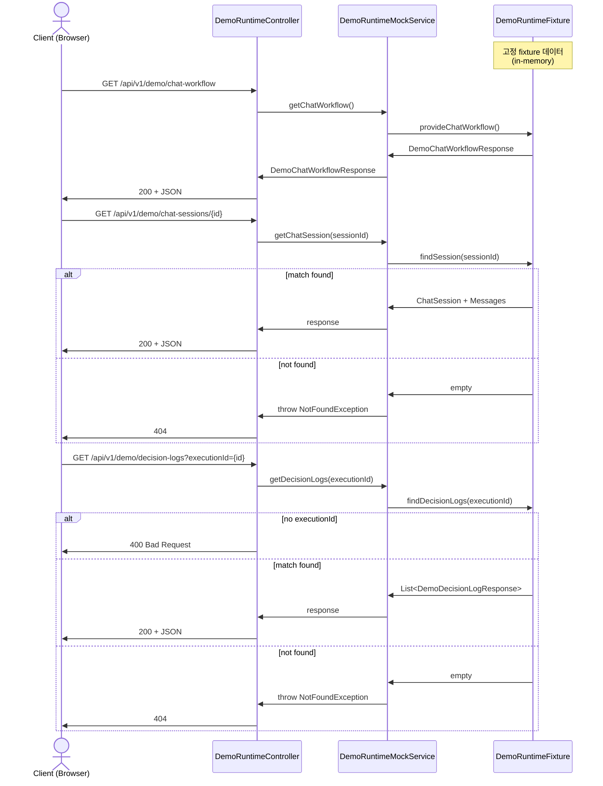
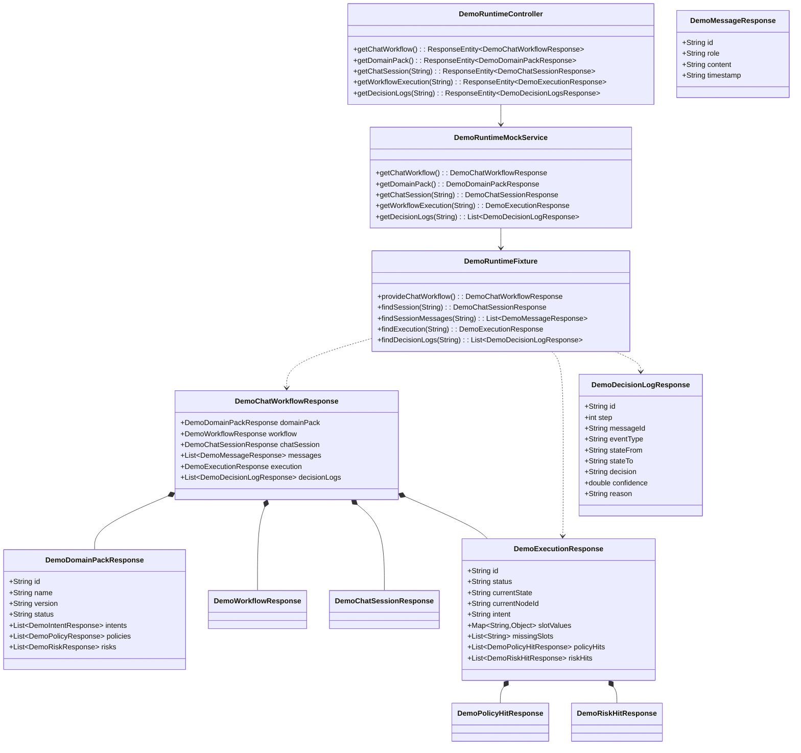

# Demo Runtime Mock API Spec

> Demo Mock API는 실제 runtime 엔진, state machine, inference, evaluator 없이
> 고정 fixture 데이터로 workflow 동작을 시연할 수 있도록 한다.

---

## Goal

데모 시연을 위해 Slot/Policy/Risk/Decision Log 데이터를 포함한 mock API 계약을 정의하고,
고정 fixture 기반으로 5개 GET endpoint를 제공한다. 실제 DB/엔진 없이 Frontend가
workflow 시뮬레이션을 체험할 수 있게 하는 것이 목적이다.

---

## Sequence Diagram



---

## REST API

### Endpoints

| Method | Path | Description |
|--------|------|-------------|
| GET | /api/v1/demo/chat-workflow | 통합 demo fixture (6개 섹션) |
| GET | /api/v1/demo/domain-pack | 축소 domainPack + workflow |
| GET | /api/v1/demo/chat-sessions/{sessionId} | chatSession + messages |
| GET | /api/v1/demo/workflow-executions/{executionId} | execution 상세 (slots/policies/risks) |
| GET | /api/v1/demo/decision-logs | decision logs (executionId query 필수) |

---

### `GET /api/v1/demo/chat-workflow`

통합 데모 fixture를 반환한다. 입력 없이 항상 동일한 fixture 데이터를 반환한다.

**Request**: 없음

**200 OK**

```json
{
  "domainPack": {
    "id": "demo-pack-1",
    "name": "CS Support Domain Pack",
    "version": "1.0.0",
    "status": "PUBLISHED",
    "intents": [
      {
        "id": "intent-1",
        "name": "환불 요청",
        "description": "고객이 제품 환불을 요청하는 경우"
      },
      {
        "id": "intent-2",
        "name": "배송 조회",
        "description": "고객이 배송 상태를 문의하는 경우"
      }
    ],
    "policies": [
      {
        "id": "policy-1",
        "name": "환불 가능 기간",
        "description": "구매일로부터 14일 이내 환불 가능",
        "severity": "HARD"
      }
    ],
    "risks": [
      {
        "id": "risk-1",
        "name": "고액 환불",
        "description": "100만원 이상 환불 요청 시 리뷰 필요",
        "level": "HIGH"
      }
    ]
  },
  "workflow": {
    "id": "workflow-1",
    "name": "환불 처리 워크플로우",
    "description": "고객 환불 요청을 처리하는 워크플로우",
    "states": ["INITIAL", "INTENT_DETECTED", "SLOT_COLLECTING", "POLICY_CHECKING", "RISK_CHECKING", "DECIDING", "COMPLETED", "HANDOFF"],
    "transitions": [
      { "from": "INITIAL", "to": "INTENT_DETECTED", "on": "INTENT_DETECTED" },
      { "from": "INTENT_DETECTED", "to": "SLOT_COLLECTING", "on": "SLOT_FILLED" },
      { "from": "SLOT_COLLECTING", "to": "POLICY_CHECKING", "on": "POLICY_CHECKED" },
      { "from": "POLICY_CHECKING", "to": "RISK_CHECKING", "on": "RISK_CHECKED" },
      { "from": "RISK_CHECKING", "to": "DECIDING", "on": "STATE_TRANSITIONED" },
      { "from": "DECIDING", "to": "COMPLETED", "on": "ANSWER_GENERATED" },
      { "from": "DECIDING", "to": "HANDOFF", "on": "HANDOFF_TRIGGERED" }
    ]
  },
  "chatSession": {
    "id": "session-1",
    "status": "completed",
    "startedAt": "2026-05-10T09:00:00Z",
    "completedAt": "2026-05-10T09:05:30Z"
  },
  "messages": [
    {
      "id": "msg-1",
      "role": "user",
      "content": "제품 환불하고 싶습니다",
      "timestamp": "2026-05-10T09:00:00Z"
    },
    {
      "id": "msg-2",
      "role": "assistant",
      "content": "네, 환불 도와드리겠습니다. 주문번호를 알려주세요.",
      "timestamp": "2026-05-10T09:00:15Z"
    },
    {
      "id": "msg-3",
      "role": "user",
      "content": "주문번호는 ORD-12345입니다",
      "timestamp": "2026-05-10T09:01:00Z"
    },
    {
      "id": "msg-4",
      "role": "assistant",
      "content": "ORD-12345 주문에 대한 환불이 완료되었습니다. 14일 이내에 계좌로 입금됩니다.",
      "timestamp": "2026-05-10T09:05:30Z"
    }
  ],
  "execution": {
    "id": "exec-1",
    "status": "COMPLETED",
    "currentState": "COMPLETED",
    "currentNodeId": "wf-node-final",
    "intent": "환불 요청",
    "slotValues": {
      "orderNumber": "ORD-12345",
      "refundAmount": 59000
    },
    "missingSlots": [],
    "policyHits": [
      {
        "policyId": "policy-1",
        "policyName": "환불 가능 기간",
        "result": "PASS",
        "detail": "구매일로부터 14일 이내"
      }
    ],
    "riskHits": [
      {
        "riskId": "risk-1",
        "riskName": "고액 환불",
        "result": "LOW",
        "detail": "환불 금액 59,000원 — 고액 환불 기준 미만"
      }
    ]
  },
  "decisionLogs": [
    {
      "id": "log-1",
      "step": 1,
      "messageId": "msg-1",
      "eventType": "INTENT_DETECTED",
      "stateFrom": "INITIAL",
      "stateTo": "INTENT_DETECTED",
      "decision": "ALLOW",
      "confidence": 0.95,
      "reason": "환불 요청 패턴 감지"
    },
    {
      "id": "log-2",
      "step": 2,
      "messageId": "msg-3",
      "eventType": "SLOT_FILLED",
      "stateFrom": "INTENT_DETECTED",
      "stateTo": "SLOT_COLLECTING",
      "decision": "ALLOW",
      "confidence": 0.88,
      "reason": "주문번호 slot 수집 완료"
    },
    {
      "id": "log-3",
      "step": 3,
      "messageId": "msg-3",
      "eventType": "POLICY_CHECKED",
      "stateFrom": "SLOT_COLLECTING",
      "stateTo": "POLICY_CHECKING",
      "decision": "ALLOW",
      "confidence": 1.0,
      "reason": "환불 가능 기간 정책 통과"
    },
    {
      "id": "log-4",
      "step": 4,
      "messageId": "msg-3",
      "eventType": "RISK_CHECKED",
      "stateFrom": "POLICY_CHECKING",
      "stateTo": "RISK_CHECKING",
      "decision": "ALLOW",
      "confidence": 0.75,
      "reason": "고액 환불 위험 낮음"
    },
    {
      "id": "log-5",
      "step": 5,
      "messageId": "msg-4",
      "eventType": "ANSWER_GENERATED",
      "stateFrom": "DECIDING",
      "stateTo": "COMPLETED",
      "decision": "ALLOW",
      "confidence": 0.92,
      "reason": "환불 완료 안내 생성"
    }
  ]
}
```

---

### `GET /api/v1/demo/domain-pack`

chat-workflow 통합 응답에서 domainPack + workflow만 분리하여 반환한다.

**Request**: 없음

**200 OK**

```json
{
  "domainPack": {
    "id": "demo-pack-1",
    "name": "CS Support Domain Pack",
    "version": "1.0.0",
    "status": "PUBLISHED",
    "intents": [
      { "id": "intent-1", "name": "환불 요청", "description": "고객이 제품 환불을 요청하는 경우" },
      { "id": "intent-2", "name": "배송 조회", "description": "고객이 배송 상태를 문의하는 경우" }
    ],
    "policies": [
      { "id": "policy-1", "name": "환불 가능 기간", "description": "구매일로부터 14일 이내 환불 가능", "severity": "HARD" }
    ],
    "risks": [
      { "id": "risk-1", "name": "고액 환불", "description": "100만원 이상 환불 요청 시 리뷰 필요", "level": "HIGH" }
    ]
  },
  "workflow": {
    "id": "workflow-1",
    "name": "환불 처리 워크플로우",
    "description": "고객 환불 요청을 처리하는 워크플로우",
    "states": ["INITIAL", "INTENT_DETECTED", "SLOT_COLLECTING", "POLICY_CHECKING", "RISK_CHECKING", "DECIDING", "COMPLETED", "HANDOFF"],
    "transitions": [
      { "from": "INITIAL", "to": "INTENT_DETECTED", "on": "INTENT_DETECTED" },
      { "from": "INTENT_DETECTED", "to": "SLOT_COLLECTING", "on": "SLOT_FILLED" },
      { "from": "SLOT_COLLECTING", "to": "POLICY_CHECKING", "on": "POLICY_CHECKED" },
      { "from": "POLICY_CHECKING", "to": "RISK_CHECKING", "on": "RISK_CHECKED" },
      { "from": "RISK_CHECKING", "to": "DECIDING", "on": "STATE_TRANSITIONED" },
      { "from": "DECIDING", "to": "COMPLETED", "on": "ANSWER_GENERATED" },
      { "from": "DECIDING", "to": "HANDOFF", "on": "HANDOFF_TRIGGERED" }
    ]
  }
}
```

**200 OK** (chat-workflow와 동일한 응답 스키마. domainPack + workflow 필드만 응답)

---

### `GET /api/v1/demo/chat-sessions/{sessionId}`

특정 chat session의 정보와 메시지 목록을 조회한다.

**Request**: Path variable `sessionId` (String)

**200 OK** (fixture에 존재하는 sessionId일 때)

```json
{
  "chatSession": {
    "id": "session-1",
    "status": "completed",
    "startedAt": "2026-05-10T09:00:00Z",
    "completedAt": "2026-05-10T09:05:30Z"
  },
  "messages": [
    {
      "id": "msg-1",
      "role": "user",
      "content": "제품 환불하고 싶습니다",
      "timestamp": "2026-05-10T09:00:00Z"
    },
    {
      "id": "msg-2",
      "role": "assistant",
      "content": "네, 환불 도와드리겠습니다. 주문번호를 알려주세요.",
      "timestamp": "2026-05-10T09:00:15Z"
    },
    {
      "id": "msg-3",
      "role": "user",
      "content": "주문번호는 ORD-12345입니다",
      "timestamp": "2026-05-10T09:01:00Z"
    },
    {
      "id": "msg-4",
      "role": "assistant",
      "content": "ORD-12345 주문에 대한 환불이 완료되었습니다. 14일 이내에 계좌로 입금됩니다.",
      "timestamp": "2026-05-10T09:05:30Z"
    }
  ]
}
```

**404 Not Found** (fixture에 없는 sessionId일 때)

```json
{
  "error": "NOT_FOUND",
  "message": "Chat session not found: unknown-session"
}
```

---

### `GET /api/v1/demo/workflow-executions/{executionId}`

특정 workflow execution의 상세 정보를 조회한다. slot, policy, risk 정보를 포함한다.

**Request**: Path variable `executionId` (String)

**200 OK** (fixture에 존재하는 executionId일 때)

```json
{
  "id": "exec-1",
  "status": "COMPLETED",
  "currentState": "COMPLETED",
  "currentNodeId": "wf-node-final",
  "intent": "환불 요청",
  "slotValues": {
    "orderNumber": "ORD-12345",
    "refundAmount": 59000
  },
  "missingSlots": [],
  "policyHits": [
    {
      "policyId": "policy-1",
      "policyName": "환불 가능 기간",
      "result": "PASS",
      "detail": "구매일로부터 14일 이내"
    }
  ],
  "riskHits": [
    {
      "riskId": "risk-1",
      "riskName": "고액 환불",
      "result": "LOW",
      "detail": "환불 금액 59,000원 — 고액 환불 기준 미만"
    }
  ]
}
```

**404 Not Found** (fixture에 없는 executionId일 때)

```json
{
  "error": "NOT_FOUND",
  "message": "Workflow execution not found: unknown-exec"
}
```

---

### `GET /api/v1/demo/decision-logs?executionId={executionId}`

특정 execution의 decision log 목록을 조회한다. `executionId` query parameter가 필수다.

**Request**: Query parameter `executionId` (String, required)

**200 OK**

```json
{
  "decisionLogs": [
    {
      "id": "log-1",
      "step": 1,
      "messageId": "msg-1",
      "eventType": "INTENT_DETECTED",
      "stateFrom": "INITIAL",
      "stateTo": "INTENT_DETECTED",
      "decision": "ALLOW",
      "confidence": 0.95,
      "reason": "환불 요청 패턴 감지"
    },
    {
      "id": "log-2",
      "step": 2,
      "messageId": "msg-3",
      "eventType": "SLOT_FILLED",
      "stateFrom": "INTENT_DETECTED",
      "stateTo": "SLOT_COLLECTING",
      "decision": "ALLOW",
      "confidence": 0.88,
      "reason": "주문번호 slot 수집 완료"
    }
  ]
}
```

**400 Bad Request** (executionId 누락)

```json
{
  "error": "BAD_REQUEST",
  "message": "executionId query parameter is required"
}
```

**404 Not Found** (fixture에 없는 executionId일 때)

```json
{
  "error": "NOT_FOUND",
  "message": "Decision logs not found for execution: unknown-exec"
}
```

---

## Class Design

### DDD Layered Structure



### DTO Records (Java 17+)

```java
// --- Controller layer ---

public record DemoChatWorkflowResponse(
    DemoDomainPackResponse domainPack,
    DemoWorkflowResponse workflow,
    DemoChatSessionResponse chatSession,
    List<DemoMessageResponse> messages,
    DemoExecutionResponse execution,
    List<DemoDecisionLogResponse> decisionLogs
) {}

public record DemoDomainPackResponse(
    String id,
    String name,
    String version,
    String status,
    List<DemoIntentResponse> intents,
    List<DemoPolicyResponse> policies,
    List<DemoRiskResponse> risks
) {}

public record DemoWorkflowResponse(
    String id,
    String name,
    String description,
    List<String> states,
    List<DemoTransitionResponse> transitions
) {}

public record DemoTransitionResponse(
    String from,
    String to,
    String on
) {}

public record DemoIntentResponse(
    String id,
    String name,
    String description
) {}

public record DemoPolicyResponse(
    String id,
    String name,
    String description,
    String severity
) {}

public record DemoRiskResponse(
    String id,
    String name,
    String description,
    String level
) {}

public record DemoExecutionResponse(
    String id,
    String status,
    String currentState,
    String currentNodeId,
    String intent,
    Map<String, Object> slotValues,
    List<String> missingSlots,
    List<DemoPolicyHitResponse> policyHits,
    List<DemoRiskHitResponse> riskHits
) {}

public record DemoDecisionLogResponse(
    String id,
    int step,
    String messageId,
    String eventType,
    String stateFrom,
    String stateTo,
    String decision,
    double confidence,
    String reason
) {}

// --- Individual endpoint response wrappers ---

// GET /api/v1/demo/domain-pack -> { domainPack: {...}, workflow: {...} }
public record DemoDomainPackEndpointResponse(
    DemoDomainPackResponse domainPack,
    DemoWorkflowResponse workflow
) {}

// GET /api/v1/demo/chat-sessions/{sessionId} -> { chatSession: {...}, messages: [...] }
public record DemoChatSessionEndpointResponse(
    DemoChatSessionResponse chatSession,
    List<DemoMessageResponse> messages
) {}

// GET /api/v1/demo/decision-logs?executionId={id} -> { decisionLogs: [...] }
public record DemoDecisionLogEndpointResponse(
    List<DemoDecisionLogResponse> decisionLogs
) {}

// These wrapper records serve as per-endpoint return types, wrapping only the
// subset of fields each individual GET endpoint returns.

public record DemoChatSessionResponse(
    String id,
    String status,
    String startedAt,
    String completedAt
) {}

public record DemoMessageResponse(
    String id,
    String role,
    String content,
    String timestamp
) {}

public record DemoPolicyHitResponse(
    String policyId,
    String policyName,
    String result,
    String detail
) {}

public record DemoRiskHitResponse(
    String riskId,
    String riskName,
    String result,
    String detail
) {}

// --- eventType enum values ---
// INTENT_DETECTED, ACTION_SELECTED, SLOT_FILLED, POLICY_CHECKED,
// RISK_CHECKED, STATE_TRANSITIONED, ANSWER_GENERATED,
// HANDOFF_TRIGGERED, SESSION_COMPLETED
```

### Confidence & Timestamp Constraints

| 필드 | 타입 | 제약 |
|------|------|------|
| `confidence` | `double` | `0.0 <= confidence <= 1.0` |
| `timestamp`, `startedAt`, `completedAt` | `String` (ISO-8601) | `2026-05-10T09:00:00Z` 형식 |

### `eventType` Enum

| 값 | 설명 |
|----|------|
| `INTENT_DETECTED` | 사용자 의도 감지 |
| `ACTION_SELECTED` | 실행 액션 선정 |
| `SLOT_FILLED` | Slot 정보 수집 완료 |
| `POLICY_CHECKED` | 정책 확인 완료 |
| `RISK_CHECKED` | 리스크 확인 완료 |
| `STATE_TRANSITIONED` | 상태 전이 발생 |
| `ANSWER_GENERATED` | 응답 생성 완료 |
| `HANDOFF_TRIGGERED` | 상담사 전환 트리거 |
| `SESSION_COMPLETED` | 세션 종료 |

---

## Acceptance Criteria

### Positive Tests

**1. `GET /api/v1/demo/chat-workflow` 200 OK**
- 응답에 6개 최상위 필드 포함: `domainPack`, `workflow`, `chatSession`, `messages`, `execution`, `decisionLogs`
- `decisionLogs`는 최소 3개 이상의 엔트리를 가짐
- 각 `decisionLog` 엔트리는 `messageId`, `stateFrom`, `stateTo`, `eventType`, `decision`, `confidence`, `reason` 필드를 모두 포함
- `execution.slotValues`는 비어 있지 않은 Map
- `execution.missingSlots`는 존재 (빈 리스트 가능)
- `execution.policyHits`와 `execution.riskHits`는 각각 최소 1개 이상

**2. `GET /api/v1/demo/chat-sessions/{knownId}` 200 OK**
- 응답에 `chatSession`과 `messages` 필드 포함
- `chatSession.id`가 요청한 `sessionId`와 일치
- `messages`는 최소 1개 이상

**3. `GET /api/v1/demo/decision-logs?executionId={knownId}` 200 OK**
- 응답에 `decisionLogs` 리스트 포함
- 각 로그는 9개 `eventType` 중 하나를 가짐

### Negative Tests

**4. `GET /api/v1/demo/chat-sessions/unknown` 404 Not Found**
- 응답 코드 404
- 에러 메시지에 "not found" 포함

**5. `GET /api/v1/demo/decision-logs` (executionId 누락) 400 Bad Request**
- 응답 코드 400
- 에러 메시지에 "executionId" 포함

**6. `GET /api/v1/demo/decision-logs?executionId=unknown` 404 Not Found**
- 응답 코드 404
- 에러 메시지에 "not found" 포함

### Test Checklist (for TDD)

- [ ] Positive: chat-workflow returns 200 with all 6 sections
- [ ] Positive: domain-pack returns 200 with domainPack + workflow
- [ ] Positive: chat-sessions/{knownId} returns 200 with chatSession + messages
- [ ] Positive: workflow-executions/{knownId} returns 200 with slotValues, missingSlots, policyHits, riskHits
- [ ] Positive: decision-logs?executionId={knownId} returns 200 with decisionLogs
- [ ] Positive: 각 decisionLog 엔트리 confidence가 0.0~1.0 범위 내
- [ ] Positive: timestamp가 ISO-8601 형식 (DateTimeFormat.ISO_DATE_TIME)
- [ ] Positive: eventType이 9개 enum 값 중 하나
- [ ] Negative: chat-sessions/unknown → 404
- [ ] Negative: workflow-executions/unknown → 404
- [ ] Negative: decision-logs?executionId=unknown → 404
- [ ] Negative: decision-logs (no query) → 400
- [ ] Contract: 모든 응답이 JSON이며 Content-Type: application/json

---

## OUT / Guardrails

### In Scope (Must Implement)

| 모듈/파일 | 책임 1줄 |
|---|---|
| `.agent/specs/4.1.5.md` | API 계약/fixture/acceptance criteria 문서화 |
| `DemoRuntimeController` | `/api/v1/demo/...` GET routing만 담당 |
| `DemoRuntimeMockService` | 고정 fixture 조회/ID 매칭만 담당 |
| `DemoRuntimeFixture` | 통합/개별 API가 공유할 고정 데이터 생성 |
| `*/dto/*.java` | demo response schema (Java record) |
| `DemoRuntimeControllerTest` | HTTP 계약/TDD 검증 (MockMvc, JsonPath) |
| `DemoRuntimeMockServiceTest` | fixture 일관성/404 lookup 검증 (JUnit 5, AssertJ) |

### Out of Scope (Must NOT Have)

- 기존 `workflowruntime`/`domainpack` 공개 API 변경 금지
- JPA Entity/Repository/Liquibase 변경 금지
- 실제 runtime 엔진, state machine, inference, policy/risk evaluator 구현 금지
- frontend `.ts` mock/type 파일 구현 금지
- WebSocket/SSE/실시간 업데이트 구현 금지
- 새 외부 의존성 추가 금지
- JSON 문자열 직접 반환 금지
- 과도한 인터페이스/추상화 금지
- Pagination (initial demo는 전체 데이터 반환)

---

## Additional Notes

- 모든 DTO는 Java 17+ `record` 타입으로 선언한다 (불변성, equals/hashCode 자동 생성)
- 직렬화는 Jackson 기본 설정으로 처리한다 (Java record 컴포넌트명이 camelCase로 자동 직렬화됨)
- `DemoRuntimeFixture`는 `@Component` 또는 `@Configuration` 빈으로 등록하여 서비스에서 주입받는다
- 에러 응답은 `GlobalExceptionHandler` 또는 컨트롤러 내 `@ExceptionHandler`로 일관된 형식을 유지한다
- `NotFoundException`은 커스텀 예외 클래스 (`RuntimeException` 상속)를 사용한다
- Demo fixture의 session/execution ID는 고정값(session-1, exec-1)으로 시작하며, 향후 확장을 고려해 Map 기반 lookup 구조로 설계한다
