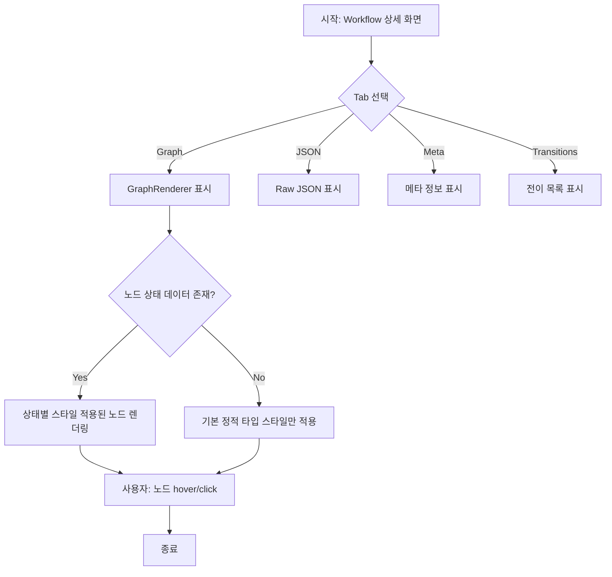

# [FE] 워크플로우 그래프 뷰어 및 노드 상태 스타일 구현

> 이 스펙은 도메인 팩 워크플로우의 읽기 전용 그래프 뷰어에 런타임 노드 상태 시각화를 추가하는 것을 정의한다.
> FSD (Feature-Sliced Design) 아키텍처를 따른다.

---

## Goal

도메인 팩 워크플로우의 읽기 전용 그래프 뷰어에서 각 노드의 런타임 실행 상태(IDLE, ACTIVE, COMPLETED, ERROR)를 시각적으로 표현한다. 정적 노드 타입(START, ACTION 등)에 따른 형태 스타일과 별개로, 상태에 따른 색상/테두리/애니메이션 변화를 적용한다.

---

## User Flow Chart



---

## Design Diff

### As-is vs To-be

| 영역 | As-is | To-be | 변경 내용 |
|------|-------|-------|----------|
| 노드 데이터 | `data.label` (string)만 전달 | `data.label` + `data.status` (NodeStatus) 전달 | 상태 정보 추가 |
| 노드 스타일 | 정적 타입별 클래스만 적용 (`.start`, `.action` 등) | 정적 타입 클래스 + 상태별 변형 클래스/인라인 스타일 병행 적용 | 런타임 상태 시각화 |
| GraphRenderer | `graph: WorkflowGraph`만 수신 | `graph: WorkflowGraph` + `nodeStates?: NodeStateMap` 선택적 수신 | 상태 오버레이 지원 |
| 커스텀 노드 컴포넌트 | `data.label`만 사용 | `data.label`과 `data.status`를 모두 읽어 조건적 렌더링 | 상태 인지 |
| 상태 정의 | 없음 | `IDLE`, `ACTIVE`, `COMPLETED`, `ERROR` 4가지 명시적 정의 | 도메인 모델 확장 |

---

## Component Tree

```
WorkflowDetailPanel
├─ TabNavigation (graph | json | meta | transitions)
├─ GraphRenderer (read-only React Flow wrapper)
│    ├─ ReactFlow
│    │    ├─ StartNode (custom node component)
│    │    ├─ ActionNode (custom node component)
│    │    ├─ DecisionNode (custom node component)
│    │    ├─ AnswerNode (custom node component)
│    │    ├─ HandoffNode (custom node component)
│    │    ├─ TerminalNode (custom node component)
│    │    ├─ Background
│    │    └─ Controls
│    └─ (nodes module CSS)
├─ JsonPanel
├─ MetaPanel
└─ TransitionListPanel
```

---

## API Integration

### Endpoints

| Method | Path | Description |
|--------|------|-------------|
| GET | `/api/v1/workspaces/{workspaceId}/domain-packs/{packId}/versions/{versionId}/workflows/{workflowId}` | Workflow 정의 상세 조회 |

### Response Schema

Backend `WorkflowDefinitionDetail` record (`backend/src/main/java/com/init/domainpack/application/WorkflowDefinitionDetail.java`):

| 필드 | 타입 | 설명 |
|------|------|------|
| id | Long | Workflow 식별자 |
| workflowCode | String | Workflow 코드 |
| name | String | Workflow 이름 |
| description | String | Workflow 설명 |
| graphJson | @JsonRawValue String | 그래프 구조 JSON 문자열 |
| initialState | String | 초기 상태 코드 |
| terminalStatesJson | String | 종료 상태 목록 JSON 문자열 |
| evidenceJson | String | 근거 정보 JSON 문자열 |
| metaJson | String | 메타 정보 JSON 문자열 |
| createdAt | OffsetDateTime | 생성 시각 |
| updatedAt | OffsetDateTime | 수정 시각 |

### graphJson Structure

```typescript
interface WorkflowGraph {
  direction: "LR" | "TB";
  nodes: GraphNode[];
  edges: GraphEdge[];
}

interface GraphNode {
  id: string;
  label: string;
  type: GraphNodeType;
  policyRef?: string;
  position?: { x: number; y: number };
}

interface GraphEdge {
  id: string;
  from: string;
  to: string;
  label?: string;
}

type GraphNodeType = "START" | "ACTION" | "DECISION" | "ANSWER" | "HANDOFF" | "TERMINAL";
```

graphJson 유효성 검증 (backend `WorkflowDefinitionDetail.validateGraphJson`):
- `direction`: 문자열, 필수
- `nodes`: 배열, 필수
- `edges`: 배열, 필수

### Query Key Pattern

```typescript
// frontend/src/features/workflow-draft-read/model/useWorkflowDetail.ts
export function useWorkflowDetail(
  wsId: number,
  packId: number,
  versionId: number,
  workflowId: number | null,
) {
  return useQuery<WorkflowDetail>({
    queryKey: ["workflows", "detail", wsId, packId, versionId, workflowId] as const,
    queryFn: () => workflowApi.detail(wsId, packId, versionId, workflowId!),
    enabled: workflowId != null,
  });
}
```

---

## Data Flow

```
┌─────────────────────────────────────────────────────────┐
│                     UI Layer                            │
│  ┌─────────────────────────────────────────────────┐   │
│  │ GraphRenderer                                   │   │
│  │  props: { graph: WorkflowGraph, nodeStates? }   │   │
│  └─────────────────────────────────────────────────┘   │
└─────────────────────────────────────────────────────────┘
                           │
                           ▼
┌─────────────────────────────────────────────────────────┐
│                   Feature Layer                         │
│  ┌─────────────────────────────────────────────────┐   │
│  │ useWorkflowDetail()                             │   │
│  │  - TanStack Query                               │   │
│  │  - fetches WorkflowDefinitionDetail             │   │
│  │  - parses graphJson string → WorkflowGraph      │   │
│  └─────────────────────────────────────────────────┘   │
│  ┌─────────────────────────────────────────────────┐   │
│  │ toFlow() (graph converter)                      │   │
│  │  - WorkflowGraph → React Flow nodes/edges       │   │
│  │  - injects status into node.data if provided    │   │
│  └─────────────────────────────────────────────────┘   │
└─────────────────────────────────────────────────────────┘
                           │
                           ▼
┌─────────────────────────────────────────────────────────┐
│                   Entity Layer                          │
│  ┌─────────────────────────────────────────────────┐   │
│  │ WorkflowGraph, GraphNode, GraphEdge types       │   │
│  │ GraphNodeType union type                        │   │
│  └─────────────────────────────────────────────────┘   │
└─────────────────────────────────────────────────────────┘
                           │
                           ▼
┌─────────────────────────────────────────────────────────┐
│                   Shared Layer                          │
│  ┌─────────────────────────────────────────────────┐   │
│  │ API client, TanStack Query config               │   │
│  │ Generated Zod schemas (WorkflowDefinitionDetail)│   │
│  └─────────────────────────────────────────────────┘   │
└─────────────────────────────────────────────────────────┘
```

---

## 수정 대상 파일

| 파일 | 변경 유형 | 설명 |
|------|----------|------|
| `frontend/src/features/workflow-draft-read/ui/GraphRenderer.tsx` | change | `nodeStates` 선택적 prop 추가, `toFlow` 호출 시 상태 전달 |
| `frontend/src/features/workflow-draft-read/ui/nodes/StartNode.tsx` | change | `data.status` 읽어 상태별 스타일/클래스 적용 |
| `frontend/src/features/workflow-draft-read/ui/nodes/ActionNode.tsx` | change | `data.status` 읽어 상태별 스타일/클래스 적용 |
| `frontend/src/features/workflow-draft-read/ui/nodes/DecisionNode.tsx` | change | `data.status` 읽어 상태별 스타일/클래스 적용 |
| `frontend/src/features/workflow-draft-read/ui/nodes/AnswerNode.tsx` | change | `data.status` 읽어 상태별 스타일/클래스 적용 |
| `frontend/src/features/workflow-draft-read/ui/nodes/HandoffNode.tsx` | change | `data.status` 읽어 상태별 스타일/클래스 적용 |
| `frontend/src/features/workflow-draft-read/ui/nodes/TerminalNode.tsx` | change | `data.status` 읽어 상태별 스타일/클래스 적용 |
| `frontend/src/features/workflow-draft-read/ui/nodes/nodes.module.css` | change | 상태별 변형 클래스 추가 (`.active`, `.completed`, `.error`) |
| `frontend/src/entities/workflow/lib/graphConverter.ts` | change | `toFlow()` 함수에 선택적 `nodeStates` 파라미터 추가 |
| `frontend/src/entities/workflow/model/types.ts` | change | `NodeStatus` 타입 및 `NodeStateMap` 타입 추가 |
| `frontend/src/features/workflow-draft-read/ui/WorkflowDetailPanel.tsx` | change | GraphRenderer에 `nodeStates` prop 연결 (상태 데이터 수신 시) |

---

## State Management

### Server State (TanStack Query)

```typescript
// entities/workflow/model/types.ts
export type NodeStatus = "IDLE" | "ACTIVE" | "COMPLETED" | "ERROR";

export interface NodeStateMap {
  [nodeId: string]: NodeStatus;
}
```

```typescript
// features/workflow-draft-read/model/useWorkflowDetail.ts
// 기존 hook 재사용. nodeStates는 별도 소스(웹소켓/폴링/쿼리 파라미터)에서 수신 가능.
```

### Client State (Local Component State)

```typescript
// GraphRenderer 내부 또는 부모 컴포넌트
interface GraphRendererProps {
  graph: WorkflowGraph;
  nodeStates?: NodeStateMap;  // 선택적: 런타임 상태 오버레이
  onEdgeClick?: (edgeId: string) => void;
  onPaneClick?: () => void;
}
```

**정적 타입 스타일 vs 런타임 상태 스타일 구분**:

| 구분 | 정적 타입 스타일 | 런타임 상태 스타일 |
|------|-----------------|-----------------|
| 결정 시점 | 설계/정의 시점 | 실행/런타임 시점 |
| 데이터 소스 | `GraphNode.type` 필드 | 외부 상태 서비스 또는 execution log |
| 표현 대상 | 노드의 "역할" (START, ACTION, DECISION 등) | 노드의 "현재 실행 상태" |
| 시각적 효과 | 모양(직사각형, 마름모, 원 등), 기본 색상 | 테두리 색상, 배경 강조, 애니메이션(깜빡임), 아이콘 오버레이 |
| 적용 범위 | 모든 워크플로우 그래프 | 실행 중인 워크플로우 인스턴스에 한함 |
| CSS 클래스 | `.start`, `.action`, `.decision`, `.answer`, `.handoff`, `.terminal` | `.active`, `.completed`, `.error` (변형 클래스) |

**노드 타입 정의 (`GraphNodeType`)**:
- `START`: 둥근 직사각형 (pill shape), 진한 배경
- `ACTION`: 직사각형 (rounded), 기본 배경
- `DECISION`: 마름모 (diamond shape), 중앙 정렬
- `ANSWER`: 직사각형 (tag shape, clip-path), 반투명 배경
- `HANDOFF`: 직사각형 (trapezoid shape, clip-path)
- `TERMINAL`: 원 (circle), 진한 배경

**노드 상태 정의 (`NodeStatus`)**:
- `IDLE`: 기본 상태, 정적 타입 스타일만 적용, 추가 시각 효과 없음
- `ACTIVE`: 현재 실행 중, 테두리 강조 + 부드러운 애니메이션(펄스)
- `COMPLETED`: 실행 완료, 체크 아이콘 오버레이 + 완료 표시 테두리
- `ERROR`: 실행 실패, 에러 표시 테두리 + 경고 아이콘 오버레이

---

## States

### UI States Matrix

| 상태 | 조건 | UI 표현 |
|------|------|---------|
| Loading | `workflowId != null`이고 `useWorkflowDetail` 쿼리 `isLoading === true` | GraphRenderer 영역에 skeleton 또는 spinner 표시 |
| Error | `useWorkflowDetail` 쿼리 `isError === true` | 에러 메시지 + 재시도 버튼 표시 |
| Empty | `workflowId === null` | 그래프 영역 비어있음, 안내 문구 |
| Success (no states) | 데이터 로드 완료, `nodeStates` 미제공 | 정적 타입 스타일만 적용된 그래프 |
| Success (with states) | 데이터 로드 완료, `nodeStates` 제공 | 타입 스타일 + 상태 스타일 병행 적용 |

---

## Test Scenarios

### Test Strategy

| 구분 | 방법 | 도구 | 비고 |
|------|------|------|------|
| 수동 테스트 | 브라우저 직접 확인 | Chrome DevTools | 주요 플로우 |
| 컴포넌트 테스트 | Storybook | `pnpm storybook` | 6가지 노드 타입 x 4가지 상태 조합 |
| 통합 테스트 | Vitest | `pnpm test` | graphConverter + 상태 주입 |
| E2E 테스트 | Playwright | `pnpm test:e2e` | 워크플로우 상세 화면 진입 → 그래프 표시 |

### Test Environment & 사전 조건

| 항목 | 값 |
|------|---|
| 환경 | `pnpm dev` |
| API Mock | MSW (Mock Service Worker) 또는 실제 backend `local` 프로필 |
| 사전 조건 | Domain Pack 1개 + Workflow 1개 이상 존재, `graphJson` 유효 |

### Test Scenarios

#### Happy Path

| # | 시나리오 | 사전 조건 | 조작 | 기대 결과 |
|---|---------|---------|------|----------|
| 1 | 워크플로우 그래프 조회 | Workflow 1개, graphJson 유효 | Workflow 상세 → Graph 탭 선택 | 6가지 노드 타입이 정적 스타일로 표시 |
| 2 | 노드 상태 오버레이 | `nodeStates`에 ACTIVE 상태 1개 포함 | GraphRenderer에 `nodeStates` prop 전달 | 해당 노드에 ACTIVE 시각 효과(테두리 강조/펄스) 적용 |
| 3 | 전체 상태 표시 | `nodeStates`에 IDLE/ACTIVE/COMPLETED/ERROR 모두 포함 | 상태 데이터 수신 | 각 노드에 해당 상태 스타일 정확히 적용 |
| 4 | 그래프 탭 전환 | 이전 탭이 JSON 또는 Meta | Graph 탭 클릭 | React Flow 캔버스 정상 렌더링, fitView 적용 |
| 5 | 빈 상태 데이터 | `nodeStates`가 `undefined` 또는 `{}` | GraphRenderer 렌더링 | 정적 타입 스타일만 적용, 오류 없음 |

#### Error & Edge Cases

| # | 시나리오 | 조작 | 기대 결과 |
|---|---------|------|----------|
| 1 | 알 수 없는 노드 상태 | `nodeStates`에 정의되지 않은 상태 문자열 포함 | 콘솔 warning 출력, IDLE로 fallback, 렌더링 중단 없음 |
| 2 | graphJson 파싱 실패 | `graphJson`이 유효하지 않은 JSON | 에러 바운더리에서 fallback UI 표시 |
| 3 | 노드 상태 맵에 없는 노드 ID | `nodeStates`에 그래프에 없는 nodeId 포함 | 무시, 해당 노드는 정적 스타일만 적용 |
| 4 | 동시 상태 변경 | `nodeStates` prop이 빠르게 갱신 | React Flow 내부 상태와 동기화, 시각적 깜빡임 최소화 |
| 5 | 다크 모드 전환 | 시스템/앱 다크 모드 토글 | 상태 색상이 다크 모드 변수에 맞게 자동 조정 (CSS variable 기반) |

#### 반응형 & 접근성

| # | 확인 항목 | 기대 결과 |
|---|---------|----------|
| 1 | 그래프 줌/패닝 | 마우스 휠/드래그로 자유롭게 탐색 가능 |
| 2 | 상태 색상 대비 | ACTIVE/COMPLETED/ERROR 색상 대비 4.5:1 이상 |
| 3 | 애니메이션 감소 모드 | `prefers-reduced-motion` 시 펄스 애니메이션 비활성화, 정적 테두리로 대체 |
| 4 | 키보드 탐색 | React Flow 기본 키보드 단축키 동작 (+- 줌, 방향키 패닝) |

---

## Open Questions

1. **상태 데이터 소스**: `nodeStates`는 웹소켓 실시간 푸시, 폴링, 또는 별도 API 엔드포인트 중 어떤 방식으로 수신하는가? 현재 스펙 범위에서는 GraphRenderer가 선택적 prop으로 수신하는 것으로 가정하며, 데이터 소스는 사용처(예: workflow-runtime 실행 화면)에서 결정한다.
2. **상태 전이 애니메이션**: ACTIVE → COMPLETED 상태 전이 시 전환 애니메이션 지속 시간과 easing 함수는 디자인 시스템 가이드(`frontend/DESIGN.md`)를 따르는가?
3. **노드 상태 아이콘**: COMPLETED(체크), ERROR(경고) 아이콘은 `lucide-react`를 사용하는가, 아니면 SVG 인라인인가?

---

## Notepad Paths

- `.sisyphus/notepads/4.1.8-spec/learnings.md` — 패턴, 컨벤션, 성공적 접근법 기록
- `.sisyphus/notepads/4.1.8-spec/issues.md` — 문제, 블로커, gotcha 기록
- `.sisyphus/notepads/4.1.8-spec/decisions.md` — 아키텍처 선택과 근거 기록
- `.sisyphus/notepads/4.1.8-spec/problems.md` — 미해결 이슈, 기술 부채 기록
