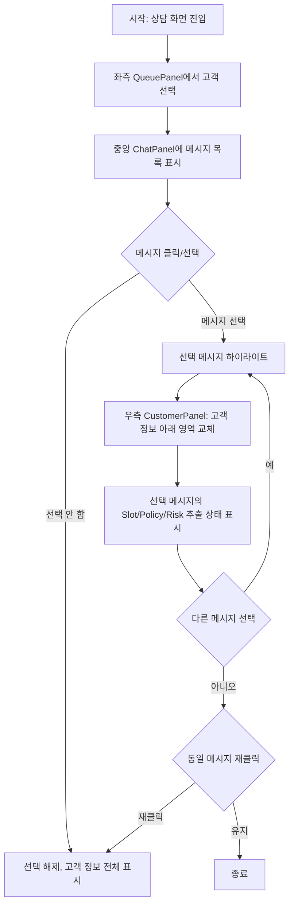

# [FE] 선택 메시지 상세 패널 — Slot·Policy·Risk 추출 상태 표시

> 이 스펙은 상담 대화(Conversation Turn)에서 특정 메시지를 선택하면, 우측 CustomerPanel 영역에 해당 메시지와 연관된 Slot·Policy·Risk의 추출 여부/매핑 태그를 표시하는 기능을 정의한다.
> FSD (Feature-Sliced Design) 아키텍처를 따른다.

---

## Goal

상담 화면의 우측 CustomerPanel 영역에서, 선택한 메시지에 AI가 추출한 Slot(정보 단위)·Policy(처리 규칙)·Risk(위험 요소)가 있는지 시각적으로 표시한다. 운영자가 대화 중 특정 발화를 클릭하면, 해당 발화에서 추출된 도메인 팩 요소를 즉시 확인할 수 있어야 한다.

**OUT scope (별도 티켓)**:
- 메시지별 Slot·Policy·Risk 매핑 데이터를 제공하는 백엔드 API (본 스펙은 화면/UI만 기술)
- 추출 결과 상세 편집/수정 기능
- 대량 메시지 일괄 처리

---

## User Flow Chart



### Selection Rules
- **단일 선택**: 한 번에 하나의 메시지만 선택 가능
- **선택 해제**: 동일 메시지 재클릭 또는 다른 영역 클릭 시 선택 해제
- **고객 전환**: 다른 고객 선택 시 선택 상태 초기화

---

## Design Diff

### As-is vs To-be

| 영역 | As-is | To-be | 변경 내용 |
|------|-------|-------|----------|
| 메시지 선택 | 클릭 인터랙션 없음 (읽기 전용) | 메시지 클릭 시 선택 상태 토글 | `activeMessageId` 상태 추가 |
| 우측 CustomerPanel | 고객 정보 + 문의 관련 주문 + 처리 단계 + 메모 | 고객 정보 + Slot·Policy·Risk 추출 상태 영역 추가 | 새로운 섹션 `추출 정보` 추가 |
| Slot 표시 | 없음 | 추출된 Slot 목록 (태그 형태) | slotCode, name, dataType, isSensitive |
| Policy 표시 | 없음 | Trigger된 Policy 목록 (태그 형태) | policyCode, name, severity |
| Risk 표시 | 없음 | 감지된 Risk 목록 (태그 형태) | riskCode, name, riskLevel |
| 메시지 하이라이트 | 선택 시 시각적 피드백 없음 | 선택된 메시지에 dashed border 또는 배경색 변경 | CSS 상태 클래스 추가 |
| DetectedItems 컴포넌트 | `pages/consultation/ui/sections/DetectedItems.tsx`에 존재 (미사용) | CustomerPanel에서 Slot/Policy/Risk 표시에 재사용 | 기존 컴포넌트 활성화 |

---

## Component Tree

```
ConsultationPage (pages/consultation/ui/)
├─ QueuePanel (features/consultation/ui/) — 좌측 268px
├─ ChatPanel (features/consultation/ui/) — 중앙 flex:1
│    └─ Message (pages/consultation/ui/sections/) — 개별 메시지
│         └─ (선택 시 하이라이트 스타일 적용)
├─ CustomerPanel (pages/consultation/ui/sections/) — 우측 320px
│    ├─ Section: 고객 정보 (변경 없음)
│    ├─ Section: 추출 정보 (신규) ← Slot/Policy/Risk 상태
│    │    ├─ DetectedItems (재사용) — Slot 추출 태그
│    │    ├─ DetectedItems (재사용) — Policy Trigger 태그
│    │    └─ DetectedItems (재사용) — Risk 감지 태그
│    └─ Section: 상담 메모 (변경 없음)
```

### 신규/변경 컴포넌트 상세

#### `ConsultationPage` (변경)
- **신규 상태**: `activeMessageId: string | null` — 현재 선택된 메시지 ID
- **신규 핸들러**: `handleSelectMessage(messageId: string)` — 메시지 선택/해제 토글
- **변경**: `ChatPanel`에 `onSelectMessage` prop 전달
- **변경**: `CustomerPanel`에 `activeMessageId` 및 선택 메시지의 Slot/Policy/Risk 데이터 prop 전달

#### `ChatPanel` (변경)
- **신규 Prop**: `selectedMessageId: string | null`
- **신규 Prop**: `onSelectMessage: (messageId: string) => void`
- 각 메시지에 `onClick` 핸들러 추가 (클릭 시 `onSelectMessage(id)` 호출)
- 선택된 메시지에 CSS 하이라이트 클래스 적용

#### `CustomerPanel` (변경)
- **신규 Prop**: `selectedMessageInfo: MessageExtractionInfo | null`
- `selectedMessageInfo`가 있으면 고객 정보 아래에 **추출 정보** 영역 표시
- `selectedMessageInfo`가 없으면 기존 고객 정보만 표시

#### `DetectedItems` (기존, 활성화)
- 이미 `pages/consultation/ui/sections/DetectedItems.tsx`에 존재
- `DetectedItem[]`을 받아 태그 목록으로 렌더링
- Slot/Policy/Risk 각각 별도 인스턴스로 사용

---

## API Integration

### 별도 백엔드 티켓 필요 사항

본 스펙에서 다루지 않으며, 별도 티켓으로 분리되어 있다.

| 필요 데이터 | 설명 |
|------------|------|
| 메시지-매핑 조회 API | 특정 메시지 ID에 연결된 Slot/Policy/Risk 목록 반환 |
| 응답 구조 | 각 항목의 ID, code, name, type, 추출 여부(ok), 매핑 상태 |

### Mock Data Interface (프론트 단독 개발용)

```typescript
interface MessageExtractionInfo {
  messageId: string;
  slots: ExtractionItem[];
  policies: ExtractionItem[];
  risks: ExtractionItem[];
}

interface ExtractionItem {
  code: string;       // 식별 코드 (slotCode, policyCode, riskCode)
  name: string;       // 표시명
  type: 'SLOT' | 'POLICY' | 'RISK';
  extracted: boolean;  // 추출 성공 여부
  mapped: boolean;    // 도메인 팩 매핑 여부 (※ 단계2: 추출+매핑 통합 시 사용)
}
```

---

## Data Flow

```
┌─────────────────────────────────────────────────────────┐
│                     UI Layer                            │
│  ┌─────────────────────────────────────────────────┐   │
│  │ ConsultationPage                                 │   │
│  │  state: activeMessageId                         │   │
│  │  state: messageExtractions (Map<id, ExtInfo>)   │   │
│  └─────────────────────────────────────────────────┘   │
└─────────────────────────────────────────────────────────┘
        │                        ▲
        │ Props                  │ Props
        ▼                        │
┌─────────────────────────────────────────────────────────┐
│                  Feature Layer                          │
│  ┌─────────────────────────────────────────────────┐   │
│  │ ChatPanel (selectedMessageId, onSelectMessage)  │   │
│  │  → Message onClick → onSelectMessage(id)        │   │
│  └─────────────────────────────────────────────────┘   │
│  ┌─────────────────────────────────────────────────┐   │
│  │ CustomerPanel                                   │   │
│  │  props: { selectedMessageInfo }                 │   │
│  │  → DetectedItems (slots)                       │   │
│  │  → DetectedItems (policies)                    │   │
│  │  → DetectedItems (risks)                       │   │
│  └─────────────────────────────────────────────────┘   │
└─────────────────────────────────────────────────────────┘
        │                        ▲
        │                        │
        ▼                        │
┌─────────────────────────────────────────────────────────┐
│                   Entity Layer                          │
│  SlotDefinition, PolicyDefinition, RiskDefinition       │
│  ExtractionItem (신규 타입, consultation entities)      │
└─────────────────────────────────────────────────────────┘
```

### Key Data Flow Design Decisions

1. **추출 정보 상태**: `ConsultationPage`에서 관리 (중앙 집중)
   - 선택된 messageId → 해당 message의 추출 정보 표시
   - 아직 백엔드 API가 없으므로 mock 데이터로 개발
2. **단일 선택 원칙**: `activeMessageId`는 하나만 유지
   - `onSelectMessage("msg-1")` → `activeMessageId = "msg-1"`
   - `onSelectMessage("msg-1")` (재클릭) → `activeMessageId = null` (토글 해제)
3. **고객 변경 시 초기화**: `handleSelectCustomer`에서 `activeMessageId = null` 설정

---

## State: 표시 상세

### Slot 추출 상태 표시

Slot은 대화에서 추출된 **정보 단위** (주문번호, 상품명, 금액 등)이다.

| 필드 | 디자인 | 설명 |
|------|--------|------|
| 추출 성공 | `DetectedItems`에서 `ok: true` → 초록 배경(`var(--signal-bg)`) + 체크 아이콘 | slotCode + name 표시 |
| 추출 실패 | `DetectedItems`에서 `ok: false` → 노랑 배경(`var(--warn-bg)`) + 느낌표 | slotCode + "추출되지 않음" |

**DetectedItem 변환 예시**:
```typescript
// SlotDefinition → DetectedItem
{
  label: slot.slotCode,         // "orderNumber"
  value: slot.name,             // "주문번호"
  ok: slot.extracted,           // true/false
}
```

### Policy Trigger 상태 표시

Policy는 대화 상황에 **Trigger된 처리 규칙**이다.

| 필드 | 디자인 | 설명 |
|------|--------|------|
| Trigger됨 | `ok: true` → 초록 배경 + 체크 | policyCode + name 표시 |
| 미Trigger | `ok: false` → 노랑 배경 + 느낌표 | policyCode + "적용되지 않음" |

### Risk 감지 상태 표시

Risk는 대화에서 **감지된 위험 요소**이다.

| 필드 | 디자인 | 설명 |
|------|--------|------|
| 감지됨 | `ok: true` → 초록 배경 + 체크 | riskCode + name + (riskLevel badge) 표시 |
| 미감지 | `ok: false` → 노랑 배경 + 느낌표 | riskCode + "감지되지 않음" |

### 선택 메시지 하이라이트

선택된 메시지는 ChatPanel 내에서 시각적으로 구분된다.

| 상태 | 디자인 |
|------|--------|
| 선택됨 | `border: 1px dashed var(--ink-2)` + `background: var(--paper-3)` (또는 기존 bodyBg 대체) |
| 선택 안 됨 | 기존 스타일 유지 |

### 빈 상태 (추출 정보 없음)

선택한 메시지에 Slot/Policy/Risk 데이터가 하나도 없으면 각 항목을 표시하지 않고, 대신 하나의 요약 문구를 표시한다:

```
◈ 추출 정보
  이 메시지에서 추출된 정보가 없습니다
```

---

## 수정 대상 파일

| 파일 | 변경 유형 | 설명 |
|------|----------|------|
| `frontend/src/pages/consultation/ui/ConsultationPage.tsx` | change | `activeMessageId` 상태 추가, `handleSelectMessage` 핸들러, ChatPanel에 `onSelectMessage` 전달, CustomerPanel에 `selectedMessageInfo` 전달 |
| `frontend/src/pages/consultation/ui/sections/CustomerPanel.tsx` | change | `selectedMessageInfo` prop 추가, Slot/Policy/Risk 섹션 조건부 렌더링, `DetectedItems` 재사용 |
| `frontend/src/features/consultation/ui/ChatPanel.tsx` | change | `selectedMessageId` + `onSelectMessage` prop 추가, Message onClick 하이라이트 |
| `frontend/src/pages/consultation/ui/sections/Message.tsx` | change | `selected` prop 추가, 선택 시 하이라이트 스타일 적용 |
| `frontend/src/pages/consultation/ui/sections/DetectedItems.tsx` | use (기존) | Slot/Policy/Risk 표시에 재사용 (변경 불필요) |

### 생성할 파일 없음

모든 변경은 기존 파일 수정으로 처리. 신규 파일 생성 불필요.

---

## State Management

### Component State (ConsultationPage)

```typescript
// pages/consultation/ui/ConsultationPage.tsx
import type { DetectedItem } from './sections/DetectedItems';

// 신규 상태
const [activeMessageId, setActiveMessageId] = useState<string | null>(null);

// 신규 핸들러
const handleSelectMessage = (messageId: string) => {
  setActiveMessageId((prev) => (prev === messageId ? null : messageId));
};

// CustomerPanel 전달 데이터 (mock 추출 예시)
const selectedMessageInfo = activeMessageId ? {
  slots: [
    { label: 'orderNumber', value: '주문번호', ok: true } as DetectedItem,
    { label: 'refundAmount', value: '환불 금액', ok: false } as DetectedItem,
  ],
  policies: [
    { label: 'partialRefund', value: '부분 환불 정책', ok: true } as DetectedItem,
  ],
  risks: [
    { label: 'highValueRefund', value: '고가 금액 환불', ok: false } as DetectedItem,
  ],
} : null;
```

### 고객 변경 시 초기화

```typescript
const handleSelectCustomer = (id: string) => {
  setActiveCustomerId(id);
  setActiveMessageId(null);  // ← 추가: 메시지 선택 초기화
  // ...
};
```

---

## Acceptance

### Positive

```typescript
// 1. 메시지 선택 시 CustomerPanel에 Slot/Policy/Risk 표시
// Given: 대화 메시지 목록이 표시된 상태
// When:  특정 메시지를 클릭
// Then:  해당 메시지가 하이라이트되고, 우측 CustomerPanel에 
//        "추출 정보" 섹션이 나타나며 Slot/Policy/Risk 태그가 표시됨
```

```typescript
// 2. 메시지 선택 해제
// Given: 메시지가 선택된 상태
// When:  동일 메시지를 다시 클릭
// Then:  선택이 해제되고, CustomerPanel이 기존 고객 정보만 표시 (추출 정보 영역 사라짐)
```

### Negative

```typescript
// 3. 추출 정보가 없는 메시지 선택
// Given: 추출 데이터가 없는 메시지가 있는 상태
// When:  해당 메시지를 클릭
// Then:  CustomerPanel에 "이 메시지에서 추출된 정보가 없습니다" 빈 상태 문구 표시
```

```typescript
// 4. 고객 전환 시 메시지 선택 초기화
// Given: 메시지가 선택되고 추출 정보가 표시된 상태
// When:  좌측 QueuePanel에서 다른 고객 선택
// Then:  메시지 선택 상태가 초기화되고, CustomerPanel이 새 고객의 기본 정보만 표시
```

---

## 참고 파일

| 파일 경로 | 설명 |
|----------|------|
| `frontend/src/pages/consultation/ui/ConsultationPage.tsx` | 3단 레이아웃 메인 페이지, 상태 관리 |
| `frontend/src/pages/consultation/ui/sections/CustomerPanel.tsx` | 우측 고객 정보 패널 (320px) |
| `frontend/src/pages/consultation/ui/sections/DetectedItems.tsx` | 추출 항목 표시 컴포넌트 (재사용) |
| `frontend/src/pages/consultation/ui/sections/Message.tsx` | 메시지 단위 UI 컴포넌트 |
| `frontend/src/features/consultation/ui/ChatPanel.tsx` | 채팅 메시지 목록 패널 |
| `frontend/src/features/consultation/ui/CustomerInfoPanel.tsx` | 기존 고객 정보 패널 (미사용, CustomerPanel 우선) |
| `frontend/src/entities/slot/model/types.ts` | SlotDefinition 타입 (zod generated) |
| `frontend/src/entities/policy/model/types.ts` | PolicyDefinition 타입 (zod generated) |
| `frontend/src/entities/risk/model/types.ts` | RiskDefinition 타입 (zod generated) |
| `frontend/src/shared/ui/ostone/atoms/Pill.tsx` | 태그/뱃지 표시 원자 컴포넌트 |
| `frontend/DESIGN.md` | 디자인 시스템 가이드 (흑백 시스템, pill radius) |
