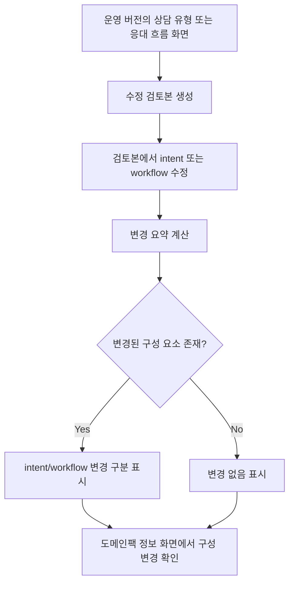

# Frontend FSD Spec: workflow 변경 요약 표시

## Goal

도메인 팩 수정 검토본에서 workflow 이름, 설명, 그래프 텍스트, 그래프 구조 변경을 intent 변경과 함께 변경 요약 및 도메인팩 정보 화면에 표시한다.

## User Flow Chart



## Design Diff

### As-is vs To-be

| 영역 | As-is | To-be | 변경 내용 |
| --- | --- | --- | --- |
| 변경 요약 계산 | `intentCode` 기준 intent name/description만 비교 | intent와 workflow를 함께 비교 | workflow 변경도 변경 있음 상태에 포함 |
| workflow 변경 분류 | 표시 없음 | 이름, 설명, 그래프 텍스트, 그래프 구조로 구분 | 그래프 node/edge label 변경과 구조 변경을 분리 |
| 도메인팩 정보 | `summaryJson`의 생성/품질/검토 필드 중심 표시 | revision diff가 확인되면 구성 변경 섹션 표시 | intent/workflow 변경 구성 요소를 구분 |
| 변경 없음 상태 | intent 변경이 없으면 변경 없음 | intent와 workflow 모두 없을 때만 변경 없음 | workflow-only 수정도 변경 있음으로 처리 |

## Component Tree

```text
IntentDraftReadPage
├─ useIntentDraftReadController
│  └─ useIntentRevisionSummary
│     └─ buildDomainPackRevisionSummary
└─ IntentRevisionDraftActions

SummaryDetailPanel
├─ useDomainPackRevisionSummary
│  └─ buildDomainPackRevisionSummary
└─ SummaryJsonCard
   └─ 구성 변경 섹션
```

## API Integration

### Endpoints

| Method | Path | Description |
| --- | --- | --- |
| GET | `/api/v1/workspaces/:workspaceId/domain-packs/:packId/versions/:versionId/intents` | base/draft intent 목록 조회 |
| GET | `/api/v1/workspaces/:workspaceId/domain-packs/:packId/versions/:versionId/workflows` | base/draft workflow 목록 조회 |
| GET | `/api/v1/workspaces/:workspaceId/domain-packs/:packId/versions/:versionId/workflows/:workflowId` | workflow graphJson 포함 상세 조회 |

### Query Key Pattern

기존 generated endpoint 함수와 feature-local hook state를 사용한다. 새 서버 API나 generated 파일 직접 수정은 포함하지 않는다.

## Data Flow

```text
base version intents/workflows
        │
        ├─ compare by intentCode / workflowCode
        │
draft version intents/workflows
        │
        ▼
buildDomainPackRevisionSummary
        │
        ├─ IntentRevisionDraftActions: 변경된 구성 요소 개수
        └─ SummaryJsonCard: intent/workflow 구성 변경 목록
```

## 수정 대상 파일

| 파일 | 변경 유형 | 설명 |
| --- | --- | --- |
| `frontend/src/shared/lib/domainPackRevisionSummary.ts` | new | intent/workflow 변경 요약 계산 |
| `frontend/src/features/intent-revision-draft/model/useIntentRevisionSummary.ts` | modify | workflow 상세를 함께 조회해 요약에 포함 |
| `frontend/src/features/intent-revision-draft/api/intentRevisionDraftApi.ts` | modify | workflow list/detail generated API wrapper 추가 |
| `frontend/src/features/intent-revision-draft/ui/IntentRevisionDraftActions.tsx` | modify | 변경된 구성 요소 수를 intent/workflow로 구분 |
| `frontend/src/pages/domain-pack/model/useIntentDraftReadController.ts` | modify | workflow-only 변경도 적용 가능하게 판단 |
| `frontend/src/features/domain-pack-summary-read/model/useDomainPackRevisionSummary.ts` | new | 도메인팩 정보 화면용 revision diff 조회 |
| `frontend/src/features/domain-pack-summary-read/ui/SummaryDetailPanel.tsx` | modify | revision diff를 도메인팩 정보 카드에 전달 |
| `frontend/src/features/domain-pack-summary-read/ui/SummaryJsonCard.tsx` | modify | 구성 변경 섹션 렌더링 |
| `frontend/src/features/domain-pack-summary-read/ui/SummaryJsonCard.module.css` | modify | 구성 변경 목록 스타일 |

## State Management

- 서버 상태는 기존 generated API 함수로 조회한다.
- 변경 요약은 저장하지 않고 화면에서 base/draft 버전을 비교해 계산한다.
- workflow graph diff는 `graphJson` 상세 응답을 기준으로 계산한다.

## Tests

### Test Strategy

| 구분 | 방법 | 도구 | 비고 |
| --- | --- | --- | --- |
| 단위 테스트 | diff builder 검증 | Vitest | workflow name/description/graph text/structure |
| Hook 테스트 | 요약 조회 흐름 검증 | React Testing Library | intent와 workflow API 호출 |
| 컴포넌트 테스트 | 도메인팩 정보 구성 변경 표시 | React Testing Library | intent/workflow 구분 렌더링 |

### Test Scenarios

#### Happy Path

| # | 시나리오 | 사전 조건 | 조작 | 기대 결과 |
| --- | --- | --- | --- | --- |
| 1 | workflow 이름/설명 변경 | base/draft workflowCode 동일 | 요약 계산 | workflow 변경 필드에 이름/설명 표시 |
| 2 | workflow graph label 변경 | node/edge 구조 동일, label 변경 | 요약 계산 | 그래프 텍스트 변경 표시 |
| 3 | workflow graph 구조 변경 | node/edge 추가 또는 연결 변경 | 요약 계산 | 그래프 구조 변경 표시 |
| 4 | workflow-only 변경 적용 | intent 변경 없음, workflow 변경 있음 | 검토본 적용 | 변경 있음으로 판단 |
| 5 | 도메인팩 정보 확인 | revision draft source 존재 | 정보 화면 진입 | 구성 변경에 상담 유형/응대 흐름 구분 표시 |

#### Error & Edge Cases

| # | 시나리오 | 조작 | 기대 결과 |
| --- | --- | --- | --- |
| 1 | 변경 없음 | base/draft intent와 workflow 동일 | 변경된 구성 요소 없음 표시 |
| 2 | base에 없는 draft workflow | 새 workflowCode만 존재 | diff 대상에서 제외 |
| 3 | workflow 상세 조회 실패 | 상세 API 에러 | 요약 에러 표시 |

## Non-goals

- backend summaryJson 스키마 변경은 포함하지 않는다.
- workflow 생성/삭제 diff 표시는 이번 범위에 포함하지 않는다.
- generated API 파일 직접 수정은 포함하지 않는다.

## Self-review

### Pass 1: Issue Fidelity

- workflow 이름/설명 변경 표시 요구를 포함했다.
- workflow 그래프 node/edge 텍스트 및 구조 변경 표시 요구를 포함했다.
- 도메인팩 정보 화면에서 intent/workflow 구성 요소를 구분하는 요구를 포함했다.
- 변경 없음/변경 있음 상태가 workflow 수정에도 반영되는 요구를 포함했다.

### Pass 2: Ostone Compliance

- issue 번호만 사용한 `.agent/specs/404.md` 파일명이다.
- 프론트엔드 FSD 템플릿을 기준으로 작성했다.
- 참조한 파일과 디렉터리는 repository에서 존재를 확인했다.
- feature 간 cross-slice import를 피하기 위해 공통 diff builder는 `frontend/src/shared/lib/`에 둔다.
