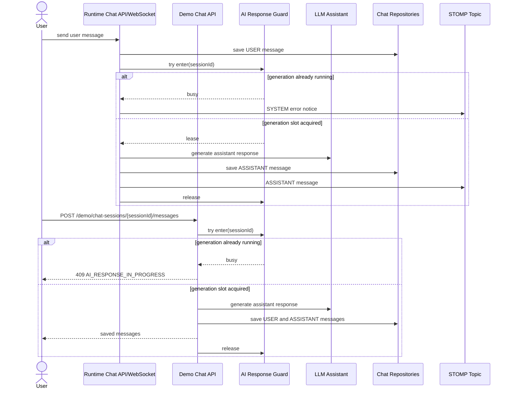

# Issue 406: AI 응답 생성 중 추가 입력 중복 응답 방지

---

## Goal

동일 채팅 세션에서 AI 응답 생성이 진행 중일 때 추가 입력이 들어와도 AI 생성 작업이 병렬로 실행되지 않도록 세션 단위 처리 정책을 적용한다.

---

## Sequence Diagram



---

## REST API

### Endpoint

기존 데모 채팅 메시지 전송 API의 busy 응답만 명확히 정의한다.

| Method | Path | Description |
| --- | --- | --- |
| POST | `/api/v1/workspaces/{workspaceId}/demo/chat-sessions/{sessionId}/messages` | 데모 채팅 사용자 메시지 전송 및 assistant 응답 생성 |

### Response

**409 Conflict**

```json
{
  "code": "AI_RESPONSE_IN_PROGRESS",
  "message": "AI 응답 생성 중입니다. 잠시 후 다시 시도해 주세요."
}
```

일반 런타임 WebSocket 경로는 HTTP 응답이 아니라 `/topic/chat.{sessionId}`에 `ChatMessageResponse.error("AI_RESPONSE_IN_PROGRESS", ...)` 형식의 `SYSTEM`/`ERROR` 메시지를 전송한다.

---

## Class Design

### Affected Files

| 파일 | 변경 유형 | 설명 |
| --- | --- | --- |
| `backend/src/main/java/com/init/workflowruntime/application/AiResponseGenerationGuard.java` | new | 세션별 AI 응답 생성 슬롯을 `tryEnter`/lease로 관리 |
| `backend/src/main/java/com/init/workflowruntime/application/LlmResponseHandler.java` | modify | 일반 런타임 async LLM 응답 생성 전에 guard 획득, busy 시 system error 전송 |
| `backend/src/main/java/com/init/chatdemo/application/DemoChatSessionRegistrationService.java` | modify | 데모 메시지 append 전에 동일 guard 적용, busy 시 409 예외 발생 |
| `backend/src/test/java/com/init/workflowruntime/application/AiResponseGenerationGuardTest.java` | new | 동일 세션 lease 중복 거절과 세션별 독립성 검증 |
| `backend/src/test/java/com/init/workflowruntime/application/LlmResponseHandlerTest.java` | modify | 동시 생성 중 이벤트가 LLM을 호출하지 않고 안내 메시지를 보내는지 검증 |
| `backend/src/test/java/com/init/chatdemo/application/DemoChatSessionRegistrationServiceTest.java` | modify | demo append 중 busy 상태가 409 예외로 반환되고 저장/LLM 호출이 없는지 검증 |
| `frontend/src/pages/user-chat/ui/UserChatPage.tsx` | modify | demo HTTP 409 busy 응답을 사용자 안내 문구로 매핑 |
| `frontend/src/pages/user-chat/ui/UserChatPage.test.tsx` | modify | demo busy 응답의 사용자 안내 렌더링 검증 |

### Policy

- 정책은 `reject while busy`이다.
- 동일 JVM 내 같은 `sessionId`에 대해 하나의 AI 응답 생성 작업만 guard lease를 획득할 수 있다.
- 일반 런타임은 사용자 메시지 저장 이후 async 응답 생성 단계에서 busy를 감지하므로, 추가 assistant 응답은 만들지 않고 STOMP system error notice를 보낸다.
- 데모 런타임은 사용자 메시지와 assistant 메시지를 같은 요청에서 생성하므로, busy 상태에서는 메시지를 저장하지 않고 409를 반환한다.
- guard는 LLM 성공, fallback 저장, 예외 발생 여부와 관계없이 release된다.

---

## Requirements

1. 동일 세션에서 `LlmResponseHandler#handleChatMessageReceived`가 동시에 여러 LLM 생성을 실행하지 않는다.
2. 일반 런타임에서 busy 상태의 추가 사용자 입력 이벤트는 assistant 응답 저장 없이 `AI_RESPONSE_IN_PROGRESS` system error를 STOMP로 전달한다.
3. `DemoChatSessionRegistrationService#appendMessage`는 동일 세션 busy 상태에서 user/assistant 메시지를 저장하지 않고 409 응답으로 종료한다.
4. 데모 채팅 화면은 서버의 `AI_RESPONSE_IN_PROGRESS` 409 응답을 “AI 응답 생성 중입니다” 안내로 표시한다.
5. 기존 AI 비활성/상담사 모드 체크와 저장 직전 재검증 동작은 유지한다.
6. LLM 예외 fallback, 메시지 sequence 산정, session metadata 갱신, queue upsert 이벤트의 기존 정상 동작은 유지한다.

---

## Non-goals

- 입력을 서버 큐에 쌓아 순차 처리하지 않는다.
- 마지막 입력만 debounce하거나 이전 입력을 취소하지 않는다.
- DB 스키마 또는 `runtime.chat_session` 상태 컬럼을 추가하지 않는다.
- 멀티 인스턴스 전체에 걸친 분산 락은 이번 범위에 포함하지 않는다.
- 프론트엔드 화면 구조나 디자인을 변경하지 않는다. busy 응답 문구 매핑만 다룬다.

---

## Tests

### Test Strategy

| 구분 | 방법 | 도구 | 비고 |
| --- | --- | --- | --- |
| Unit | guard lease 획득/거절/release 동작 검증 | JUnit 5 | 동일 세션과 다른 세션 분리 확인 |
| Application unit | guard가 busy를 반환할 때 일반 runtime LLM 호출/저장을 생략하는지 검증 | JUnit 5 + Mockito | STOMP error notice 확인 |
| Application unit | demo append가 busy 시 409 예외를 던지고 저장하지 않는지 검증 | JUnit 5 + Mockito | `DuplicateException`의 `AI_RESPONSE_IN_PROGRESS` code 확인 |
| Frontend unit | demo busy 응답 문구 렌더링 검증 | Vitest + React Testing Library | 기존 message error 영역 사용 |
| Regression | 기존 LLM success/fallback/human mode 테스트 유지 | Gradle test | constructor 변경에 따른 회귀 확인 |

### Acceptance Criteria

| # | 시나리오 | 기대 결과 |
| --- | --- | --- |
| 1 | 같은 세션에서 AI 응답 생성 중 일반 런타임 이벤트가 추가 발생 | 두 번째 이벤트는 LLM을 호출하지 않고 `AI_RESPONSE_IN_PROGRESS` system error를 전송한다 |
| 2 | 같은 세션에서 AI 응답 생성 중 demo 메시지 append 요청 발생 | HTTP 409로 매핑되는 예외가 발생하고 메시지는 저장되지 않는다 |
| 3 | demo 화면이 `AI_RESPONSE_IN_PROGRESS` 응답을 받음 | generic 실패 문구 대신 “AI 응답 생성 중입니다” 안내를 표시한다 |
| 4 | 첫 번째 AI 생성 작업이 성공 또는 실패 후 종료 | guard가 release되어 이후 입력은 다시 처리될 수 있다 |
| 5 | 세션이 상담사 모드로 전환됨 | 기존처럼 LLM 호출과 자동 전송을 생략한다 |

---

## Open Questions

- 없음. 이 이슈에서는 서버 단의 `reject while busy` 정책을 우선 적용한다.
