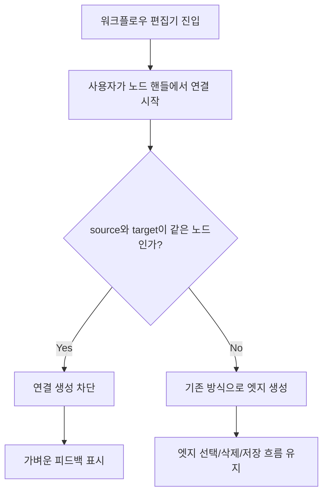

# Issue 408: 워크플로우 편집기 자기참조 연결 차단

---

## Goal

워크플로우 편집기에서 같은 노드를 source와 target으로 연결하는 자기참조 화살표 생성을 즉시 차단해 편집/삭제/저장 단계의 불안정한 그래프 상태를 방지한다.

---

## User Flow Chart



---

## Design Diff

### As-is vs To-be

| 영역 | As-is | To-be | 변경 내용 |
| --- | --- | --- | --- |
| 그래프 연결 생성 | `source === target` 연결도 `addEdge`로 추가 | 같은 노드 간 연결은 추가하지 않음 | 편집기 단계에서 자기참조 엣지를 차단 |
| 사용자 피드백 | 차단 피드백 없음 | 차단 시 toast warning 표시 | 사용자가 연결이 무시된 이유를 알 수 있음 |
| 정상 엣지 | source node 타입에 따라 일반/decision 엣지 생성 | 동일 | 기존 정상 엣지 생성 동작 유지 |
| 엣지 삭제/저장 | 자기참조 엣지로 불안정 가능 | 자기참조 엣지 유입 방지 | 저장 전 그래프 상태 안정화 |

---

## Component Tree

```text
WorkflowEditForm
└─ InteractiveGraphEditor
   ├─ ReactFlow
   │  ├─ Editable*Node
   │  ├─ PlainEdge
   │  └─ EditableEdge
   └─ AddNodeToolbar
```

---

## 수정 대상 파일

| 파일 | 변경 유형 | 설명 |
| --- | --- | --- |
| `frontend/src/features/update-workflow/ui/InteractiveGraphEditor.tsx` | modify | `onConnect`에서 자기참조 연결을 차단하고 toast warning 제공 |
| `frontend/src/features/update-workflow/ui/InteractiveGraphEditor.test.tsx` | new | 자기참조 연결 차단과 정상 연결 유지 검증 |

---

## API Integration

백엔드 API 변경은 없다. 저장 요청에 포함되는 `graphJson` 구조도 변경하지 않고, 편집기 내부에서 유효하지 않은 자기참조 엣지 생성을 막는다.

---

## Data Flow

```text
ReactFlow onConnect(params)
  -> params.source / params.target 비교
    -> 동일: toast warning 후 edges 갱신 중단
    -> 다름: 기존 addEdge 경로로 edges 갱신
  -> InteractiveGraphEditor onStateChange
  -> WorkflowEditForm graphStateRef
  -> 저장 시 toWorkflowGraph 변환
```

---

## State Management

새 전역 상태는 추가하지 않는다. `InteractiveGraphEditor`의 기존 `onConnect` 경로에서 자기참조 연결만 무시한다.

---

## Requirements

1. 같은 노드를 source와 target으로 하는 연결은 생성되지 않는다.
2. 자기참조 연결이 차단되면 사용자에게 가벼운 피드백을 제공한다.
3. source와 target이 다른 기존 정상 연결은 계속 생성된다.
4. decision 노드에서 시작하는 정상 연결은 기존처럼 editable decision edge로 생성된다.
5. 기존 엣지 삭제, 노드 추가, 그래프 저장 경로는 변경하지 않는다.

---

## Non-goals

- 자기참조 엣지를 별도 self-loop UI로 렌더링하지 않는다.
- 백엔드 `WorkflowGraphValidator`의 cycle 검증 정책을 변경하지 않는다.
- 이미 저장된 데이터에 자기참조 엣지가 있는 경우의 마이그레이션이나 정정 UI는 포함하지 않는다.
- React Flow 커스텀 엣지 렌더링 방식을 재설계하지 않는다.

---

## Tests

### Test Strategy

| 구분 | 방법 | 도구 | 비고 |
| --- | --- | --- | --- |
| 컴포넌트 테스트 | `InteractiveGraphEditor`의 `onConnect` 동작 검증 | Vitest + React Testing Library | React Flow를 테스트 더블로 대체해 연결 이벤트 직접 호출 |
| 회귀 테스트 | 기존 update-workflow 관련 테스트 실행 | `pnpm test -- InteractiveGraphEditor WorkflowEditForm` | 정상 연결/폼 연동 영향 확인 |
| 빌드/린트 | 프론트엔드 타입/린트 검증 | `pnpm lint`, 필요 시 `pnpm build` | import/type 오류 확인 |

### Acceptance Criteria

| # | 시나리오 | 기대 결과 |
| --- | --- | --- |
| 1 | 사용자가 같은 노드의 source/target 핸들을 연결 | 엣지가 추가되지 않고 자기참조 불가 안내 toast가 표시된다 |
| 2 | 사용자가 서로 다른 노드를 연결 | 엣지가 1개 추가되고 `onStateChange`에 반영된다 |
| 3 | decision 노드에서 다른 노드로 연결 | 기존처럼 `type: "decision"` 엣지가 생성된다 |
| 4 | 기존 엣지를 삭제 | 기존 React Flow 삭제 키 동작이 유지된다 |

---

## Open Questions

- 없음. 이 이슈 범위에서는 편집 단계 차단과 사용자 피드백만 다룬다.
