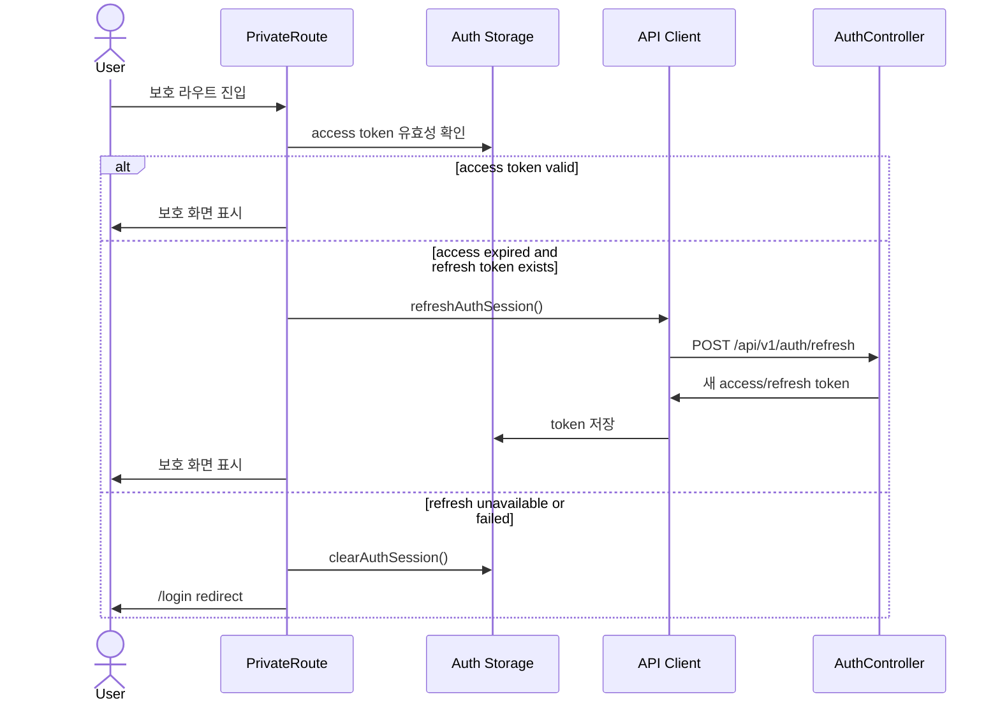

# Backend/Frontend Spec: 세션 유지 정책 개선

## Goal

시연 중 access token 만료로 보호 라우트에서 로그인 화면으로 이탈하지 않도록, access token 만료 시 유효한 refresh token으로 세션을 자연스럽게 갱신한다.

## Problem

- backend의 기본 access token 만료 시간은 30분(`1800000ms`)이다.
- refresh token은 7일 동안 유효하지만 frontend의 라우트 인증 판단은 access token의 `exp`만 확인한다.
- access token이 만료된 상태에서 보호 라우트에 진입하면 refresh token이 남아 있어도 인증되지 않은 상태로 처리될 수 있다.
- 시연 편의용 세션 정책과 운영/프로덕션 보안 정책을 환경 변수로 분리할 수 있어야 한다.

## Scope

- Backend auth 설정에서 access token/refresh token 만료 시간을 환경 변수로 조정할 수 있게 한다.
- Frontend 보호 라우트 진입 시 access token이 만료되어도 refresh token이 있으면 `/api/v1/auth/refresh`로 갱신을 시도한다.
- Frontend API client가 인증된 요청에서 401을 받았을 때 refresh token으로 갱신 후 원 요청을 한 번 재시도한다.
- refresh token이 없거나 refresh 실패 시 기존처럼 auth session을 정리하고 로그인 화면으로 이동한다.

## Non-Goals

- refresh token 저장소, DB 스키마, 회전 정책 자체는 변경하지 않는다.
- 쿠키 기반 인증 또는 silent iframe 같은 별도 인증 방식을 도입하지 않는다.
- 비밀번호 재설정, 회원가입, 로그아웃 플로우의 응답 계약은 변경하지 않는다.

## Affected Modules

| 영역 | 경로 | 변경 이유 |
| --- | --- | --- |
| Backend auth config | `backend/src/main/resources/application.yml` | token 만료 시간 환경 변수 바인딩 |
| Backend local config | `backend/src/main/resources/application-local.yml` | 로컬/시연 기본 access token 유지 시간 분리 |
| Docker compose env | `docker-compose.yml` | 컨테이너 실행 시 token 만료 환경 변수 전달 |
| Env example | `.env.example` | 시연/운영별 token 만료 설정 문서화 |
| Frontend auth storage | `frontend/src/shared/lib/auth.ts` | refresh 후 token만 갱신하는 저장 함수 제공 |
| Frontend API client | `frontend/src/shared/api/index.ts` | 401 refresh/retry 및 외부 refresh 함수 제공 |
| Frontend protected route | `frontend/src/shared/ui/PrivateRoute.tsx` | 라우트 redirect 전 refresh 시도 |

## Expected Flow

## Requirements

1. `JWT_ACCESS_TOKEN_EXPIRATION` 환경 변수로 access token 만료 시간을 설정할 수 있어야 한다.
2. `JWT_REFRESH_TOKEN_EXPIRATION` 환경 변수로 refresh token 만료 시간을 설정할 수 있어야 한다.
3. 기본 운영 설정은 기존 30분 access token, 7일 refresh token 정책을 유지한다.
4. `local` 프로필은 별도 환경 변수 override가 없을 때 시연 중 이탈 가능성을 낮추는 더 긴 access token 기본값을 사용한다.
5. 보호 라우트는 access token 만료만으로 즉시 세션을 삭제하지 않고 refresh token이 있으면 갱신을 시도한다.
6. 인증 헤더가 포함된 API 요청이 401을 받으면 refresh token으로 갱신 후 원 요청을 한 번만 재시도한다.
7. refresh 요청 자체나 로그인/회원가입 같은 auth endpoint 실패는 무한 재시도하지 않는다.
8. refresh 실패 또는 refresh token 부재 시 저장된 auth session을 정리한다.
9. refresh 성공 시 기존 user 정보는 유지하면서 access token과 refresh token만 갱신한다.

## API/Data Impact

- 신규 endpoint는 없다.
- 기존 `POST /api/v1/auth/refresh` 요청/응답 계약을 그대로 사용한다.
- DB 마이그레이션은 필요하지 않다.

## Validation Plan

- Frontend unit tests:
  - 만료된 access token과 유효한 refresh token이 있을 때 `PrivateRoute`가 refresh 후 children을 렌더링한다.
  - refresh 실패 시 `PrivateRoute`가 session을 정리하고 `/login`으로 redirect한다.
  - API client가 인증된 요청 401 이후 refresh 성공 시 새 access token으로 원 요청을 한 번 재시도한다.
  - API client가 refresh 실패 시 session을 정리하고 원 401 에러를 반환한다.
- Backend/config verification:
  - `application.yml`, `application-local.yml`, `docker-compose.yml`, `.env.example`에서 token 만료 설정 경로를 확인한다.
- Regression:
  - 기존 로그인/로그아웃/refresh API 테스트가 계속 통과해야 한다.

## Assumptions

- 시연 환경의 정확한 access token 기본 시간은 별도 지정이 없으므로, 로컬 프로필 기본값은 시연 한 세션을 충분히 넘기는 12시간으로 둔다.

## Open Questions

- 없음.
