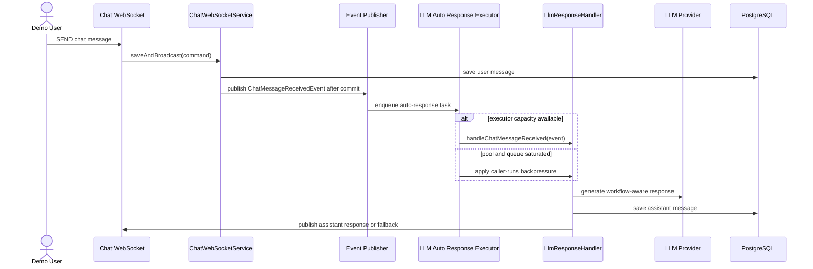

# Issue 410: 시연 예상 동시 채팅 세션 처리량 점검

## Goal

시연 중 여러 사용자가 동시에 데모 채팅을 사용할 때 LLM 자동 응답 처리량을 예측 가능하게 제한하고, 운영자가 안전한 동시 세션 범위와 병목 신호를 점검할 수 있게 한다.

## Background

사용자 채팅 메시지는 저장 커밋 이후 `ChatMessageReceivedEvent`를 발행하고, LLM 자동 응답은 `LlmResponseHandler`의 비동기 이벤트 리스너에서 생성된다. 이슈 확인 내용처럼 전용 executor와 큐 한도가 없으면 LLM 지연 또는 provider throttle 상황에서 동시 요청 수와 대기열을 추적하기 어렵다.

## Sequence Diagram

## Scope

### In Scope

- LLM 자동 응답 이벤트 리스너가 전용 bounded executor를 사용한다.
- executor core/max/queue/keep-alive 값을 환경 변수로 조정할 수 있다.
- executor active/pool/queue 지표를 Actuator metrics로 확인할 수 있다.
- 시연 리허설용 간단 부하 시나리오와 병목 판정 기준을 문서화한다.

### Out of Scope

- 실제 외부 LLM provider의 rate limit 상향 또는 모델 교체.
- 세션별 LLM 동시 실행 1개 제한, 사용자 입력 제한, 회로 차단기 구현.
- 프론트엔드 채팅 UX 변경.
- DB schema 또는 OpenAPI 계약 변경.

## Affected Modules

| 영역 | 경로 | 영향 |
| --- | --- | --- |
| Backend config | `backend/src/main/java/com/init/workflowruntime/config/AiConfig.java` | LLM 자동 응답 전용 executor bean 구성 |
| Backend config | `backend/src/main/java/com/init/workflowruntime/config/LlmAutoResponseProperties.java` | executor 설정값 바인딩 및 기본값 제공 |
| Backend application | `backend/src/main/java/com/init/workflowruntime/application/LlmResponseHandler.java` | 전용 executor를 지정한 비동기 이벤트 처리 |
| Backend config | `backend/src/main/resources/application.yml` | 환경 변수 기반 executor 기본값 추가 |
| Backend tests | `backend/src/test/java/com/init/workflowruntime/config/AiConfigTest.java` | bounded executor와 metric 등록 검증 |
| Backend tests | `backend/src/test/java/com/init/workflowruntime/config/LlmAutoResponsePropertiesTest.java` | 설정 기본값/보정 검증 |
| Backend tests | `backend/src/test/java/com/init/workflowruntime/application/LlmResponseHandlerTest.java` | handler가 전용 executor를 사용하는지 검증 |
| Env docs | `.env.example` | 로컬에서 조정 가능한 executor 환경 변수 예시 |
| Ops docs | `docs/ops/demo-chat-throughput.md` | 시연 부하 시나리오와 지표 확인 방법 |

## Configuration

| 환경 변수 | 기본값 | 의미 |
| --- | --- | --- |
| `AI_CHAT_AUTO_RESPONSE_CORE_SIZE` | `4` | 항상 유지할 LLM 자동 응답 worker 수 |
| `AI_CHAT_AUTO_RESPONSE_MAX_SIZE` | `8` | burst 시 확장 가능한 worker 상한 |
| `AI_CHAT_AUTO_RESPONSE_QUEUE_CAPACITY` | `16` | worker가 모두 바쁠 때 대기 가능한 자동 응답 작업 수 |
| `AI_CHAT_AUTO_RESPONSE_KEEP_ALIVE_SECONDS` | `60` | core 초과 worker idle 유지 시간 |

기본값 기준으로 동시에 실행 중인 자동 응답은 최대 8개, 큐 대기는 최대 16개다. 그 이상은 `CallerRunsPolicy`로 이벤트 발행 경로에 backpressure를 걸어 무제한 스레드 증가를 막는다.

## Validation Plan

| 확인 항목 | 방법 | 기대 결과 |
| --- | --- | --- |
| executor 한도 | backend 단위 테스트 | core/max/queue와 rejection policy가 의도대로 구성된다 |
| handler 연결 | backend 단위 테스트 | `LlmResponseHandler`가 `llmAutoResponseTaskExecutor`를 지정한다 |
| 지표 노출 | backend 단위 테스트 및 Actuator | queue remaining/size gauge를 조회할 수 있다 |
| 시연 리허설 | 문서의 부하 시나리오 | 동시 세션 수, 평균/최대 응답 시간, 실패율, queue saturation 여부를 기록한다 |

## Acceptance Criteria

- LLM 자동 응답은 generic async executor가 아니라 전용 bounded executor에서 실행된다.
- 기본 설정으로 동시 실행 8개, 대기 16개를 넘는 자동 응답 burst에 backpressure가 적용된다.
- executor 설정은 환경 변수로 조정 가능하다.
- `app.ai.chat.auto.response.executor.*` metric으로 active worker와 queue 상태를 확인할 수 있다.
- 시연 전 점검 문서는 동시 채팅 세션 수, 평균/최대 응답 시간, 실패율, 병목 시 후속 이슈 후보를 포함한다.

## Open Questions

- 실제 시연 예상 인원과 네트워크 환경이 확정되면 기본 executor 값을 그대로 둘지, 리허설 측정값 기준으로 조정할지 결정한다.
- LLM provider throttle이 반복되면 세션별 자동 응답 제한 또는 상담사 fallback 전환을 별도 이슈로 분리한다.
