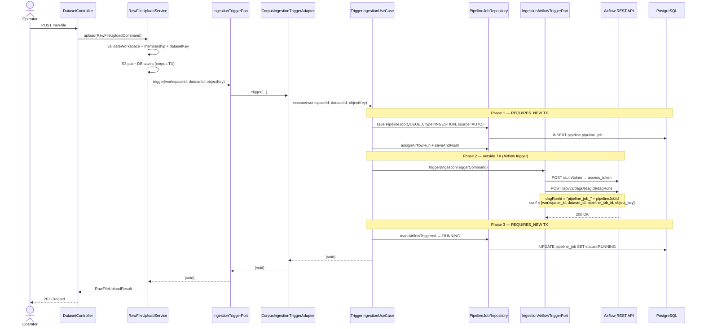

# [BE] 4.1.1.6 파일 업로드 이후 Airflow 트리거 연동

**Canonical Number**: `4116`
**Branch**: `spec/4116`
**Template Base**: `_TEMPLATE_BE.md`
**작성일**: 2026-05-14 (v2: U-02=A 반영, 2026-05-14)
**선행 스펙**: `.agent/specs/114.md` (U-08 deferred 항목 구현)

---

## Goal

`AirflowIngestionTriggerAdapter` NOOP stub을 실제 Airflow API 호출 구현으로 교체한다.
파일 업로드(spec/114) 완료 직후 `domain_pack_generation` DAG가 자동으로 트리거되어 ingestion 파이프라인이 시작되도록 연동하되, **실제 `pipeline_job` DB 레코드를 생성하여 ML과의 `pipeline_job_id` contract를 준수한다.**

---

## Confirmed Decisions

| ID | 결정 내용 |
|----|-----------|
| U-01 | `domain_pack_generation` DAG 재사용 |
| U-02 | pipeline_job DB 레코드 **생성** (contract 무결성 필수) |
| U-03 | `IngestionTriggerPort.trigger()` 파라미터에 `workspaceId` 추가 |
| U-04 | `AirflowApiProperties`를 `shared` 모듈로 이전 (이 PR 내 처리) |
| U-05 | `TriggerIngestionUseCase`에 `TransactionTemplate(REQUIRES_NEW)` 2-phase 패턴 적용 |
| U-06 | corpus-specific 예외 불필요 — pipelinejob 예외(`AirflowTriggerFailedException`)가 corpus `catch(Exception)` 블록으로 전파 |

---

## 아키텍처 결정: CorpusIngestionTriggerAdapter in pipelinejob BC

corpus BC는 `IngestionTriggerPort` 인터페이스만 정의하고, 구현체(`CorpusIngestionTriggerAdapter`)는 **pipelinejob BC**에 위치한다.

```
corpus.application.port.IngestionTriggerPort   (인터페이스, corpus 소유)
         ↑ implements
pipelinejob.infrastructure.corpus.CorpusIngestionTriggerAdapter   (@Component)
         → calls TriggerIngestionUseCase (pipelinejob application)
                 → creates pipeline_job (QUEUED)
                 → calls IngestionAirflowTriggerPort (pipelinejob internal port)
                 → updates pipeline_job (RUNNING or FAILED)
pipelinejob.infrastructure.airflow.AirflowIngestionTriggerAdapter
                 → Airflow REST API
```

> **BC 의존성 방향**: pipelinejob BC가 corpus BC의 port interface를 import.
> 이는 pipelinejob이 이미 workspace/corpus 데이터를 port 통해 의존하는 기존 패턴과 일치함.
> corpus BC는 pipelinejob BC를 직접 import하지 않음.

---

## Sequence Diagram



> **Airflow 트리거 실패 시**:
> - `usecase`: `markFailed()` 호출 → pipeline_job FAILED (REQUIRES_NEW TX commit)
> - `AirflowTriggerFailedException` 전파
> - corpus `catch(Exception)` → S3 orphan cleanup + corpus DB rollback
> - 최종 상태: pipeline_job FAILED (committed) + corpus records 없음 + S3 파일 없음

---

## REST API

신규 endpoint 없음. `POST /api/v1/workspaces/{workspaceId}/datasets/raw-file` (spec/114) 내부 동작 변경.

---

## Scope of Changes

### 1. shared 모듈 — `AirflowApiProperties` 이전 및 `Ingestion` DAG 추가

**이동 대상:**
- `com.init.pipelinejob.infrastructure.airflow.AirflowApiProperties` → `com.init.shared.infrastructure.airflow.AirflowApiProperties`
- `com.init.pipelinejob.infrastructure.airflow.AirflowApiConfig` → `com.init.shared.infrastructure.airflow.AirflowApiConfig`

**변경 내용 (`AirflowApiProperties`):**

```java
package com.init.shared.infrastructure.airflow;

@ConfigurationProperties(prefix = "airflow")
public record AirflowApiProperties(Api api, Dags dags) {

  public record Api(
      String baseUrl, String username, String password,
      Duration connectTimeout, Duration readTimeout) {}

  public record Dags(DomainPackGeneration domainPackGeneration, Ingestion ingestion) {}

  public record DomainPackGeneration(String dagId) {}

  public record Ingestion(String dagId) {}    // 신규
}
```

**application.yml 추가:**

```yaml
airflow:
  dags:
    ingestion:
      dag-id: ${AIRFLOW_INGESTION_DAG_ID:domain_pack_generation}
```

> `AIRFLOW_INGESTION_DAG_ID` 기본값 = `domain_pack_generation` (U-01 결정).
> 추후 ingestion 전용 DAG 생성 시 환경 변수만 교체.

---

### 2. pipelinejob 모듈 — 기존 파일 수정

**`AirflowApiProperties.java`, `AirflowApiConfig.java` 삭제** (shared로 이전)

**`AirflowDomainPackGenerationTriggerAdapter.java`** — import 경로만 변경:
```java
// Before
import com.init.pipelinejob.infrastructure.airflow.AirflowApiProperties;
// After
import com.init.shared.infrastructure.airflow.AirflowApiProperties;
```

**`PipelineJob.java`** — `JOB_TYPE_INGESTION` 상수 추가:
```java
public static final String JOB_TYPE_INGESTION = "INGESTION";
```

**`PipelineJob.java`** — `createIngestion()` 팩토리 메서드 추가:
```java
public static PipelineJob createIngestion(
    Long workspaceId, Long datasetId, OffsetDateTime requestedAt) {
  Objects.requireNonNull(datasetId, "datasetId must not be null");
  PipelineJob job = create(
      workspaceId, JOB_TYPE_INGESTION, STATUS_QUEUED, "AUTO", "{}", requestedAt);
  job.datasetId = datasetId;
  return job;
}
```

> `triggerSource = "AUTO"` — 파일 업로드로 자동 트리거됨을 명시. `MANUAL`은 운영자 수동 실행 전용.
> `triggeredBy = null` — 자동 트리거이므로 특정 사용자 귀속 없음.

---

### 3. pipelinejob 모듈 — 신규 파일

#### 3-1. `IngestionAirflowTriggerPort` (pipelinejob 내부 포트)

```java
// pipelinejob/application/IngestionAirflowTriggerPort.java
package com.init.pipelinejob.application;

public interface IngestionAirflowTriggerPort {
  String dagId();
  void trigger(IngestionTriggerCommand command);   // throws AirflowTriggerFailedException
}
```

#### 3-2. `IngestionTriggerCommand`

```java
// pipelinejob/application/IngestionTriggerCommand.java
package com.init.pipelinejob.application;

public record IngestionTriggerCommand(
    Long workspaceId,
    Long datasetId,
    Long pipelineJobId,
    String dagRunId,
    String objectKey) {}
```

#### 3-3. `TriggerIngestionUseCase`

```java
// pipelinejob/application/TriggerIngestionUseCase.java
package com.init.pipelinejob.application;

import com.init.pipelinejob.application.exception.AirflowTriggerFailedException;
import com.init.pipelinejob.domain.model.PipelineJob;
import com.init.pipelinejob.domain.repository.PipelineJobRepository;
import java.time.Clock;
import java.time.OffsetDateTime;
import org.springframework.stereotype.Service;
import org.springframework.transaction.PlatformTransactionManager;
import org.springframework.transaction.TransactionDefinition;
import org.springframework.transaction.support.TransactionTemplate;

// NOTE: TransactionTemplate(REQUIRES_NEW)를 사용한다.
// corpus BC의 @Transactional 내부에서 호출되므로, pipeline_job 커밋이 corpus TX와 독립적이어야 함.
// Phase 1/3은 REQUIRES_NEW TX로 corpus TX를 일시 중단하고 별도 커밋.
// Airflow trigger(Phase 2)는 TX 외부에서 실행.
@Service
public class TriggerIngestionUseCase {

  private final PipelineJobRepository pipelineJobRepository;
  private final IngestionAirflowTriggerPort airflowTriggerPort;
  private final Clock clock;
  private final TransactionTemplate requiresNewTx;

  public TriggerIngestionUseCase(
      PipelineJobRepository pipelineJobRepository,
      IngestionAirflowTriggerPort airflowTriggerPort,
      Clock clock,
      PlatformTransactionManager transactionManager) {
    this.pipelineJobRepository = pipelineJobRepository;
    this.airflowTriggerPort = airflowTriggerPort;
    this.clock = clock;
    this.requiresNewTx = buildRequiresNewTemplate(transactionManager);
  }

  public void execute(Long workspaceId, Long datasetId, String objectKey) {
    // Phase 1: pipeline_job QUEUED 생성 (corpus TX와 독립 커밋)
    CreatedJob createdJob = requiresNewTx.execute(status -> {
      String dagId = airflowTriggerPort.dagId();
      PipelineJob job =
          PipelineJob.createIngestion(workspaceId, datasetId, OffsetDateTime.now(clock));
      PipelineJob saved = pipelineJobRepository.saveAndFlush(job);
      String dagRunId = "pipeline_job_" + saved.getId();
      saved.assignAirflowRun(dagId, dagRunId, buildPayloadJson(workspaceId, datasetId, dagId, dagRunId, objectKey));
      pipelineJobRepository.saveAndFlush(saved);
      return new CreatedJob(saved.getId(), dagId, dagRunId);
    });

    // Phase 2: Airflow 트리거 (TX 외부)
    try {
      airflowTriggerPort.trigger(new IngestionTriggerCommand(
          workspaceId, datasetId, createdJob.pipelineJobId(), createdJob.dagRunId(), objectKey));
    } catch (AirflowTriggerFailedException ex) {
      markFailed(createdJob.pipelineJobId(), ex.getMessage());
      throw ex;
    }

    // Phase 3: pipeline_job RUNNING 전환 (corpus TX와 독립 커밋)
    requiresNewTx.executeWithoutResult(status -> {
      PipelineJob job = pipelineJobRepository.findById(createdJob.pipelineJobId())
          .orElseThrow(() -> new IllegalStateException(
              "pipeline_job을 찾을 수 없습니다. id=" + createdJob.pipelineJobId()));
      if (PipelineJob.STATUS_QUEUED.equals(job.getStatus())) {
        job.markAirflowTriggered(OffsetDateTime.now(clock));
        pipelineJobRepository.saveAndFlush(job);
      }
    });
  }

  private void markFailed(Long pipelineJobId, String errorMessage) {
    requiresNewTx.executeWithoutResult(status -> {
      PipelineJob job = pipelineJobRepository.findById(pipelineJobId)
          .orElseThrow(() -> new IllegalStateException(
              "pipeline_job을 찾을 수 없습니다. id=" + pipelineJobId));
      if (!job.isFinalized()) {
        job.markFailed(errorMessage, OffsetDateTime.now(clock));
        pipelineJobRepository.saveAndFlush(job);
      }
    });
  }

  private String buildPayloadJson(
      Long workspaceId, Long datasetId, String dagId, String dagRunId, String objectKey) {
    // ObjectMapper를 통해 JSON 직렬화 (TriggerDomainPackGenerationUseCase 패턴 참조)
    // {"workspaceId":1, "datasetId":42, "jobType":"INGESTION", "airflowDagId":"...", "airflowRunId":"...", "objectKey":"..."}
    return "{}"; // 의사 코드 — 실제 구현에서 ObjectMapper 주입 필요
  }

  private TransactionTemplate buildRequiresNewTemplate(PlatformTransactionManager tm) {
    TransactionTemplate t = new TransactionTemplate(tm);
    t.setPropagationBehavior(TransactionDefinition.PROPAGATION_REQUIRES_NEW);
    return t;
  }

  private record CreatedJob(Long pipelineJobId, String dagId, String dagRunId) {}
}
```

#### 3-4. `AirflowIngestionTriggerAdapter` (pipelinejob 내부 — HTTP 호출)

```java
// pipelinejob/infrastructure/airflow/AirflowIngestionTriggerAdapter.java
package com.init.pipelinejob.infrastructure.airflow;

// AirflowDomainPackGenerationTriggerAdapter 구조와 동일한 패턴.
// 차이점:
//   - implements IngestionAirflowTriggerPort (not DomainPackGenerationTriggerPort)
//   - dagId: properties.dags().ingestion().dagId() (신규 Ingestion record)
//   - conf: {workspace_id, dataset_id, pipeline_job_id, object_key}
//   - 예외: AirflowTriggerFailedException(command.pipelineJobId(), "Ingestion DAG 실행 요청에 실패했습니다.", cause)
//           → (Long, String, Throwable) 오버로드 신규 추가 필요 (SC-B3 해소)

@Component
public class AirflowIngestionTriggerAdapter implements IngestionAirflowTriggerPort {

  // AirflowDomainPackGenerationTriggerAdapter와 동일한 RestClient + JWT auth + reconciliation 패턴.
  // dagId(), trigger(), reconcileDagRunOrThrow(), dagRunExists(), requestToken(),
  // buildDagRunRequest(), restClient(), api() 메서드 구조 동일.

  @Override
  public String dagId() {
    api();
    if (properties.dags() == null || properties.dags().ingestion() == null) {
      throw new AirflowConfigurationInvalidException();
    }
    String dagId = properties.dags().ingestion().dagId();
    if (isBlank(dagId)) throw new AirflowConfigurationInvalidException();
    return dagId;
  }

  @Override
  public void trigger(IngestionTriggerCommand command) {
    // DomainPackGenerationTriggerAdapter.trigger() 패턴 그대로.
    // 반환값 없음(void) — dagRunId는 command에 이미 확정됨.
  }

  private ObjectNode buildDagRunRequest(IngestionTriggerCommand command) {
    ObjectNode request = objectMapper.createObjectNode();
    request.put("dag_run_id", command.dagRunId());
    request.put("logical_date",
        OffsetDateTime.ofInstant(clock.instant(), ZoneOffset.UTC).toString());
    ObjectNode conf = request.putObject("conf");
    conf.put("workspace_id", command.workspaceId());
    conf.put("dataset_id", command.datasetId());
    conf.put("pipeline_job_id", command.pipelineJobId());   // 실제 DB record ID
    conf.put("object_key", command.objectKey());
    return request;
  }
}
```

#### 3-5. `CorpusIngestionTriggerAdapter` (corpus port → pipelinejob use case 브리지)

```java
// pipelinejob/infrastructure/corpus/CorpusIngestionTriggerAdapter.java
package com.init.pipelinejob.infrastructure.corpus;

import com.init.corpus.application.port.IngestionTriggerPort;
import com.init.pipelinejob.application.TriggerIngestionUseCase;
import org.springframework.stereotype.Component;

@Component
public class CorpusIngestionTriggerAdapter implements IngestionTriggerPort {

  private final TriggerIngestionUseCase useCase;

  public CorpusIngestionTriggerAdapter(TriggerIngestionUseCase useCase) {
    this.useCase = useCase;
  }

  @Override
  public void trigger(Long workspaceId, Long datasetId, String objectKey) {
    useCase.execute(workspaceId, datasetId, objectKey);
  }
}
```

---

### 4. corpus 모듈 — 수정 및 삭제

**삭제**: `corpus/infrastructure/airflow/AirflowIngestionTriggerAdapter.java` (NOOP stub — `CorpusIngestionTriggerAdapter`로 대체)

**`IngestionTriggerPort.java`** — `workspaceId` 파라미터 추가 (U-03):

```java
package com.init.corpus.application.port;

public interface IngestionTriggerPort {
  void trigger(Long workspaceId, Long datasetId, String objectKey);
}
```

**`RawFileUploadService.java:117`** — `workspaceId` 추가:

```java
// Before
triggerPort.trigger(uploadResult.datasetId(), objectKey);

// After
triggerPort.trigger(command.workspaceId(), uploadResult.datasetId(), objectKey);
```

---

## Class Design Summary

```
shared/infrastructure/airflow/
├── AirflowApiProperties.java          [이전 + Ingestion record 추가]
└── AirflowApiConfig.java              [이전]

pipelinejob/domain/model/
└── PipelineJob.java                   [JOB_TYPE_INGESTION 상수 + createIngestion() 추가]

pipelinejob/application/
├── IngestionAirflowTriggerPort.java   [신규 — pipelinejob 내부 port]
├── IngestionTriggerCommand.java       [신규 — record]
└── TriggerIngestionUseCase.java       [신규 — REQUIRES_NEW 2-phase]

pipelinejob/infrastructure/airflow/
├── AirflowApiProperties.java          ← 삭제 (shared로 이전)
├── AirflowApiConfig.java              ← 삭제 (shared로 이전)
├── AirflowDomainPackGenerationTriggerAdapter.java  [import 경로만 수정]
└── AirflowIngestionTriggerAdapter.java [신규 — HTTP 호출]

pipelinejob/infrastructure/corpus/
└── CorpusIngestionTriggerAdapter.java [신규 — corpus port 구현체]

corpus/application/port/
└── IngestionTriggerPort.java          [workspaceId 파라미터 추가]

corpus/application/
└── RawFileUploadService.java          [L117 trigger() 호출부 수정]

corpus/infrastructure/airflow/
└── AirflowIngestionTriggerAdapter.java ← 삭제 (CorpusIngestionTriggerAdapter로 대체)
```

---

## Tests

### TriggerIngestionUseCase 단위 테스트

```java
@DisplayName("TriggerIngestionUseCase")
@ExtendWith(MockitoExtension.class)
class TriggerIngestionUseCaseTest {

  @Test
  @DisplayName("execute_성공_시_pipeline_job_RUNNING_전환")
  void execute_success_pipelineJobRunning() {
    // given: airflowTriggerPort.dagId() = "domain_pack_generation"
    //        airflowTriggerPort.trigger() 정상 호출
    // when: useCase.execute(1L, 42L, "workspaces/1/...")
    // then: pipeline_job STATUS=RUNNING, airflowDagId/RunId 할당됨
    //       dagRunId = "pipeline_job_" + savedId
    //       conf.pipeline_job_id = savedId (실제 DB ID)
  }

  @Test
  @DisplayName("execute_Airflow_실패_시_pipeline_job_FAILED_후_예외_전파")
  void execute_airflowFail_pipelineJobFailed() {
    // given: airflowTriggerPort.trigger() → throws AirflowTriggerFailedException
    // then: pipeline_job STATUS=FAILED
    //       AirflowTriggerFailedException 전파
  }

  @Test
  @DisplayName("execute_REQUIRES_NEW_TX_사용_corpus_TX와_독립")
  void execute_usesRequiresNewTransaction() {
    // Phase 1/3의 TransactionTemplate propagation = REQUIRES_NEW 검증
  }
}
```

### AirflowIngestionTriggerAdapter 단위 테스트

`AirflowDomainPackGenerationTriggerAdapter` 테스트 패턴 동일 적용:

```java
@DisplayName("AirflowIngestionTriggerAdapter")
class AirflowIngestionTriggerAdapterTest {

  @Test void trigger_success()
  @Test void trigger_409_conflict_reconciles()
  @Test void trigger_network_failure_reconciles()
  @Test void trigger_failure_no_dagRun_throws()
  @Test void dagId_blank_throws_AirflowConfigurationInvalidException()
  // conf 필드 검증: workspace_id, dataset_id, pipeline_job_id(실제 ID), object_key
}
```

### CorpusIngestionTriggerAdapter 단위 테스트

```java
class CorpusIngestionTriggerAdapterTest {
  @Test
  void trigger_delegatesToUseCase() {
    // adapter.trigger(1L, 42L, "key") → useCase.execute(1L, 42L, "key") 1회 호출
  }
}
```

### RawFileUploadServiceTest 수정

```java
// 기존
verify(triggerPort).trigger(uploadResult.datasetId(), objectKey);
// 변경
verify(triggerPort).trigger(command.workspaceId(), uploadResult.datasetId(), objectKey);
```

### Test Checklist

- [ ] TriggerIngestionUseCase: 정상 흐름 — pipeline_job QUEUED → RUNNING
- [ ] TriggerIngestionUseCase: Airflow 실패 → pipeline_job FAILED + 예외 전파
- [ ] TriggerIngestionUseCase: REQUIRES_NEW TX propagation 검증
- [ ] TriggerIngestionUseCase: dagRunId 형식 = "pipeline_job_" + pipelineJobId
- [ ] AirflowIngestionTriggerAdapter: conf.pipeline_job_id = 실제 DB record ID
- [ ] AirflowIngestionTriggerAdapter: conf.object_key 포함 확인
- [ ] AirflowIngestionTriggerAdapter: 409 reconciliation 성공
- [ ] AirflowIngestionTriggerAdapter: network 실패 reconciliation 성공
- [ ] AirflowIngestionTriggerAdapter: dagId 미설정 → AirflowConfigurationInvalidException
- [ ] CorpusIngestionTriggerAdapter: TriggerIngestionUseCase 위임 확인
- [ ] RawFileUploadService: trigger() mock 호출 (workspaceId 포함)
- [ ] (기존) RawFileUploadService 단위 테스트 회귀 없음 확인

---

## Database

**신규 마이그레이션 없음.**
`pipeline.pipeline_job` 테이블은 이미 존재하며 `job_type = "INGESTION"`, `trigger_source = "AUTO"` 값을 수용할 수 있음 (`varchar(100)`, `varchar(50)` 타입 확인 완료).

---

## Additional Notes

- **`CorpusIngestionTriggerAdapter` 위치**: `pipelinejob/infrastructure/corpus/` 패키지 — corpus BC의 port를 pipelinejob BC 인프라에서 구현하는 어댑터임을 명시.
- **corpus BC는 pipelinejob BC를 import하지 않음** — DDD 계층 원칙 준수.
- **`TransactionTemplate(REQUIRES_NEW)` 적용 이유**: corpus `@Transactional` 내부에서 호출되므로 pipeline_job 커밋이 corpus 트랜잭션 롤백에 영향받지 않아야 함. pipeline_job FAILED 레코드는 corpus 롤백 후에도 영구 보존.
- **`TriggerIngestionUseCase.buildPayloadJson()`**: ObjectMapper 주입 필요. `TriggerDomainPackGenerationUseCase` 패턴 참조.
- **conf.object_key**: ML DAG `domain_pack_generation.py` 기존 params에 미정의 — ML 팀과 사용 여부 협의 필요. Airflow는 미정의 conf 필드를 무시하므로 안전.
- **AirflowIngestionTriggerAdapter**: `AirflowDomainPackGenerationTriggerAdapter`와 구조가 매우 유사하므로, codeBuilder는 코드 중복을 최소화하는 방향으로 구현 (공통 base class 추출은 Rule of Three 기준으로만 도입).
- **`triggered_by = null`**: 파일 업로드 자동 트리거이므로 특정 사용자 귀속 없음. `trigger_source = "AUTO"`로 구분.
- **`AirflowTriggerFailedException` 신규 생성자 추가 필요** (SC-B3): `(Long, Throwable)` 생성자가 "Domain Pack Generation DAG 실행 요청에 실패했습니다." 메시지를 하드코딩. `AirflowIngestionTriggerAdapter`에서 ingestion 전용 메시지를 전달할 `(Long, String, Throwable)` 오버로드를 추가해야 함:
  ```java
  public AirflowTriggerFailedException(Long pipelineJobId, String message, Throwable cause) {
    super("AIRFLOW_TRIGGER_FAILED", message, cause);
    this.pipelineJobId = pipelineJobId;
  }
  ```
  `AirflowIngestionTriggerAdapter`에서 호출 형식: `new AirflowTriggerFailedException(command.pipelineJobId(), "Ingestion DAG 실행 요청에 실패했습니다.", cause)`
- 불확실성 관리: `.handoff/4116/uncertainty-register-4116.md` 참조.
