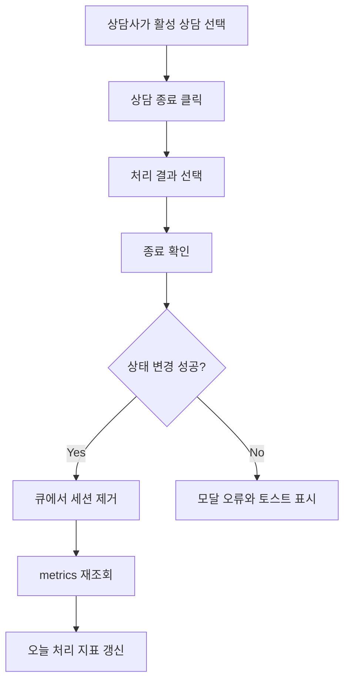
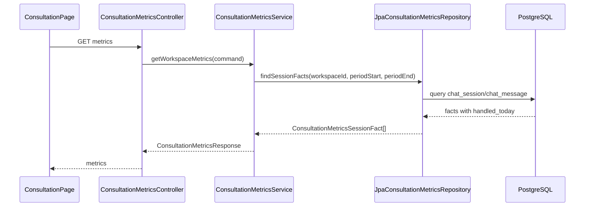

# Issue 413: 상담 오늘 처리 지표 갱신

## Goal

상담사가 상담을 처리하면 상담 화면 상단의 `오늘 처리` 지표가 처리 결과 선택지와 동일한 기준으로 즉시 갱신되도록 한다.

## Problem

상담 화면은 진입 시 `GET /api/v1/workspaces/{workspaceId}/consultation/metrics`를 한 번 호출해 상단 지표를 채운다. 상담 종료 모달에서 `해결됨`, `고객 이탈`, `보류`, `후속 연락 필요` 중 하나를 선택해 상태 변경 요청이 성공해도 큐에서 세션만 제거되고 metrics는 다시 조회되지 않는다.

Backend 집계도 `status = 'COMPLETED'`이고 오늘 `ended_at`이 있는 세션만 `handledTodayCount`로 계산한다. 현재 UI 선택지 중 `해결됨`, `보류`, `후속 연락 필요`는 `RESOLVED` 상태로 저장되므로 상담사가 처리했다고 인식한 세션이 오늘 처리에 포함되지 않을 수 있다.

## Scope

- `RESOLVED`와 `COMPLETED` 모두 상담사가 처리한 종료 결과로 본다.
- `COMPLETED`는 `runtime.chat_session.ended_at`이 오늘 기간 안에 있으면 오늘 처리로 집계한다.
- `RESOLVED`는 `meta_json.resolution.resolvedAt`이 오늘 기간 안에 있으면 오늘 처리로 집계한다.
- 상담 종료/해결 요청 성공 후 `ConsultationPage`는 metrics를 재조회해 상단 지표를 갱신한다.
- 관련 frontend/backend 테스트를 갱신하거나 추가한다.

## Non-goals

- `runtime.chat_session`에 별도 `resolved_at` 컬럼을 추가하지 않는다.
- 상담 처리 선택지나 상태 enum을 새로 늘리지 않는다.
- metrics endpoint 응답 필드를 변경하지 않는다.
- 상담 이력 화면의 필터 기본값은 이 이슈에서 변경하지 않는다.

## User Flow Chart

## Design Diff

| 영역 | As-is | To-be | 변경 내용 |
| --- | --- | --- | --- |
| Frontend metrics 로딩 | 화면 진입 시 1회 조회 | 화면 진입 및 상담 처리 성공 후 조회 | 종료 성공 handler에서 metrics reload 호출 |
| Backend 처리 기준 | `COMPLETED` + 오늘 `ended_at` | `COMPLETED` + 오늘 `ended_at`, 또는 `RESOLVED` + 오늘 `resolution.resolvedAt` | UI 처리 결과 선택지와 집계 기준 정렬 |
| 사용자 피드백 | 큐에서는 사라지지만 상단 지표가 이전 값 유지 가능 | 처리 직후 최신 지표 반영 | 낙관 업데이트보다 서버 재조회 우선 |

## Affected Files

| 파일 | 변경 유형 | 설명 |
| --- | --- | --- |
| `frontend/src/pages/consultation/ui/ConsultationPage.tsx` | modify | metrics 로딩 함수를 재사용 가능하게 정리하고 상담 처리 성공 후 재조회 |
| `frontend/src/pages/consultation/ui/ConsultationPage.test.tsx` | modify | 상담 처리 성공 후 metrics 재조회 검증 |
| `frontend/src/pages/consultation/ui/ConsultationPage.generated-api.test.tsx` | modify | generated updateStatus 흐름에서 metrics 재조회 검증 |
| `backend/src/main/java/com/init/workflowruntime/infrastructure/persistence/JpaConsultationMetricsRepository.java` | modify | `RESOLVED` 처리 기준을 `meta_json.resolution.resolvedAt` 기반으로 포함 |
| `backend/src/test/java/com/init/workflowruntime/infrastructure/persistence/JpaConsultationMetricsRepositoryTest.java` | modify | `RESOLVED` 오늘 처리 포함 및 기간 밖 제외 검증 |

## API Integration

### Existing Endpoints

| Method | Path | Description |
| --- | --- | --- |
| GET | `/api/v1/workspaces/{workspaceId}/consultation/metrics` | 상담 지표 조회 |
| PATCH | `/api/v1/consultation/sessions/{sessionId}/status` | 상담 세션 상태 및 처리 결과 변경 |

### Response Contract

`handledTodayCount`, `llmHandledTodayCount`, `humanHandledTodayCount`의 응답 필드는 유지한다. 단, 처리 대상 세션 판정은 다음으로 명확히 한다.

| 상태 | 오늘 처리 기준 |
| --- | --- |
| `COMPLETED` | `ended_at >= periodStart and ended_at < periodEnd` |
| `RESOLVED` | `meta_json.resolution.resolvedAt >= periodStart and meta_json.resolution.resolvedAt < periodEnd` |

## Backend Data Flow

## Frontend State Management

- metrics는 기존처럼 `ConsultationPage` local state로 유지한다.
- `loadMetrics`를 `useCallback`으로 분리해 화면 진입과 상담 처리 성공 흐름에서 공유한다.
- 처리 성공 후 metrics 조회가 실패해도 이미 성공한 상담 종료/해결을 되돌리지 않는다. 기존 metrics 오류 토스트 정책을 사용한다.

## Acceptance Criteria

1. 상담 종료 모달에서 `고객 이탈`을 선택해 `COMPLETED`로 저장하면 성공 후 metrics가 다시 조회된다.
2. 상담 종료 모달에서 `해결됨`, `보류`, `후속 연락 필요`을 선택해 `RESOLVED`로 저장하면 성공 후 metrics가 다시 조회된다.
3. Backend `handledTodayCount`는 오늘 `ended_at`이 있는 `COMPLETED`와 오늘 `meta_json.resolution.resolvedAt`이 있는 `RESOLVED`를 포함한다.
4. Backend `handledTodayCount`는 기간 밖 `resolvedAt`을 가진 `RESOLVED`를 오늘 처리로 포함하지 않는다.
5. `humanHandledTodayCount`와 `llmHandledTodayCount`는 변경된 `handledToday` 기준을 동일하게 사용한다.
6. metrics 재조회 실패는 상담 처리 성공을 취소하지 않고 기존 오류 표시/토스트 흐름으로 처리한다.

## Validation

- Backend: `cd backend && ./gradlew test --tests com.init.workflowruntime.infrastructure.persistence.JpaConsultationMetricsRepositoryTest`
- Frontend: `cd frontend && pnpm test -- ConsultationPage.test.tsx ConsultationPage.generated-api.test.tsx`

## Open Questions

- 없음. 이 이슈에서는 `RESOLVED`도 처리 건수에 포함하고, 기존 metadata의 `resolution.resolvedAt`을 기준 시각으로 사용한다.
