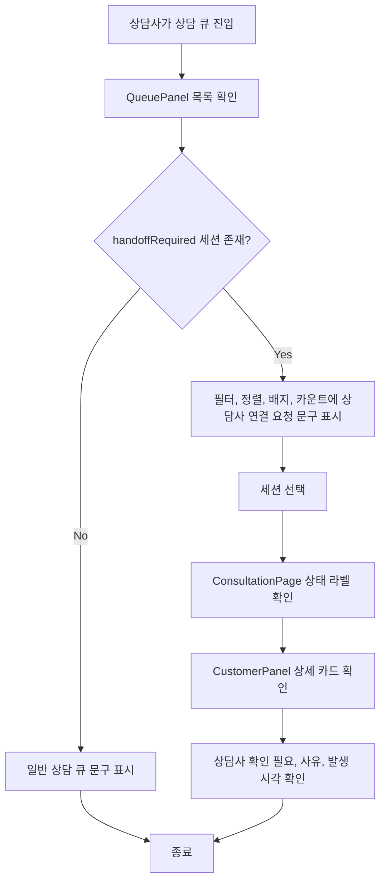

# Frontend FSD Spec: 상담사 연결 요청 라벨 개선

## Goal

상담 응대 화면에서 `handoffRequired` 상태를 내부 구현처럼 보이는 `AI 이관`이 아니라 상담사가 바로 이해할 수 있는 상담사 연결/확인 요청 맥락으로 표시한다.

## User Flow Chart



## Design Diff

### As-is vs To-be

| 영역 | As-is | To-be | 변경 내용 |
|------|-------|-------|----------|
| 상담 큐 필터 | `AI 이관` | `상담사 연결 요청` | 내부 AI 처리보다 상담사 행동 의미를 우선 표시 |
| 상담 큐 정렬 | `AI 이관 우선` | `연결 요청 우선` | 짧고 업무 중심인 정렬명으로 변경 |
| 상담 큐 검색 대상 | `AI 이관` | `상담사 연결 요청` | 검색어 매칭도 화면 라벨과 일치 |
| 상담 큐 배지 | `AI 이관` | `상담사 연결 요청` | 카드 상태 의미를 상담사 연결 요청으로 표시 |
| 상담 큐 카운트 | `AI 이관 N건` | `연결 요청 N건` | 헤더 요약은 짧은 표현 사용 |
| 상담 큐 빈 상태 | `AI 이관 상담이 없습니다` | `상담사 연결 요청이 없습니다` | 필터 빈 상태 문구 변경 |
| 상담 상세 상태 prefix | `AI 이관 · ...` | `상담사 연결 요청 · ...` | active status prefix를 사용자 맥락으로 변경 |
| 고객 상세 카드 제목 | `AI 이관` | `상담사 확인 필요` | 상세 카드에서 사유/발생 시각과 함께 확인 요청 의미 표시 |

## Component Tree

```text
ConsultationPage
├─ QueuePanel
│  ├─ filter tabs
│  ├─ sort buttons
│  ├─ search input
│  ├─ queue item handoff badge
│  └─ queue summary / empty state
└─ CustomerPanel
   └─ handoffRequired detail InfoCard
      ├─ 상태: 상담사 확인 필요
      ├─ 사유
      └─ 발생 시각
```

## API Integration

이번 변경은 프론트엔드 표시 문구만 변경하며 API 호출, generated endpoint, query key, 응답 스키마를 변경하지 않는다.

## 수정 대상 파일

| 파일 | 변경 유형 | 설명 |
|------|----------|------|
| `frontend/src/features/consultation/ui/QueuePanel.tsx` | modify | 필터, 정렬, 검색 대상, 빈 상태, 배지, 카운트 문구 변경 |
| `frontend/src/features/consultation/ui/QueuePanel.test.tsx` | modify | 상담 큐 문구 기대값 갱신 |
| `frontend/src/pages/consultation/ui/ConsultationPage.tsx` | modify | `handoffRequired` active status prefix 문구 변경 |
| `frontend/src/pages/consultation/ui/ConsultationPage.test.tsx` | modify | 페이지 통합 테스트 기대 문구 갱신 |
| `frontend/src/pages/consultation/ui/sections/CustomerPanel.tsx` | modify | 상세 카드 제목을 상담사 확인 필요로 변경 |
| `frontend/src/pages/consultation/ui/sections/consultation-sections.test.tsx` | modify | 상세 패널 테스트 기대 문구 갱신 |

## State Management

상태 모델은 유지한다.

- `handoffRequired` 값은 계속 상담사 확인/연결 요청 표시 여부를 결정한다.
- 정렬, 필터, 검색 로직은 기존 기준을 유지하고 표시 문자열만 변경한다.
- 고객 상세 패널의 사유와 발생 시각 표시 조건은 기존 `handoffRequired` 조건을 유지한다.

## Requirements

1. 상담 큐 필터/정렬/배지/요약/빈 상태에서 `AI 이관` 문구를 제거한다.
2. `handoffRequired` 상태는 기본적으로 `상담사 연결 요청`으로 표시한다.
3. 짧은 헤더 카운트 요약은 `연결 요청 N건` 형식을 사용한다.
4. 정렬 옵션은 `연결 요청 우선`을 사용한다.
5. 상세 패널은 `상담사 확인 필요` 제목 아래에 상태, 사유, 발생 시각을 함께 표시한다.
6. API, 데이터 구조, 상담 큐 정렬 우선순위, 필터 동작은 변경하지 않는다.

## Non-goals

- 백엔드 `handoffRequired` 필드명 또는 API 응답 스키마 변경은 하지 않는다.
- 상담 큐 정렬 기준, 필터 기준, 배정 상태 계산 방식을 변경하지 않는다.
- 새로운 디자인 컴포넌트나 색상 체계를 도입하지 않는다.

## Tests

### Test Strategy

| 구분 | 방법 | 도구 | 비고 |
|------|------|------|------|
| 컴포넌트 테스트 | 라벨/배지/빈 상태/정렬 버튼 기대값 검증 | Vitest + React Testing Library | `QueuePanel`, `CustomerPanel` |
| 페이지 통합 테스트 | 상담 큐 요약 문구와 상태 prefix 검증 | Vitest + React Testing Library | `ConsultationPage` |
| 정적 확인 | 남은 `AI 이관` 문구 검색 | `rg` | 사용자-facing 잔존 문구 확인 |

### Test Scenarios

| # | 시나리오 | 기대 결과 |
|---|---------|----------|
| 1 | 상담 큐 헤더 표시 | `연결 요청 N건 · 미배정 N건 · 진행 N건` 표시 |
| 2 | `handoffRequired` 고객 카드 표시 | `상담사 연결 요청` 배지와 사유 표시 |
| 3 | 기본 정렬 표시 | `연결 요청 우선` 버튼이 활성화되고 기존 정렬 순서 유지 |
| 4 | 상담사 연결 요청 필터 선택 | `handoffRequired` 세션만 표시 |
| 5 | 상담사 연결 요청 필터 결과 없음 | `상담사 연결 요청이 없습니다` 표시 |
| 6 | 상세 패널 표시 | `상담사 확인 필요`, 사유, 발생 시각 표시 |

## Open Questions

- 없음. 이슈에 추천 용어와 확인 기준이 명시되어 있어 별도 제품 결정이 필요하지 않다.
