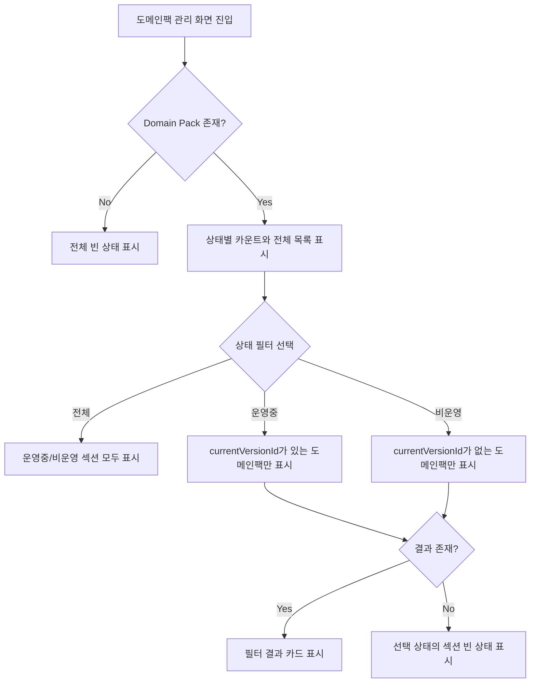

# Frontend FSD Spec: Domain Pack Status Filter

## Goal

도메인팩 관리 화면 상단의 `전체`, `운영중`, `비운영` 상태 pill을 실제 목록 필터로 동작시켜 사용자가 상태별 도메인팩만 확인할 수 있게 한다.

---

## User Flow Chart



---

## Design Diff

### As-is vs To-be

| 영역 | As-is | To-be | 변경 내용 |
|------|-------|-------|----------|
| 상태 pill | `span`으로 렌더링되는 정적 요약 | `button` 기반 필터 컨트롤 | 클릭/키보드 선택 가능 |
| 선택 상태 | 없음 | active 스타일과 `aria-pressed` 제공 | 현재 필터가 시각적/접근성 상태로 드러남 |
| 목록 표시 | 운영중/비운영 섹션을 항상 모두 표시 | 선택된 필터에 맞는 섹션만 표시 | `currentVersionId` 기준 클라이언트 필터링 |
| URL 상태 | 없음 | `status=operating` 또는 `status=idle` query 유지 | 새로고침/공유 시 필터 보존, 전체는 query 제거 |

---

## Component Tree

```
DomainPackListPage
├─ Header
│  └─ StatusFilterButtons
└─ Sections
   ├─ PackSection (operating)
   └─ PackSection (idle)
```

---

## API Integration

### Endpoints

| Method | Path | Description |
|--------|------|-------------|
| GET | `/api/v1/workspaces/{workspaceId}/domain-packs` | 워크스페이스 도메인팩 전체 목록 조회 |

서버 API는 상태 필터 query parameter를 제공하지 않는다. 이번 변경은 이미 받은 전체 목록을 `currentVersionId` 존재 여부로 클라이언트에서 필터링한다.

---

## 수정 대상 파일

| 파일 | 변경 유형 | 설명 |
|------|----------|------|
| `frontend/src/pages/domain-pack/ui/DomainPackListPage.tsx` | modify | 상태 필터 query 파싱, 버튼 이벤트, 조건부 섹션 렌더링 |
| `frontend/src/pages/domain-pack/ui/domain-pack-list-page.module.css` | modify | 필터 버튼 active/focus/hover 스타일 |
| `frontend/src/pages/domain-pack/ui/DomainPackListPage.test.tsx` | modify | 필터 선택, URL query 초기 상태, empty state 테스트 |

---

## State Management

필터 상태는 `react-router-dom`의 `useSearchParams`로 관리한다.

| 상태 | Query | 의미 |
|------|-------|------|
| 전체 | 없음 또는 미지원 값 | 모든 도메인팩 표시 |
| 운영중 | `status=operating` | `currentVersionId != null`인 도메인팩 표시 |
| 비운영 | `status=idle` | `currentVersionId == null`인 도메인팩 표시 |

---

## Tests

### Test Strategy

| 구분 | 방법 | 도구 | 비고 |
|------|------|------|------|
| 컴포넌트 테스트 | 필터 버튼 클릭과 query 초기 상태 검증 | Vitest + React Testing Library | 기존 API hook mock 재사용 |

### Test Scenarios

#### Happy Path

| # | 시나리오 | 사전 조건 | 조작 | 기대 결과 |
|---|---------|---------|------|----------|
| 1 | 전체 필터 | 운영중/비운영 pack 존재 | `전체` 선택 | 두 섹션과 모든 pack 표시 |
| 2 | 운영중 필터 | 운영중/비운영 pack 존재 | `운영중` 선택 | 운영중 pack만 표시, active 상태 표시 |
| 3 | 비운영 필터 | 운영중/비운영 pack 존재 | `비운영` 선택 | 비운영 pack만 표시, active 상태 표시 |
| 4 | URL query 복원 | `?status=operating`으로 진입 | 페이지 렌더 | 운영중 필터가 선택된 상태로 표시 |

#### Error & Edge Cases

| # | 시나리오 | 기대 결과 |
|---|---------|----------|
| 1 | 선택한 상태에 결과 없음 | 해당 섹션의 empty state 표시 |
| 2 | 미지원 `status` query | 전체 필터로 처리 |
| 3 | 전체 데이터 없음 | 기존 전체 EmptyState 유지 |

#### 반응형 & 접근성

| # | 확인 항목 | 기대 결과 |
|---|---------|----------|
| 1 | 키보드 탐색 | 필터 버튼에 focus-visible ring 표시 |
| 2 | 스크린 리더 | 필터 그룹 label과 `aria-pressed`로 선택 상태 인지 가능 |
| 3 | 모바일 | pill 버튼이 줄바꿈되어 겹침 없이 표시 |

---

## Non-goals

- 서버 사이드 필터 API 또는 Orval generated API 변경은 포함하지 않는다.
- 도메인팩 상태 모델을 새 enum으로 backend에 추가하지 않는다.
- 검색, 정렬, 페이지네이션을 함께 추가하지 않는다.

## Open Questions

- 없음. 이슈의 확인 기준은 클라이언트 필터링으로 충족 가능하다.
