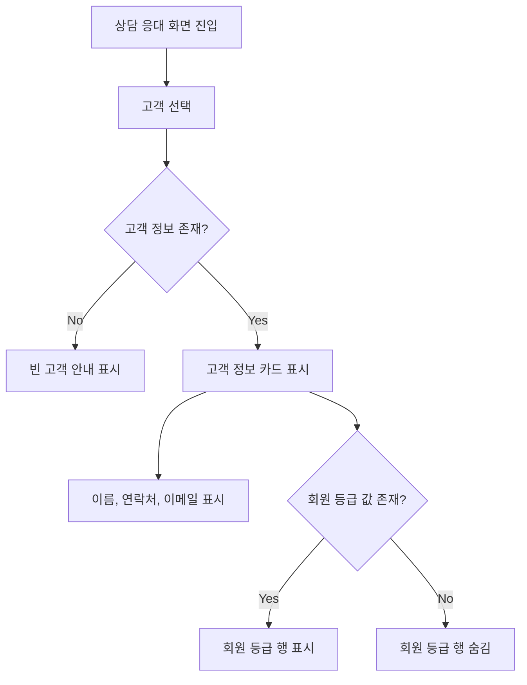

# Issue 420: 고객 정보 패널 표시 정보 정리

## Goal

상담 응대 화면의 우측 고객 정보 카드에서 중복되거나 비어 있는 행을 줄여 상담사가 즉시 참고할 수 있는 고객 정보만 보이게 한다.

## User Flow Chart



## Design Diff

### As-is vs To-be

| 영역 | As-is | To-be | 변경 내용 |
| --- | --- | --- | --- |
| 고객 정보 카드 상단 | `meta`로 채널 값 표시 | 채널 `meta` 미표시 | 카드 헤더에서 채널 노출 제거 |
| 고객 정보 카드 행 | `채널 / WEB` 행 렌더링 | 채널 행 미표시 | 카드 내부 중복 채널 행 제거 |
| 회원 등급 행 | 값이 없어도 `회원 등급 / 확인된 정보 없음` 표시 | 실제 회원 등급 값이 있을 때만 표시 | 빈 회원 등급 행 제거 |
| 핵심 고객 정보 | 이름, 채널, 회원 등급, 연락처, 이메일 | 이름, 연락처, 이메일, 실제 값이 있는 회원 등급 | 상담사가 바로 참고할 수 있는 정보 중심으로 밀도 조정 |

## Component Tree

```text
CustomerPanel
├─ InfoCard(title="고객 정보")
│  ├─ InfoRow(label="이름")
│  ├─ InfoRow(label="회원 등급")     // membershipTier가 있을 때만
│  ├─ InfoRow(label="연락처")
│  └─ InfoRow(label="이메일")
├─ InfoCard(title="AI 이관")
├─ InfoCard(title="문의 관련 주문")
├─ InfoCard(title="처리 단계")
├─ InfoCard(title="확인된 정보")
└─ InfoCard(title="내부 메모")
```

## API Integration

API 변경은 없다. `CustomerPanel`은 기존 `CustomerInfo` props를 그대로 사용하고, 화면 표시 조건만 변경한다.

## Data Flow

```text
ConsultationPage/session data
  -> CustomerPanel.customer
    -> CustomerInfo.name: 항상 고객 정보 카드에 표시
    -> CustomerInfo.channel: 고객 정보 카드에서는 표시하지 않음
    -> CustomerInfo.membershipTier: 공백이 아닌 값이 있을 때만 표시
    -> CustomerInfo.contact/email: 기존 fallback 정책 유지
```

## 수정 대상 파일

| 파일 | 변경 유형 | 설명 |
| --- | --- | --- |
| `frontend/src/pages/consultation/ui/sections/CustomerPanel.tsx` | update | 고객 정보 카드의 채널 노출 제거 및 회원 등급 조건부 렌더링 |
| `frontend/src/pages/consultation/ui/sections/consultation-sections.test.tsx` | update | 채널 행 제거와 빈 회원 등급 행 숨김 정책 검증 |

## State Management

상태 관리 변경은 없다.

## Tests

### Test Strategy

| 구분 | 방법 | 도구 | 비고 |
| --- | --- | --- | --- |
| 컴포넌트 테스트 | CustomerPanel 렌더링 결과 검증 | Vitest + React Testing Library | 기존 상담 섹션 테스트 갱신 |
| 수동 확인 | 상담 응대 화면 고객 패널 확인 | 브라우저 | 필요 시 로컬 개발 서버에서 확인 |

### Test Scenarios

#### Happy Path

| # | 시나리오 | 사전 조건 | 기대 결과 |
| --- | --- | --- | --- |
| 1 | 기본 고객 정보만 있는 고객 선택 | `name`, `channel`만 존재 | 고객 정보 카드에 고객 이름은 보이고 `WEB`, `채널`, `회원 등급`은 보이지 않는다 |
| 2 | 회원 등급이 있는 고객 선택 | `membershipTier` 값 존재 | 고객 정보 카드에 실제 회원 등급 값이 표시된다 |

#### Error & Edge Cases

| # | 시나리오 | 기대 결과 |
| --- | --- | --- |
| 1 | `membershipTier`가 `null`, `undefined`, 빈 문자열, 공백 문자열 | 회원 등급 행이 표시되지 않는다 |
| 2 | 고객 정보가 없는 상태 | 기존 빈 고객 안내가 유지된다 |

#### 반응형 & 접근성

| # | 확인 항목 | 기대 결과 |
| --- | --- | --- |
| 1 | 우측 패널 폭 320px | 남은 행의 텍스트가 기존 레이아웃 안에서 겹치지 않는다 |
| 2 | 스크린 리더 탐색 | 제거된 채널/빈 회원 등급 행이 읽히지 않고 남은 정보 행은 기존 구조를 유지한다 |

## Non-goals

- 고객 데이터 모델 또는 API 응답 스키마는 변경하지 않는다.
- 주문 정보, 처리 단계, 확인된 정보, 내부 메모 카드의 표시 정책은 변경하지 않는다.
- 채널 값을 큐 목록이나 다른 상담 화면 영역에서 제거하지 않는다.

## Acceptance Criteria

- 상담 응대 화면의 고객 정보 카드에서 `채널 WEB` 행이 보이지 않는다.
- 고객 정보 카드 상단에도 채널 `WEB` 값이 보이지 않는다.
- 회원 등급 값이 없을 때 `회원 등급 / 확인된 정보 없음` 행이 보이지 않는다.
- 회원 등급 값이 있을 때 실제 값은 정상 표시된다.
- 관련 CustomerPanel 테스트가 새 노출 정책을 검증한다.
