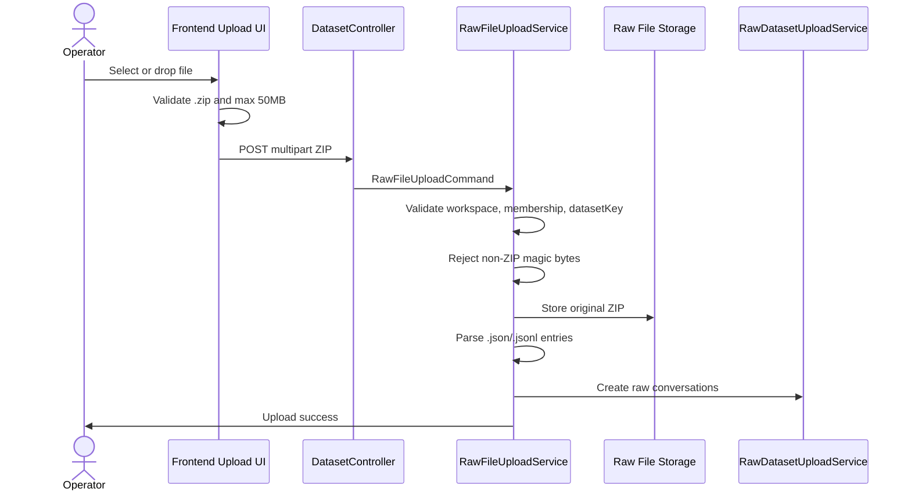

# Issue 421: 상담 로그 업로드 ZIP-only 정책 정렬

## Goal

상담 로그 원본 업로드 경로가 프론트엔드와 백엔드 모두에서 ZIP 파일만 허용하도록 정책, 안내 문구, 검증, 테스트를 일관되게 정렬한다.

## Problem

현재 상담 로그 업로드는 운영 정책상 압축된 원본 로그 묶음인 ZIP 파일만 받는 것이 기대 동작이지만, 구현은 서로 다른 정책을 표현한다.

- `frontend/src/shared/lib/rawLogUploadPolicy.ts`는 JSON 파일만 허용한다.
- `frontend/src/features/log-upload/ui/LogUploadForm.test.tsx`와 `frontend/src/shared/lib/rawLogUploadPolicy.test.ts`는 JSON 업로드를 성공 기준으로 검증한다.
- `backend/src/main/java/com/init/corpus/application/RawFileUploadService.java`는 ZIP 파일이면 내부 `.json`/`.jsonl`을 파싱하지만, ZIP이 아니면 원본 바이트를 JSON으로 파싱한다.
- `backend/src/test/java/com/init/corpus/presentation/DatasetControllerRawFileTest.java`와 `backend/src/test/java/com/init/corpus/application/RawFileUploadServiceTest.java`는 단일 JSON 파일 업로드 성공을 허용한다.

그 결과 사용자는 UI에서 실제 정책과 다른 JSON 안내를 보게 되고, API 직접 호출자는 ZIP이 아닌 JSON 단일 파일을 업로드할 수 있다.

## Scope

### Frontend

- `frontend/src/shared/lib/rawLogUploadPolicy.ts`
  - 파일 선택 accept 값을 ZIP 기준으로 변경한다.
  - 업로드 안내 라벨과 검증 오류 문구를 ZIP 기준으로 변경한다.
  - `.zip` 확장자가 아닌 `.json`, `.csv`, `.xlsx` 등은 클라이언트 검증에서 거부한다.
- `frontend/src/shared/lib/rawLogUploadPolicy.test.ts`
  - ZIP 정책 노출, 정상 ZIP 허용, 비-ZIP 거부, 크기 제한을 검증한다.
- `frontend/src/features/log-upload/ui/LogUploadForm.test.tsx`
  - 파일 선택/안내/토스트/업로드 플로우 테스트를 ZIP 기준으로 갱신한다.

### Backend

- `backend/src/main/java/com/init/corpus/application/RawFileUploadService.java`
  - 워크스페이스/멤버십/데이터셋 키 검증 뒤, S3/MinIO 저장과 파싱 전에 ZIP 매직 바이트가 아닌 파일을 `RawFileParseException`으로 거부한다.
  - 정상 ZIP 내부의 `.json`/`.jsonl` 파싱, ZIP entry count/size 제한, 경로 traversal 방어는 유지한다.
- `backend/src/test/java/com/init/corpus/application/RawFileUploadServiceTest.java`
  - 정상 업로드와 JSON/JSONL 파싱 검증을 ZIP 입력 기준으로 변경한다.
  - ZIP이 아닌 파일이 저장/파싱 전에 거부되는 시나리오를 추가한다.
  - ZIP 내부의 빈 JSON, 잘못된 JSON, 필수 상담 내용 누락 등 기존 실패 시나리오는 유지한다.
- `backend/src/test/java/com/init/corpus/presentation/DatasetControllerRawFileTest.java`
  - multipart 성공 케이스는 ZIP 파일 기준으로 변경한다.
  - 서비스에서 ZIP-only 위반을 보고할 때 400 계열 응답으로 매핑되는지 검증한다.

## Non-goals

- ZIP 내부 상담 데이터 스키마를 변경하지 않는다.
- ZIP 폭탄 방어 임계값을 변경하지 않는다.
- OpenAPI generated 클라이언트 파일을 직접 수정하지 않는다.
- 별도 파일 업로드 UI 레이아웃이나 디자인 시스템을 변경하지 않는다.
- 기존 `/api/v1/workspaces/{workspaceId}/datasets/raw` JSON body 업로드 API 정책은 변경하지 않는다.

## Expected Behavior

## API and Data Impact

- Endpoint path and request shape stay unchanged:
  - `POST /api/v1/workspaces/{workspaceId}/datasets/raw-file`
  - `multipart/form-data` with `file`, `datasetKey`, `name`, `sourceType`
- Non-ZIP multipart files must fail with an existing 400 validation-style error response through `RawFileParseException` handling.
- Stored raw file metadata continues to record the original uploaded ZIP filename, content type, size, object key, and checksum.
- No database schema changes are required.

## Acceptance Criteria

- `RAW_LOG_UPLOAD_ACCEPT`, accepted type label, file type label, and validation message all say ZIP rather than JSON.
- The log upload UI accepts `.zip` files and rejects `.json`, `.csv`, `.xlsx`, and other non-ZIP filenames before upload.
- `RawFileUploadService` rejects non-ZIP bytes before `RawFileStoragePort.put(...)` is called.
- ZIP files containing `.json` and `.jsonl` entries continue to parse into conversations.
- ZIP entry path traversal and ZIP size/count limits remain active.
- `rawLogUploadPolicy`, `LogUploadForm`, `DatasetControllerRawFileTest`, and `RawFileUploadServiceTest` cover ZIP-only behavior.

## Validation Plan

- Run targeted frontend tests:
  - `cd frontend && pnpm test -- rawLogUploadPolicy LogUploadForm`
- Run targeted backend tests:
  - `cd backend && ./gradlew test --tests com.init.corpus.application.RawFileUploadServiceTest --tests com.init.corpus.presentation.DatasetControllerRawFileTest`
- Run broader module checks if targeted verification exposes integration risk.

## Open Questions

- None. The issue explicitly defines ZIP-only upload as the expected policy while preserving `.json`/`.jsonl` support inside ZIP archives.
