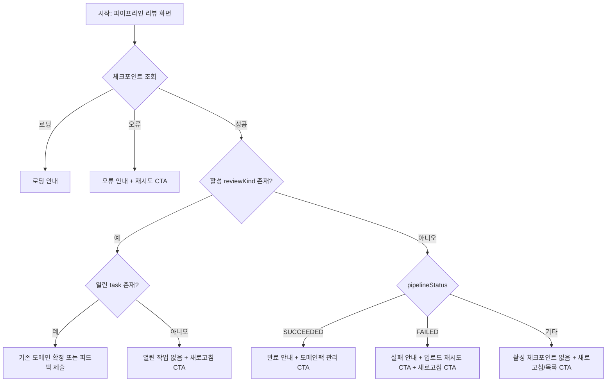

# Frontend Spec: 체크포인트 상태별 다음 행동 안내

## Goal

파이프라인 리뷰 화면에서 체크포인트 조회 오류, 완료, 실패, 활성 리뷰 없음 상태마다 사용자가 바로 실행할 수 있는 다음 행동 CTA를 제공한다.

## User Flow Chart



## Design Diff

### As-is vs To-be

| 영역 | As-is | To-be | 변경 내용 |
|------|-------|-------|----------|
| 조회 오류 | 텍스트 안내만 표시 | 재시도 버튼 제공 | 화면 안에서 체크포인트를 다시 조회할 수 있다 |
| 파이프라인 완료 | 완료 설명만 표시 | 도메인팩 관리 화면 이동 CTA 제공 | 생성된 초안 확인 경로를 명확히 안내한다 |
| 파이프라인 실패 | 실패 설명만 표시 | 업로드 재시도 및 현재 job 새로고침 CTA 제공 | 실패 후 재시작 또는 상태 재확인을 선택할 수 있다 |
| 활성 체크포인트 없음 | 상태 설명만 표시 | 상태 설명과 새로고침/목록 이동 CTA 제공 | 대기 상태가 멈춘 것처럼 보이지 않게 한다 |
| 열린 작업 없음 | 텍스트 안내만 표시 | 새로고침 CTA 제공 | resolved task만 있는 활성 세션에서도 다음 확인 행동을 제공한다 |

## Component Tree

```text
PipelineReviewPage
└─ PipelineReviewCheckpointCard
   ├─ StateActionCard
   │  └─ StateActions
   ├─ DomainConfirmationCard
   └─ HumanFeedbackCard
```

## API Integration

### Endpoints

| Method | Path | Description |
|--------|------|-------------|
| GET | `/api/v1/workspaces/{workspaceId}/pipeline-jobs/{pipelineJobId}/review-checkpoint` | 체크포인트 상태 및 리뷰 task 조회 |
| POST | `/api/v1/workspaces/{workspaceId}/pipeline-jobs/{pipelineJobId}/review-checkpoint/domain-confirmation` | 도메인 후보 확정 |
| POST | `/api/v1/workspaces/{workspaceId}/pipeline-jobs/{pipelineJobId}/review-checkpoint/human-feedback` | 클러스터 경계 피드백 제출 |

기존 `frontend/src/features/pipeline-review/api/pipelineReviewApi.ts` 훅과 TanStack Query `refetch`를 사용한다. 신규 API는 만들지 않는다.

## Data Flow

```text
PipelineReviewPage route params
  -> PipelineReviewCheckpointCard props(workspaceId, pipelineJobId)
  -> usePipelineReviewCheckpoint query
  -> status branch
  -> CTA: query.refetch() 또는 기존 라우트 Link
```

## 수정 대상 파일

| 파일 | 변경 유형 | 설명 |
|------|----------|------|
| `frontend/src/features/pipeline-review/ui/PipelineReviewCheckpointCard.tsx` | modify | 상태별 CTA 렌더링, 기존 도메인 확정/피드백 플로우 유지 |
| `frontend/src/features/pipeline-review/ui/PipelineReviewCheckpointCard.module.css` | modify | 상태 카드 CTA 레이아웃과 버튼/링크 스타일 추가 |
| `frontend/src/features/pipeline-review/ui/PipelineReviewCheckpointCard.test.tsx` | modify | 오류, 완료, 실패, 활성 체크포인트 없음 상태별 CTA 검증 |

## State Management

- 서버 상태는 기존 `usePipelineReviewCheckpoint`의 TanStack Query 결과를 그대로 사용한다.
- 재시도/새로고침 CTA는 `query.refetch()`를 호출한다.
- 화면 이동 CTA는 검증된 기존 라우트만 사용한다.
  - `/workspaces/{workspaceId}/domain-packs`
  - `/workspaces/{workspaceId}/upload`
- `pipelineJobId`가 없으면 기존처럼 렌더링하지 않는다.

## Tests

### Test Strategy

| 구분 | 방법 | 도구 | 비고 |
|------|------|------|------|
| 컴포넌트 테스트 | 상태별 렌더링 및 CTA 동작 검증 | Vitest, React Testing Library | `PipelineReviewCheckpointCard.test.tsx` |
| 회귀 테스트 | 기존 도메인 확정/피드백 제출 동작 유지 확인 | Vitest, React Testing Library | 기존 테스트 유지 |

### Test Scenarios

| # | 시나리오 | 조작 | 기대 결과 |
|---|---------|------|----------|
| 1 | 체크포인트 조회 실패 | `다시 시도` 클릭 | `query.refetch()`가 호출된다 |
| 2 | `SUCCEEDED` + no review | `도메인팩 관리로 이동` 확인 | `/workspaces/{workspaceId}/domain-packs` 링크가 표시된다 |
| 3 | `FAILED` + no review | `업로드 다시 시작` 확인 | `/workspaces/{workspaceId}/upload` 링크가 표시된다 |
| 4 | no review 대기 상태 | `상태 새로고침` 클릭 | `query.refetch()`가 호출된다 |
| 5 | 열린 작업 없는 활성 리뷰 | `작업 새로고침` 클릭 | `query.refetch()`가 호출된다 |
| 6 | 도메인 확정/피드백 제출 | 기존 버튼 조작 | 기존 mutation 호출이 유지된다 |

## Non-goals

- 파이프라인 job 상세/목록 화면을 새로 만들지 않는다.
- 신규 backend endpoint 또는 OpenAPI generated 파일을 변경하지 않는다.
- 도메인팩 상세로 직접 이동하기 위한 pack id 추론을 하지 않는다.
- 기존 도메인 확정, feedback replay API 계약을 변경하지 않는다.

## Open Questions

- 파이프라인 job 상세/목록 화면이 별도로 제공되면 실패 상태의 보조 CTA를 해당 화면으로 대체할 수 있다.
