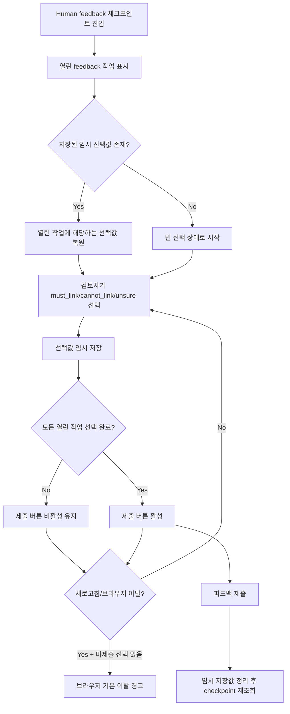

# Frontend FSD Spec: pipeline-review feedback draft preservation

## Goal

파이프라인 human feedback 화면에서 제출 전 선택한 판단을 임시 보존하고, 미제출 선택값이 있을 때 새로고침 이탈을 경고하여 검토자가 같은 판단을 반복하지 않도록 한다.

---

## User Flow Chart



---

## Design Diff

### As-is vs To-be

| 영역 | As-is | To-be | 변경 내용 |
|------|-------|-------|----------|
| 피드백 선택 상태 | 컴포넌트 local state에만 보관 | workspace/job 단위 localStorage 임시 저장 | 새로고침 또는 재진입 후 열린 작업 선택값 복원 |
| 이탈 보호 | 없음 | 미제출 선택값이 있으면 beforeunload 경고 | 브라우저 새로고침/탭 닫기 전에 손실 가능성 알림 |
| 제출 완료 | 서버 제출 후 query invalidate | 제출 성공 시 임시 저장값 제거 후 query invalidate | 완료된 선택값이 다음 세션에 남지 않음 |
| 제출 버튼 조건 | 모든 열린 작업 선택 시 활성 | 동일 | 기존 활성화 조건 유지 |

---

## Component Tree

```
PipelineReviewCheckpointCard
├─ usePipelineReviewCheckpoint
├─ useConfirmPipelineDomain
├─ useSubmitPipelineFeedback
├─ local feedback draft state
├─ Domain confirmation view
└─ Human feedback view
   ├─ feedback task list
   │  ├─ CaseContextCard
   │  └─ choice buttons
   └─ submit replay button
```

---

## API Integration

### Endpoints

변경 없음. 기존 `frontend/src/features/pipeline-review/api/pipelineReviewApi.ts`의 checkpoint 조회, 도메인 확정, human feedback 제출 API를 그대로 사용한다.

### Client Persistence

| 항목 | 값 |
|------|----|
| 저장소 | `window.localStorage` |
| 범위 | workspaceId + pipelineJobId |
| 저장 대상 | 열린 feedback task id별 `must_link`, `cannot_link`, `unsure` 선택값 |
| 복원 조건 | `reviewKind === "HUMAN_FEEDBACK"`이고 현재 열린 작업 id에 해당하는 값만 복원 |
| 정리 조건 | human feedback 제출 성공 또는 더 이상 human feedback이 아닌 checkpoint |

---

## 수정 대상 파일

| 파일 | 변경 유형 | 설명 |
|------|----------|------|
| `frontend/src/features/pipeline-review/ui/PipelineReviewCheckpointCard.tsx` | update | 선택값 localStorage 보존, 열린 작업 기준 pruning, beforeunload 경고, 제출 성공 후 정리 |
| `frontend/src/features/pipeline-review/ui/PipelineReviewCheckpointCard.test.tsx` | update | 임시 저장 복원, 제출 후 정리, 이탈 경고, 제출 버튼 활성 조건 회귀 테스트 |

---

## State Management

- 서버 상태는 TanStack Query 기반 기존 API 훅을 유지한다.
- 선택값은 현재 workspace/job의 컴포넌트 state와 localStorage draft를 결합해 표시하되, human feedback checkpoint에서만 localStorage와 동기화한다.
- localStorage가 비활성화되거나 파싱 실패가 발생해도 화면 렌더링과 제출 흐름은 중단하지 않는다.
- 저장된 draft에는 현재 열린 task id와 허용된 decision 값만 반영한다.

---

## Non-goals

- 서버 측 draft 저장 API를 추가하지 않는다.
- React Router route transition blocker는 이번 범위에 포함하지 않는다. 브라우저 새로고침/탭 닫기 경고와 localStorage 복원으로 손실을 줄인다.
- 도메인 확정 checkpoint에는 임시 저장을 적용하지 않는다.
- feedback decision 타입이나 백엔드 제출 payload를 변경하지 않는다.

---

## Tests

### Test Strategy

| 구분 | 방법 | 도구 | 비고 |
|------|------|------|------|
| 컴포넌트 테스트 | 사용자 선택/제출 동작 검증 | Vitest + React Testing Library | 기존 test 파일 확장 |
| 스토리지 테스트 | localStorage 복원/정리 검증 | Vitest jsdom | workspace/job scoped key 확인 |
| 이탈 경고 테스트 | beforeunload 이벤트 검증 | Vitest jsdom | 미제출 선택값 존재 여부 기준 |

### Test Scenarios

| # | 시나리오 | 조작 | 기대 결과 |
|---|---------|------|----------|
| 1 | 피드백 선택 후 임시 저장 | choice 버튼 클릭 | workspace/job scoped localStorage에 선택값 저장 |
| 2 | 재진입 시 임시 선택 복원 | 저장값이 있는 상태에서 렌더 | 해당 choice가 selected 상태이고 제출 버튼 조건에 반영 |
| 3 | 일부 작업만 선택 | 열린 작업 2개 중 1개 선택 | 제출 버튼 비활성 유지 |
| 4 | 제출 성공 | 모든 열린 작업 선택 후 submit mutation success 콜백 실행 | localStorage 임시 저장값 제거 |
| 5 | 미제출 선택값이 있는 새로고침 | beforeunload 이벤트 발생 | event가 취소되어 브라우저 경고 가능 |
| 6 | human feedback이 아닌 상태 | reviewKind가 null 또는 DOMAIN_CONFIRMATION | 기존 draft가 정리되고 화면 동작 유지 |

---

## Acceptance Criteria

- 피드백 선택 후 새로고침/재진입 시 현재 열린 작업의 선택값이 복원된다.
- 미제출 선택값이 하나 이상 있으면 브라우저 새로고침/탭 닫기 전에 기본 이탈 경고를 트리거한다.
- 제출 완료 후 해당 workspace/job의 임시 저장값이 남지 않는다.
- 열린 작업 전체 선택 여부와 제출 버튼 활성화 조건은 기존과 동일하게 동작한다.
- localStorage를 사용할 수 없는 환경에서도 선택 및 제출 기능은 중단되지 않는다.
