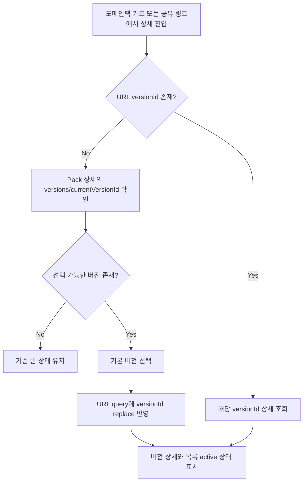

# Issue 428 [FE] 도메인팩 상세 기본 버전 자동 선택

## Goal

`versionId` 없이 도메인팩 상세 화면에 진입한 사용자가 별도 클릭 없이 적절한 버전 상세를 바로 확인하고, 자동 선택된 버전이 URL query와 버전 목록 active 상태에 함께 반영되도록 한다.

## User Flow Chart



## Design Diff

### As-is vs To-be

| 영역 | As-is | To-be | 변경 내용 |
|------|-------|-------|----------|
| 상세 진입 | `versionId`가 없으면 상세 패널이 "버전을 선택하세요." placeholder 표시 | 기본 버전을 즉시 선택해 상세 표시 | 탐색 클릭 1회 제거 |
| URL 상태 | 기본 버전 선택이 URL에 반영되지 않음 | 자동 선택된 `versionId`를 query에 `replace` 반영 | 공유/새로고침 안정화 |
| 버전 목록 | `selectedId`가 없을 때 tab stop만 내부 계산 | 기본 버전이 active 선택값으로 전달 | 상세 패널, 목록, URL 일관성 |
| 빈 버전 pack | 기존 빈 상태 | 기존 빈 상태 유지 | 안전한 fallback 유지 |

## Component Tree

```text
DomainPackSummaryPage
├─ DomainPackSummaryPageContent
│  ├─ usePackDetail
│  ├─ resolveDefaultVersionId
│  ├─ useVersionDetail(effectiveSelectedVersionId)
│  ├─ VersionListPanel(selectedId=effectiveSelectedVersionId)
│  └─ SummaryDetailPanel(query=selected version query)
```

## API Integration

### Endpoints

| Method | Path | Description |
|--------|------|-------------|
| GET | `/api/v1/workspaces/{workspaceId}/domain-packs/{packId}` | Pack 상세와 버전 요약 목록 조회 |
| GET | `/api/v1/workspaces/{workspaceId}/domain-packs/{packId}/versions/{versionId}` | 선택 버전 상세 조회 |

새 endpoint는 추가하지 않는다. `frontend/src/features/domain-pack-summary-read/model/usePackDetail.ts`의 기존 generated API hook을 사용한다.

## Data Flow

```text
URL search versionId
  └─ 없으면 DomainPackDetail.versions/currentVersionId에서 기본 versionId 계산
      ├─ useVersionDetail 조회 파라미터
      ├─ VersionListPanel selectedId
      ├─ breadcrumb version label
      └─ URLSearchParams versionId replace
```

## 수정 대상 파일

| 파일 | 변경 유형 | 설명 |
|------|----------|------|
| `frontend/src/pages/domain-pack/ui/DomainPackSummaryPage.tsx` | modify | 기본 버전 선택 우선순위 계산 및 URL query 자동 반영 |
| `frontend/src/pages/domain-pack/ui/DomainPackSummaryPage.test.tsx` | modify | 기본 버전 선택, URL 반영, 빈 버전 유지 테스트 |

## State Management

- 서버 상태는 기존 `usePackDetail`, `useVersionDetail` TanStack Query 흐름을 유지한다.
- 클라이언트 상태는 별도 store 없이 URL query를 단일 공유 가능한 선택 상태로 사용한다.
- `versionId`가 URL에 있으면 사용자의 명시 선택으로 보고 자동 선택으로 덮어쓰지 않는다.
- `versionId`가 없을 때 기본 선택 우선순위는 다음과 같다.
  1. `currentVersionId`가 `versions`에 존재하면 현재 배포중 버전
  2. `lifecycleStatus === "DRAFT"` 중 최신 버전
  3. 전체 버전 중 최신 버전
- 최신 판정은 `versionNo`, `createdAt`, `versionId` 순으로 큰 값을 우선한다.

## Tests

### Test Strategy

| 구분 | 방법 | 도구 | 비고 |
|------|------|------|------|
| 통합 테스트 | 페이지 렌더링 후 route/search와 hook 호출 검증 | Vitest + React Testing Library | URL query 자동 반영과 selected version query 확인 |
| 회귀 테스트 | 빈 버전 pack에서 `versionId`가 추가되지 않는지 검증 | Vitest + React Testing Library | 기존 빈 상태 보존 |

### Acceptance Criteria

- `/workspaces/{wsId}/domain-packs/{packId}` 진입 시 버전이 있으면 기본 버전 상세 조회가 시작된다.
- 자동 선택된 기본 버전은 URL `versionId`, `VersionListPanel.selectedId`, breadcrumb 버전 라벨에 일관되게 반영된다.
- 배포중 버전이 있으면 draft나 최신 버전보다 우선 선택된다.
- 배포중 버전이 없고 draft가 있으면 최신 draft가 선택된다.
- draft도 없으면 최신 버전이 선택된다.
- 버전이 없는 pack은 URL을 변경하지 않고 기존 빈 상태를 유지한다.

## Non-goals

- Backend API나 Domain Pack 버전 정렬 계약 변경은 하지 않는다.
- 유효하지 않거나 존재하지 않는 `versionId` query의 복구 정책은 변경하지 않는다.
- 버전 목록 UI 스타일 변경은 하지 않는다.

## Open Questions

- 없음. 이슈 본문에 명시된 정책 범위 안에서 frontend metadata 기반 기본 선택으로 해결한다.
