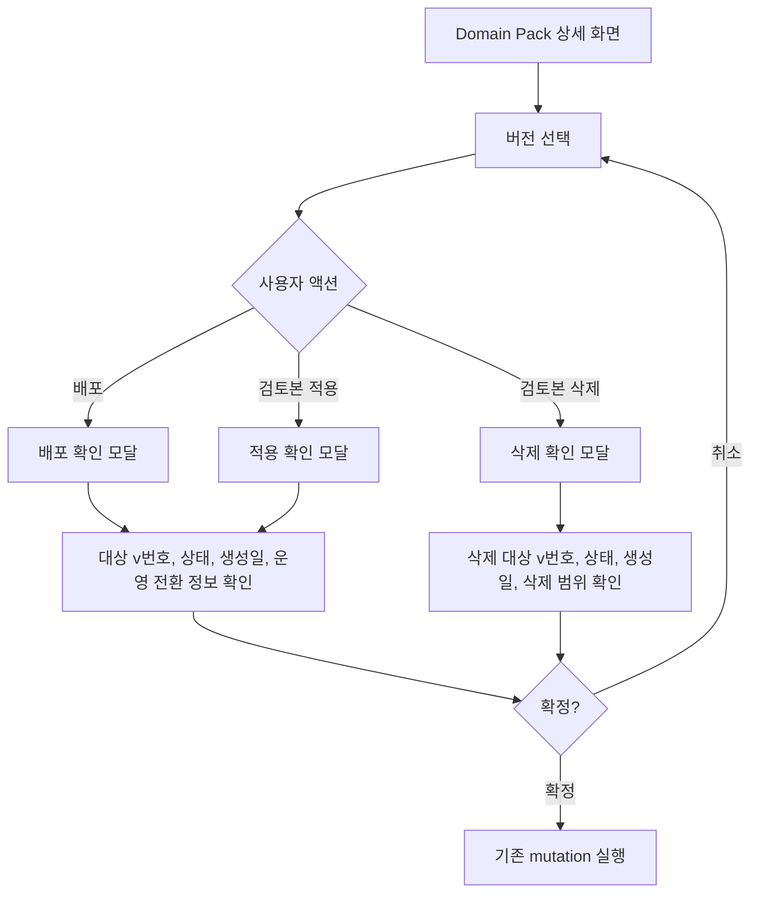

# Frontend Spec: 버전 액션 확인 모달 대상 정보 표시

## Goal

도메인팩 버전 배포, 적용, 삭제 확인 모달에서 사용자가 확정하려는 대상 버전과 운영 전환 맥락을 명확히 확인할 수 있게 한다.

## User Flow Chart



## Design Diff

### As-is vs To-be

| 영역 | As-is | To-be | 변경 내용 |
|------|-------|-------|----------|
| 배포 확인 모달 | "이 버전" 중심 안내 | 대상 버전 번호와 상태, 생성일, 운영 전환 방향 표시 | 배포 전환 맥락 추가 |
| 적용 확인 모달 | 검토 중 버전 적용 문구만 표시 | 현재 운영 버전에서 대상 draft 버전으로 바뀌는 흐름 표시 | 적용 대상 혼동 감소 |
| 삭제 확인 모달 | 검토 중 버전 삭제 안내만 표시 | 삭제되는 draft 버전 번호, 상태, 생성일, 변경 요약 또는 생성 정보를 표시 | 되돌릴 수 없는 삭제 범위 명확화 |

## Component Tree

```text
DomainPackSummaryPage
├─ VersionListPanel
└─ SummaryDetailPanel
   ├─ AlertDialog (deploy)
   │  └─ VersionActionContext
   ├─ AlertDialog (apply draft)
   │  └─ VersionActionContext
   └─ AlertDialog (discard draft)
      └─ VersionActionContext
```

## API Integration

기존 도메인팩 상세/버전 상세 API 응답을 사용한다. 새로운 endpoint, request payload, generated API 변경은 없다.

| 데이터 | 출처 | 용도 |
|--------|------|------|
| `currentVersionId`, `currentVersionNo` | Domain Pack 상세 | 현재 운영 버전 표시 |
| `versionId`, `versionNo`, `lifecycleStatus`, `createdAt`, `summaryJson` | Version 상세 | 확인 모달 대상 버전 맥락 표시 |

## Data Flow

`DomainPackSummaryPage`가 pack 상세의 현재 운영 버전 번호를 `SummaryDetailPanel`에 전달한다. `SummaryDetailPanel`은 선택된 버전 상세 데이터로 확인 모달 안의 대상 버전 정보와 전환 문구를 구성한다.

## 수정 대상 파일

| 파일 | 변경 유형 | 설명 |
|------|----------|------|
| `frontend/src/pages/domain-pack/ui/DomainPackSummaryPage.tsx` | modify | 현재 운영 버전 번호를 상세 패널에 전달 |
| `frontend/src/pages/domain-pack/ui/DomainPackSummaryPage.test.tsx` | modify | 상세 패널 prop 전달 검증 보강 |
| `frontend/src/features/domain-pack-summary-read/ui/SummaryDetailPanel.tsx` | modify | 배포/적용/삭제 확인 모달에 대상 버전 컨텍스트 표시 |
| `frontend/src/features/domain-pack-summary-read/ui/SummaryDetailPanel.module.css` | modify | 확인 모달 컨텍스트 블록 스타일 추가 |
| `frontend/src/features/domain-pack-summary-read/ui/SummaryDetailPanel.test.tsx` | modify | 모달별 대상 버전, 전환 정보, 삭제 범위 표시 검증 |

## State Management

새로운 client/server state는 추가하지 않는다. 확인 모달 open state와 기존 mutation pending state를 그대로 사용한다.

## Tests

### Test Strategy

| 구분 | 방법 | 도구 | 비고 |
|------|------|------|------|
| 컴포넌트 테스트 | 확인 모달 렌더링 검증 | Vitest + React Testing Library | 대상 버전/전환/삭제 범위 확인 |
| 페이지 테스트 | prop 전달 검증 | Vitest + React Testing Library | 현재 운영 버전 번호 전달 확인 |
| 정적 검증 | 타입/빌드 확인 | `pnpm test`, `pnpm build` | frontend 변경 범위 |

### Test Scenarios

| # | 시나리오 | 조작 | 기대 결과 |
|---|---------|------|----------|
| 1 | PUBLISHED 버전 배포 확인 | 배포 버튼 클릭 | 모달에 대상 `v{versionNo}`, 상태, 현재 운영 버전에서 대상 버전으로 전환되는 문구가 보인다 |
| 2 | DRAFT 버전 적용 확인 | 적용 버튼 클릭 | 모달에 대상 draft 버전과 운영 전환 문구가 보인다 |
| 3 | DRAFT 버전 삭제 확인 | 삭제 버튼 클릭 | 모달에 삭제 대상 draft 버전, 생성일, 삭제 범위 안내가 보인다 |
| 4 | 변경 요약이 있는 버전 | 액션 모달 열기 | 파싱 가능한 `summaryJson`의 topic 또는 reason이 변경 요약으로 표시된다 |

## Non-goals

- 도메인팩 version detail API에 description 필드를 새로 추가하지 않는다.
- 배포/적용/삭제 mutation 계약을 변경하지 않는다.
- 확인 모달 외 화면의 버전 목록, 요약 카드, JSON 표시 방식을 변경하지 않는다.

## Open Questions

- 백엔드에서 버전별 사람이 작성한 description을 제공하면, 이후 확인 모달의 변경 요약 우선순위를 description 우선으로 조정할 수 있다.
