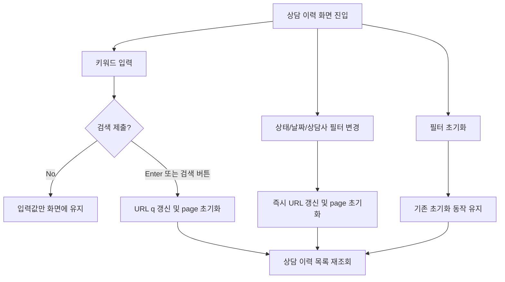

# Frontend Spec: 상담 이력 검색 입력 경험 개선

## Goal

상담 이력 화면의 키워드 입력이 매 글자마다 URL과 목록 조회를 갱신하지 않고, 사용자가 Enter 또는 검색 버튼으로 의도를 확정했을 때만 검색을 실행하도록 개선한다.

## User Flow Chart



## Design Diff

### As-is vs To-be

| 영역 | As-is | To-be | 변경 내용 |
|------|-------|-------|----------|
| 키워드 검색 | 입력 `onChange`마다 `q` query 갱신 | Enter 또는 검색 버튼 제출 시 `q` query 갱신 | 입력 중 URL/API 갱신 빈도 감소 |
| 상태/날짜/상담사 필터 | 변경 즉시 query 갱신 | 기존처럼 변경 즉시 query 갱신 | 비키워드 필터의 예측 가능한 즉시 반영 유지 |
| 필터 초기화 | query와 page 초기화 | 기존처럼 query와 page 초기화 | 기존 페이지네이션/초기화 흐름 유지 |

## Component Tree

```text
ChatHistoryPage
├─ SessionList
│  ├─ KeywordSearchForm
│  │  ├─ SearchInput
│  │  └─ SearchButton
│  ├─ StatusFilter
│  ├─ DateRangeFilters
│  ├─ CounselorFilter
│  ├─ ResetFiltersButton
│  ├─ SessionCard[]
│  └─ PaginationControls
└─ MessageHistory
```

## API Integration

### Endpoints

| Method | Path | Description |
|--------|------|-------------|
| GET | `/api/v1/workspaces/{workspaceId}/consultation/sessions` | 상담 이력 목록 조회 |

### Query Key Pattern

- `frontend/src/features/consultation/api/chatHistoryKeys.ts`의 상담 이력 목록 query key는 URL search params에서 복원된 필터 값을 기반으로 유지한다.
- 키워드 입력 중에는 `q` search param을 갱신하지 않으므로 `useChatSessions` 파라미터와 query key도 변경되지 않는다.

## Data Flow

```text
SessionList local keyword draft
  ├─ input change: local draft만 갱신
  ├─ form submit: onFiltersChange({ keyword }) 호출
  └─ filters.keyword 변경: URL에서 복원된 값으로 draft 동기화

ChatHistoryPage
  ├─ onFiltersChange 수신
  ├─ URL search params 갱신
  ├─ page query 제거
  └─ useChatSessions 파라미터 변경
```

## 수정 대상 파일

| 파일 | 변경 유형 | 설명 |
|------|----------|------|
| `frontend/src/features/consultation/ui/chat-history/SessionList.tsx` | modify | 키워드 입력을 로컬 draft로 분리하고 Enter/검색 버튼 제출 시에만 필터 변경 전달 |
| `frontend/src/features/consultation/ui/chat-history/SessionList.module.css` | modify | 검색 제출 버튼과 입력 padding 스타일 조정 |
| `frontend/src/features/consultation/ui/chat-history/SessionList.test.tsx` | modify | 입력 중 필터 변경 미호출, 제출 시 필터 변경 호출 검증 |
| `frontend/src/pages/consultation/ui/chat-history/ChatHistoryPage.test.tsx` | modify | URL query가 검색 제출 이후에만 갱신되는지 검증 |

## State Management

### Server State

- 기존 `useChatSessions` 기반 TanStack Query 흐름을 유지한다.
- query 파라미터가 제출 후에만 바뀌도록 하여 서버 목록 조회 빈도를 줄인다.

### Client State

- `SessionList`가 키워드 입력 draft를 로컬 state로 보관한다.
- `filters.keyword`가 URL 복원, 초기화, 외부 변경으로 바뀌면 draft를 동기화한다.

## Tests

### Test Strategy

| 구분 | 방법 | 도구 | 비고 |
|------|------|------|------|
| 컴포넌트 테스트 | 검색 입력/제출 이벤트 검증 | Vitest + React Testing Library | `SessionList.test.tsx` |
| 페이지 테스트 | URL search params 갱신 시점 검증 | Vitest + React Testing Library | `ChatHistoryPage.test.tsx` |

### Test Scenarios

#### Happy Path

| # | 시나리오 | 조작 | 기대 결과 |
|---|---------|------|----------|
| 1 | 키워드 입력 중 | 검색 input에 텍스트 입력 | `onFiltersChange`가 호출되지 않는다 |
| 2 | 키워드 검색 제출 | Enter 또는 검색 버튼 클릭 | `onFiltersChange({ keyword })`가 호출되고 URL `q`가 갱신된다 |
| 3 | 페이지가 있는 상태에서 키워드 검색 | `page=3`에서 검색 제출 | `q`가 갱신되고 `page` query가 제거된다 |

#### Error & Edge Cases

| # | 시나리오 | 조작 | 기대 결과 |
|---|---------|------|----------|
| 1 | 같은 키워드 제출 | 기존 키워드와 같은 값 제출 | 불필요한 필터 변경 호출을 하지 않는다 |
| 2 | 필터 초기화 | 초기화 버튼 클릭 | 키워드 draft와 URL query가 기존 초기화 동작대로 비워진다 |
| 3 | 다른 필터 변경 | 상태/날짜/상담사 변경 | 기존처럼 즉시 URL query가 갱신된다 |

#### 반응형 & 접근성

| # | 확인 항목 | 기대 결과 |
|---|---------|----------|
| 1 | 키보드 제출 | 검색 input에서 Enter | 검색이 제출된다 |
| 2 | 검색 버튼 | 버튼에 접근 가능한 이름 제공 | 스크린 리더가 검색 버튼 목적을 읽을 수 있다 |
| 3 | 모바일 폭 | 320px 목록 영역 | input과 원형 버튼이 겹치지 않는다 |

## Non-goals

- 백엔드 상담 이력 API 계약은 변경하지 않는다.
- 상태/날짜/상담사 필터를 debounce 또는 제출 방식으로 바꾸지 않는다.
- generated API 파일은 변경하지 않는다.

## Open Questions

- 없음.
