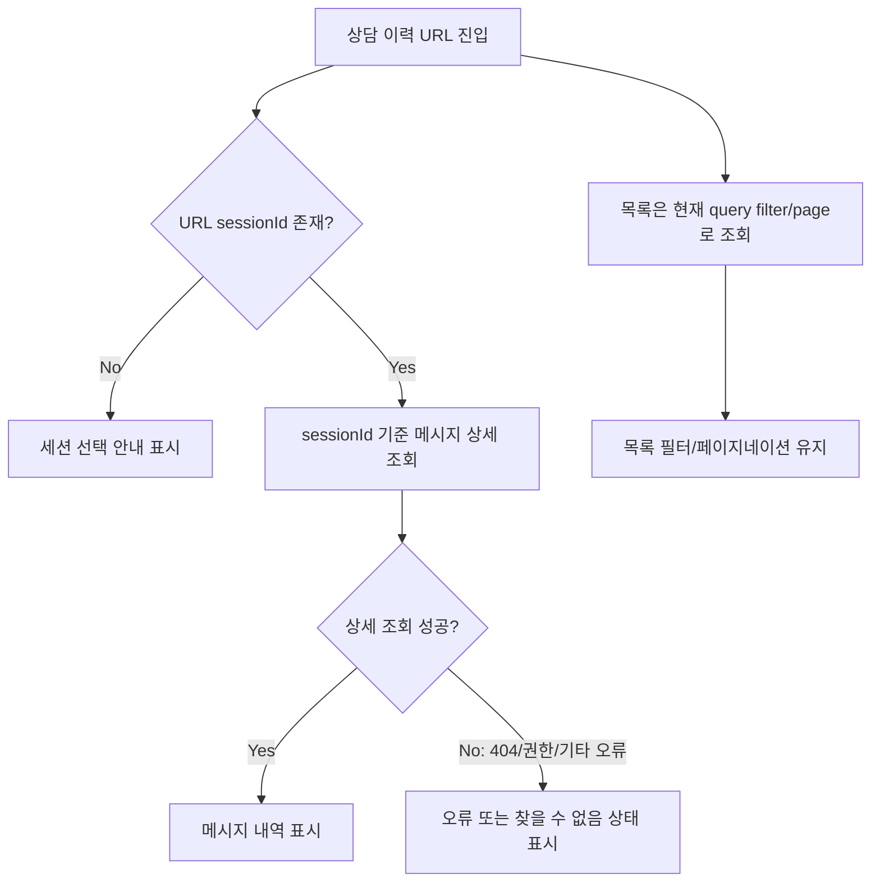

# 431 [FE] 직접 진입한 상담 이력 상세 안정화

## Goal

상담 이력 상세 URL(`/workspaces/{workspaceId}/consultation/history/{sessionId}`)로 직접 진입하거나 새로고침해도, 현재 목록 페이지/필터에 세션이 포함되어 있는지와 무관하게 URL의 `sessionId` 기준으로 메시지 상세 조회를 시도한다.

---

## User Flow Chart



---

## Design Diff

### As-is vs To-be

| 영역 | As-is | To-be | 변경 내용 |
|------|-------|-------|----------|
| 상세 조회 조건 | `sessionId`가 현재 페이지의 `sessions`에 있을 때만 `MessageHistory`에 전달 | URL에 `sessionId`가 있으면 바로 `MessageHistory`에 전달 | 목록 페이지 포함 여부와 상세 조회를 분리 |
| 직접 진입 | 현재 필터/페이지 결과에 없으면 missing 상태 표시 | 메시지 상세 API가 실제 존재/권한 여부를 판단 | 공유 링크와 새로고침 안정화 |
| 목록 동작 | 필터/페이지네이션/query 유지 | 기존 동작 유지 | 상세 패널만 URL `sessionId` 기준으로 독립 조회 |

---

## Component Tree

```
ChatHistoryPage
├─ SessionList
│    ├─ filters
│    ├─ pagination
│    └─ selectedSessionId highlight
└─ MessageHistory
     └─ useChatMessagePage(sessionId)
```

---

## API Integration

### Endpoints

| Method | Path | Description |
|--------|------|-------------|
| GET | `/api/v1/workspaces/{workspaceId}/consultation/sessions` | 상담 이력 목록 조회 |
| GET | `/api/v1/consultation/sessions/{sessionId}/messages` | 상담 메시지 상세 조회 |

### Query Key Pattern

- 목록은 기존 `chatHistoryKeys.sessionList(workspaceId, params)`를 유지한다.
- 메시지는 기존 `chatHistoryKeys.messages(sessionId, page, size)`를 유지한다.
- URL `sessionId`가 현재 목록 결과에 없더라도 메시지 query key는 해당 `sessionId`로 생성되어야 한다.

---

## Data Flow

```
URL params
  ├─ workspaceId -> useChatSessions(workspaceId, filters, page)
  └─ sessionId   -> MessageHistory -> useChatMessagePage(sessionId)
```

- `SessionList`는 현재 필터/페이지 결과만 표시한다.
- `MessageHistory`는 목록 결과에 의존하지 않고 URL `sessionId`를 직접 사용한다.
- 실제 미존재/권한 오류는 메시지 상세 API의 오류 상태로 표현한다.

---

## 수정 대상 파일

| 파일 | 변경 유형 | 설명 |
|------|----------|------|
| `frontend/src/pages/consultation/ui/chat-history/ChatHistoryPage.tsx` | modify | 현재 목록 포함 여부에 따른 상세 조회 차단 로직 제거 |
| `frontend/src/pages/consultation/ui/chat-history/ChatHistoryPage.test.tsx` | modify | 현재 목록에 없는 URL `sessionId`도 메시지 조회를 시도하는 회귀 테스트 추가/수정 |
| `frontend/src/features/consultation/ui/chat-history/MessageHistory.tsx` | modify | 유효하지 않은 `sessionId`는 메시지 조회 없이 찾을 수 없음 상태 표시 |
| `frontend/src/features/consultation/ui/chat-history/MessageHistory.test.tsx` | modify | 유효하지 않은 `sessionId` 처리 회귀 테스트 추가 |

---

## State Management

### Server State (TanStack Query)

- 목록 server state: 기존 필터와 페이지 query parameter를 기반으로 유지한다.
- 메시지 server state: URL `sessionId`를 기반으로 독립 조회한다.

### Client State

- 별도 전역 상태를 추가하지 않는다.
- URL path parameter와 search parameter를 기존처럼 source of truth로 유지한다.

---

## Tests

### Test Strategy

| 구분 | 방법 | 도구 | 비고 |
|------|------|------|------|
| 통합 테스트 | 라우터 URL과 mock query hook 검증 | Vitest + React Testing Library | 직접 진입/목록 선택 회귀 검증 |

### Test Environment & 사전 조건

| 항목 | 값 |
|------|---|
| 환경 | `cd frontend && pnpm test -- ChatHistoryPage.test.tsx MessageHistory.test.tsx` |
| API Mock | `useChatSessions`, `useChatMessagePage` mock |
| 사전 조건 | 목록에 없는 `sessionId`를 가진 URL로 진입 |

### Test Scenarios

#### Happy Path

| # | 시나리오 | 사전 조건 | 조작 | 기대 결과 |
|---|---------|---------|------|----------|
| 1 | URL `sessionId`가 현재 목록에 있음 | 목록에 session `7` 존재 | `/history/7` 진입 | `useChatMessagePage("7")` 호출 |
| 2 | URL `sessionId`가 현재 목록에 없음 | 목록에는 session `7`만 존재 | `/history/999` 진입 | `useChatMessagePage("999")` 호출 후 메시지 상세 상태 표시 |
| 3 | 목록 세션 선택 | 목록에 session `7` 존재 | 세션 카드 클릭 | 기존 query를 유지하며 `/history/7` 이동 |

#### Error & Edge Cases

| # | 시나리오 | 조작 | 기대 결과 |
|---|---------|------|----------|
| 1 | 상세 API 오류 | `/history/999` 진입 후 메시지 조회 오류 | 오류 상태와 다시 시도 표시 |
| 2 | 세션 미선택 | `/history` 진입 | 세션 선택 안내 표시 |
| 3 | 목록 로딩 중 직접 진입 | `/history/{sessionId}` 진입 | 목록 로딩 여부와 무관하게 메시지 조회 시도 |
| 4 | 유효하지 않은 sessionId | `/history/invalid` 진입 | 메시지 조회 없이 찾을 수 없음 상태 표시 |

---

## Non-Goals

- 백엔드 API 경로, 권한 정책, 응답 envelope 변경은 하지 않는다.
- 목록 필터가 선택된 `sessionId`를 포함하도록 자동 보정하지 않는다.
- 목록에 없는 선택 세션을 임시 카드로 삽입하지 않는다.
- 메시지 상세의 오류 문구 체계를 새로 설계하지 않는다.

---

## Acceptance Criteria

- 현재 목록 페이지에 없는 `sessionId`로 직접 진입해도 메시지 상세 조회가 시도된다.
- 실제 404/권한 오류 등 상세 API 오류인 경우에만 오류 상태를 표시한다.
- 기존 목록 선택, 필터, 페이지네이션 동작은 유지된다.
- 스펙 파일은 `.agent/specs/431.md`에 위치한다.

---

## Open Questions

- 없음. 이슈 본문만으로 구현 범위가 충분히 확정된다.
