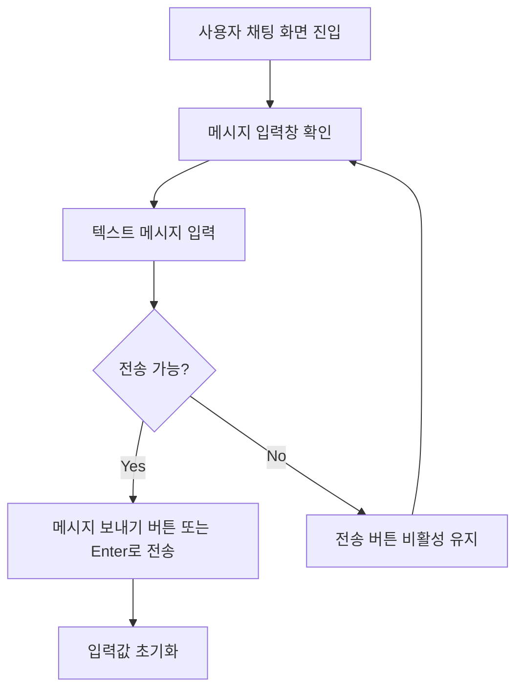

# 432 [FE] 사용자 채팅 입력창의 미지원 파일 첨부 버튼 정리

## Goal

사용자 채팅 입력창에서 실제로 동작하지 않는 파일 첨부 버튼을 노출하지 않아, 사용자가 지원되지 않는 첨부 기능을 기대하거나 시연 중 비활성 버튼을 눌러보는 혼란을 줄인다.

---

## User Flow Chart



---

## Design Diff

### As-is vs To-be

| 영역 | As-is | To-be | 변경 내용 |
|------|-------|-------|----------|
| 사용자 채팅 입력창 | 파일 첨부 아이콘 버튼이 disabled 상태로 항상 표시됨 | 첨부 버튼을 렌더링하지 않음 | 미지원 기능을 버튼처럼 보이지 않게 정리 |
| 메시지 입력 | 텍스트 입력, Enter 전송, 보내기 버튼 전송 지원 | 기존 동작 유지 | 입력/전송 회귀 방지 |
| 접근성 | disabled 첨부 버튼의 예정 상태가 title에만 의존 | 접근 대상에서 제거 | 지원하지 않는 컨트롤을 키보드/스크린리더 흐름에서 제거 |

---

## Component Tree

```
ChatRoom
└─ MessageInput
   ├─ input[메시지 입력]
   └─ button[메시지 보내기]

ChatConversationScreen
└─ MessageInput
   ├─ input[메시지 입력]
   └─ button[메시지 보내기]
```

---

## API Integration

### Endpoints

이 변경은 프론트엔드 표시 방식만 조정하므로 신규 API, OpenAPI generated client, 백엔드 계약 변경이 없다.

---

## Data Flow

```
MessageInput local state
    │
    ├─ content.trim() 비어 있음 또는 disabled → 전송 버튼 disabled
    └─ content.trim() 존재 및 enabled → onSend(trimmed) 호출 후 입력값 초기화
```

---

## 수정 대상 파일

| 파일 | 변경 유형 | 설명 |
|------|----------|------|
| `frontend/src/features/user-chat/ui/MessageInput.tsx` | update | 미지원 파일 첨부 버튼 렌더링 제거, 텍스트 입력/전송 동작 유지 |
| `frontend/src/features/user-chat/ui/MessageInput.test.tsx` | update | 첨부 버튼이 노출되지 않고 기존 전송 동작이 유지되는지 검증 |

---

## State Management

기존 `MessageInput`의 로컬 `content` 상태만 사용한다. 신규 전역 상태, 서버 상태, feature 간 통신은 없다.

---

## Scope

### In Scope

- 사용자 채팅 입력창에서 disabled 파일 첨부 버튼 제거.
- `Paperclip` 아이콘 import 제거.
- 메시지 입력, 보내기 버튼 클릭, Enter 전송, IME 조합 중 Enter 무시, disabled 상태 동작 유지.
- 컴포넌트 테스트에 첨부 버튼 미노출 검증 추가.

### Out of Scope

- 실제 파일 업로드/첨부 플로우 구현.
- 첨부 예정 안내 패널 또는 릴리즈 로드맵 표시.
- 채팅 메시지 API, WebSocket, 백엔드, DB 스키마 변경.
- 채팅 화면 전체 레이아웃 재설계.

---

## Tests

### Test Strategy

| 구분 | 방법 | 도구 | 비고 |
|------|------|------|------|
| 컴포넌트 테스트 | 사용자 입력창 렌더링 및 이벤트 검증 | Vitest + React Testing Library | `MessageInput` 단위 검증 |
| 정적 검증 | 프론트엔드 린트/빌드 | `pnpm lint`, `pnpm build` | 변경 범위 회귀 확인 |

### Test Environment & 사전 조건

| 항목 | 값 |
|------|---|
| 위치 | `frontend/` |
| 테스트 대상 | `frontend/src/features/user-chat/ui/MessageInput.test.tsx` |
| 사전 조건 | Node/pnpm 의존성이 설치되어 있음 |

### Test Scenarios

#### Happy Path

| # | 시나리오 | 사전 조건 | 조작 | 기대 결과 |
|---|---------|---------|------|----------|
| 1 | 입력창 렌더링 | 채팅 입력창 표시 | 화면 확인 | 파일 첨부 버튼이 보이지 않는다 |
| 2 | 버튼 클릭 전송 | 메시지 입력 | 보내기 버튼 클릭 | trim된 메시지가 `onSend`로 전달되고 입력값이 비워진다 |
| 3 | Enter 전송 | 메시지 입력 | Enter 키 입력 | 메시지가 `onSend`로 전달된다 |

#### Error & Edge Cases

| # | 시나리오 | 조작 | 기대 결과 |
|---|---------|------|----------|
| 1 | 빈 메시지 | 공백만 입력 후 전송 | `onSend`가 호출되지 않는다 |
| 2 | IME 조합 중 Enter | 조합 중 Enter 입력 | `onSend`가 호출되지 않는다 |
| 3 | disabled 상태 | disabled prop 전달 | 입력창과 보내기 버튼이 비활성화된다 |

#### 반응형 & 접근성

| # | 확인 항목 | 기대 결과 |
|---|---------|----------|
| 1 | 키보드 탐색 | 지원하지 않는 첨부 버튼에 포커스가 가지 않는다 |
| 2 | 스크린 리더 | 지원하지 않는 첨부 버튼이 컨트롤로 읽히지 않는다 |
| 3 | 전송 버튼 라벨 | 보내기 버튼은 `메시지 보내기` 접근 가능한 이름을 유지한다 |

---

## Acceptance Criteria

- 사용자 채팅 입력창에 `파일 첨부` 버튼 또는 `message-attach` 테스트 대상이 렌더링되지 않는다.
- 기존 메시지 입력/전송 동작은 유지된다.
- disabled 상태에서 메시지 입력과 전송이 계속 막힌다.
- 신규 API, 백엔드, 데이터베이스 변경이 없다.

---

## Open Questions

- 향후 파일 첨부 기능이 정식 범위에 포함될 때 별도 이슈에서 업로드 플로우, 파일 제한, 보안/저장소 정책을 다시 정의한다.
