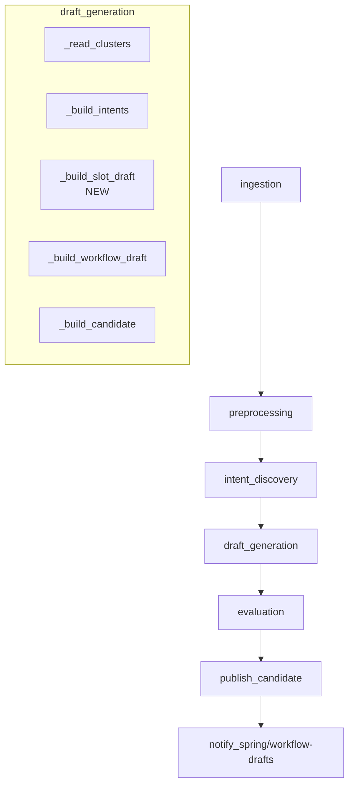

# 4.3.2 [ML] Slot 초안 자동 추출

> 백로그 제목은 "Slot / Slot Status update 추출"이지만, 사용자 결정(Q-001)에 따라 본 spec의 scope은 **신규 slot 초안 자동 추출**로 한정한다.
> Slot status 전환 패턴 추출은 본 spec의 범위 밖이며, 운영자가 FE 321 UI에서 수동 토글한다.

---

## Goal

`draft_generation` 단계가 cluster의 `workflow_signal`을 기반으로 사전 정의된 slot pool에서 slot 초안 후보를 도출하여 `candidate.json`의 `workflowDraft.slots` 와 `workflowDraft.intentSlotBindings` 를 채운다. 현재 두 필드는 빈 list로 하드코딩되어 있다 (draft_generation/main.py:328-333).

도출된 slot은 publish_candidate의 workflow-drafts callback을 통해 BE로 전달되며, 운영자는 spec 228·321 FE UI에서 검토·수정·삭제한다.

---

## Scope (사용자 결정 기반)

### In Scope

- `draft_generation/main.py` 내부에 `_build_slot_draft()` 함수 추가 (Q-003 A).
- `cluster.workflow_signal` → 사전 정의 slot pool 정적 mapping (Q-002 A).
- `workflowDraft.slots` 와 `workflowDraft.intentSlotBindings` 채움.
- cluster당 0-5개 slot 추출 (Q-003 A).
- slotCode 패턴 `SLOT_{cluster_id}_{counter}` (Q-004 A).
- 자동 intentSlotBindings 생성 (`isRequired=true`, Q-004 A).
- 관련 metrics 추가.

### Out of Scope

- Slot status 전환 패턴 추출 (백로그 이름 typo로 간주 — Q-001 사용자 결정).
- conversation 텍스트 NER / keyword 기반 동적 slot 탐지 (Q-002 B/C 기각).
- `slot_discovery` 별도 stage 신설 (Q-003 C 기각).
- candidate.json slot 항목의 `status` 필드 (Q-004 A — BE default `ACTIVE` 신뢰).
- publish_candidate validate_candidate 의 slot 검증 추가 (Q-004 A — 변경 없음).

---

## DAG Diagram

기존 pipeline DAG에 새 task는 추가하지 않는다. 변경은 `draft_generation` task 내부 로직에 국한된다.



---

## Stage Interface

### Input

`draft_generation` 단계의 기존 입력을 그대로 사용. 새 입력 artifact는 없다.

| 필드 | 출처 | 비고 |
|------|------|------|
| `clusters.json` | intent_discovery stage | `clusters[*].cluster_id`, `clusters[*].workflow_signal` 사용 |
| `preprocessed_data.json` | preprocessing stage | 본 변경에서는 직접 사용 안 함 (cluster signal에 이미 반영됨) |

### Output (candidate.json 변경 부분)

```json
{
  "workflowDraft": {
    "slots": [
      {
        "slotCode": "SLOT_1_1",
        "name": "주문 ID",
        "description": "결제 관련 문의 cluster 1의 주문 식별자",
        "dataType": "STRING",
        "isSensitive": false,
        "validationRuleJson": "{}",
        "defaultValueJson": null,
        "metaJson": "{}"
      }
    ],
    "intentSlotBindings": [
      {
        "intentCode": "INTENT_1",
        "slotCode": "SLOT_1_1",
        "isRequired": true,
        "collectionOrder": 1,
        "promptHint": "",
        "conditionJson": "{}"
      }
    ]
  }
}
```

- `status` 필드는 포함하지 않는다 (Q-004 A). BE default `ACTIVE` 가 적용된다.
- `validationRuleJson`, `metaJson`, `conditionJson` 은 빈 JSON object 문자열 `"{}"`.
- `defaultValueJson` 은 `null`.
- `promptHint` 는 빈 문자열 (운영자 UI에서 추후 입력).

---

## Configuration

`PipelineRuntimeConfig` 에 새 설정은 추가하지 않는다. mapping table은 코드 내 상수로 정의한다 (KISS — `.agent/rules/principles.md:3-7`).

### Slot Mapping Table (constant)

`ml/src/pipeline/stages/draft_generation/main.py` 또는 신규 helper 모듈에 다음 상수를 둔다.

```python
from typing import NamedTuple


class SlotTemplate(NamedTuple):
    code_suffix: str        # slotCode 식별 접미사 (참고용; 실제 slotCode는 SLOT_{cluster_id}_{counter})
    name: str
    description: str
    data_type: str          # STRING | NUMBER | BOOLEAN | DATE | ADDRESS
    is_sensitive: bool


# cluster.workflow_signal 키 → slot 후보 list
SIGNAL_SLOT_MAPPING: dict[str, tuple[SlotTemplate, ...]] = {
    "requires_payment_check": (
        SlotTemplate("order_id", "주문 ID", "결제·환불 대상 주문 식별자", "STRING", False),
        SlotTemplate("payment_method", "결제 수단", "결제 수단 (카드/계좌이체 등)", "STRING", False),
    ),
    "requires_user_identification": (
        SlotTemplate("customer_name", "고객 이름", "본인 확인용 고객 이름", "STRING", True),
        SlotTemplate("customer_phone", "고객 연락처", "본인 확인용 휴대폰 번호", "STRING", True),
    ),
    "has_escalation_cases": (
        SlotTemplate("escalation_reason", "에스컬레이션 사유", "상담사 전환 사유", "STRING", False),
    ),
}
```

- 각 signal이 `True`일 때 해당 list의 모든 slot template이 cluster의 slot 후보가 된다.
- 같은 signal pool에서 중복은 자연 발생 안 함 (signal key 별로 분리).
- cluster의 활성 signal이 모두 `True`라도 최대 slot 수는 2 + 2 + 1 = 5개 → Q-003 A의 상한 (cluster당 0-5) 충족.

---

## Stage Implementation

### 함수 시그니처

```python
# ml/src/pipeline/stages/draft_generation/main.py

def _build_slot_draft(
    clusters: list[dict[str, Any]],
) -> tuple[list[dict[str, Any]], list[dict[str, Any]], dict[str, int]]:
    """cluster.workflow_signal 기반으로 slots + intentSlotBindings 도출.

    Returns:
        (slots, intentSlotBindings, metrics)
        slots: workflowDraft.slots 에 들어갈 list
        intentSlotBindings: workflowDraft.intentSlotBindings 에 들어갈 list
        metrics: slot_count, cluster_with_slot_count, signal_hit_counts
    """
    ...
```

### 호출 위치

기존 `run()` 함수 (draft_generation/main.py:34-91) 안에서 `_build_workflow_draft(clusters)` 호출 직후에 신규 3줄을 삽입한다. `metrics.update(workflow_metrics)` 는 이미 main.py:59에 존재하므로 건드리지 않는다.

```python
    # ── 기존 코드 (main.py:58-59, 수정 없음) ──────────────────────────────
    workflow_draft, workflow_metrics = _build_workflow_draft(clusters)
    metrics.update(workflow_metrics)

    # ── 신규 추가 (3줄) ────────────────────────────────────────────────────
    slots, intent_slot_bindings, slot_metrics = _build_slot_draft(clusters)
    workflow_draft["slots"] = slots
    workflow_draft["intentSlotBindings"] = intent_slot_bindings
    metrics.update(slot_metrics)
```

`workflow_draft` 가 dict라는 점은 기존 `_build_workflow_draft` 의 return 값 형태에서 확인됨 (draft_generation/main.py:297-345).

### 알고리즘 의사 코드

```python
def _build_slot_draft(clusters):
    slots: list[dict] = []
    bindings: list[dict] = []
    cluster_with_slot_count = 0
    signal_hit_counts = {key: 0 for key in SIGNAL_SLOT_MAPPING.keys()}

    for cluster in clusters:
        cluster_id = cluster["cluster_id"]
        signal = cluster.get("workflow_signal") or {}
        intent_code = f"INTENT_{cluster_id}"
        cluster_slot_counter = 0

        for signal_key, templates in SIGNAL_SLOT_MAPPING.items():
            if not signal.get(signal_key):
                continue
            signal_hit_counts[signal_key] += 1
            for template in templates:
                cluster_slot_counter += 1
                slot_code = f"SLOT_{cluster_id}_{cluster_slot_counter}"
                slots.append({
                    "slotCode": slot_code,
                    "name": template.name,
                    "description": template.description,
                    "dataType": template.data_type,
                    "isSensitive": template.is_sensitive,
                    "validationRuleJson": "{}",
                    "defaultValueJson": None,
                    "metaJson": "{}",
                })
                bindings.append({
                    "intentCode": intent_code,
                    "slotCode": slot_code,
                    "isRequired": True,
                    "collectionOrder": cluster_slot_counter,
                    "promptHint": "",
                    "conditionJson": "{}",
                })
        if cluster_slot_counter > 0:
            cluster_with_slot_count += 1

    metrics = {
        "slot_count": len(slots),
        "cluster_with_slot_count": cluster_with_slot_count,
        "signal_slot_hit_payment_check": signal_hit_counts["requires_payment_check"],
        "signal_slot_hit_user_identification": signal_hit_counts["requires_user_identification"],
        "signal_slot_hit_escalation": signal_hit_counts["has_escalation_cases"],
    }
    return slots, bindings, metrics
```

### Invariants (engineering-bound, Q-004)

본 함수는 다음 invariant를 보호한다. 위반 시 `publish_candidate.validate_candidate` 또는 BE persist 단계에서 fail이 발생한다 (downstream contract 보호).

1. `slotCode` 는 candidate 전체에서 unique. cluster_id 가 unique이고 counter가 cluster별 reset되므로 자연 보장.
2. `slotCode` 길이 ≤ 100자. `SLOT_{int}_{int}` 패턴은 cluster_id가 int인 한 100자를 초과하지 않음.
3. `name` 은 비어있지 않고 ≤ 255자. mapping 상수에 정적으로 정의되어 자연 보장.
4. `dataType` 은 비어있지 않고 ≤ 50자. mapping 상수에 `STRING` 등 enum value로 고정.
5. `intentSlotBindings[*].intentCode` 는 `intentDraft.intents[*].intentCode` 에 반드시 존재. 같은 `INTENT_{cluster_id}` 패턴을 `_build_intents` 와 `_build_slot_draft` 에서 공유.
6. `intentSlotBindings[*].slotCode` 는 같은 candidate의 `workflowDraft.slots[*].slotCode` 에 반드시 존재. 같은 함수에서 동시 생성하므로 자연 보장.

invariant 1-6은 `publish_candidate/main.py:206-244` 의 검증 규칙과 정합한다.

---

## Metrics

기존 `draft_generation` 메트릭에 다음 5개 추가.

| 메트릭 | 단위 | 설명 | 기대값 |
|--------|------|------|--------|
| `slot_count` | count | 전체 cluster에서 도출된 slot 총 수 | ≥ 0 |
| `cluster_with_slot_count` | count | 1개 이상의 slot이 도출된 cluster 수 | ≤ cluster_count |
| `signal_slot_hit_payment_check` | count | `requires_payment_check` 가 true인 cluster 수 | 0 ~ cluster_count |
| `signal_slot_hit_user_identification` | count | `requires_user_identification` 가 true인 cluster 수 | 0 ~ cluster_count |
| `signal_slot_hit_escalation` | count | `has_escalation_cases` 가 true인 cluster 수 | 0 ~ cluster_count |

manifest의 `metrics` 필드에 포함된다 (기존 패턴 — draft_generation/main.py:84-88).

---

## Artifact Schema

`candidate.json` 파일의 위치 / 이름 / 최상위 구조는 변경하지 않는다 (`DEFAULT_CANDIDATE_ARTIFACT = "candidate.json"`).

변경 부분은 `workflowDraft.slots` (빈 list → 0~5×cluster 개) 와 `workflowDraft.intentSlotBindings` (빈 list → slot 수와 동일) 두 필드뿐이다.

---

## Tests

`ml/tests/stages/test_draft_generation_main.py` 의 기존 단위 테스트를 보완하고 새 단위 테스트를 추가한다.

### 기존 테스트 수정

- `assert draft["slots"] == []` (test_draft_generation_main.py:388) → cluster signal에 따라 실제 slot이 들어가는 fixture로 보완.

### 신규 단위 테스트 (Test Checklist)

- [ ] `_build_slot_draft` — workflow_signal 모두 False → slots=[], bindings=[]
- [ ] `_build_slot_draft` — `requires_payment_check`=True 단독 → order_id + payment_method 2개 slot, 2개 binding
- [ ] `_build_slot_draft` — `requires_user_identification`=True 단독 → customer_name + customer_phone, `isSensitive=true` 확인
- [ ] `_build_slot_draft` — 모든 signal True → 5개 slot (2+2+1), `collectionOrder` 1~5
- [ ] `_build_slot_draft` — 여러 cluster (cluster_id 1, 2) → slotCode가 cluster별로 reset되어 `SLOT_1_1`, `SLOT_2_1` 형식
- [ ] `_build_slot_draft` — intentCode 가 cluster별 `INTENT_{cluster_id}` 와 일치
- [ ] `_build_slot_draft` — metrics: slot_count, cluster_with_slot_count, signal_hit_* 정확성
- [ ] `run()` 통합 — candidate.json 출력에서 `workflowDraft.slots` 가 비어있지 않은 cluster fixture로 검증
- [ ] `publish_candidate.validate_candidate` 가 본 출력 candidate를 통과 (downstream contract 회귀 방지)

기존 ML 테스트 규칙은 `.agent/rules/testing.md` 와 `.agent/rules/python.md` 를 따른다.

---

## Error Handling

본 변경은 새 외부 의존성 없이 정적 mapping만 사용한다. 별도의 신규 예외 / retry는 추가하지 않는다.

- cluster에 `workflow_signal` 키가 없거나 빈 dict인 경우 → 해당 cluster는 slot 0개 (자연 처리).
- mapping table에 없는 signal key는 무시.
- cluster_id가 int가 아닌 경우 → 기존 `_build_workflow_draft` 패턴과 동일하게 처리 (현재 코드는 cluster_id를 type-check 없이 사용 — 본 spec에서도 같은 가정 유지).

publish_candidate / BE 측 검증은 본 변경에서 수정하지 않는다 (Q-004 A).

---

## Monitoring

기존 `draft_generation` logger (`pipeline.draft_generation`)를 그대로 사용한다. 다음 로그 라인을 `run()` 안에 추가:

```
logger.info(
    "draft_generation.slot_summary slot_count=%d cluster_with_slot_count=%d "
    "signal_slot_hit_payment_check=%d signal_slot_hit_user_identification=%d "
    "signal_slot_hit_escalation=%d",
    slot_metrics["slot_count"],
    slot_metrics["cluster_with_slot_count"],
    slot_metrics["signal_slot_hit_payment_check"],
    slot_metrics["signal_slot_hit_user_identification"],
    slot_metrics["signal_slot_hit_escalation"],
)
```

---

## Dependencies

새 외부 의존성 없음. `pyproject.toml` 변경 없음.

---

## 변경 파일 목록

- `ml/src/pipeline/stages/draft_generation/main.py` — `_build_slot_draft` 추가, `run()` 호출 추가, 로그 라인 추가, `SIGNAL_SLOT_MAPPING` / `SlotTemplate` 상수 정의.
- `ml/tests/stages/test_draft_generation_main.py` — 기존 `assert draft["slots"] == []` 수정 + 신규 테스트 추가.

> **참고 (Code-Grounded Verification)**: helper 모듈로 분리하지 않고 같은 파일 `main.py` 에 두는 이유는 `_build_workflow_draft` / `_build_intents` 와 같은 패턴을 따르기 위함이며, file 수를 최소화한다 (`.agent/rules/principles.md:3-7` KISS).

---

## Done Criteria

- [ ] `_build_slot_draft` 가 cluster의 `workflow_signal` 에 따라 SIGNAL_SLOT_MAPPING 의 slot template을 정확히 도출한다.
- [ ] `candidate.json` 의 `workflowDraft.slots` 와 `workflowDraft.intentSlotBindings` 가 채워진다.
- [ ] 같은 cluster 내 `intentSlotBindings[*].intentCode` 가 `intentDraft.intents[*].intentCode` 와 일치한다.
- [ ] `publish_candidate.validate_candidate` 가 본 출력 candidate를 통과한다 (downstream contract 회귀 없음).
- [ ] `manifest.metrics` 에 slot 관련 5개 metric이 포함된다.
- [ ] `uv run pytest ml/tests/stages/test_draft_generation_main.py` 통과.
- [ ] `uv run ruff check . && uv run ruff format --check . && uv run mypy .` 통과.

---

## Open Items (uncertainty register 참조)

- 본 spec 본문은 사용자 결정(Q-001~Q-004)으로 confirmed된 항목만 포함한다.
- engineering-bound invariant 6개는 `.handoff/432/uncertainty-register-432.md` 에 보존되며 spec 본문에는 직접 노출하지 않는다 (codeBuilder는 execution log에 `Engineering-bound invariant adopted` 명시).
- 선행 spec 4.3.1 부재(M2)는 사용자가 백로그 명명 typo로 간주(Q-001)하여 본 spec scope에 영향 없음.
